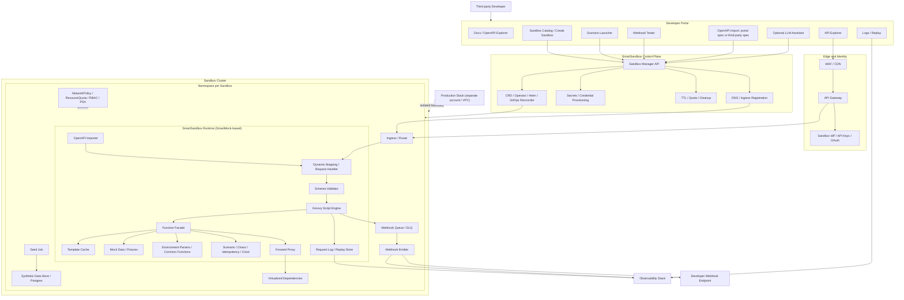
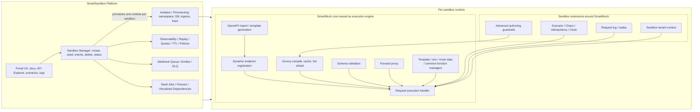
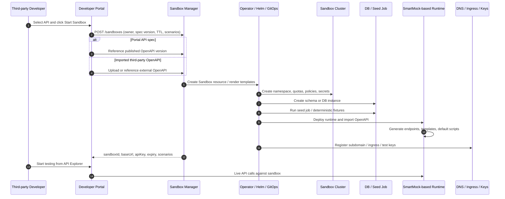
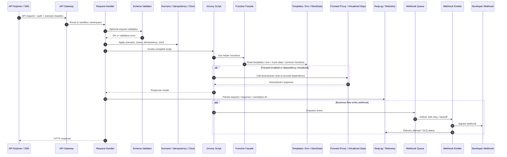
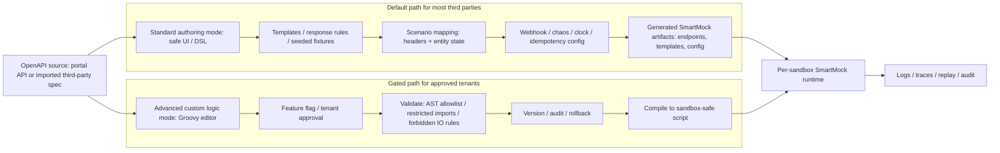
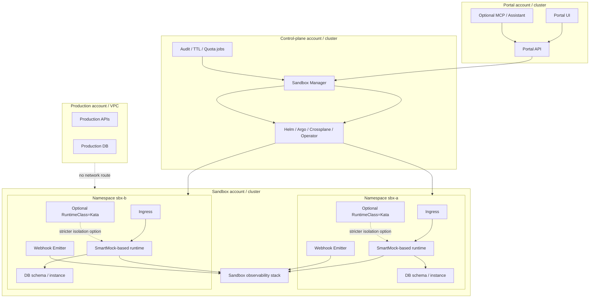

# SmartSandbox Architecture Section for Proposal

## 1. Purpose

This section consolidates the recommended target architecture for **SmartSandbox** based on the uploaded SmartSandbox discussion, the SmartSandbox proposal/summary, the SmartMock technical overview, and the design decisions clarified during this working session.

The core recommendation is:

- **Keep SmartMock as the core execution engine**.
- **Do not equate SmartMock with the full SmartSandbox platform**.
- **Deploy one SmartMock-based runtime per sandbox**.
- **Use SmartSandbox as the platform layer around SmartMock** for portal integration, sandbox lifecycle, control plane, isolation, synthetic data, webhooks, observability, and governance.
- **Use Kubernetes namespace-per-sandbox as the default operating model**, with **schema-per-sandbox** as the default database tenancy mode.
- **Allow raw SmartMock/Groovy authoring only as a gated advanced capability**, while keeping a safer template/rule/scenario authoring path as the default for most third parties.

---

## 2. Decision Inputs and Assumptions

The architecture below assumes the following business and technical decisions:

1. **Sandbox purpose**
   - Third parties will primarily test APIs published in the developer portal.
   - To differentiate from standard market sandboxes, SmartSandbox should also allow:
     - testing of broader business use cases,
     - import of third-party OpenAPI/Swagger definitions,
     - authoring or customization of mock behavior,
     - support for more complex end-to-end journeys.

2. **Isolation model**
   - Each sandbox should be isolated from all other sandboxes.
   - One runtime per sandbox is preferred.

3. **Runtime strategy**
   - SmartMock should remain the core execution engine unless it cannot be enhanced far enough for the SmartSandbox target state.

4. **Planning approach**
   - A full roadmap is needed first, before phase boundaries are finalized.

5. **Scale assumption**
   - Exact concurrency targets are not yet known.
   - The platform should, at minimum, support the current HSBC developer portal user base and be instrumented early so the actual scale profile can be measured.

6. **Authoring model**
   - Third-party customization is required.
   - Raw SmartMock/Groovy logic via UI should exist only in a controlled advanced mode, not as the default path for every tenant.

---

## 3. Recommended Architecture Summary

| Area | Recommendation | Why |
|---|---|---|
| Core runtime | Reuse **SmartMock** as the execution kernel inside each sandbox | SmartMock already supports dynamic endpoint registration, Groovy script execution, OpenAPI import, schema validation, forwarding, and hot reload |
| Platform boundary | Build **SmartSandbox** as a platform around SmartMock, not inside a single shared SmartMock instance | Portal UX, sandbox lifecycle, quotas, TTL, DNS, ingress, webhooks, replay, observability, and governance are platform concerns |
| Isolation | **One runtime per sandbox** | Matches the requirement for isolation and supports advanced custom behavior more safely |
| Sandbox topology | **Kubernetes namespace-per-sandbox** | Best balance of fidelity, cost, and operational control |
| Database tenancy | **Schema-per-sandbox** by default; **instance-per-sandbox** as stricter option | Schema mode is cost-efficient; instance mode remains available for stricter isolation or regulated tenants |
| Authoring model | Default to **safe UI/DSL/templates/scenarios**; gate **raw Groovy** as advanced mode | Reduces security risk while preserving the flexibility that differentiates the platform |
| External dependencies | Support **contract-based external API simulation** via imported OpenAPI and virtualized dependencies | Enables richer end-to-end business journey testing |
| Security posture | Separate sandbox account/VPC/IdP, default-deny network policies, least privilege, strong script guardrails | Required because custom behavior and imported specs increase trust and isolation requirements |
| Future isolation path | Add **micro-VM/Kata** option for higher-risk tenants or untrusted-code cases | Preserves room for stronger isolation without changing the control plane model |

---

## 4. Consolidated Architecture Diagrams

### 4.1 SmartSandbox Detailed Logical Architecture

**Caption:** *This diagram shows the full logical architecture of SmartSandbox, including the portal experience layer, edge and identity controls, the SmartSandbox control plane, and the per-sandbox SmartMock-based runtime.*

**Explanation**

This is the target logical architecture for the proposal.

The architecture is intentionally split into four layers:

1. **Experience layer**
   - The developer portal remains the user-facing surface for documentation, API exploration, sandbox creation, scenario launch, webhook testing, and replay.
   - Optional assistant capabilities can be added later, but they operate only through sandbox-safe tools and portal APIs.

2. **Edge and identity layer**
   - All runtime access still passes through a gateway and sandbox-specific identity controls.
   - This preserves parity with production-style auth and rate limiting while preventing sandbox tokens from being reused in production.

3. **Control plane layer**
   - The Sandbox Manager is the single platform entry point for creating, configuring, seeding, expiring, and destroying sandboxes.
   - The portal should never write directly into the sandbox cluster. It should call the control plane only.
   - The reconciler turns a high-level sandbox request into actual infrastructure such as namespace, secrets, ingress, seed job, and runtime deployment.

4. **Runtime layer**
   - Every sandbox gets its own namespace and its own SmartMock-based runtime.
   - Inside that runtime, SmartMock remains responsible for the core API simulation mechanics: OpenAPI import, request mapping, schema validation, script execution, templates, mock data, forwarding, and response generation.
   - SmartSandbox-specific capabilities are added around it: seeded synthetic data, scenario controls, chaos, idempotency, time controls, queue-backed webhook delivery, replay storage, and dependency virtualization.

**Key design implications**

- This architecture preserves SmartMock investment while still creating a true SmartSandbox platform.
- It supports both portal-published APIs and imported third-party OpenAPI contracts.
- It is suitable for end-to-end business flow testing because the runtime can simulate downstream dependencies and emit signed webhook events.
- The isolation boundary is explicit: no production routing, no production secrets, no shared tenant runtime.

---

### 4.2 Relationship Between SmartMock and SmartSandbox

**Caption:** *This diagram clarifies that SmartMock is the execution core inside each sandbox, while SmartSandbox is the broader platform that provisions, governs, and exposes sandboxes through the developer portal.*

**Explanation**

This is the most important architecture relationship to make explicit in the proposal.

**SmartMock is not being replaced.** It remains the execution engine that performs:

- dynamic endpoint registration,
- OpenAPI-driven endpoint and template creation,
- Groovy compilation and hot reload,
- request handling,
- schema validation,
- forward proxy behavior,
- access to templates, environment parameters, and mock data.

**SmartSandbox is the platform around SmartMock.** It adds the elements that SmartMock alone does not provide:

- sandbox lifecycle APIs,
- per-sandbox infrastructure provisioning,
- TTL and quota enforcement,
- webhook infrastructure,
- user-facing logs and replay,
- portal workflows,
- stronger authoring controls and auditability,
- governance and multi-sandbox operations.

This relationship is important for three reasons:

1. **Preserves existing assets**
   - SmartMock already solves the hardest runtime mechanics.
   - Reusing it avoids rebuilding the execution engine from zero.

2. **Creates a cleaner platform boundary**
   - Platform concerns remain outside the runtime.
   - Runtime concerns remain inside SmartMock.

3. **Supports phased delivery**
   - SmartMock can be hardened and extended in parallel with building the Sandbox Manager and portal integrations.

---

### 4.3 Sandbox Provisioning and Activation Sequence

**Caption:** *This sequence shows how a new sandbox is created from the portal, provisioned by the control plane, seeded with data, and returned as a ready-to-use isolated environment.*

**Explanation**

This diagram explains how the system comes alive operationally.

The sequence is intentionally portal-first and control-plane-driven:

1. The user starts in the developer portal.
2. The portal calls the Sandbox Manager.
3. The Sandbox Manager drives provisioning through infrastructure automation.
4. The runtime is deployed only after namespace, policy, and data foundations are in place.
5. The portal receives the final connection details only when the sandbox is ready.

**Why this sequence matters**

- It keeps all sandbox creation logic behind one consistent API surface.
- It allows imported third-party OpenAPI definitions to be treated as first-class sandbox content.
- It ensures deterministic seed data and version-pinned OpenAPI imports are part of sandbox creation, not afterthoughts.
- It provides a clean place for TTL, quota, audit, and policy enforcement.

**What is provisioned during creation**

- Namespace and policies
- Secrets and test credentials
- Database schema or instance
- Seed fixtures and scenario entities
- SmartMock-based runtime
- Ingress and subdomain
- Scenario catalog metadata

This sequence also establishes the right future extension point for premium capabilities such as warm pools, sandbox cloning, snapshot/restore, or tenant class-specific isolation modes.

---

### 4.4 Runtime Request Execution Flow Inside One Sandbox

**Caption:** *This sequence shows how a single API request is processed inside a sandbox, including schema validation, scenario handling, script execution, forwarding, replay capture, and webhook emission.*

**Explanation**

This is the request-time execution path and it shows why SmartMock is a strong foundation.

Inside each sandbox runtime, the request path works as follows:

1. **Gateway routing**
   - The request is routed to the correct sandbox namespace and authenticated as a sandbox request.

2. **Schema validation**
   - Validation occurs before business logic when enabled, so malformed requests fail early and consistently.

3. **Scenario controls**
   - Scenario selection, idempotency behavior, chaos injection, and clock offset are applied as first-class execution context.
   - This is where headers such as `X-Sandbox-Scenario` and `X-Chaos` become meaningful.

4. **Groovy execution**
   - The runtime invokes the compiled SmartMock script for the endpoint.
   - The script uses helper functions to access templates, data, environment parameters, and downstream calls.

5. **Forwarding and dependency virtualization**
   - If the use case requires downstream integration behavior, the script or runtime can call a forwarded destination or a virtualized external API.
   - This is how SmartSandbox supports more realistic end-to-end journeys.

6. **Replay and telemetry**
   - Every request is captured with correlation information, enabling user-facing replay and deeper troubleshooting.

7. **Webhook emission**
   - Business flows can enqueue events which are delivered asynchronously with signatures, retry logic, and DLQ handling.

**Design value**

This runtime flow gives SmartSandbox a major differentiator over simple static sandboxes:

- it supports contract-based APIs,
- dynamic behavior,
- deterministic scenarios,
- dependency simulation,
- and event-driven testing,

all inside an isolated runtime owned by one sandbox.

---

### 4.5 Authoring and Customization Model

**Caption:** *This diagram shows the recommended two-layer authoring model: safe default authoring for most users, and gated advanced Groovy authoring for approved tenants who need deeper customization.*

**Explanation**

This is the recommended authoring model for SmartSandbox.

The platform should support customization, but it should not expose raw unrestricted Groovy to every tenant by default.

#### Standard mode

This is the default path for most external developers.

It should provide safe ways to configure behavior without writing arbitrary code:

- imported OpenAPI contracts,
- response templates,
- seeded canonical entities,
- header-driven or state-driven scenarios,
- webhook behavior,
- chaos controls,
- idempotency configuration,
- clock or time offset controls.

This gives most users enough flexibility to test integrations while keeping the runtime safer and easier to operate.

#### Advanced mode

This is the controlled path for approved users who genuinely need custom logic.

It should be available only when:

- the tenant is approved,
- the feature is enabled,
- validation rules are enforced,
- script activity is versioned and audited,
- rollback is supported.

**Why this matters**

The SmartMock overview makes it clear that script security is a real concern if arbitrary Groovy is exposed broadly. That means the authoring model is not just a UX decision; it is a platform safety decision.

**Proposal language recommendation**

You can describe the authoring strategy this way in the proposal:

> SmartSandbox supports two authoring modes: a safe configuration-driven mode for most users, and a gated advanced programmable mode for approved tenants who require deeper custom behavior. Both modes compile down to sandbox-scoped SmartMock runtime artifacts.

---

### 4.6 Physical Deployment Topology

**Caption:** *This diagram shows the recommended physical deployment topology across the portal environment, the control-plane environment, the sandbox environment, and the separate production environment.*

**Explanation**

This physical view is important for the proposal because it makes the isolation story concrete.

The deployment is split into distinct environments:

1. **Portal account / cluster**
   - Hosts the developer-facing UI and portal APIs.
   - May later host assistant tooling or supporting services.

2. **Control-plane account / cluster**
   - Hosts the Sandbox Manager and the automation that turns sandbox requests into deployed infrastructure.
   - This keeps lifecycle automation separate from both the portal and the runtime sandboxes.

3. **Sandbox account / cluster**
   - Hosts the actual sandbox namespaces.
   - Each namespace contains an isolated runtime and related components.
   - This is the recommended operating area for sandbox traffic.

4. **Production account / VPC**
   - Remains separate.
   - No network path should exist from sandbox to production by default.

**Operational implications**

- This model supports multiple concurrent sandboxes without forcing them into the same runtime.
- It creates a clean path for tenant classes or isolation tiers later.
- For higher-risk or more programmable tenants, the namespace can use a stricter runtime class such as Kata without changing the portal or control-plane APIs.

---

## 5. Cross-Cutting Architecture Decisions

### 5.1 Security and Governance

The proposal should state the following security positions explicitly:

- Sandbox runs in a separate cloud account or project and separate VPC.
- Sandbox tokens, issuers, secrets, and keys are distinct from production.
- Namespaces use default-deny network policies and restricted pod security.
- Egress is limited to explicitly approved destinations such as DNS, webhook destinations, and approved virtualized dependency targets.
- Script authoring is audited, versioned, and restricted.
- Raw advanced scripting is gated by tenant policy.
- No real production data or production secrets are allowed in the sandbox environment.

### 5.2 Data Strategy

The default data strategy should be:

- synthetic-by-default,
- deterministic fixtures,
- stable IDs for documented entities,
- scenario state stored per sandbox,
- golden webhook payloads per API version,
- optional offline-anonymized replay packs in later phases.

### 5.3 Observability and Replay

Observability is not only a platform concern; it is also a developer experience feature.

The architecture should capture:

- request and response logs,
- correlation IDs,
- latency and error reason,
- webhook delivery attempts,
- replay snippets for portal users,
- labels such as `sandbox_id`, `tenant_id`, and `openapi_version`.

### 5.4 External API Simulation and End-to-End Journeys

To differentiate the product, SmartSandbox should support:

- importing third-party OpenAPI contracts,
- generating mock endpoints from those contracts,
- routing SmartMock forward proxy calls toward virtualized dependencies,
- composing multi-step scenarios that span first-party and external APIs,
- replaying realistic downstream behavior for more complete business journeys.

This is a major differentiator from simple developer-portal sandboxes that only expose a narrow set of fixed examples.

---

## 6. Phased Roadmap

### Phase 0 — Hardening Foundation

**Goal:** make SmartMock safe enough to serve as a per-sandbox runtime kernel.

**Key deliverables**

- package SmartMock as a sandbox deployable runtime,
- carry sandbox context through execution metadata and caches,
- add stronger script guardrails,
- separate admin/runtime auth expectations,
- add request correlation, audit, and policy hooks,
- add runtime limits for script execution and payload handling.

### Phase 1 — MVP SmartSandbox

**Goal:** create isolated sandboxes from the portal and support real API testing plus webhooks.

**Key deliverables**

- Sandbox Manager APIs,
- namespace-per-sandbox deployment,
- schema-per-sandbox database,
- OpenAPI import on create,
- deterministic seed data,
- scenario header support,
- webhook emitter with retry/DLQ/manual resend,
- request logs and replay,
- basic portal integration.

### Phase 2 — Fidelity and Differentiation

**Goal:** go beyond standard sandboxes and support richer business journey simulation.

**Key deliverables**

- imported third-party OpenAPI support,
- external dependency virtualization,
- richer scenario packs,
- chaos toggles,
- stronger observability search and replay,
- better authoring UX,
- CI parity gates and spec drift controls.

### Phase 3 — Excellence Tier

**Goal:** provide premium capabilities for advanced tenants and high-fidelity simulation use cases.

**Key deliverables**

- time travel and scheduled jobs,
- record-replay packs,
- domain-specific simulators,
- optional LLM assistant,
- stricter runtime classes such as micro-VMs for risk-tiered tenants,
- snapshot/clone/reset capabilities.

---

## 7. Proposal-Ready Positioning Statement

The recommended SmartSandbox architecture treats **SmartMock as the programmable sandbox execution engine** and **SmartSandbox as the isolated, self-service platform around it**. This lets the organization preserve existing SmartMock strengths while adding the platform capabilities required for a true developer-portal sandbox offering: isolation, lifecycle automation, synthetic data, scenarios, webhooks, observability, replay, and richer end-to-end business journey simulation.

This approach is technically credible, aligned with the current SmartMock core, and operationally extensible. It supports a pragmatic MVP while leaving a clear path toward stronger isolation classes, advanced authoring, external dependency simulation, and best-in-class sandbox fidelity.

---

## 8. Reference Basis

This architecture section is derived from the following source material and design decisions:

1. **ChatGPT-Sandbox in developer portal (1).md**
   - isolation model discussion,
   - Sandbox Manager responsibilities,
   - namespace-per-sandbox recommendation,
   - database tenancy options,
   - scenario engine, webhook simulator, observability, and security controls.

2. **ChatGPT-SmartSandbox summary.md**
   - consolidated SmartSandbox reference architecture,
   - portal/control-plane/sandbox-cluster separation,
   - dynamic mock data and scenario engine,
   - webhook, observability, and security model,
   - phased rollout model.

3. **Smart-Mock-Execution-Engine-Overview (1).md**
   - SmartMock runtime mechanics,
   - dynamic endpoint registration,
   - OpenAPI-driven provisioning,
   - Groovy script execution and hot reload,
   - schema validation,
   - forward proxy,
   - extensibility model,
   - risks and security considerations.

4. **Working-session decisions captured during proposal shaping**
   - one runtime per sandbox,
   - keep SmartMock as the core execution engine,
   - support imported third-party OpenAPI contracts,
   - allow advanced raw Groovy authoring only in gated mode.

