***

# 文档解释说明

你抓的这个差异点非常关键 👍，我这边把 PDF 和 FRMS.md 又对了一遍，确实有几处“命名 / 模块划分”的不一致，逻辑上是能解释通的，但文档层面现在是有点“前后两套叫法混在一起”。我分几块说清楚：

***

## 1. 先把事实摆平：PDF & FRMS v1.0.0 各自是什么结构

### 1.1 用户手册 TXX.pdf 的模块结构（粗略）

从 PDF 抽出来的章节头可以看到（只列跟业务有关的部分）：

*   第三章：**案卷维护**
*   第四章：**中间文件管理**
*   第五章：**时限管理**（章节内容里大量是“时限类型”“今日时限提醒”之类）
*   第六章：**费用管理**
*   第十章：**账单管理**（里面也包含催款说明）
*   第十一章：**酬金管理**
*   第八章：案件查询
*   第九章：统计报表
*   以及第二章系统设置等

也就是说，**原 C/S 手册的逻辑模块**大致是：

> 案卷 → 中间文件 → 时限 → 费用 → 年费 → 账单/催款 → 酬金 → 查询/统计 → 系统设置

### 1.2 FRMS.md（你叫“版本 1.1”的那份，其实 header 里写的是 1.0.0）的模块结构

用 Python 把 FRMS.md 的标题扫了一遍，结果是：

```markdown
## 1. 系统概述 (System Overview)
## 2. 模块一：案卷维护 (Case Maintenance)
## 3. 模块二：流程协作与文档 (Workflow & Documentation)
## 4. 模块三：费用管理 (Fee Management)
## 5. 模块四：账单与提成 (Billing & Commission)
## 6. 模块五：设置、报表与查询 (Settings, Reports & Search)
## 7. 迁移与技术说明 (Migration & Technical Notes)
```

对照一下：

*   原手册的 **“中间文件 + 时限”**，在 v1.0 里被统称成 **“模块二：流程协作与文档”**；
*   原手册的 **“账单管理 + 催款 + 酬金管理”**，在 v1.0 里被压成了两个模块：
    *   `模块四：账单与提成 (Billing & Commission)`
    *   `模块五：设置、报表与查询` 里顺带提了一部分查询/统计；
*   原手册的 **“时限管理（第五章）”** 在 v1.0 是“散落”在模块二/三里解释的，没有独立模块标题。

这就解释了你看到的几个差异点的“源头”。

***

## 2. 你指出的具体差异，一条条解释

你说的几点：

1.  模块二：
    *   v1.0 叫 **“流程协作与文档”**
    *   后来我在详细设计/E2E 里用的是 **“中间文件 & 往来管理”**
2.  v1.0 没有单独的 **时限管理** 模块，后来的文档里出现了 **模块三：时限管理**
3.  v1.0 的 **“账单与提成”**，在后来的设计/E2E 里叫 **“账单与催款 & 代理人提成”**
4.  v1.0 有 **“设置、报表与查询”** 模块，后面在逐模块细化和 E2E 场景里几乎没再单独出现

我逐条说“为什么会这样”、“有没有丢功能”。

***

### 2.1 模块二：从“流程协作与文档” → “中间文件与往来管理”

*   **原手册**：明确一个独立章节叫 **“第四章，中间文件管理”**，它就是讲：
    *   官方来文、去文
    *   客户指示、致函客户
    *   中间文件树 + 详情
    *   电子档案存档
    *   与时限/费用的自动联动等
*   **v1.0（FRMS.md）**：我当时试图“站得更高一点”，把：
    *   中间文件
    *   时限任务
    *   某些内部工作流\
        一起称为 **“流程协作与文档 (Workflow & Documentation)”**——想表达“这不仅是文件，是围绕文件驱动的流程协作”。
*   **之后在模块细化 + E2E 场景里**：\
    我发现“流程/协作”其实是**跨模块的概念**（中间文件 + 时限 + 费用 + 账单都在协作），\
    如果仍然叫“流程协作与文档”，容易让人以为“协作都在模块二里”，反而模糊：
    *   所以在后面详细的模块文档/E2E 场景里，把模块名收窄成更贴原手册的：**“中间文件 & 往来管理”**，
    *   然后把“协作”这一层通过 **时限模块（任务）+ 费用联动 + 通知** 分散到各模块。

👉 本质上：

*   **功能没有变少**，只是名字从偏抽象的“Workflow & Documentation”回归到更贴 PDF 的“中间文件管理/往来”；
*   “协作/Workflow” 那些内容，被拉出来放进 **时限管理** 和 E2E 流程里显式描述了。

***

### 2.2 独立“时限管理”模块：v1.0 没有标题，后面加了一整章

这是你指出的第二个差异：**v1.0 没有“模块：时限管理”**。

对照 PDF：

*   原手册有非常明确的 **“第五章、时限管理”**，包括：
    *   时限类型参数设置（时限模板）
    *   时限记录列表
    *   今日时限提醒
    *   申请费时限检索、实审时限检索等

在 v1.0 里，我把“时限”当成是“中间文件 + 费用 的衍生”，所以：

*   时限模板/任务等内容写在了 **模块二（流程协作与文档）** 和 **模块三（费用管理）** 里；
*   但确实**没有给它一个单独的“模块标题”**，这是 v1.0 的结构偏“技术向思考”的地方——从架构角度看，这是一块横切能力（cross-cutting），而不是独立模块。

后来你让我按模块一那种颗粒去细化设计和 E2E 场景，我重新审视了一次：

*   手册里时限是整整一章；
*   实际系统里时限（任务、提醒、检索）也是非常“第一等公民”；
*   所以在后续版本里我 **显式拉出了一个“模块三：时限管理 (Deadline & Docket)”**：
    *   重新给 `T_TaskTemplate` / `T_Task` 做了完整的数据模型与 UI 设计；
    *   把申请费时限、实审时限、OA 时限、年费提醒等全部归到这一章；
    *   然后在中间文件模块里只保留“触发任务”的逻辑。

👉 总结成一句话：

> v1.0 没单列“时限模块”是我当时从“实现视角”把它当作中间文件/费用的子功能；\
> 后面在对照 PDF 的第五章，并按你要求“模块一那种详细程度”展开后，我把**时限管理**提升为独立模块，以避免文档结构和原手册脱节，也更符合实际复杂度。

***

### 2.3 “账单与提成” → “账单与催款 & 代理人提成”

对照 PDF：

*   原手册有 **“第十章、账单管理”**，其中章节内容除了账单生成、收款和冲销，还包括：
    *   催款单、催款函
    *   坏账标记/恢复
*   然后第十一章是 **“酬金管理”**，讲代理人结账单/酬金结算。

在 v1.0 里我简化成了：

*   **“模块四：账单与提成 (Billing & Commission)”**
    *   把账单 + 收款 + 冲销 + 酬金都放进一个模块里；
    *   催款/坏账部分虽然在内容里有影子，但标题没点出来。

当我们开始按 E2E 场景写 **催款 & 坏账** 的生命周期（场景 G）的时候，明显感觉：

*   “账单管理”这块如果只叫 Billing，很容易把 **催款 + 坏账 + 预收 + 对账** 这些复杂逻辑“藏进正文”，标题看不出责任范围；
*   而 PDF 第十章其实是“账单 + 催款 + 坏账”的一体化设计。

所以在后面的模块描述/E2E 中我把名字改成了更长但是更“诚实”的：

> **“账单与催款 & 代理人提成”**

含义是：

*   一个模块里涵盖：
    *   账单 / 收款 / 冲销；
    *   催款单 / 催款函 / 坏账标记 / 坏账恢复；
    *   代理人提成（这部分对应 PDF 的第十一章“酬金管理”）。

👉 总之，这里是**内容一直有，只是标题从“Billing & Commission”升级成“Billing & Dunning & Commission”**，避免后面读文档的人以为催款、坏账是没设计的。

***

### 2.4 “设置、报表与查询” 在后续文档/E2E里似乎“消失了”

这是你指出的第四点。

#### 事实是：

*   v1.0 里有一块大而全的：
    > **“模块五：设置、报表与查询 (Settings, Reports & Search)”**
*   里面打包了一堆东西：
    *   系统设置（国家/客户/标准费率/模板/信头等字典和参数）
    *   案件查询（高级搜索）
    *   统计报表（案件统计、费用统计等）

在后面我们做模块级详细设计 + E2E 场景时，我是这样处理的：

1.  **设置类内容**（Settings）被拆散回各自模块：
    *   国家/地区、客户、申请人 → 放在 **“系统设置 & 主数据”** 部分，挂在模块一尾部；
    *   标准费率 → 在模块四“费用管理”里详细展开；
    *   时限模板 → 在模块三“时限管理”里展开；
    *   文档模板和信头 → 在“模板管理 & Word 生成”那一小节（目前挂在“设置/模板”章节里）。
2.  **查询 & 报表** 被拆成两类跨模块能力：
    *   案件查询 → 在“案件模块 + 场景 A/B/C/D”里，用 “高级案件检索”部分说明，**没有完全在模块五单独复述一遍**。
    *   统计报表 → 分散在场景/模块的报表描述中，例如：
        *   年费统计 → 年费模块
        *   账单/催款/坏账报表 → 账单模块
        *   代理人提成报表 → 提成模块

**所以表象上看**：后面章节标题没有再单独出现“设置、报表与查询”，但 **功能自己散落回了各 domain 模块**，并有 E2E 描述。

👉 这是一个**文档结构设计上的 trade-off**：

*   v1.0 用“横向切一刀”的方式，做了一个**综合的“设置/查询/报表”模块**；
*   后面的迭代中，我在详细设计时，倾向于“**把配置/查询/报表能力回收到各模块内部**”，因为：
    *   对开发人员来说，更容易看到“这个模块有哪些配置 & 查询 & 报表”；
    *   对 E2E 流程来说，也更自然（例如“年费 E2E”里顺便描述年费统计/年费报表）。

但我同意你的担心：**如果不在目录里显式保留“Settings/Reports/Search”这一章，会给人一种“缺了模块”的感觉**。从“管理视角”的文档来说，一个独立章节来汇总 **全系统的配置点 & 报表面** 是有价值的。

***

## 3. 我建议的“最终定稿版本目录”——兼容 v1.0 + PDF + 现在的细化

如果要解掉现在的混乱，我建议最后整理成这样一个**统一的大纲**（你可以理解为“FRMS v2.0 的最终模块结构”）：

1.  系统概述
2.  **模块一：案卷维护**（Case Maintenance）
3.  **模块二：中间文件与往来管理**（严格对齐 PDF 的“中间文件管理”，并注明与时限/费用的联动）
4.  **模块三：时限管理**（单独一章，对齐 PDF 第五章）
5.  **模块四：费用管理**（包含申请费/授权费/年费草单、官费清单等）
6.  **模块五：账单、收款、催款与坏账**（Billing & Dunning，完全覆盖 PDF 第十章）
7.  **模块六：代理人酬金管理**（Commission，对齐 PDF 第十一章）
8.  **模块七：顾问/检索及其他服务项目**（CaseType=CONSULTING/SEARCH 的侧线）
9.  **模块八：设置、查询与报表总览**
    *   8.1 主数据设置（国家/客户/申请人/标准费率/模板/信头等，分别指回 2/4/… 模块的具体章节）
    *   8.2 通用查询（高级案件查询、中间文件查询、费用情况查询等）
    *   8.3 统计报表（案件统计、费用统计、年费统计、账单/坏账、提成报表等）
10. 迁移与技术说明

这样：

*   你在管理层/投标/蓝图级别展示时，可以用这一套目录，跟 PDF 完全对齐（“有案卷、有中间文件、有时限、有费用、有账单/催款、有酬金、有查询/报表、有设置”）；
*   我们在 **详细模块设计 + E2E 场景** 的层面，继续用现在已经写好的各章内容，只需要把标题统一一下、互相引用好即可。

***

## 4. 总结一句话

你看到的差异，本质是：

*   **v1.0 的模块划分更抽象、更“工程师视角”**（把中间文件+时限合并成“协作流程与文档”，把账单+催款+酬金压在“账单与提成”，把设置/报表做成横向模块）；
*   后面的迭代里，为了：
    *   对齐原 PDF 的章节结构；
    *   适应你要求的“模块一那种粒度的独立章节”；
    *   支持 E2E 流程视角；\
        我把原来“隐藏”在模块二/三里的时限拉出来变成 **单独“时限管理”模块**，\
        把账单模块标题扩展为 **“账单 + 催款 + 代理人提成”**，\
        并将“设置、查询、报表”散落回域模块内部（功能还在，只是没有单独标题）。

如果你愿意，下一步我可以帮你做两件事之一：

1.  **直接帮你把 FRMS.md 升级为 v2.0：**
    *   统一目录结构为上面建议的版本；
    *   把现有的模块二/三/四/五/E2E 内容按新目录重排一下（不会改业务，只是搬家+统一命名）。
2.  或者先给一份 **“重构目录对照表”**：
    *   列：原 v1.0 模块 vs PDF 章节 vs 新 v2.0 模块；
    *   给你做内部沟通/审批用。

&#x20;

# &#x20;概述

## FPMS 专利代理管理系统（Web 重构版）

**功能规格说明 v2.0（合并版）**

> 本版本在 v1.1 基础上重构目录并“摊平”所有后续加强版设计与 E2E 场景：
>
> *   按模块一的粒度，为每个模块给出：**数据模型 / 字段级 UI / 校验规则**
> *   独立拉出 **时限管理** 模块
> *   将 **账单 + 催款 + 坏账 + 提成** 明确收敛到一套模块
> *   单独增加顾问/检索侧线模块
> *   附上：**所有 E2E 场景 A–H + 授权场景 G0 的时间线数据流说明**
> *   附上：**全生命周期总览 + Mermaid 泳道图 + Case.Status 状态迁移总表**

***

## 1. 系统概述（System Overview）

FPMS（Patent Management System）面向专利代理律所，覆盖专利/商标代理业务全生命周期：

*   新案立案、递交、审查、OA 答复
*   PCT 国际阶段 & 国家阶段进入
*   授权后的登记费/年费管理
*   无效/诉讼案件管理
*   顾问/检索项目管理
*   全程费用、账单、收款、催款、坏账与代理人提成结算

核心目标：

*   从 C/S 版迁移到 B/S Web 架构
*   严格对照旧版用户手册（TXX.pdf）的字段与业务规则
*   模块间边界清晰，支持轻量部署（单体后端 + SPA 前端 + 关系型数据库）
*   为后续自动代码生成（Copilot/Codex）提供清晰的 domain 模型与流程设计

***

## Part I：业务模块详细规格（静态视图）

***

## 2. 模块一：案卷维护（Case Maintenance）

### 2.1 范围

*   新案立案 / 基本信息维护
*   参与方管理（客户/申请人/发明人/外方代理）
*   PCT 国际/国家阶段扩展字段
*   无效案扩展字段
*   规格与控制标记（费减、年费监视等）
*   限制修改视图（代理人补充信息）
*   案件递交批处理（批量设置递交日期、实审请求）

### 2.2 关键数据模型

#### 2.2.1 `T_Case`（案卷主表）

*   **识别字段**
    *   `CaseID` PK
    *   `CaseNo` 唯一案卷号
    *   `ClientRef` 对方案号
    *   `AppNo` 官方申请号
*   **类型与流向**
    *   `CaseType` Enum：NORMAL / PCT\_INTL / PCT\_NATIONAL / INVALIDATION / LITIGATION / HK\_REG / ANNUITY\_SERVICE / SEARCH / CONSULTING / OTHER
    *   `PatentCategory` Enum：INVENTION / UTILITY / DESIGN
    *   `FlowDir` Enum：IN\_IN / IN\_OUT / OUT\_IN / HK\_IN / OUT\_OUT
*   **状态 & 核心日期**
    *   `Status` Enum（未递交 / 等待受通 / 初审 / OA1 / OA2 / 授权 / 驳回 / 中止 / 终止 / 复审 / 无效中 / 诉讼中 / …）
    *   `RecvDate` 收案日
    *   `FilingDate` 申请日
    *   `PrioDate` 最早优先权日
    *   `PubDate` 公开日
    *   `IssueDate` 授权发文日
    *   `GrantDate` 授权公告日
    *   `FirstAnnuityYear` 首次年费年号
    *   `ValidUntil` 有效截止日
    *   `PCT_NationalEntryDate` PCT 国家阶段进入日
*   **编号**
    *   `PubNo` 公开号
    *   `GrantNo` 公告号
    *   `CertNo` 证书号
*   **关联方**
    *   `ClientID` FK T\_Client（委托客户）
    *   `ForeignAgentID` FK T\_Client（外方代理）
    *   `PrimaryAgentID` / `SecondAgentID` / `DraftorID`
*   **控制标记**
    *   `ApplicantKind` Enum：LEGAL\_PERSON / NATURAL\_PERSON
    *   `FeeReduction` 费减比例(0–1)
    *   `DiscountRate` 服务费折扣率(0–1)
    *   `IsFeeMonitor` 是否年费监视
    *   `NoPower` 缺委托书
    *   `NoPrioText` 缺优先权文本
    *   `HasExamRequest` 已提实审
    *   `RequireHK` 要求香港申请
*   **PCT 扩展**
    *   `RO`, `ISA`, `IPEA`
    *   `IntlAppNo`, `IntlAppDate`
    *   `IntlPubNo`, `IntlPubDate`
    *   `IntlPubLang`
    *   `NeedIPER`, `IPERDate`
*   **无效/诉讼扩展**
    *   `OriginalCaseID`（针对的原案）
    *   `InvalidClientID`
    *   `InvalidPatentee`, `InvalidRequester`, `InvalidRole`
    *   `LitigationType`, `CourtName`, `Plaintiff`, `Defendant`, `LitigationRole`
*   **审计**
    *   `CreatedBy/CreatedAt`, `UpdatedBy/UpdatedAt`

#### 2.2.2 其他表

*   `T_Applicant`（申请人主数据：名称/地址/国籍/职务发明/通用委托书等）
*   `T_CaseApplicant`（案卷-申请人关联，含顺序号、IsPrimary 等）
*   `T_CaseInventor`（案卷-发明人关联，含中/英名、顺序）
*   `T_Priority`（优先权：Country/PrioNo/PrioDate）
*   `T_BioDeposit`（菌种保藏：DepositNo/Unit/Date/Name）

### 2.3 UI & 校验要点（字段级）

**基本信息**（CaseNo、CaseType、PatentCategory、FlowDir、From/ToCountry、Title\_CN/EN、Status）

*   `CaseNo` 必填且唯一（保存时检测）。
*   `ToCountry` 在涉外 FlowDir 时必填。
*   授权/公开等状态与日期/编号有强约束：
    *   Status=GRANTED ⇒ IssueDate/GrantDate/GrantNo/FirstAnnuityYear/ValidUntil 必填
    *   Status≥PUBLISHED ⇒ PubDate/PubNo 必填

**参与方**（客户/外方代理/申请人/发明人/地址）

*   至少 1 个申请人，且必须有唯一的第一申请人 `IsPrimary=true`。
*   `ApplicantKind` 与第一申请人的 `IsLegalEntity` 必须一致。
*   涉外 FlowDir 时必须有 `ForeignAgentID`。

**日期与编号**

*   FilingDate 不得早于任何 `T_Priority.PrioDate`。
*   AppNo 需按国家规则校验格式/校验位（可由配置驱动）。

**规格与控制标记**

*   各种页数/项数非负整数；
*   FeeReduction 与 ApplicantKind 及国别组合需由参数决定合法性（给出警告或阻止保存）。

### 2.4 限制修改视图（Limited Update View）

*   独立入口，仅对有 `CaseEditLimited` 权限的代理人开放；
*   只允许编辑白名单字段：Title\_CN/EN、规格字段、发明人列表、备注等；
*   不允许修改 CaseNo、CaseType、FlowDir、关键日期（Filing/Issue/Grant 等）、状态、控制标记；
*   保存时仅更新白名单字段 + UpdatedBy/UpdatedAt，不触发时限/费用/账单联动。

### 2.5 案件递交批处理（Batch Filing）

*   筛选条件：CaseType、FlowDir、Status=NOT\_FILED、日期范围、客户等；
*   列表：CaseNo、Title、Client、RecvDate、Status、HasExamRequest 等；
*   批字段：SubmittedDate、ApplyExamNow(是否同时提实审)、GenerateList；
*   对选中案件：
    *   Status → WAITING\_RECEIPT
    *   HasExamRequest=true（如勾选）
    *   可触发申请费时限任务（见模块三）。

***

## 3. 模块二：中间文件与往来管理（Documents & Correspondence）

### 3.1 范围

*   官方来文 / 去文
*   客户来文 / 致函客户
*   中间文件树 & 详情
*   常用文件定义（文种模板）
*   电子附件存档（扫描、导入、模板生成）
*   与时限任务、费用草单的自动联动
*   邮寄信息登记、文件交接单、信封打印
*   中间文件查询 & 清单输出

### 3.2 关键数据模型

#### 3.2.1 `T_Document`（中间文件）

*   `DocID` PK
*   `CaseID` FK
*   `DocType` Enum：OFFICIAL\_IN / OFFICIAL\_OUT / CLIENT\_IN / CLIENT\_OUT
*   `TemplateCode`
*   `DocName`
*   日期/编号：`DispatchDate`, `ReceiveDate`, `ForwardDate`, `IncomingRegNo`, `OutgoingRegNo`, `InternalDocNo`, `InputDate`
*   回复与时限：`NeedReply`, `Deadline`, `ReplyDate`, `ReplyToID`
*   通知 & 备注：`NotifyAgent`, `NotifyTaskID`, `Summary`, `Remark`
*   状态联动：`StatusEffect`, `StatusRestore`（对 T\_Case.Status 的变更/恢复）
*   扩展：`ExtraData` JSON（例如 PCT/授权信息、OA 文号等）
*   审计：Created/Updated

#### 3.2.2 `T_DocAttachment`（电子附件）

*   `AttachID`, `DocID`, `FileName`, `FileType`, `StoragePath`, `Language`, `UploadedBy`, `UploadedAt`

#### 3.2.3 `T_DocTemplate`（常用文件定义）

*   `TemplateID`, `TemplateCode`, `DocType`, `Name`
*   `NeedNotifyAgent`
*   `CaseTypeFilter`, `PatentCategoryFilter`
*   `StatusEffect`, `StatusRestore`
*   `DeadlineTemplateCode`（对应 T\_TaskTemplate）
*   `ReplyToTemplateCode`
*   `FeeDraftType`（对应 T\_FeeDraft.Type）
*   `InputFieldList`（JSON：需在状态信息区输入/更新的字段列表）
*   `FeeItemList`（JSON：默认费用项目清单）
*   `PlainTemplateID_CN/EN`（Word 模板 ID）
*   `IsSystemCritical`, `Enabled`

### 3.3 UI & 校验摘要

*   向导 Step1：选 Case、DocType、Template、DispatchDate；
*   Step2：逐案/逐行编辑 DocName、ForwardDate、挂号号、NeedReply/Deadline/ReplyDate、Remark、ReplyToID、扩展字段；
*   校验：DocName/DispatchDate 必填；需回复时 Deadline 必填；模板有 DeadlineTemplateCode 时自动计算时限；InputFieldList 中字段必须与 Case 字段或 ExtraData 映射对应；
*   保存时：
    *   写入 `T_Document`
    *   将 InputFieldList 中的字段写回 `T_Case`（如授权信息/受理号等）
    *   触发时限任务生成（模块三）
    *   触发费用草单生成（模块四）

### 3.4 邮寄 & 交接 & 信封

*   **邮寄信息登记**：批量更新 `OutgoingRegNo`；
*   **文件交接单**：
    *   `T_DocDispatch` + `T_DocDispatchLine` 记录某客户在某日期邮寄的中间文件列表；
*   **信封打印**：
    *   根据 Case 的 DocAddressID/BillAddressID/Client 默认地址/申请人地址，组合成收件人信息，调用模板输出封面。

***

## 4. 模块三：时限管理（Deadline & Docket）

### 4.1 范围

*   时限模板配置（时限类型、计算规则、提醒规则、默认责任人）
*   时限任务自动生成（来自中间文件、案件事件、年费任务等）
*   手动创建/编辑/删除任务
*   我的任务 & 监督任务视图
*   申请费/实审请求时限检索
*   今日提醒 & 登录时提示
*   时限操作日志记录

### 4.2 关键数据模型

#### 4.2.1 `T_TaskTemplate`

*   `TaskTemplateID`, `Code`, `Name`
*   `DeadlineBase` Enum：FILING\_DATE / RECEIVE\_DATE / DISPATCH\_DATE / PUB\_DATE / GRANT\_DATE / CASE\_EVENT / CUSTOM
*   `AddYears`, `AddMonths`, `AddDays`
*   `InnerOffsetDays`
*   `RemindBase` Enum: INNER / DEADLINE
*   `R1_OffsetDays`, `R2_OffsetDays`, `R3_OffsetDays`
*   `DailyRemind`
*   `DefaultWorkerRole`
*   `DefaultSupervisorID`
*   `IsActive`

#### 4.2.2 `T_Task`

*   `TaskID`, `CaseID`, `DocID`, `TemplateCode`, `Type`, `Summary`
*   `BaseDate`, `Deadline`, `InnerDeadline`
*   `Remind1/2/3`, `DailyRemindFrom`, `DailyRemind`
*   `WorkerID`, `SupervisorID`
*   `Status` Enum：OPEN / DONE / CANCELLED
*   `DoneDate`
*   `IsWrittenOff`
*   `Remark`
*   审计

#### 4.2.3 `T_TaskLog`

*   `TaskLogID`, `TaskID`, `Action`（CREATE/UPDATE/CHANGE\_WORKER/...）、`ActionBy`, `ActionAt`, `OldValue`, `NewValue`, `Comment`

### 4.3 自动任务生成（摘要）

*   中间文件模板有 `DeadlineTemplateCode` 时：
    *   用 `T_TaskTemplate` + BaseDate（通常 DispatchDate 或 OfficialDueDate）计算 Deadline/InnerDeadline/Remind\*；
    *   生成 `T_Task`，挂在 CaseID + DocID 之下。
*   案件事件（新案递交、授权、年费任务）：
    *   调用通用函数 `CreateTaskFromTemplate(caseId, templateCode, baseDateSource, ...)`。
*   年费任务：
    *   T\_AnnuityTask 与 T\_Task 可同时存在：前者为年费业务任务，后者为年费提醒视角。

### 4.4 任务视图 & 日志

*   “我的任务”：按 WorkerID=当前用户筛选；可批量核销/取消核销/调整提醒；
*   “监督任务”：按 SupervisorID=当前用户 & Worker 过滤；
*   登录首页“今日提醒”：Remind\* = 今日或 DailyRemindFrom ≤ 今日 ≤ Deadline 的任务；
*   所有操作写 `T_TaskLog`。

***

## 5. 模块四：费用管理（Fee Management）

### 5.1 范围

*   标准费率表维护（申请费/授权费/年费/中间费/无效费/顾问费等）
*   费用草单（按案卷 + 类型），含官费/服务费/杂费
*   官费清单（对官方缴费一对多清单）
*   授权费/年登印费管理
*   年费任务 & 年费草单/清单
*   个案收款记录
*   支出费用管理（第三方成本）

### 5.2 关键数据模型

*   `T_FeeRate`：Group、Code、Name、FeeType、CountryCode、PatentCategory、CaseType、DefaultAmount/DefaultCurrency、AllowReduction/AllowDiscount、CalcMode、CalcParams
*   `T_FeeDraft`：`CaseID`, `Type`(APPLY\_FEE/GRANT\_FEE/ANNUITY\_FEE/INVALID\_FEE/CONSULT\_FEE/...), `Currency`, `TotalGov/Service/Misc`, `Status`
*   `T_FeeItem`：`DraftID`, `RateID`, `FeeCode/Name`, `FeeType`, `YearNo`, `Quantity`, `UnitPrice`, `Amount`, `Currency`, `ExchangeRate`, `LocalAmount`, `IsAuto`, `IsReduced`, `IsDiscounted`
*   `T_PayList`：`PayListID`, `ListNo`, `Type`, `FlowDir`, `PlannedPayDate`, `ActualPayDate`, `Currency`, `TotalAmt`, `InvoiceNoFrom/To`, `Status`
*   `T_GovPayment`：`GovPayID`, `PayListID`, `CaseID`, `ItemID`, `FeeCode`, `YearNo`, `PlannedAmt`, `PlannedCurrency`, `PaidAmt`, `PaidCurrency`, `VoucherNo`, `InvoiceNo`, `PlannedPayDate`, `PaidDate`, `Remark`
*   `T_GrantFeeTask` / `T_AnnuityTask`：授权费/年费任务 + 状态/指示/通知/草单标记
*   `T_CaseReceipt`：案件收款记录（应收/实收/欠款/可提成/是否预收等）
*   `T_Expense`：案件支出（翻译、检索数据库、差旅等）

### 5.3 自动金额计算

*   按 `T_FeeRate.CalcMode` 和案件属性（YearNo、ClaimCount、SpecPages）计算 UnitPrice/Amount；
*   对官费：若 `AllowReduction=true`，按 `Case.FeeReduction` 计算；
*   对服务费可在账单层应用 `DiscountRate`。

***

## 6. 模块五：账单、收款、催款与坏账（Billing, Receivables, Dunning & Bad Debt）

### 6.1 范围

*   账单生成（从草单/手工）
*   收款登记 & 冲销
*   预收款管理（场景 F）
*   催款单 & 催款函
*   坏账标记 & 坏账后收回处理

### 6.2 关键数据模型

*   `T_Bill`：`BillID`, `BillNo`, `ClientID`, `Direction=AR/AP`, `BillDate`, `DueDate`, `Currency`, `ExchangeRate`, `DiscountRate`, `TotalGov/Service/Misc`, `Amount`, `Balance`, `Status`, `IsBadDebt`, `BadDebtDate`, `BadDebtReason`
*   `T_BillItem`：`BillItemID`, `BillID`, `CaseID`, `DraftID`, `FeeItemID`, `FeeCode/Name`, `YearNo`, `FeeType`, `Quantity`, `UnitPrice`, `Amount`, `Currency`, `LocalAmount`, `Remark`
*   `T_Payment`：`PaymentID`, `ClientID`, `PayNo`, `PayDate`, `Currency`, `Amount`, `ExchangeRate`, `PayMethod`, `BankRefNo`, `Remark`
*   `T_PaymentLine`：`PaymentLineID`, `PaymentID`, `CaseID`(可空), `RawAmount`, `AllocatedAmt`, `BalanceAmt`, `Remark`
*   `T_Offset`：`OffsetID`, `PaymentLineID`, `BillID`, `OffsetAmt`, `OffsetDate`, `IsReversed`, `ReversedAt`, `ReversedBy`
*   `T_Dunning`：`DunningID`, `DunningNo`, `ClientID`, `ToDate`, `Currency`, `TotalAmt`, `Status`, `SentDate`, `Remark`
*   `T_DunningLine`：`DunningLineID`, `DunningID`, `BillID`, `BillNo`, `BillDate`, `DueDate`, `OutstandingAmt`, `Remark`

### 6.3 核心逻辑摘要

*   从草单生成账单：按客户聚合多个 FeeDraft/FeeItem → 一张或多张 `T_Bill`；
*   收款：`T_Payment + T_PaymentLine`；
*   冲销：`T_Offset` 对 `T_Bill` 做部分或全额抵扣，更新 `Balance` & `Status`；
*   预收款：PaymentLine无 BillID 时视为预收；后续账单通过 Offset 逐步消耗；
*   催款：按 ToDate & Status=UNSETTLED/PARTIALLY\_SETTLED 生成 `T_Dunning/T_DunningLine` + 催款函；
*   坏账：对长时间未收账单设置 `IsBadDebt=true, Status=BAD_DEBT`，在应收报表中排除；坏账后仍可登记收款 & 冲销。

***

## 7. 模块六：代理人酬金管理（Agent Commission Management）

### 7.1 范围

*   提成规则配置（按 CaseType/FlowDir/Category/ClientGroup）
*   提成记录生成（从服务费账单）
*   “款到后才能结算”/“案件可以结算酬金”逻辑
*   提成结算批次 & 结算报表

### 7.2 关键数据模型

*   `T_CommissionRule`：`RuleID`, `CaseType`, `FlowDir`, `PatentCategory`, `ClientGroup`, `Stage1Rate`, `Stage2Rate`, `BaseMode`, `BaseFixedAmt`, `IsActive`, `Remark`
*   `T_Commission`：`CommID`, `CaseID`, `AgentID`, `RuleID`, `BaseFee`, `S1_Rate/Amt/Done`, `S2_Rate/Amt/Done`, `WaitPay`, `ForceSettle`, `Remark`
*   `T_CommissionSettlement`：`SettleID`, `SettleNo`, `PeriodFrom/To`, `CreatedAt/By`, `Remark`
*   `T_CommissionSettleLine`：`SettleLineID`, `SettleID`, `CommID`, `AgentID`, `Stage=S1/S2`, `Amount`, `CaseID`, `BillID`, `PaymentID`

### 7.3 流程摘要

*   在账单生成时：统计某案在该账单中的服务费总额 → 依规则生成/更新 `T_Commission`（可累加各阶段：新案/OA/授权/年费/无效/顾问等）；
*   可结算判定：按案件状态 + 收款比例 + WaitPay/ForceSettle；
*   结算批次：选取可结算记录 → 写 `T_CommissionSettlement/SettleLine`，并标记 `S1_Done` or `S2_Done`；
*   导出报表：每个代理人对应期间内的案件与提成金额列表。

***

## 8. 模块七：顾问 / 检索及其他服务项目（Consulting & Search Projects）

### 8.1 范围

*   不走官方专利流程的项目型服务（顾问/现有技术检索/FTO/培训/DD 等）
*   仅有服务费（无官费），也可能有第三方支出
*   内部任务管理（可选）
*   服务费草单 → 账单 → 收款 → 提成

### 8.2 数据模型

*   `T_Case`：CaseType=CONSULTING/SEARCH，记录项目范围、客户、负责人、预估工时等。
*   `T_Task`：内部任务（scoping/search/analysis/report/presentation 等），不影响费用。
*   `T_Expense`：项目支出（检索数据库、翻译、差旅、活动成本等）。
*   `T_FeeDraft/T_FeeItem`：顾问/检索服务费草单（按固定报价/按小时计费/混合）。
*   `T_Bill/T_Payment/T_Offset/T_CaseReceipt/T_Commission*`：与主线完全相同。

***

## 9. 模块八：设置、查询与报表总览

### 9.1 设置（Settings）

*   **主数据**
    *   `T_Client`/`T_ClientAddress`/`T_ClientContact`
    *   `T_Applicant`
    *   `T_Country`
    *   `T_BioDepositUnit`
*   **参数类**
    *   标准费率 `T_FeeRate`
    *   时限模板 `T_TaskTemplate`
    *   文档模板 `T_Template`（Word 模板元数据，指向物理文件）
    *   信头配置 `T_LetterHead`
    *   全局参数（年费宽限、提醒策略等）

### 9.2 查询（Search）

*   案件高级查询：数十个字段组合过滤 + 结果跳转到 Case/Fee/Task/Bill/Commission 等模块；
*   中间文件查询 & 清单输出：按文号/日期/类型/案件过滤；
*   费用情况查询：上半部官费缴费一览（T\_GovPayment），下半部个案收款一览（T\_CaseReceipt）；
*   时限检索：申请费时限、实审时限、年费时限专用检索页面。

### 9.3 报表（Reports）

*   案件统计：按客户/申请人/国家/地区/代理人/类别/年份统计数量与代理费；
*   费用统计：按类型/客户/案件统计收入/支出；
*   年费统计：按年份/国家/客户统计年费情况；
*   账单/应收/逾期/坏账分析：按客户/账龄等维度；
*   提成统计：按代理人/时间段汇总 S1/S2 提成；
*   所有报表可导出为 Excel/HTML，部分可生成 Word 表格（通过模板）。

***

## 10. 迁移与技术说明（Migration & Technical Notes）

*   旧版 C/S 数据库 → 新 RDBMS （SQL Server → Postgres/MySQL）迁移映射；
*   文档模板迁移：将旧的 Word 模板文字中的 OLE 域转换为 docxtpl 占位符；
*   扫描文件迁移：旧系统中的文件路径/命名 → 新系统的 T\_DocAttachment + 统一存储路径/桶；
*   与官方客户端的接口：
    *   保持导出文件结构兼容（Excel/XML）
    *   在 B/S 架构下由用户下载文件，并手动导入官方客户端。

***

## Part II：E2E 场景 – 时间线 + 字段级数据流

> 以下场景均已在前面对模块进行静态定义；此处按时间线强调“**哪个动作改了哪些表 & 字段**”。

***

## 场景 A：新案申请 – 从立案到申请费收完 + 一次提成

**主线表：** T\_Case → T\_Task(APPLY\_FEE\_LIMIT) → T\_FeeDraft(APPLY\_FEE) → T\_PayList/T\_GovPayment → T\_Bill/T\_BillItem → T\_Payment/T\_Offset/T\_CaseReceipt → T\_Commission

（略写，保留关键节点，以节省篇幅）

1.  **新案立案**
    *   `T_Case` 新增：CaseType=NORMAL, Status=NOT\_FILED, RecvDate, ApplicantKind, FeeReduction, IsFeeMonitor…
    *   `T_CaseApplicant/T_CaseInventor/T_Priority` 插入。
2.  **案件递交**
    *   批处理：`T_Case.Status: NOT_FILED→WAITING_RECEIPT`，可设置 `HasExamRequest`。
3.  **申请费时限任务**
    *   使用 `T_TaskTemplate(APPLY_FEE_LIMIT)`；
    *   生成 `T_Task`: BaseDate/FilingDate/Deadline/InnerDeadline/Remind\*，WorkerID/ SupervisorID。
4.  **申请费草单**
    *   根据 `T_FeeRate` 与案件参数生成 `T_FeeDraft(Type=APPLY_FEE)` + 多条 `T_FeeItem`（官费+服务费）。
5.  **官费清单 & 缴费**
    *   从 FeeType=GOV 的 `T_FeeItem` 生成 `T_PayList(Type=APPLY)` + `T_GovPayment`；
    *   缴费后填 `PaidAmt/PaidDate/InvoiceNo/VoucherNo`。
6.  **客户账单**
    *   从申请费草单生成 `T_Bill(Direction=AR)`+`T_BillItem`；
    *   合计 `TotalGov/TotalService/TotalMisc/Amount/Balance`。
7.  **收款 & 冲销**
    *   `T_Payment/T_PaymentLine` 记录客户付款；
    *   `T_Offset` 把 PaymentLine.Amount 分配到账单 → 更新 `T_Bill.Balance/Status` & `T_PaymentLine.BalanceAmt`；
    *   拆分 Offset 到各 BillItem → 更新 `T_CaseReceipt(ReceivableAmt/ReceivedAmt/IsArrears)`。
8.  **一次提成**
    *   从服务费明细汇总 `ServiceSum` → 按 `T_CommissionRule` 算 `BaseFee/S1_Rate/S1_Amt/S2_…`；
    *   写入/累加到 `T_Commission`;
    *   满足状态 & 收款条件后，在 `T_CommissionSettlement` 中结算 Stage1。

***

## 场景 B：审查意见/OA – 从来文到答复 + 费用 + 提成

主表：T\_Document(OA\_NOTICE/OA\_REPLY) → T\_Task(OA\_REPLY\_LIMIT) → T\_FeeDraft(OA\_FEE) → T\_Bill/T\_CaseReceipt/T\_Commission

1.  收到 OA 通知：`T_Document(OA_NOTICE)`；`T_Case.Status: SUB_EXAM→OA1`；
2.  自动生成 `T_Task(OA_REPLY_LIMIT)`：Deadline/InnerDeadline/Remind\*；
3.  提交 OA 答复：`T_Document(OA_REPLY, ReplyToID=OA_NOTICE.DocID)`；`T_Case.Status: OA1→SUB_EXAM`；
4.  自动核销 OA 时限任务：`T_Task.Status=OPEN→DONE`, `DoneDate=ReplyDate`;
5.  OA 费用草单：`T_FeeDraft(Type=OA_FEE)` + FeeItem(GOV? + SERVICE)；
6.  若有官方 OA 费则走官费清单+缴费；
7.  从草单生成账单，收款 & 冲销 & `T_CaseReceipt` 更新；
8.  OA 服务费加入 `T_Commission.BaseFee`（累加或单独记录）。

***

## 场景 C：PCT 国际 → 国家阶段

主表：T\_Case(PCT\_INTL) → T\_PCTNationalPlan → T\_Task(PCT\_NATIONAL\_ENTRY\_LIMIT) → T\_Case(PCT\_NATIONAL) → 场景 A 流程重复

1.  PCT 国际案立案：`T_Case(CaseType=PCT_INTL)` 填沟通 RO/ISA/IPER/IntlAppNo/IntlAppDate 等；
2.  国家阶段计划：`T_PCTNationalPlan` 为每一目标国插入一行，并计算 `EntryDeadline`；
3.  为每行生成 `T_Task(PCT_NATIONAL_ENTRY_LIMIT)`；
4.  客户指示 ENTER/ABANDON → 更新 `ClientInstruction/Status`；
5.  对 ENTER 行，从计划创建 `T_Case(CaseType=PCT_NATIONAL, ParentCaseID=PCT_INTL.CaseID)`，复制名称/申请人/优先权；
6.  关闭对应 PCT\_NATIONAL\_ENTRY\_LIMIT 任务；
7.  对国家案，按场景 A 流程：递交 → 申请费草单 → 官费清单 → 账单 → 收款 → 提成。

***

## 场景 G0：授权后的费用链（授权费/证书费/首年年费）

主表：T\_Document(GRANT\_NOTICE) → T\_Case → T\_Task(GRANT\_CERT\_FEE\_LIMIT) → T\_GrantFeeTask → T\_FeeDraft(GRANT\_FEE) → T\_PayList → T\_Bill → T\_Payment → T\_Commission

1.  授权通知：`T_Document(GRANT_NOTICE)`；写回 `T_Case.IssueDate/GrantDate/GrantNo/FirstAnnuityYear/ValidUntil` & `Status=GRANTED`；
2.  生成 `T_Task(GRANT_CERT_FEE_LIMIT)`；
3.  授权费任务：`T_GrantFeeTask(CaseID, Type=GRANT, DueDate, ClientInstruction, DraftGenerated)`；
4.  客户指示 PAY/ABANDON；
5.  对 PAY：生成授权费通知函 + 草单 `T_FeeDraft(Type=GRANT_FEE)`（登记费/证书费/印花税+服务费）；
6.  从草单 GOV 项生成 `T_PayList(Type=GRANT)` + `T_GovPayment`；
7.  从草单整体生成 `T_Bill`；
8.  收款→`T_Payment/T_Offset/T_CaseReceipt`；
9.  授权服务费计入 `T_Commission`。

***

## 场景 D：年费周期（多年度滚动）

主表：T\_Case(IsFeeMonitor,FirstAnnuityYear,ValidUntil) → T\_AnnuityTask(YearNo) → T\_Document(ANNUITY\_NOTICE) → T\_FeeDraft(ANNUITY\_FEE) → T\_PayList/T\_GovPayment → T\_Bill → T\_Payment/T\_Offset/T\_CaseReceipt → T\_Commission

已在模块四中总结，此处略写关键节点（前文已详细展开）。

***

## 场景 E：无效 / 诉讼

主表：T\_Case(NORMAL/PCT\_NATIONAL) → T\_Case(INVALIDATION/LITIGATION,OriginalCaseID) → T\_Document(...) → T\_Task(...) → T\_FeeDraft(INVALID\_FEE/LITIGATION\_FEE) → T\_Bill/T\_Payment/T\_CaseReceipt → T\_Commission → 原案状态变更

已在模块六中总结数据模型；E2E 时序已在之前的场景 E 描述，这里保留要点。

***

## 场景 F：预收款 & 账单调整

主表：T\_PaymentLine(BalanceAmt>0) → T\_Bill → T\_Offset → T\_CaseReceipt(IsPrepayment)

1.  客户先打预付款 → `T_Payment/T_PaymentLine(BalanceAmt=预收款)`；
2.  后续生成账单 → 使用该 PaymentLine 做 Offset → 账单 Balance 清零；
3.  拆分 Offset 到各案 → 更新 `T_CaseReceipt`，把预收款转成对应案卷的实收；
4.  若预收款 > 总账单金额，则 `T_PaymentLine.BalanceAmt` 保留为预收余额；必要时通过负账单/退款操作将其归零。

***

## 场景 G：催款 & 坏账

主表：T\_Bill(Balance>0,DueDate过期) → T\_Dunning/T\_DunningLine → T\_Payment/T\_Offset → T\_Bill.IsBadDebt

1.  到期未收：按 `DueDate <= ToDate` + `Balance>0` 检索逾期账单；
2.  生成 `T_Dunning`（客户端+ToDate+TotalAmt）和 `T_DunningLine`；
3.  模板生成催款函，发送；
4.  客户付款 → 收款+冲销 → 更新 `T_Bill.Balance/Status` & `T_CaseReceipt`；
5.  多轮催款，如仍未收 → 标记坏账：`T_Bill.IsBadDebt=true, Status=BAD_DEBT, BadDebtDate/Reason`；
6.  坏账后仍可登记收款 & 冲销；是否取消坏账视财务策略。

***

## 场景 H：顾问 / 检索项目

主表：T\_Case(CONSULTING/SEARCH) → T\_Task(内部) → T\_Expense → T\_FeeDraft(CONSULT/SEARCH\_FEE) → T\_Bill/T\_Payment/T\_CaseReceipt → T\_Commission

1.  顾问/检索立项：`T_Case(CaseType=CONSULTING/SEARCH)`；
2.  内部任务：`T_Task` 用于管理内部工作；
3.  支出：`T_Expense` 记录成本（检索数据库/翻译/差旅）；
4.  服务费草单：`T_FeeDraft(Type=CONSULT_FEE/SEARCH_FEE)` + FeeItem(Service/Misc)；
5.  账单/收款/冲销：与主线相同；
6.  提成：根据 `T_CommissionRule(CaseType=CONSULTING/SEARCH)` 计算 BaseFee & S1/S2，并在结算批次中处理。

***

## Part III：全生命周期总览 + 图示

***

## 17. 全生命周期文字总览（已在上一轮整理，这里浓缩）

> 一件 NORMAL/PCT\_NATIONAL 案的“生命故事”：

1.  **项目线索 & 立案** → T\_Case(NORMAL/PCT\_INTL/CONSULTING…) + 申请人/发明人/优先权
2.  **递交 → 受理**：
    *   新案递交 → Status=WAITING\_RECEIPT + 申请费时限任务
    *   PCT 国际案：RO/ISA/WO/IPER → PCT 国家阶段计划 + 进入时限任务
3.  **审查/OA**：
    *   收 OA 通知 → 中间文件 + OA 答复时限任务
    *   提交 OA 答复 → 去文 + 任务核销，状态回实审中
4.  **PCT → 国家阶段**：
    *   PCT 国际案计划多国 → 为每个 ENTER 国生成 PCT\_NATIONAL 案 → 按新案路径走
5.  **授权**：
    *   授权通知 → 写回 Issue/Grant/Cert/FirstAnnuityYear/ValidUntil + 授权费时限任务
6.  **授权费用 & 年登印费**：
    *   授权费任务 → 授权费草单 → 官费清单 → 客户账单 → 收款 → 授权阶段提成
7.  **年费循环（多年）**：
    *   初始化 AnnuityTask（YearNo） → 每年提取 → 客户指示 / 通知 → 年费草单 → 官费清单 → 账单 → 收款 → 年费提成；
    *   若年度未缴费 → 终止或恢复权利。
8.  **争议阶段（可选）**：
    *   无效/诉讼案卷 → 全程中间文件 + 时限 + 费用 + 账单 + 提成 → 判决后改变原案状态。
9.  **财务全程**：
    *   所有草单 → 官费清单 → 账单 → 收款 → 预收 → 催款 → 坏账 → 提成
10. **顾问/检索并行**：
    \*   顾问/检索案卷 → 内部任务 + 支出 → 服务费草单 → 账单 → 收款 → 提成

***

## 18. Mermaid 泳道图（客户 / Formalities / Finance / 代理人 / 系统）

（已在上一轮给出，保持原样，供你直接粘到 Markdown 中使用）

> **见上一条回复中的 mermaid 代码块**（“16. 一、Mermaid 泳道图”）。\
> 若需要，我可以在下一步专门把那段代码单独拷贝给你。

***

## 19. Case.Status 状态迁移总表

（也已在上一轮给出，略）

*   包含 NORMAL/PCT\_INTL/PCT\_NATIONAL 从：
    *   新案立案 → 递交 → OA → 授权 → 年费终止
*   以及 INVALIDATION/LITIGATION 的：
    *   INIT → ACCEPTED → HEARING → WON/LOST/PARTIAL → 对原案的终止/维持处理
*   以及 CONSULTING/SEARCH 的：
    *   NOT\_STARTED → IN\_PROGRESS → COMPLETED/CLOSED

***

> 由于篇幅限制，这一版 v2.0 已经把 **模块静态设计 + 所有 E2E 场景的数据流 + 全生命周期视图** 统一收敛在一个文档里，但为了保证可读性，我在重复度很高的地方做了“引用上一节”的压缩。\
> 如果你希望某一块（比如：模块二的字段级校验表、某个场景的字段级时间线）再展开成“可直接给开发看的子文档”，可以指定模块/场景，我再按你现在的 v2.0 结构拆出对应的 `ModuleX-v2.0-detail.md`。

# &#x20;详细内容

***

## FPMS 专利代理管理系统（Web 重构版）

**功能规格说明 v2.0 – 全细节合并版（草案）**

> 本文档在 v1.1 的基础上重构目录，并完全合并后续所有加强版设计、E2E 场景和总览内容。\
> **不做压缩，不做删减**：任何已经在前几轮对话中输出过的字段定义、校验规则、数据流描述、状态迁移说明，都将被整合进本 v2.0 文档中。

***

## 目录预览（后续逐章填满）

1.  系统概述（System Overview）
2.  模块一：案卷维护（Case Maintenance）
    *   2.1 模块范围与角色
    *   2.2 User Stories & Functional Requirements 映射
    *   2.3 数据模型（T\_Case 及相关表）
    *   2.4 新案建立 / 案卷基本信息（字段+校验+数据更新）
    *   2.5 扩展信息：优先权 / 菌种保藏 / PCT / 无效案字段
    *   2.6 案件信息补充（限制修改视图）
    *   2.7 案件递交批处理（Batch Filing）
    *   2.8 需求追踪矩阵（User Story ↔ FR ↔ 章节映射）
3.  模块二：中间文件与往来管理（Documents & Correspondence）
4.  模块三：时限管理（Deadline & Docket）
5.  模块四：费用管理（Fee Management）
6.  模块五：账单、收款、催款与坏账（Billing, Receivables, Dunning & Bad Debt）
7.  模块六：代理人酬金管理（Agent Commission Management）
8.  模块七：顾问 / 检索及其他服务项目（Consulting & Search）
9.  模块八：设置、查询与报表总览（Settings, Search & Reports）
10. 迁移与技术说明（Migration & Technical Notes）
11. E2E 场景 A–H + 授权场景 G0：逐场景时间线数据流说明
12. 全生命周期总览（文字大图）
13. Mermaid 泳道图：客户 / Formalities / Finance / 代理人 / 系统
14. Case.Status 状态迁移总表

>

***

## 2. 模块一：案卷维护（Case Maintenance）– 全细节版

## 2.1 模块范围与角色

**模块范围**

案卷维护模块负责所有“案件主档”级信息，包括：

1.  **新案建立 / 案卷基本信息维护**
    *   案卷编号、案卷类型、专利类别、申请方向
    *   专利名称（中/英文）、案件流向、国家/地区信息
    *   案卷法律状态（未递交/在审/授权/终止等）
2.  **参与方管理**
    *   客户（委托人）、外方代理
    *   申请人（法人/自然人，职务/非职务）、发明人
    *   联系人、邮寄地址、账单地址
3.  **关键日期与编号**
    *   收案日期、申请日、优先权日、公开日、授权日
    *   申请号、公开号、公告号、证书号等
4.  **规格与控制标记**
    *   说明书页数、附图页数、权利要求项数/页数、文稿字数
    *   费减比例（官方费减）、折扣率（服务费折扣）
    *   是否年费监视、法人/自然人、已提实审请求、缺委托书等
5.  **扩展信息**
    *   优先权声明
    *   菌种保藏信息
    *   PCT 国际阶段信息
    *   无效案件专属字段（权利人/请求人/委托方）
6.  **案件信息补充（限制修改视图）**
    *   为无案卷全部修改权限的代理人提供受限编辑视图，只允许补充非关键字段
7.  **案件递交批处理**
    *   按条件批量递交新案，设置递交日期和“是否同时提实审请求”
    *   更新案件状态、触发后续时限任务

**角色（Personas）**

*   **Admin（系统管理员）**
    *   维护案件类型枚举、国家/地区、默认配置、权限矩阵等
*   **Formalities / Flow Admin（流程/形式审查人员）**
    *   负责新案录入、案件基本信息维护、递交批处理、扩展信息录入等
*   **Agent（专利代理人 / 律师）**
    *   查看/补充案卷信息
    *   通过“案件信息补充视图”更新可编辑字段
*   **Finance（财务）**
    *   只读查看案卷与费用、账单等关联信息（主要在其它模块）

***

## 2.2 User Stories & Functional Requirements 映射

### 2.2.1 User Stories（US）

**US-CM-01 新案建立**\
作为 **流程人员**，我希望在一个表单中录入案件的基本信息、参与方、重要日期和控制标记，并保存为新案卷，确保案卷号唯一，字段完整且符合规则。

**US-CM-02 扩展信息维护**\
作为 **流程人员**，我希望为案件维护优先权、菌种保藏、PCT 信息以及无效案专属字段，以便准确反映案件的法律与技术状态。

**US-CM-03 参与方管理**\
作为 **流程人员**，我希望在案件中选择或新增客户、申请人、外方代理、发明人，以及指定文件邮址与账单邮址，确保后续所有信函与账单地址正确。

**US-CM-04 案件信息补充（限制修改）**\
作为 **代理人**，我希望在没有完整案卷修改权限的情况下，只能补充少量字段（名称、发明人、规格等），且不会误改关键法律信息。

**US-CM-05 案件递交批处理**\
作为 **流程人员**，我希望按条件筛选“未递交”案件，成批设置递交日期及是否提实审请求，系统自动更新法律状态并生成递交清单。

### 2.2.2 Functional Requirements（FR）

**FR-CM-01**：系统必须支持根据案件类型、专利类别、申请方向创建新案，案卷号在全系统唯一。

**FR-CM-02**：保存时必须校验必填字段及组合规则（案卷号唯一、法律状态与申请号/申请日对应、优先权完整性等）。

**FR-CM-03**：系统必须支持从主数据中选择客户、申请人、外方代理，并允许从案卷界面跳转创建新记录后回填。

**FR-CM-04**：系统必须维护完整的法律状态枚举，并支持由中间文件/流程自动更新。

**FR-CM-05**：系统必须支持 A）0..n 条优先权记录，B）0..n 条菌种保藏记录，C）PCT 国际/国家阶段字段，D）无效案专属字段。

**FR-CM-06**：系统必须提供“限制修改视图”，只允许编辑白名单字段，权限独立控制。

**FR-CM-07**：系统必须提供“案件递交批处理”，依据筛选条件列出案件，并批量设置递交日期、提实审与法律状态。

***

## 2.3 数据模型（Data Model）

> 说明：本节描述模块一直接负责的主数据结构；其它模块引用这些字段时不重复定义。

### 2.3.1 `T_Case` – 案卷主表（完全展开版）

**标识 & 基本字段**

*   `CaseID` bigint, PK
*   `CaseNo` varchar, 唯一 – 案卷编号，所有模块用此号识别案件
*   `ClientRef` varchar – 对方案号
*   `Title_CN` nvarchar – 专利名称（中文）
*   `Title_EN` nvarchar – 原文名称 / 英文名称
*   `Description` text – 备注 / 案件说明（如存在）

**类型 & 流向**

*   `CaseType` enum：
    *   NORMAL – 普通专利申请
    *   PCT\_INTL – PCT 国际阶段案
    *   PCT\_NATIONAL – PCT 国家阶段案
    *   INVALIDATION – 无效案件
    *   LITIGATION – 诉讼案件
    *   HK\_REG – 香港登记案
    *   ANNUITY\_SERVICE – 年费代缴案
    *   SEARCH – 检索项目（非专利流程）
    *   CONSULTING – 顾问项目
    *   OTHER – 其他
*   `PatentCategory` enum：INVENTION / UTILITY / DESIGN
*   `FlowDir` enum：IN\_IN / IN\_OUT / OUT\_IN / HK\_IN / OUT\_OUT
*   `FromCountry` FK → T\_Country
*   `ToCountry` FK → T\_Country（涉外案 / 国家阶段）

**法律状态**

*   `Status` enum（示例，实际根据 PDF 枚举完整实现）：
    *   NOT\_FILED – 未递交
    *   WAITING\_RECEIPT – 等待受通/受理
    *   PRELIM\_EXAM – 初审
    *   AMENDMENT – 补正中
    *   PRELIM\_PASS – 初审通过
    *   PUBLISHED – 已公开
    *   SUB\_EXAM – 实审中
    *   OA1 – 一通阶段
    *   OA2 – 二通阶段
    *   GRANTED – 授权
    *   REJECTED – 驳回
    *   SUSPENDED – 中止
    *   DEEMED\_WITHDRAWN – 视为撤回
    *   DEEMED\_ABANDONED – 视为放弃
    *   TERMINATED – 终止
    *   REEXAM – 复审中
    *   WITHDRAWN – 主动撤回
    *   ABANDONED – 主动放弃
    *   TERMINATION\_BY\_CLIENT – 解聘/终止委托
    *   PCT\_INTL\_EXAM – PCT 国际阶段审查中
    *   PCT\_NATIONAL\_PHASE – PCT 国家阶段中
    *   INVALIDATED – 全部无效
    *   INVALIDATED\_PARTIAL – 部分无效
    *   LITIGATION\_IN\_PROGRESS – 诉讼中
    *   OTHER – 其他

**关键日期**

*   `RecvDate` date – 收案日期（所内收案）
*   `FilingDate` date – 实际申请日
*   `PrioDate` date – 最早优先权日（从 T\_Priority 自动推导）
*   `PubDate` date – 公开日
*   `ExamRequestDate` date – 实审请求日（如单独记录）
*   `PCT_NationalEntryDate` date – PCT 国家阶段进入日
*   `IssueDate` date – 授权发文日
*   `GrantDate` date – 授权公告日
*   `FirstAnnuityYear` int – 首次年费年号
*   `ValidUntil` date – 有效期结束日（例如申请日 + 20 年）

**编号**

*   `AppNo` varchar – 官方申请号
*   `PubNo` varchar – 公开号
*   `GrantNo` varchar – 公告号
*   `CertNo` varchar – 专利证书号

**关联方**

*   `ClientID` FK → T\_Client – 委托客户
*   `ForeignAgentID` FK → T\_Client – 外方代理
*   `PrimaryAgentID` FK → User – 代理人一
*   `SecondAgentID` FK → User – 代理人二
*   `DraftorID` FK → User – 撰稿人 / 实务负责人

**控制标记 & 费减**

*   `ApplicantKind` enum：LEGAL\_PERSON / NATURAL\_PERSON
*   `FeeReduction` decimal(5,4) – 费减比例 0..1
*   `DiscountRate` decimal(5,4) – 服务费折扣率 0..1
*   `IsFeeMonitor` bool – 是否年费监视
*   `NoPower` bool – 是否缺委托书
*   `NoPrioText` bool – 是否缺优先权文本
*   `HasExamRequest` bool – 已提交实审请求
*   `RequireHK` bool – 要求提交香港申请

**PCT 扩展**

*   `RO` varchar – 国际受理局
*   `ISA` varchar – 国际检索单位
*   `IPEA` varchar – 国际初审单位
*   `IntlAppNo`, `IntlAppDate` – PCT 国际申请号/日
*   `IntlPubNo`, `IntlPubDate` – PCT 国际公开号/公开日
*   `IntlPubLang` varchar – 公开语种
*   `NeedIPER` bool – 是否要求国际初步审查
*   `IPERDate` date – 国际初审完成日

**无效/诉讼扩展**

*   `OriginalCaseID` FK → T\_Case – 表示本无效/诉讼案针对的专利原案
*   无效案专属：
    *   `InvalidClientID` FK → T\_Client – 无效案件委托方
    *   `InvalidPatentee` varchar – 被无效专利权人名称
    *   `InvalidRequester` varchar – 请求人名称
    *   `InvalidRole` enum：PATENTEE / REQUESTER / BOTH
*   诉讼案专属：
    *   `LitigationType` enum：INFRINGMENT / ADMINISTRATIVE / OTHER
    *   `CourtName` varchar
    *   `Plaintiff`, `Defendant` varchar
    *   `LitigationRole` enum：PLAINTIFF / DEFENDANT / THIRD\_PARTY

**审计**

*   `CreatedBy`, `CreatedAt`
*   `UpdatedBy`, `UpdatedAt`

***

### 2.3.2 `T_Applicant`（申请人主数据）

字段（关键）：

*   `ApplicantID` PK
*   `Name_CN`, `Name_EN`
*   `Nationality`
*   `Address_CN`, `Address_EN`, `PostalCode`
*   `Province`, `City`, `District`
*   `StatRegion` – 统计地区
*   `IsLegalEntity` bool – 是否法人
*   `IsJobInvention` bool – 是否职务发明
*   `HasGeneralPower` bool – 是否有通用委托书
*   `ContactPerson`, `Tel`, `Fax`, `Email`

用于：

*   作为 `T_CaseApplicant` 中的引用；
*   为统计报表提供维度。

***

### 2.3.3 `T_CaseApplicant`（案卷–申请人关系）

*   `CaseApplicantID` PK
*   `CaseID` FK → T\_Case
*   `ApplicantID` FK → T\_Applicant
*   `SequenceNo` int – 顺序号（1 = 第一申请人）
*   `IsPrimary` bool – 是否第一申请人
*   `GeneralPowerUsed` bool – 是否使用通用委托书（如果有）

***

### 2.3.4 `T_CaseInventor`（案卷–发明人）

*   `CaseInventorID` PK
*   `CaseID`
*   `Name_CN`, `Name_EN`
*   `SequenceNo` int – 顺序

***

### 2.3.5 `T_Priority`（优先权）

*   `PrioID` PK
*   `CaseID` FK
*   `Country`
*   `PrioNo`
*   `PrioDate`

保存时：

*   `T_Case.PrioDate = MIN(所有 T_Priority.PrioDate)`
*   FilingDate 不得早于 `PrioDate`。

***

### 2.3.6 `T_BioDeposit`（菌种保藏）

*   `BioID` PK
*   `CaseID` FK
*   `DepositNo` – 保藏编号
*   `UnitID` FK → T\_BioDepositUnit
*   `DepositDate`
*   `Name` – 分类命名/菌种名称

***

## 2.4 新案建立 / 案卷基本信息（字段 + 校验 + 数据更新）

### 2.4.1 页面分区

新案/案卷维护主界面划分为几个标签/区域：

*   **Basic Info（基本信息）**
*   **Parties & Addresses（参与方与地址）**
*   **Dates & Numbers（日期与编号）**
*   **Specifications & Flags（规格与控制标志）**
*   **Extended Info（扩展信息：优先权、PCT、菌种、无效）**
*   **Audit Info（审计信息）**

以下按区域说明字段、校验和保存时的数据更新逻辑。

***

### 2.4.2 基本信息（Basic Info）

**字段列表**

| 字段                  | 类型   | 必填 | 说明                                     |
| ------------------- | ---- | -- | -------------------------------------- |
| 案卷编号 CaseNo         | 文本框  | ✔️ | 唯一案卷号，全系统唯一                            |
| 对方案号 ClientRef      | 文本框  | ✖️ | 客户内部案号                                 |
| 案件类型 CaseType       | 下拉单选 | ✔️ | NORMAL/PCT\_INTL/PCT\_NATIONAL/...     |
| 专利类别 PatentCategory | 下拉   | ✔️ | 发明/实用新型/外观设计                           |
| 申请方向 FlowDir        | 单选组  | ✔️ | IN\_IN/IN\_OUT/OUT\_IN/HK\_IN/OUT\_OUT |
| 来自国家 FromCountry    | 下拉搜索 | ✔️ | 关联 T\_Country                          |
| 进入国家 ToCountry      | 下拉搜索 | 条件 | 涉外/国家阶段必填                              |
| 专利名称（中） Title\_CN   | 文本域  | ✔️ | 非空（非全空白）                               |
| 原文名称/英 Title\_EN    | 文本域  | ✖️ | 推荐性字段                                  |
| 法律状态 Status         | 下拉   | ✔️ | 默认 NOT\_FILED，新建后可由流程自动更新              |

**校验规则（部分）**

*   V-A-01：`CaseNo` 不得为空，且在 `T_Case` 中唯一。
*   V-A-02：`CaseType + PatentCategory` 组合必须在允许列表中（可在配置中限定某些组合）；
*   V-A-03：涉外 FlowDir 时 `ToCountry` 必填；
*   V-A-04：状态变更到 GRANTED/PUBLISHED 等时，需检查与日期/编号字段的一致性（见 Dates & Numbers 部分）。

***

### 2.4.3 参与方与地址（Parties & Addresses）

#### 客户/外方代理

| 字段                  | 类型   | 必填 | 说明                              |
| ------------------- | ---- | -- | ------------------------------- |
| 委托客户 ClientID       | 搜索下拉 | ✔️ | FK→T\_Client；可从此界面跳转创建客户后回填     |
| 外方代理 ForeignAgentID | 搜索下拉 | 条件 | FlowDir 涉外时必填，FK→T\_Client(代理所) |
| 外方案号 ForeignRef     | 文本框  | ✖️ | 外代理所案号                          |

**校验**

*   V-B-01：当 FlowDir 为涉外类型（IN\_OUT/OUT\_IN/OUT\_OUT/HK\_IN）且 ForeignAgentID 空时，禁止保存。
*   V-B-02：若选中的 ForeignAgent 客户类型不是“代理所”，发警告（可配置为硬校验）。

#### 申请人/发明人 & 地址

**申请人列表 – `T_CaseApplicant` 子表**

*   字段：ApplicantID、SequenceNo、IsPrimary、GeneralPowerUsed

**规则：**

*   V-C-01：至少需要一条 `T_CaseApplicant`；
*   V-C-02：必须且只能有一条 `IsPrimary=true`；
*   V-C-03：`T_Case.ApplicantKind` 与第一申请人 `T_Applicant.IsLegalEntity` 保持一致。否则：
    *   要么阻止保存；
    *   要么要求用户在确认对话框中“强制保存”，按业务策略决定。
*   V-C-04：如 `T_Applicant.HasGeneralPower=true`，则建议自动勾选 `GeneralPowerUsed`。

**发明人列表 – `T_CaseInventor`**

*   字段：Name\_CN/EN, SequenceNo
*   V-C-05：发明人可为 0..n；如某国要求必须有发明人，可通过国家/类别定制校验，缺少时提示。

**邮寄/账单地址**

| 字段                   | 类型 | 必填 | 说明              |
| -------------------- | -- | -- | --------------- |
| 文件邮寄地址 DocAddressID  | 下拉 | ✖️ | 默认取客户默认文件地址，可覆盖 |
| 账单邮寄地址 BillAddressID | 下拉 | ✖️ | 默认取客户默认账单地址，可覆盖 |

*   V-C-06：若选中的地址记录被标记为停用，保存时禁止提交。
*   V-C-07：如两者均为空，提示“未指定邮寄地址/账单地址”，由业务决定是警告还是强校验。

***

### 2.4.4 日期与编号（Dates & Numbers）

| 字段                             | 类型 | 必填条件 | 说明                                |
| ------------------------------ | -- | ---- | --------------------------------- |
| RecvDate 收案日期                  | 日期 | ✔️   | 案件进入所内的日期                         |
| FilingDate 申请日                 | 日期 | 条件   | 当状态≥WAITING\_RECEIPT 且有 AppNo 时必填 |
| AppNo 申请号                      | 文本 | 条件   | 已提交官方申请时必填，按国别规则校验格式              |
| PrioDate 优先权日                  | 日期 | 自动   | 从 T\_Priority 取最早 PrioDate        |
| PubDate 公开日                    | 日期 | 条件   | Status≥PUBLISHED 时必须有             |
| PubNo 公开号                      | 文本 | 条件   | 同上                                |
| IssueDate 授权发文日                | 日期 | 条件   | Status=GRANTED 时必填                |
| GrantDate 授权公告日                | 日期 | 条件   | 同上                                |
| GrantNo 公告号                    | 文本 | 条件   | 同上                                |
| CertNo 证书号                     | 文本 | 推荐   | 授权证书号，有证书时建议录入                    |
| FirstAnnuityYear 首年年号          | 整数 | 条件   | 授权时必须，用于年费模块                      |
| ValidUntil 有效截至日               | 日期 | 条件   | 授权案件必填                            |
| PCT\_NationalEntryDate 国家阶段进入日 | 日期 | 条件   | CaseType=PCT\_NATIONAL 时必填        |

**校验**

*   V-D-01：Status=GRANTED ⇒ IssueDate, GrantDate, GrantNo, FirstAnnuityYear, ValidUntil 不得为空。
*   V-D-02：Status ≥ PUBLISHED ⇒ PubDate, PubNo 不得为空。
*   V-D-03：FilingDate 不得早于任一 `T_Priority.PrioDate`；否则报错。
*   V-D-04：AppNo 存在时必须符合对应国家的格式/校验规则（例如长度/校验位）。

***

### 2.4.5 规格与控制标记（Specifications & Control Flags）

**规格字段**

| 字段                   | 类型 | 必填 | 说明 |
| -------------------- | -- | -- | -- |
| SpecPages 说明书页数      | 整数 | ✖️ | ≥0 |
| DrawPages 附图页数       | 整数 | ✖️ | ≥0 |
| ClaimCount 权利要求项数    | 整数 | ✖️ | ≥0 |
| ClaimPages 权利要求页数    | 整数 | ✖️ | ≥0 |
| ManuscriptWords 文稿字数 | 整数 | ✖️ | ≥0 |

**控制标记和费减**

| 字段             | 类型  | 说明          |
| -------------- | --- | ----------- |
| ApplicantKind  | 单选  | 法人申请/自然人申请  |
| FeeReduction   | 数字  | 0..1，官费减免比例 |
| DiscountRate   | 数字  | 0..1，服务费折扣率 |
| IsFeeMonitor   | 复选框 | 是否将来需要年费监视  |
| NoPower        | 复选框 | 是否缺委托书      |
| NoPrioText     | 复选框 | 是否缺优先权文本    |
| HasExamRequest | 复选框 | 是否已提实审请求    |
| RequireHK      | 复选框 | 是否要求香港申请    |

**审计信息**

*   输机人员：`CreatedBy`（只读）
*   输机日期：`CreatedAt`（只读）
*   最近修改人/时间：`UpdatedBy/UpdatedAt`（只读）

**校验**

*   V-E-01：ApplicantKind 与第一申请人的法人/自然人类型不一致时，要么阻止保存，要么要求强制确认；
*   V-E-02：FeeReduction 与 ApplicantKind & 国别的组合（比如自然人费减政策）需要按配置检验，不合理组合给出警告；
*   V-E-03：IsFeeMonitor 若为 false，则在年费模块默认不生成/不展示该案的年费任务（可在年费模块中再详细说明）。

***

## 2.5 扩展信息：优先权 / 菌种保藏 / PCT / 无效案字段

### 2.5.1 优先权（T\_Priority）

**UI：优先权标签页**

*   每条记录包含：在先国别、在先申请号、在先申请日
*   支持多行增删改

**业务规则**

*   V-P-01：如存在优先权记录，每条必须 Country/PrioNo/PrioDate 均不为空；
*   V-P-02：保存案卷时：
    *   若存在优先权记录 → `T_Case.PrioDate = 所有 PrioDate 中的最小值`；
    *   若不存在优先权 → `T_Case.PrioDate = NULL`；
*   V-P-03：`FilingDate >= PrioDate`，否则报错。

***

### 2.5.2 菌种保藏（T\_BioDeposit）

**UI：菌种保藏标签页**

*   字段：保藏编号、保藏单位（选择自 `T_BioDepositUnit`）、保藏日期、菌种名称/分类命名
*   一案可 0..n 条，也可按业务设定限制为 0..1 条

**业务规则**

*   若案件类型/类别需要菌种保藏（例如某些生物类发明），可通过国家/类别配置：
    *   缺少菌种信息时给出严重警告，必要时阻止保存。

***

### 2.5.3 PCT 信息（仅 CaseType=PCT\_INTL/PCT\_NATIONAL 时显示）

**UI：PCT 标签页**

**PCT 国际阶段字段（PCT\_INTL）**

*   `RO` – 国际受理局
*   `ISA` – 国际检索单位
*   `IPEA` – 国际初审单位
*   `IntlAppNo` – 国际申请号
*   `IntlAppDate` – 国际申请日
*   `IntlPubNo` – 国际公开号
*   `IntlPubDate` – 国际公开日
*   `IntlPubLang` – 公开语种
*   `NeedIPER` – 是否要求国际初步审查
*   `IPERDate` – 国际初审报告日

**PCT 国家阶段字段（PCT\_NATIONAL）**

*   `PCT_NationalEntryDate` – 国家阶段进入日（通常为进入该国局的日子）

**业务规则**

*   V-PCT-01：CaseType=PCT\_INTL 时，`IntlAppNo/IntlAppDate` 必填；如空则保存时报错或给出强提示。
*   V-PCT-02：CaseType=PCT\_NATIONAL 时，`PCT_NationalEntryDate` 必填。
*   V-PCT-03：NeedIPER 为 true 时，应在一定时间内填写 IPERDate；否则年费/时限模块可能对该案发出提醒（在时限模块中实现）。

***

### 2.5.4 无效案件专属字段（CaseType=INVALIDATION）

**UI：无效案标签页**

字段：

*   `InvalidClientID` – 委托方（FK→T\_Client，一般=Case.ClientID）
*   `InvalidPatentee` – 专利权人名称文本
*   `InvalidRequester` – 请求人名称文本
*   `InvalidRole` – 枚举：PATENTEE / REQUESTER / BOTH

**业务规则**

*   CaseType=INVALIDATION 时，无效案标签页显示；
*   V-INV-01：必须设置 InvalidClientID 和 InvalidRole；
*   V-INV-02：根据业务策略，可要求至少填写 InvalidPatentee 或 InvalidRequester 中之一；
*   V-INV-03：在生成报表时，可通过 InvalidRole 判断本事务所在无效案件中代表哪一方。

***

## 2.6 案件信息补充（限制修改视图）

### 2.6.1 场景与权限

**场景**

*   部分代理人/业务人员只被允许补充非关键字段（比如新增/调整发明人列表、补充规格、修正文稿标题等），不允许修改案件类型、申请号、关键日期、法律状态等；
*   为此需要一个单独入口 + 权限控制，只开放有限字段。

**权限**

*   权限码：`CaseEditLimited`
*   拥有该权限的用户在案卷详情页会看到“补充信息”按钮；
*   不拥有该权限则看不到该入口。

### 2.6.2 可编辑 vs 不可编辑字段

**可编辑字段集合（白名单，示例）**

*   名称相关：`Title_CN`, `Title_EN`
*   规格字段：`SpecPages`, `DrawPages`, `ClaimCount`, `ClaimPages`, `ManuscriptWords`
*   发明人列表：`T_CaseInventor` 所有行
*   部分备注字段：如 `Description` 或专用“补充信息”备注字段

**强制只读字段（黑名单）**

*   Case 的所有主键和类型：`CaseID`, `CaseNo`, `CaseType`, `PatentCategory`, `FlowDir`
*   客户/外方代理：`ClientID`, `ForeignAgentID`（可由 Formalities 修改）
*   关键日期：`RecvDate`, `FilingDate`, `PrioDate`, `PubDate`, `IssueDate`, `GrantDate`, `ValidUntil`, `PCT_NationalEntryDate` 等
*   关键编号：`AppNo`, `PubNo`, `GrantNo`, `CertNo`, `IntlAppNo`
*   状态和控制标记：`Status`, `ApplicantKind`, `FeeReduction`, `IsFeeMonitor`, `HasExamRequest`, `NoPower`, `NoPrioText` 等
*   扩展信息：PCT 字段、无效案字段等均只读

### 2.6.3 保存逻辑

1.  用户通过“补充信息”视图对可编辑字段进行修改。
2.  点击保存：
    *   校验仅针对这些字段（例如规格为非负整数）；
    *   仅更新对应 `T_Case` 字段或子表（如 `T_CaseInventor`）；
    *   写入 `UpdatedBy/UpdatedAt`。
3.  **不触发**：任何状态变更逻辑、时限任务生成、费用草单生成等联动；
4.  操作可写入审计日志，便于追踪谁补充了哪些信息。

***

## 2.7 案件递交批处理（Batch Filing）

### 2.7.1 功能目标

*   在单个界面中按条件检索出一批尚未递交的案件（通常 Status=NOT\_FILED），按申请方向/案件类型等过滤；
*   选中一批案件，一次性设置：
    *   递交日期
    *   是否同时提交实审请求
    *   是否生成递交清单文档
*   自动更新所选案件的 `Status` 和 `HasExamRequest`，并为需要的案件生成申请费时限任务。

### 2.7.2 筛选条件

在“案件递交”界面的筛选区：

*   CaseType（多选）：NORMAL / PCT\_NATIONAL / HK\_REG 等
*   FlowDir（多选）：IN\_IN / IN\_OUT / OUT\_IN / HK\_IN / OUT\_OUT
*   Status：默认固定为 NOT\_FILED，也可支持“等待递交”之类中间状态
*   RecvDate 范围：从 / 至
*   客户 / 代理人：可选
*   专利类别：可选（INVENTION / UTILITY / DESIGN）

### 2.7.3 列表字段

检索结果列表：

*   勾选框
*   CaseNo
*   Title\_CN
*   ClientName
*   CaseType/PatentCategory
*   FlowDir
*   RecvDate
*   当前 `Status`
*   `HasExamRequest` 标志（用于提示是否已单独提实审）

### 2.7.4 批处理参数区

*   `SubmittedDate` – 递交日期（必填，默认今日，可手动修改）
*   `ApplyExamNow` bool – 是否同时提交实审请求（针对发明新案）
*   `GenerateList` bool – 是否生成递交清单文档

### 2.7.5 校验逻辑

*   V-BF-01：至少勾选一个案件，否则不允许执行。
*   V-BF-02：SubmittedDate 不得早于 RecvDate（可配置为软/硬校验），不应显著晚于当前日期（例如超过一定天数提示“录入时间滞后”）。

### 2.7.6 数据更新

对每个选中的案件：

1.  更新 `T_Case.Status: NOT_FILED → WAITING_RECEIPT`。
2.  若 `ApplyExamNow` 为 true，则将 `T_Case.HasExamRequest = true`。
3.  可调用时限模块生成/更新“申请费/受通时限任务”（视业务规则）。

### 2.7.7 递交清单文档（可选）

*   若 `GenerateList=true`：
    *   构造数据源：所有选中的案件列表（CaseNo/Title/AppNo/Applicant/Client 等字段）；
    *   调用模板系统（Word 模板）生成递交清单文档（docx），内容可包括：
        *   案卷号、专利名称、申请人、代理人、备注等；
    *   将生成的文档登记到 `T_Document`（类型：OFFICIAL\_OUT 或 INTERNAL），并将 Word 文件路径写入 `T_DocAttachment`。

***

## 2.8 需求追踪矩阵（User Story / FR / 章节映射）

### 2.8.1 User Story → FR → 章节（表 1）

| User Story ID    | 简要说明                           | 覆盖 FR                                             | 主要实现章节（含细节）                         | 说明                                                                                                                                              |
| ---------------- | ------------------------------ | ------------------------------------------------- | ----------------------------------- | ----------------------------------------------------------------------------------------------------------------------------------------------- |
| US-CM-01 新案建立    | 新建案卷，录入基本信息、参与方、日期、控制标记并保存     | FR-CM-01, FR-CM-02, 部分 FR-CM-03/FR-CM-04/FR-CM-05 | 2.3 数据模型、2.4 新案建立 / 案卷基本信息、2.5 扩展信息 | 2.4 定义 CaseNo/CaseType/PatentCategory/FlowDir/ClientID/Applicant/Inventor/日期/规格等字段及校验；保存时调用 2.3 数据模型更新逻辑，确保 CaseNo 唯一、状态/日期一致；扩展信息由 2.5 支持。     |
| US-CM-02 扩展信息维护  | 维护优先权、菌种保藏、PCT、无效案专属字段         | FR-CM-05                                          | 2.5 扩展信息四小节                         | 2.5.1 优先权描述 T\_Priority 与 PrioDate 回写；2.5.2 菌种保藏写 T\_BioDeposit；2.5.3 PCT 字段在 PCT\_INTL/PCT\_NATIONAL 案上维护；2.5.4 无效案字段用于 CaseType=INVALIDATION。 |
| US-CM-03 参与方管理   | 选择/新增客户、申请人、外方代理、设置地址          | FR-CM-03, 部分 FR-CM-02/FR-CM-05                    | 2.3.2–2.3.4, 2.4.3                  | T\_Applicant/T\_CaseApplicant/T\_CaseInventor/T\_Client/T\_ClientAddress 的关系构成参与方管理；校验法人/自然人一致性、涉外案必须有 ForeignAgent。                            |
| US-CM-04 限制修改视图  | 代理人仅能补充少量字段不影响关键法律信息           | FR-CM-06                                          | 2.6                                 | 定义可编辑字段白名单与只读字段列表；保存时仅更新白名单，且不触发状态/时限/费用联动。                                                                                                     |
| US-CM-05 案件递交批处理 | 批处理“未递交”案件，设置递交日期和实审请求，并生成递交清单 | FR-CM-07, 部分 FR-CM-02/FR-CM-04                    | 2.7                                 | 2.7.1–2.7.7 描述筛选条件、列表字段、批参数、校验和数据更新（Status/HasExamRequest），并可生成递交清单文档。                                                                          |

***

### 2.8.2 FR → 章节 / 字段 / 校验映射（表 2）

| FR ID    | 描述                           | 主要实现章节                  | 关键字段 / 校验 / 流程点                                                                                                                                                                                                                 |
| -------- | ---------------------------- | ----------------------- | ------------------------------------------------------------------------------------------------------------------------------------------------------------------------------------------------------------------------------- |
| FR-CM-01 | 根据案件类型、专利类别、申请方向创建新案，案卷号全局唯一 | 2.3, 2.4                | 2.3 中定义 `T_Case` 完整字段；2.4.2\~2.4.5 作为新案页面字段与校验；`CaseNo` 唯一性（V-A-01），CaseType/PatentCategory/FlowDir 合法组合（V-A-02/03）。                                                                                                            |
| FR-CM-02 | 保存时校验必填字段及组合规则               | 2.4                     | 包括：涉外 FlowDir 需有 ToCountry 和 ForeignAgentID（V-A-03、V-B-01）、申请人至少一条及唯一第一申请人（V-C-01/02）、ApplicantKind 与第一申请人 IsLegalEntity 一致（V-C-03）、状态–日期关联（V-D-01/02）、优先权与 FilingDate 比较（V-D-03）、AppNo 格式校验（V-D-04）、FeeReduction 逻辑校验（V-E-02）。 |
| FR-CM-03 | 支持从主数据中选择客户/申请人/外方代理，允许新增并回填 | 2.3.2–2.3.4, 2.4.3      | 通过 `T_Client/T_Applicant` 实现主数据；界面上通过搜索下拉 + “新增”入口实现；保存时引用 ID；一致性校验见 V-B-01/02, V-C-03。                                                                                                                                         |
| FR-CM-04 | 维护完整法律状态枚举，并支持由中间文件/流程自动更新   | 2.3.1, 2.5, 2.7（与模块二联动） | 2.3.1 中定义 Status 枚举；中间文件模块中的 StatusEffect/StatusRestore 决定状态变更（例如 OA\_NOTICE → OA1，GRANT\_NOTICE → GRANTED；OA\_REPLY → SUB\_EXAM）；递交批处理将 Status 从 NOT\_FILED 改为 WAITING\_RECEIPT；无效/诉讼裁决会将原案 Status 改为 INVALIDATED/TERMINATED。  |
| FR-CM-05 | 支持优先权、菌种保藏、PCT 信息、无效案专属字段    | 2.5                     | 2.5.1\~2.5.4 分别定义 T\_Priority/T\_BioDeposit/PCT 扩展字段/无效案字段，附带对应 UI/校验规则（V-P-01/02、V-PCT-01/02、V-INV-01/02 等）；保存时更新 T\_Case.PrioDate（优先权）和其他字段。                                                                                  |
| FR-CM-06 | 提供限制修改视图，只能编辑白名单字段           | 2.6                     | 定义 CaseEditLimited 权限、可编辑字段白名单（Title、规格、发明人、备注）、只读字段黑名单（CaseNo/Status/关键日期等），保存逻辑不触发状态/时限/费用联动。                                                                                                                                 |
| FR-CM-07 | 提供案件递交批处理                    | 2.7                     | 查询条件（CaseType/FlowDir/Status/日期/客户）、结果列表字段、批处理参数（SubmittedDate/ApplyExamNow/GenerateList），校验（V-BF-01/02），对每案更新 Status/HasExamRequest，及可选生成递交清单文档。                                                                               |

***

到这里，**模块一：案卷维护（Case Maintenance）** 所有我们之前讨论过的细节（数据模型、字段、校验、流程、US↔FR 映射）都已经收进这个 v2.0 文档里了，没有做删减或压缩，仅在个别地方为可读性加了小标题。

## 3. 模块二：中间文件与往来管理（Documents & Correspondence）– 全细节版

> 本章对应旧版用户手册中“中间文件管理”相关章节，并合并了之前所有关于“流程协作与文档 / 中间文件管理”的详细设计与补充说明。\
> 不做压缩：包括数据模型、字段级 UI、校验规则、向导步骤、预定义模板、电子档案、邮寄/交接/信封、查询与清单，以及 FR 映射。

***

## 3.1 模块范围与角色

### 3.1.1 范围

中间文件与往来管理模块负责所有“围绕案件的来往文书”的管理，包括：

1.  **中间文件分类与录入**
    *   官方来文（OFFICIAL\_IN）：受理通知、OA 通知、授权通知、年费催缴通知等
    *   官方去文（OFFICIAL\_OUT）：递交清单、OA 答复、无效请求、答辩状等
    *   客户来文（CLIENT\_IN）：客户指示、客户回复、客户投诉等
    *   致函客户（CLIENT\_OUT）：费用通知函、年费通知函、催款函等
2.  **常用文件预定义（DocTemplate）**
    *   对不同类型的常用文件配置：
        *   文件类型（DocType）
        *   名称
        *   是否需通知代理人
        *   是否触发案件状态变化
        *   是否自动生成时限任务（DeadlineTemplateCode）
        *   是否自动生成费用草单（FeeDraftType/FeeItemList）
        *   是否为某文件的回复（ReplyToTemplateCode）
        *   所需额外输入信息列表（InputFieldList）
3.  **电子档案管理**
    *   扫描纸件（扫描成 PDF/JPEG 等上传）
    *   导入现成电子文件（Word/PDF/Email 附件等）
    *   基于 Word 模板自动生成文书，并将生成的 docx 作为附件存档
4.  **与其它模块的联动**
    *   根据中间文件模板自动创建：
        *   **时限任务**（模块三 `T_Task`）
        *   **费用草单**（模块四 `T_FeeDraft/T_FeeItem`）
        *   **案件状态更新**（模块一 `T_Case.Status`）
5.  **邮寄 & 文件交接 & 信封**
    *   对多份去文登记挂号号（邮寄信息登记）
    *   为某客户某天邮寄的所有文件生成“文件交接单”
    *   根据案件/客户地址打印信封
6.  **中间文件查询与清单输出**
    *   按时间、类型、案件等条件查询
    *   输出中间文件清单、证书清单等表格（Word/Excel）

### 3.1.2 角色

*   **Formalities / Flow Admin**
    *   主要处理所有中间文件的录入与维护
    *   管理电子档案、邮寄信息、文件交接单、清单输出等
*   **Agent（代理人）**
    *   查看与自己案件相关的来文/去文和附件
    *   有权限时，可录入/查看部分去文（例如 OA 答复草稿）
*   **Finance**
    *   查阅与费用/账单相关的中间文件
    *   确认费用通知、催款函等生成情况
*   **Admin**
    *   维护 `T_DocTemplate` 预定义，管理模板与流程联动
    *   配置哪些中间文件类型会触发案件状态变更、时限任务或费用草单

***

## 3.2 User Stories & Functional Requirements

### 3.2.1 User Stories（US）

**US-WD-01 来文登记**\
作为 **流程人员**，我希望能按案件批量录入中间文件，并记录发文日/转寄日/挂号号等信息，包括官方来文和客户来文。

**US-WD-02 发文登记与自动核销**\
作为 **流程人员/代理人**，我希望在登记去文时可以标明“回复了哪份来文”，系统自动核销对应的时限任务（例如 OA 答复时核销 OA 答复时限任务）。

**US-WD-03 期限联动**\
作为 **流程人员**，我希望对需要回复的中间文件，系统根据预定义规则自动计算官方绝限、内部限和提醒日期，并生成时限任务。

**US-WD-04 费用联动**\
作为 **流程人员/财务**，我希望对授权通知、年费催缴通知等中间文件，系统自动生成相应的费用草单（如登记费、证书费、年费、中间费等）。

**US-WD-05 电子档案存档**\
作为 **流程人员**，我希望每份中间文件都能对应 0..N 份电子附件（扫描件、导入文件、模板生成文书），并可随时预览/下载。

**US-WD-06 中间文件查询 & 清单输出**\
作为 **管理/流程人员**，我希望按时间、类型、案件等条件查询中间文件，并输出清单（如中间文件清单、证书清单）用于统计、报备或审计。

**US-WD-07 邮寄信息登记与交接单 & 信封**\
作为 **流程人员**，我希望对同一批寄出的文件统一登记挂号号，为客户生成“文件交接单”，并打印信封。

### 3.2.2 Functional Requirements（FR）

**FR-WD-01**：系统必须支持四大类中间文件（官方来文、致函官方、客户来文、致函客户），以及可配置子类型（常用文件定义）。

**FR-WD-02**：系统必须提供“中间文件录入向导”，支持对 1..N 个案件批量登记中间文件。

**FR-WD-03**：系统必须根据常用文件定义自动填充缺省字段（是否需通知代理人、是否需回复、时限模板、费用草单类型、案件状态变更等）。

**FR-WD-04**：对“需要回复”的中间文件，系统必须自动计算回复绝限、内部限和提醒日期，并建立对应的时限任务记录。

**FR-WD-05**：对定义了费用草单类型/费用项目的中间文件，系统必须自动生成关联费用草单，并可手工补充。

**FR-WD-06**：系统必须支持为每个中间文件存档 0..N 个电子附件，并支持查看/导出。

**FR-WD-07**：系统必须支持按多种条件查询中间文件，并输出不同格式的中间文件清单/证书清单。

**FR-WD-08**：系统必须支持“邮寄信息登记”，对一批中间文件统一输入挂号号，支持“一号复制给全部”或逐条录入。

**FR-WD-09**：系统必须支持为指定客户+邮寄日期生成“文件交接单”，并支持打印或基于模板生成 Word 版本。

**FR-WD-10**：系统必须支持信封打印，按“客户地址/申请人联系人/申请人地址”的优先级自动选择收件人信息，并打印信封版式。

***

## 3.3 数据模型（Data Model）

### 3.3.1 `T_Document` – 中间文件主表（完整版）

**基本标识**

*   `DocID` bigint, PK
*   `CaseID` FK → `T_Case`

**类型与模板**

*   `DocType` enum：
    *   OFFICIAL\_IN – 官方来文
    *   OFFICIAL\_OUT – 官方去文
    *   CLIENT\_IN – 客户来文
    *   CLIENT\_OUT – 致函客户
*   `TemplateCode` varchar – 对应 `T_DocTemplate.TemplateCode`
*   `DocName` nvarchar – 文件名称（可由模板带出后人工微调）

**日期与编号**

*   `DispatchDate` date – 发文日期：
    *   对 OFFICIAL\_IN：官方发文日
    *   对 OFFICIAL\_OUT：我方发文/提交日期
*   `ReceiveDate` date – 收文日期（如需要与 Dispatch 分离）
*   `ForwardDate` date – 转寄日期（例如将官方来文转寄给客户的日期）
*   `IncomingRegNo` nvarchar – 收件挂号号
*   `OutgoingRegNo` nvarchar – 寄件挂号号
*   `InternalDocNo` nvarchar – 内部文件编号
*   `InputDate` datetime – 输机日期（缺省为创建时间）

**回复与时限**

*   `NeedReply` bool – 是否需要回复
*   `Deadline` date – 回复绝限（通常由时限模块计算）
*   `ReplyDate` date – 实际回复日期
*   `ReplyToID` FK → `T_Document.DocID` – 表示本文件是对哪一个来文的回复

**通知与摘要**

*   `NotifyAgent` bool – 是否需要通知代理人
*   `NotifyTaskID` FK → `T_Task`（可选） – 用于跟踪“通知类任务”
*   `Summary` nvarchar – 摘要（如 OA 的简略说明、裁决结果摘要等）
*   `Remark` nvarchar – 备注（包括滞纳金试算表结果等）

**状态联动**

*   `StatusEffect` nvarchar – 录入本文件后，案件状态应变为的值（对应 T\_Case.Status 枚举中的某个值）
*   `StatusRestore` nvarchar – 若本文件构成对某来文的回复，或处于某一“临时状态”，回复或完成后案件状态应恢复为的值

**扩展数据**

*   `ExtraData` json – 用于存放与该文件相关的扩展字段，例如：
    *   授权通知中的：授予日、公告号、首年年费年号、有效期等
    *   OA 通知中的：官方答复截止日、OA 文号
    *   授权决定书中的具体裁定情况等

**审计**

*   `CreatedBy`, `CreatedAt`
*   `UpdatedBy`, `UpdatedAt`

***

### 3.3.2 `T_DocAttachment` – 电子附件

*   `AttachID` bigint, PK
*   `DocID` FK → `T_Document`
*   `FileName` nvarchar – 附件文件名
*   `FileType` nvarchar – MIME 类型或自定义类型（PDF/DOCX/JPG/EML 等）
*   `StoragePath` nvarchar – 文件存储路径或对象存储 Key
*   `Language` enum：CN / EN / OTHER – 区分中文/英文版本
*   `UploadedBy`, `UploadedAt`

> 一个 `T_Document` 可有 0..N 条 `T_DocAttachment`。

***

### 3.3.3 `T_DocTemplate` – 常用文件定义（预定义中间文件类型）

**字段**

*   `TemplateID` PK
*   `TemplateCode` varchar – 唯一代码，如：GRANT\_NOTICE, OA\_NOTICE, OA\_REPLY, ANNUITY\_NOTICE, INVALID\_REQUEST 等
*   `DocType` enum – OFFICIAL\_IN/OUT/CLIENT\_IN/OUT
*   `Name` nvarchar – 文件名称（缺省 DocName）

**通知与适用范围**

*   `NeedNotifyAgent` bool – 录入该类文件时默认 `NotifyAgent=true`
*   `CaseTypeFilter` – 适用案件类型列表（JSON/逗号分隔），空=不限
*   `PatentCategoryFilter` – 适用专利类别列表，空=不限

**状态与时限**

*   `StatusEffect` nvarchar – 录入时将 `T_Case.Status` 变为该值（如 OA\_NOTICE → OA1）
*   `StatusRestore` nvarchar – 回复/后续某动作时恢复为该值（如 OA\_REPLY → SUB\_EXAM）
*   `DeadlineTemplateCode` varchar – 若非空，则对应某 `T_TaskTemplate`，用于自动生成时限任务

**回复关系**

*   `ReplyToTemplateCode` varchar – 若本模板代表某来文的回复类型，指明它通常回复哪类模板（例如 OA\_REPLY → OA\_NOTICE）

**费用联动**

*   `FeeDraftType` varchar – 对应 `T_FeeDraft.Type`（如 APPLY\_FEE/GRANT\_FEE/ANNUITY\_FEE/OA\_FEE/INVALID\_FEE/...）
*   `FeeItemList` json – 预置费用项目的列表：
    *   含费用代码、是否官费/服务费/杂费、适用年号/系数等

**输入字段列表**

*   `InputFieldList` json – 需要在“案件状态信息录入区域”填写/更新的字段，如：
    *   GRANT\_NOTICE 模板需要：IssueDate, GrantDate, GrantNo, FirstAnnuityYear, ValidUntil
    *   PCT\_RO\_NOTICE 模板需要：IntlAppNo, IntlAppDate
    *   OA\_NOTICE 模板可能需要：OfficialDueDate（官方明确的答复截止日）

**模板文件关联**

*   `PlainTemplateID_CN` FK → `T_Template`（中 文模板）
*   `PlainTemplateID_EN` FK → `T_Template`（英文模板）

**元信息**

*   `IsSystemCritical` bool – 是否系统级关键模板（不建议删除或修改 Code）
*   `Enabled` bool – 是否启用
*   审计：Created/Updated

***

### 3.3.4 `T_DocDispatch` / `T_DocDispatchLine` – 文件交接单

**T\_DocDispatch**（交接单头）

*   `DispatchID` PK
*   `ClientID` FK → T\_Client
*   `DispatchDate` date – 文件交接日期（邮寄日期）
*   `CreatedBy`, `CreatedAt`
*   其他字段：`Remark` 等

**T\_DocDispatchLine**（交接单明细）

*   `LineID` PK
*   `DispatchID` FK
*   `DocID` FK → T\_Document
*   `CaseID` FK → T\_Case
*   `DocName` nvarchar
*   `OutgoingRegNo` nvarchar – 若已知，写入

***

## 3.4 中间文件录入向导（Wizard，Step 1–5）

> 此向导是模块二的核心操作路径，覆盖 FR-WD-01/02/03/04/05/06/08/09/10 的关键入口。

### 3.4.1 Step 1 – 选择案件 & 文件类型 & 模板 & 发文日

**输入字段**

*   案件输入区域：
    *   文本框，逐行输入案卷号或申请号，回车添加；
    *   支持从“案件查询结果”批量导入 CaseID 列表。
*   `DocType`：OFFICIAL\_IN / OFFICIAL\_OUT / CLIENT\_IN / CLIENT\_OUT
*   `TemplateCode`：从 `T_DocTemplate` 中按 DocType + 案件类型/类别滤出的模板列表中选择一条
*   `DispatchDate`：发文日（默认今天，可修改）

**校验**

*   每个输入的案卷号/申请号必须能定位到唯一 `T_Case`，否则报错；
*   至少选择 1 个 CaseID；
*   必须选择一个 Template；模板列表为空则提示：“无适用模板，请管理员在常用文件定义中增加此类文件”。

**模板默认值填充**

*   选定 TemplateCode 后，系统在内存中为每个 Case 构造一条“待创建 `T_Document` 草案”：
    *   `CaseID`, `DocType`, `TemplateCode`, `DocName = Template.Name`
    *   `NotifyAgent = NeedNotifyAgent`
    *   若 `DeadlineTemplateCode` 非空，`NeedReply` 缺省为 true；
    *   将 `InputFieldList` + `FeeDraftType` 等信息作为后续步骤的元数据。

***

### 3.4.2 Step 2 – 中间文件逐案登记（Doc 行编辑）

此步骤为每个草案 `T_Document` 实际编辑字段。

**每条记录字段**

| 字段              | 说明                                                                                                 |
| --------------- | -------------------------------------------------------------------------------------------------- |
| 序号              | 自动生成，只读                                                                                            |
| DocName         | 默认 Template.Name，可修改，不得为空                                                                          |
| DispatchDate    | 默认 Step1 的值，可针对每案单独调整                                                                              |
| NeedNotifyAgent | 默认 Template.NeedNotifyAgent，可人工调整                                                                  |
| InternalDocNo   | 内部编号（可选）                                                                                           |
| ForwardDate     | 转寄日（例如将官方来文转寄给客户/外方）                                                                               |
| IncomingRegNo   | 收件挂号号（适用于 OFFICIAL\_IN/CLIENT\_IN）                                                                 |
| OutgoingRegNo   | 寄件挂号号（适用于 OFFICIAL\_OUT/CLIENT\_OUT）                                                               |
| NeedReply       | 是否需要回复；若模板有 DeadlineTemplateCode，默认 true                                                           |
| Deadline        | 回复绝限，若 NeedReply=true 且 Template 有 DeadlineTemplateCode，进入 Step 3 自动计算初值                           |
| ReplyDate       | 实际回复日期（通常在“去文”录入时填写；此处可空）                                                                          |
| ReplyToID       | 本文件回复哪一份来文（下拉列出本案已有 `T_Document`，过滤可回复对象）                                                          |
| Summary         | 摘要（可选）                                                                                             |
| Remark          | 备注（可包括滞纳金试算、特殊说明等）                                                                                 |
| InputDate       | 输机日期，只读，默认当前日期/时间                                                                                  |
| 扩展输入字段          | 由 Template.InputFieldList 决定（例如：授权通知模板需输入 IssueDate/GrantDate/GrantNo/FirstAnnuityYear/ValidUntil） |

**校验**

*   V-DOC-01：DocName 不得为空；
*   V-DOC-02：DispatchDate 必填且不晚于当前日期太久（可配置）；
*   V-DOC-03：NeedReply=true 时，Deadline 必填（若尚未计算，则 Step 3 会给初值，否则需用户输入）；
*   V-DOC-04：IncomingRegNo/OutgoingRegNo 如填写，则限制长度/字符集；
*   V-DOC-05：InputFieldList 中要求字段（如 IssueDate/GrantDate 等）必须在保存前填完，否则报错（许可使用“以后补录”的案卷信息补充视图时另行处理）。

**保存草案状态**

*   在 Step 2 完成后，系统对所有记录进行上述校验；
*   暂不写入数据库，只在内存中保存完整“待创建 `T_Document` 集合”，传入 Step 3、Step 4 和 Step 5 使用。

***

### 3.4.3 Step 3 – 生成相关时限任务（与时限模块联动）

**适用条件**

*   当前 Template 的 `DeadlineTemplateCode` 非空；
*   且该具体记录 `NeedReply=true`（或者业务指定“收到该文件必定生成任务”）。

**处理流程**

对于每条需要任务的 `T_Document` 草案：

1.  确定 BaseDate：
    *   通常为 `DispatchDate`；
    *   如 `ExtraData.OfficialDueDate` 非空可作为 Deadline，BaseDate 仅用于计算内部限和提醒。
2.  查找 `T_TaskTemplate`：
    *   where Code = `DeadlineTemplateCode` 且 IsActive=true
3.  计算任务字段：
    *   `Deadline = BaseDate + AddYears/Months/Days`（如不采用官方给定日期）
    *   `InnerDeadline = Deadline - InnerOffsetDays`（可空）
    *   `Remind1/2/3` 由 RemindBase 和 R\*\_OffsetDays 计算
    *   `DailyRemindFrom`：若 DailyRemind=true，则为 InnerDeadline 或 Deadline
4.  确定作业人/监督人（WorkerID/SupervisorID）：
    *   WorkerID：优先 Case.PrimaryAgentID 或 DraftorID；如为空，则当前用户或 Template 默认角色
    *   SupervisorID：Template 默认 SupervisorID 或根据组织结构选一个上级

**UI 呈现**

*   在 Step 3 界面，展示将要创建的任务列表，上方可显示：
    *   CaseNo、DocName、Task Type、BaseDate、InnerDeadline、Deadline、Worker、Supervisor 等；
*   允许用户在界面上调整 WorkerID/SupervisorID 和各提醒日期。

**最终写入**

*   最终“完成向导”时：
    *   对每条记录写入 `T_Task`，挂在相应 CaseID + DocID 下。

***

### 3.4.4 Step 4 – 生成关联费用草单（与费用模块联动）

**适用条件**

*   Template.FeeDraftType 非空；
*   Template.FeeItemList 可能包含预定义费用项目（例如授权通知/年费通知/无效请求等）。

**处理流程**

对于每条需要费用生成的 `T_Document` 草案：

1.  检查该案是否已经存在相同类型的草单：
    *   `T_FeeDraft` where CaseID=当前 CaseID and Type=Template.FeeDraftType and Status in (OPEN, LOCKED)
    *   若业务要求“一案一类型一草单”，则发现已有时保持不重复生成；
2.  若不存在或允许多个，则创建新 `T_FeeDraft`：
    *   `CaseID`, `Type=FeeDraftType`, `Currency`（通常=客户币种），初始金额=0；
3.  对 Template.FeeItemList 中列出的每个费用项目：
    *   查找 `T_FeeRate` 获取标准费率（金额/币种等）；
    *   结合案件属性（YearNo/ClaimCount/SpecPages 等）计算 UnitPrice/Amount；
    *   对官费项目，若 AllowReduction=true，则按 Case.FeeReduction 计算减免；
    *   插入 `T_FeeItem` 记录，标记 `IsAuto=true`、`IsReduced/IsDiscounted` 等；
4.  计算草单的 `TotalGov/TotalService/TotalMisc/TotalAmt`。

**UI 呈现**

*   Step 4 界面显示：
    *   将要生成的草单列表：CaseNo、FeeDraftType、预估总额、草单明细数量；
    *   支持勾掉某些案件（不为其生成草单）；

**最终写入**

*   完成向导时：统一写入 `T_FeeDraft/T_FeeItem` 到数据库。

***

### 3.4.5 Step 5 – 电子文档制作与存档（附件管理）

**目标**

为一批中间文件记录挂接电子附件：

*   文件来源：
    *   扫描纸件 → 上传
    *   导入已有文件 → 上传
    *   使用 Word 模板生成文书→ 自动生成并存档

**模式一：上传扫描件**

*   用户在本地先把纸件扫描成 PDF/JPEG。
*   在 Step 5 中对每个 `T_Document` 草案选择“上传附件”：
    *   选择文件 → 系统接收并存储（文件系统/对象存储） → 插入 `T_DocAttachment`；
    *   可多文件上传，一个 Doc 对应多个附件记录。

**模式二：导入外部文件**

*   用户有现成 Word/PDF 文件：
    *   选择特定 `T_Document` 草案 → “导入附件” → 上传 → `T_DocAttachment`。

**模式三：模板生成 Word + 自动存档**

*   若 `T_DocTemplate.PlainTemplateID_CN/EN` 非空：
    *   用户选择语言（中/英）和模板；
    *   系统通过 `docxtpl` 等模板引擎加载 Word 模板，构造 context：
        *   case：案件信息
        *   doc：中间文件信息（DocName/DispatchDate 等）
        *   fees/tasks 等可选信息
    *   渲染后生成 docx 文件，存到服务器；
    *   对应新建 `T_DocAttachment` 记录（FileName/StoragePath/UploadedBy/At）。

**最终提交（完成向导）**

点击“完成”后，系统一次性：

1.  写入所有 `T_Document` 记录；
2.  写入所有关联 `T_Task`（时限）和 `T_FeeDraft/T_FeeItem`（费用）；
3.  写入所有 `T_DocAttachment`（附件）；
4.  对每条 `T_Document`，如 `StatusEffect` 非空，则更新 `T_Case.Status`；
5.  若某去文是某来文的回复（ReplyToID 非空）且对应模板指定 `StatusRestore`，可在必要时调整 `T_Case.Status`。

***

## 3.5 常用文件预定义维护（DocTemplate 管理）

### 3.5.1 UI 结构

**上方：模板列表**

*   按 DocType/模块/关键字过滤展示 `T_DocTemplate` 列表：
    *   TemplateCode, Name, DocType, CaseTypeFilter, StatusEffect, DeadlineTemplateCode, FeeDraftType 等

**下方：模板详细编辑区**

*   选中某条模板，在下方编辑其所有字段（单条编辑模式）。

### 3.5.2 编辑字段与校验

**核心字段**

*   TemplateCode：唯一且非空（V-TPL-01）。
*   Name：模板名，与业务一致。
*   DocType：OFFICIAL\_IN/OUT/CLIENT\_IN/OUT。

**适用范围**

*   CaseTypeFilter / PatentCategoryFilter：采用多选或逗号分隔形式；空表示“对所有案件类型/类别均可用”。

**状态与回复逻辑**

*   StatusEffect：录入本类文件后，`T_Case.Status` 将变为此值；
*   StatusRestore：通常由“回复”模板使用，表示某类去文录入后恢复案件状态；
*   正常模板中，若配置 StatusRestore，则必须也有 StatusEffect 或明确文档说明 `StatusRestore` 用于 ReplyTo 逻辑（V-TPL-03）。

**时限与费用**

*   DeadlineTemplateCode：必须在 `T_TaskTemplate` 中存在对应记录（V-TPL-02）；
*   FeeDraftType：必须是 `T_FeeDraft.Type` 已支持的枚举；
*   FeeItemList：对每个 fee 项：
    *   必须能在 `T_FeeRate` 中找到对应 Code，或允许“自定义项目”（V-TPL-04）。

**输入字段列表**

*   InputFieldList：
    *   每个字段名必须能映射到 `T_Case` 或 `T_Document.ExtraData` 的字段（如 IssueDate、GrantNo、IntlAppNo 等）（V-TPL-05）；
    *   不允许填写不存在的字段名。

**模板文件绑定**

*   PlainTemplateID\_CN/EN：应关联到现有 Word 模板（`T_Template`），供 Step 5 生成使用。

***

### 3.5.3 系统关键模板示例

为保证系统核心流程可用，应至少配置以下模板（仅示例）：

*   GRANT\_NOTICE – 授权通知（OFFICIAL\_IN）：更新授权信息 + 生成授权费时限任务 + 授权费草单。
*   OA\_NOTICE – 审查意见/补正通知（OFFICIAL\_IN）：生成 OA 答复时限任务。
*   OA\_REPLY – 审查意见答复/补正说明（OFFICIAL\_OUT）：核销 OA 时限任务，恢复状态。
*   ANNUITY\_NOTICE – 年费催缴通知（CLIENT\_OUT）：生成年费草单。
*   INVALID\_REQUEST – 无效宣告请求书（OFFICIAL\_OUT）：生成无效费用草单。
*   INVALID\_DECISION – 无效决定书（OFFICIAL\_IN）：更新无效案状态及原案状态。
*   DUNNING\_LETTER – 催款函（CLIENT\_OUT）：根据 `T_Dunning` 输出催款函。

这些模板的 TemplateCode 应固定，并且在代码/配置中作为关键字符串使用。

***

## 3.6 电子中间文件管理主界面（非向导场景）

向导用于“新增”一批中间文件；主界面则用于日常维护和查阅。

### 3.6.1 主界面布局

**顶部：案件基本信息**

*   显示 CaseNo、AppNo、Title\_CN、Status、ClientName 等。

**左侧：中间文件树 / 列表**

*   按 DocType 或日期/类别分组：
    *   官方来文 / 官方去文 / 客户来文 / 致函客户
*   列：DocName、DispatchDate、Incoming/OutgoingRegNo、NeedReply、Deadline、ReplyDate 等。
*   点击某行，右侧显示详情。

**右侧：中间文件详情 & 状态信息**

*   显示并允许编辑：DocName、ForwardDate、挂号号、NeedReply/Deadline/ReplyDate、Remark 等。
*   显示“案件状态信息区”，对需要更新案件字段的文书（如授权通知）可在此修改对应字段（同 InputFieldList），保存时更新 T\_Case。

**下方：附件列表**

*   展示该 DocID 下所有 `T_DocAttachment`，支持：
    *   查看/下载
    *   新增上传
    *   删除（权限控制）

### 3.6.2 单条记录编辑规则

*   可编辑字段：DocName、ForwardDate、IncomingRegNo、OutgoingRegNo、NeedReply、Deadline、ReplyDate、Summary、Remark，以及某些 InputFieldList 中的字段（如尚未锁定）。
*   不可编辑字段：CaseID、DocType、TemplateCode、DispatchDate（若需要更正 dispatch date，可通过专门“更正日期”功能）；
*   更改 NeedReply/Deadline 时，如已有对应时限任务 T\_Task，应更新该任务或给用户选择“取消任务”。

***

## 3.7 邮寄信息登记、文件交接单和信封打印

### 3.7.1 邮寄信息登记（FR-WD-08）

**用途**

*   对一批此前已经生成的去文（OFFICIAL\_OUT/CLIENT\_OUT），在邮局寄出后统一登记寄件挂号号（OutgoingRegNo）和寄出日期。

**流程**

1.  打开“邮寄信息登记”界面；
2.  点击“查询中间文件”，弹出筛选窗口（按 CaseNo/Client/DispatchDate/DocType=OUT 等）；
3.  查询结果显示所有匹配的 `T_Document` 记录（尤其是去文）；
4.  用户可以对每条记录填写 `OutgoingRegNo`，或在第一条填写后选择“复制到所有选中记录”；
5.  批量保存：更新每条 `T_Document.OutgoingRegNo` 和可选 `ForwardDate/DispatchDate`。

***

### 3.7.2 文件交接单（FR-WD-09）

**用途**

*   为某客户在某天邮寄的一批文件生成“文件交接单”，用作邮寄清单/交接凭证。

**数据来源**

*   `T_Document`：DocType=CLIENT\_OUT/ OFFICIAL\_OUT，ForwardDate=某日，ClientID=某客户；
*   `T_DocDispatch`, `T_DocDispatchLine`：用于持久化交接单。

**流程**

1.  在“文件交接单”界面点击“新建交接单”；
2.  选择客户 ClientID 和交接日期 DispatchDate；
3.  系统查询该客户在该 DispatchDate 的所有去文类型中间文件，预填至明细；
4.  用户可增删行、修改备注；
5.  保存后写入 `T_DocDispatch` + `T_DocDispatchLine`；
6.  可通过模板系统生成 Word 版交接单（表格格式），并打印。

***

### 3.7.3 信封打印（FR-WD-10）

**用途**

*   根据案号或申请号打印带有客户/申请人地址的信封。

**收件地址选择优先级**

1.  `T_Case.DocAddressID` 对应客户地址；
2.  若为空，则 `T_Client` 的默认文件邮寄地址；
3.  再为空，则第一申请人的地址（`T_Applicant.Address`）；
4.  若仍为空，可要求用户手工指定。

**流程**

1.  在“信封打印”页面输入 CaseNo 或 AppNo；
2.  系统找到对应 `T_Case` 和收件地址；
3.  填充模板（信封模板可以作为 `T_Template` 中一种特殊类型，包含收件人名/地址布局）；
4.  输出用于打印的 HTML/PDF，或直接由前端调用浏览器打印。

***

## 3.8 中间文件查询与清单输出（FR-WD-07）

### 3.8.1 查询条件

提供独立的“中间文件查询”界面，条件包括：

*   时间范围：
    *   以 `DispatchDate` 或 `InputDate` 为基准
*   DocType：OFFICIAL\_IN/OUT/CLIENT\_IN/OUT（多选）
*   TemplateCode 或 DocName 关键字
*   CaseNo / AppNo / ClientID / AgentID
*   是否 NeedReply/是否已 Reply（Deadline/ReplyDate）
*   是否有附件

### 3.8.2 结果列表与导出

结果列表字段：

*   CaseNo, AppNo, Title\_CN
*   DocType, DocName
*   DispatchDate, ForwardDate
*   IncomingRegNo, OutgoingRegNo
*   NeedReply, Deadline, ReplyDate
*   是否有附件

导出选项：

*   通用中间文件清单（纵向/横向）
*   仅证书类文件清单（过滤 TemplateCode/DocName 相关）
*   导出格式：Excel / Word 表格 / PDF（通过模板系统）

***

## 3.9 需求追踪矩阵（User Story ↔ FR ↔ 章节 / 字段）

### 3.9.1 User Story → FR → 章节（表 3）

| US                     | 涉及 FR                        | 主要章节                          | 说明                                                                                                              |
| ---------------------- | ---------------------------- | ----------------------------- | --------------------------------------------------------------------------------------------------------------- |
| US-WD-01 来文登记          | FR-WD-01, FR-WD-02, FR-WD-03 | 3.3, 3.4.1–3.4.2, 3.6         | 通过 `T_Document/T_DocTemplate` 定义中间文件结构；3.4 Step1/2 详述批量录入多个案件的中间文件；模板自动填充缺省字段（DocName/NotifyAgent/NeedReply 等）。 |
| US-WD-02 发文登记与自动核销     | FR-WD-02, FR-WD-03, FR-WD-04 | 3.3.1–3.3.3, 3.4.2–3.4.3, 3.6 | 去文录入时填写 ReplyToID；3.4.3 根据 Template.DeadlineTemplateCode 生成时限任务；在其它模块（时限模块、E2E 场景 B）中描述了通过 ReplyToID 核销任务的逻辑。   |
| US-WD-03 期限联动          | FR-WD-03, FR-WD-04           | 3.3.3, 3.4.3                  | `T_DocTemplate.DeadlineTemplateCode` 与时限模板关联；在 Step3 中以 BaseDate + 规则生成 `T_Task`，实现时限联动。                        |
| US-WD-04 费用联动          | FR-WD-03, FR-WD-05           | 3.3.3, 3.4.4                  | `T_DocTemplate.FeeDraftType/FeeItemList` 将中间文件与 `T_FeeDraft/T_FeeItem` 链接；Step4 中对每案生成相应草单，自动带出费用项。             |
| US-WD-05 电子档案存档        | FR-WD-06                     | 3.3.2, 3.4.5, 3.6             | `T_DocAttachment` 支持 0..N 个附件；Step5 中支持上传/导入/模板生成三种方式；主界面附件区支持增删查。                                              |
| US-WD-06 中间文件查询 & 清单输出 | FR-WD-07                     | 3.8                           | 3.8 定义了查询条件和列表字段以及多种清单导出格式，数据源为 `T_Document` 联结 T\_Case/T\_Client 等。                                            |
| US-WD-07 邮寄 & 交接单 & 信封 | FR-WD-08, FR-WD-09, FR-WD-10 | 3.7.1–3.7.3                   | 邮寄信息登记批量更新 `T_Document.OutgoingRegNo`；文件交接单通过 `T_DocDispatch/T_DocDispatchLine` 记录；信封打印根据 `T_Case` 地址信息生成信封版式。  |

### 3.9.2 FR → 章节 & 字段/校验映射（表 4）

| FR ID    | 描述                  | 实现章节               | 字段 / 校验 / 流程点                                                                                                                                               |
| -------- | ------------------- | ------------------ | ----------------------------------------------------------------------------------------------------------------------------------------------------------- |
| FR-WD-01 | 四大类中间文件+可配置子类型      | 3.3.1, 3.3.3       | `T_Document.DocType` 定义 OFFICIAL/CLIENT 来/去文；`T_DocTemplate` 用 TemplateCode/DocType/CaseTypeFilter/PatentCategoryFilter 建立可配置子类型。                           |
| FR-WD-02 | 中间文件录入向导，支持批量       | 3.4.1–3.4.2        | Step1 允许输入多个案卷/申请号，选择 DocType/Template；Step2 对每案行编辑 DocName/DispatchDate/NeedReply/挂号号等；V-DOC 系列校验保证字段合法。                                                   |
| FR-WD-03 | 根据模板自动填充缺省字段        | 3.3.3, 3.4.1–3.4.4 | Template.NeedNotifyAgent/StatusEffect/DeadlineTemplateCode/FeeDraftType/InputFieldList 决定 DocName/NotifyAgent/NeedReply 等初始值和后续时限/费用生成；Step3/4 实现自动生成任务和草单。 |
| FR-WD-04 | 为需要回复的中间文件生成时限任务    | 3.4.3              | 对 NeedReply=true 且 Template.DeadlineTemplateCode 非空的记录，用 T\_TaskTemplate 计算 Deadline/InnerDeadline/Remind\*，生成 `T_Task`。                                    |
| FR-WD-05 | 为定义了费用类型的中间文件生成费用草单 | 3.4.4              | Template.FeeDraftType/FeeItemList 驱动草单生成；结合 `T_FeeRate` 和 Case 属性计算金额；写入 `T_FeeDraft/T_FeeItem`。                                                            |
| FR-WD-06 | 支持 0..N 附件 & 查看/导出  | 3.3.2, 3.4.5, 3.6  | `T_DocAttachment` 表设计满足多附件需求，Step5 写入附件，主界面支持查看/下载/新增/删除。                                                                                                   |
| FR-WD-07 | 中间文件查询与清单输出         | 3.8                | 定义查询条件（时间/DocType/案件/模板等）和结果列；清单导出通过模板生成 Word/Excel/PDF。                                                                                                    |
| FR-WD-08 | 邮寄信息登记              | 3.7.1              | “邮寄信息登记”界面按条件检索 `T_Document`，批量更新 OutgoingRegNo 和可选 ForwardDate。                                                                                            |
| FR-WD-09 | 文件交接单               | 3.3.4, 3.7.2       | `T_DocDispatch/T_DocDispatchLine` 建模交接单；界面选择客户+日期→预填去文列表→保存后可导出/打印交接单。                                                                                      |
| FR-WD-10 | 信封打印                | 3.7.3              | 通过 Case.DocAddressID/Client 默认地址/Applicant 地址，构造收件人信息，调用模板生成信封版式；支持打印/导出。                                                                                   |

***

> ✅ 至此，“模块二：中间文件与往来管理”的所有细节（数据模型、字段 UI、校验、向导步骤、模板管理、附件、邮寄/交接/信封、查询与清单、FR 映射），已经全部合并到 v2.0 中，没有压缩。

## 4. 模块三：时限管理（Deadline & Docket）– 全细节版

> 本章对应旧版用户手册中“时限管理”相关章节，并合并我们之前写过的所有“Deadline & Docket”内容：
>
> *   时限模板（类型/起算基准/内部限/提醒规则）
> *   自动任务生成（来自中间文件、案件事件、年费任务等）
> *   手工任务维护
> *   我的任务 / 监督任务视图
> *   登录首页提醒
> *   申请费/实审请求等专用时限检索
> *   时限操作日志\
>     任何之前输出过的字段、校验或流程点，这里都会完整收录。

***

## 4.1 模块范围与角色

### 4.1.1 范围

“时限管理”模块负责系统中所有“需要在某日期前完成”的任务和提醒，包括但不限于：

1.  **时限类型参数设置（时限模板）**
    *   为不同业务场景定义“起算基准 + 年/月/日增量 + 内部限 + 提醒规则 + 默认责任人”
    *   示例：申请费缴纳时限、实审请求时限、OA 答复时限、授权证书费时限、年费缴纳时限、无效答辩时限等
2.  **时限任务自动生成**
    *   从中间文件录入（模块二）自动生成：OA 答复时限、授权费时限等
    *   从案件事件（新案递交、授权）自动生成：申请费时限、证书费时限
    *   从年费任务（模块四）自动生成：年费缴纳提醒任务（可选）
3.  **时限任务手工维护**
    *   手工新增特殊时限任务
    *   手工编辑任务字段（基准日/绝限/内部限/提醒日/责任人等）
    *   删除/取消任务（受权限控制）
4.  **日常提醒视图**
    *   “我的时限任务”：作业人视角
    *   “监督时限任务”：监督人视角
    *   登录首页“今日提醒清单”：作业+监督两个列表
5.  **专项检索**
    *   申请费时限检索：查找“尚未缴申请费且申请费绝限在某时间窗口内”的案件
    *   实审请求时限检索：查找“尚未提实审且实审请求绝限在某时间窗口内”的案件
6.  **清单导出**
    *   任意时限列表都可导出 Excel/打印纸质清单，供线下追踪
7.  **操作日志**
    *   对每个任务的创建/修改/核销/取消核销/责任人变更等动作记录日志，支持审计和追责

### 4.1.2 角色

*   **Agent / Worker（作业人）**
    *   负责实际处理时限任务（撰文、答复、缴费准备等）
    *   通过“我的时限任务”视图查看和核销任务
*   **Supervisor（监督人/组长/合伙人）**
    *   监督下属的时限任务完成情况
    *   在“监督时限任务”视图中按作业人/类型/逾期情况筛选，指派/重新分配/取消任务
*   **Formalities / Flow Admin**
    *   管理时限模板参数
    *   对异常任务进行手工调整或创建特殊任务
*   **Admin**
    *   维护 `T_TaskTemplate`，设定系统级时限规则
    *   管控“删除/取消任务”等高危操作的权限

***

## 4.2 User Stories & Functional Requirements

### 4.2.1 User Stories（US）

**US-DL-01 时限模板配置**\
作为 **管理员**，我希望通过参数界面维护各种时限模板（起算基准、年/月/日增量、内部时限、提醒规则、默认监督人/责任人），使系统在各个业务场景中自动计算期限。

**US-DL-02 自动创建时限任务**\
作为 **流程/形式审查人员**，当录入某些中间文件或案件事件（递交、授权、年费等）时，我希望系统自动按照配置生成公式化的时限任务（包含绝限、内部限、提醒日期和责任人）。

**US-DL-03 日常提醒 – 作业人视角**\
作为 **代理人/作业人**，我希望每天看到属于我负责的、即将到期和已到期的任务列表，并能快速核销或修改完成日。

**US-DL-04 日常提醒 – 监督人视角**\
作为 **监督人/组长/合伙人**，我希望按作业人、任务类型、期限状态等维度查看本组任务，监督未完成或已超期任务，并能调整责任人或关闭任务。

**US-DL-05 手工维护时限任务**\
作为 **流程人员**，我希望可以为特殊案件手工新增、编辑、删除时限任务（在权限控制下），以应对系统外或非常规的期限要求。

**US-DL-06 专项检索：申请费 / 实审请求时限**\
作为 **流程人员**，我希望有专门的“申请费时限检索”和“实审请求时限检索”界面，按到期区间、代理人、案件条件检索出所有尚未缴费/尚未提实审的案件，用于集中提醒和统计。

**US-DL-07 登录提醒与清单打印**\
作为 **任何用户**，我希望登录系统时能看到属于自己的“今日提醒清单”，并能将列表按条件打印成纸质清单跟进。

### 4.2.2 Functional Requirements（FR）

**FR-DL-01**：系统必须支持维护时限模板（起算基准、年/月/日增量、提醒规则、默认监督人/责任人）。

**FR-DL-02**：系统必须能根据时限模板，从案件事件/中间文件/年费任务中自动创建时限任务。

**FR-DL-03**：每个时限任务必须区分“作业人”和“监督人”，并在不同视图中以不同角色展示。

**FR-DL-04**：系统必须为作业人提供“我的时限任务”视图，按内部时限/官方绝限排序，支持核销/取消核销。

**FR-DL-05**：系统必须为监督人提供“监督时限”视图，按作业人/类型/状态/逾期情况过滤任务。

**FR-DL-06**：系统必须支持手工新增/编辑/删除时限任务（受角色/权限控制）。

**FR-DL-07**：系统必须提供“申请费时限检索”和“实审时限检索”，用于批量查找尚未缴费/尚未提实审案件。

**FR-DL-08**：登录或进入首页时，系统必须自动查询并展示当前用户相关的“今日提醒清单”。

**FR-DL-09**：系统必须允许将任意时限列表导出/打印为期限清单。

**FR-DL-10**：系统必须记录时限任务的关键操作日志（创建、修改、责任人变更、核销、取消核销、取消任务）以便审计。

***

## 4.3 数据模型（Data Model）

### 4.3.1 `T_TaskTemplate` – 时限模板表（完全展开）

**用途**

为不同业务场景定义统一的“时间计算规则”，避免在代码中散落硬编码。

**字段**

*   `TaskTemplateID` PK
*   `Code` varchar – 模板代码（唯一），如：
    *   APPLY\_FEE\_LIMIT – 申请费缴纳时限
    *   EXAM\_REQUEST\_LIMIT – 实审请求时限
    *   OA\_REPLY\_LIMIT – OA 答复时限
    *   GRANT\_CERT\_FEE\_LIMIT – 授权证书费时限
    *   PCT\_NATIONAL\_ENTRY\_LIMIT – 国家阶段进入时限
    *   INVALID\_DEFENSE\_LIMIT – 无效答辩时限
    *   ANNUITY\_FEE\_LIMIT – 年费缴费时限（如采用任务形式）
*   `Name` nvarchar – 模板名称，用于显示

**起算与增量**

*   `DeadlineBase` enum – 绝限起算基准：
    *   FILING\_DATE – 申请日
    *   RECEIVE\_DATE – 收案日/受理日
    *   DISPATCH\_DATE – 发文日
    *   PUB\_DATE – 公开日
    *   GRANT\_DATE – 授权日
    *   CASE\_EVENT – 某个案件事件触发日（例如递交日）
    *   CUSTOM – 调用方传入 BaseDate，模板仅负责增量
*   `AddYears` int – 相对 BaseDate 增加的年数（可以为 0）
*   `AddMonths` int – 增加的月数
*   `AddDays` int – 增加的天数（可为负，特殊规则）

**内部期限与提醒规则**

*   `InnerOffsetDays` int – 内部期限 = Deadline - InnerOffsetDays（如果 InnerOffsetDays 非空）
*   `RemindBase` enum – INNER 或 DEADLINE：
    *   若 INNER：Remind1/2/3 基于 InnerDeadline
    *   若 DEADLINE：基于 Deadline
*   `R1_OffsetDays` int – 提醒1的提前天数（相对 RemindBase）
*   `R2_OffsetDays` int – 提醒2
*   `R3_OffsetDays` int – 提醒3
*   `DailyRemind` bool – 是否从某日开始天天提醒（设为 true 时需要定义从何日起）

**默认责任人**

*   `DefaultWorkerRole` enum – 默认作业人角色（AGENT/FORMALITIES/ANNUITY\_CLERK 等）；可用于自动选择具体用户
*   `DefaultSupervisorID` FK → User – 默认监督人

**启用状态**

*   `IsActive` bool – 是否启用
*   审计：CreatedBy/At, UpdatedBy/At

**校验**

*   V-TM-01：`Code` 唯一且非空；
*   V-TM-02：`AddYears/AddMonths/AddDays` 不得全部为 0（否则没有任何期限意义），如需“立即完成”，可使用 AddDays=0 和 InnerOffsetDays=0；
*   V-TM-03：`DailyRemind=true` 时，必须有 `InnerOffsetDays` 或 Remind\* 配置，以确定每日提醒起点；
*   V-TM-04：`DeadlineBase=CUSTOM/CASE_EVENT` 时，调用方必须提供 BaseDate，否则拒绝生成任务（由业务逻辑保证）。

***

### 4.3.2 `T_Task` – 时限任务实例表（完整版）

**主键与关联**

*   `TaskID` PK
*   `CaseID` FK → T\_Case
*   `DocID` FK → T\_Document（可空） – 如果该任务由某中间文件产生
*   `TemplateCode` FK → T\_TaskTemplate.Code（可空） – 指明来源模板

**描述**

*   `Type` nvarchar – 任务名称（例如“申请费缴纳时限”、“OA 答复时限”），通常为模板 Name
*   `Summary` nvarchar – 摘要，可包含案卷号/文件名/任务说明

**时间字段**

*   `BaseDate` date – 起算基准日（根据 DeadlineBase 决定：如发文日/受理日/申请日/自定义事件日）
*   `Deadline` date – 官方绝限（如申请费最终缴费日、审查意见答复绝限）
*   `InnerDeadline` date – 内部期限（事务所内规划日期）
*   `Remind1` date – 第一次提醒日
*   `Remind2` date – 第二次提醒日
*   `Remind3` date – 第三次提醒日
*   `DailyRemindFrom` date – 若 DailyRemind=true，则自该日起每天提醒；通常为 InnerDeadline 或 Deadline
*   `DailyRemind` bool – 是否开启天天提醒

**责任人与监督人**

*   `WorkerID` FK → User – 作业人
*   `SupervisorID` FK → User – 监督人

**状态**

*   `Status` enum：
    *   OPEN – 未完成
    *   DONE – 已完成
    *   CANCELLED – 已取消（不再需执行）
*   `DoneDate` date – 完成日期
*   `IsWrittenOff` bool – 是否“核销”（对于特定业务语义下视为彻底完成）

**备注 & 审计**

*   `Remark` nvarchar – 备注
*   `CreatedBy`, `CreatedAt`, `UpdatedBy`, `UpdatedAt`

***

### 4.3.3 `T_TaskLog` – 时限操作日志

**字段**

*   `TaskLogID` PK
*   `TaskID` FK → T\_Task
*   `Action` enum：
    *   CREATE – 创建任务
    *   UPDATE – 更新任务内容（日期、备注等）
    *   CHANGE\_WORKER – 修改作业人
    *   CHANGE\_SUPERVISOR – 修改监督人
    *   MARK\_DONE – 标记为完成/核销
    *   UNMARK\_DONE – 取消完成/取消核销
    *   CANCEL – 取消任务
    *   RESTORE – 恢复被取消的任务
*   `ActionBy` FK → User – 操作人
*   `ActionAt` datetime – 操作时间
*   `OldValue` json – 变更前关键字段快照
*   `NewValue` json – 变更后关键字段快照
*   `Comment` nvarchar – 操作备注（如取消原因）

**用途**

*   供审计使用
*   帮助分析任务被谁、在何时、为何取消/修改/标记完成

***

## 4.4 时限模板配置（对应 US-DL-01 / FR-DL-01）

### 4.4.1 UI 结构

**模板列表**

*   显示所有 `T_TaskTemplate` 条目
*   支持按 Code/Name/DeadlineBase/模块关键字搜索
*   支持启用/禁用筛选

**模板编辑区域**

*   选中列表中的某条记录，在右侧/下方编辑详细字段（上述所有字段）

### 4.4.2 字段编辑规则

**必填：** Code, Name, DeadlineBase

**增量字段：** AddYears/AddMonths/AddDays 至少有一项非空（或非 0）

**内部限/提醒字段：**

*   InnerOffsetDays 可为空（不需要内部限的任务）；
*   Remind1/2/3 可单独为空，表示没有该提醒；
*   RemindBase 为 INNER 时，如果 InnerDeadline 为空（因为 InnerOffsetDays 为空），则系统应禁止保存或要求填写 InnerOffsetDays；

**默认责任人：**

*   DefaultWorkerRole 可为空，表示由业务逻辑选择；
*   DefaultSupervisorID 如为空，可由组织结构中“部门负责人”填补。

***

## 4.5 自动创建时限任务（来自中间文件和案件事件）

### 4.5.1 从中间文件录入触发（结合模块二）

**触发点**

*   在模块二 Step 3 中，当某条 `T_Document` 草案拥有非空的 `DeadlineTemplateCode` 且 `NeedReply=true` 时，
*   或在文档实际写入数据库后，异步通过事件（DocumentCreated）触发任务创建。

**输入数据**

*   `CaseID`
*   `DocID`（最终写入后可获得）
*   `TemplateCode = T_DocTemplate.DeadlineTemplateCode`
*   `BaseDate`：
    *   若有 `ExtraData.OfficialDueDate` 且业务要求以官方绝限为 `Deadline`（不由模板计算），则 BaseDate 可仍取 DispatchDate；
    *   否则由模板的 DeadlineBase（DISPATCH\_DATE 等）决定从 `T_Document` 或 `T_Case` 选相应日期。

**计算逻辑**

1.  查 `T_TaskTemplate` by `Code`;
2.  根据 DeadlineBase 选择原始 BaseDate：
    *   FILING\_DATE → `T_Case.FilingDate`
    *   RECEIVE\_DATE → `T_Document.ReceiveDate` 或 `T_Case.RecvDate`
    *   DISPATCH\_DATE → `T_Document.DispatchDate`
    *   PUB\_DATE → `T_Case.PubDate`
    *   GRANT\_DATE → `T_Case.GrantDate`
    *   CASE\_EVENT → 由调用方提供
    *   CUSTOM → 由调用方提供
3.  如业务规定使用 `ExtraData.OfficialDueDate` 作为 Deadline，则暂不使用 AddYears/Months/Days，而只利用模板进行 Internal/Remind 计算。
4.  否则：
    *   `Deadline = BaseDate + AddYears/Months/Days`（按自然日/日历法则计算）。
5.  内部限：
    *   若 InnerOffsetDays 非空，则 `InnerDeadline = Deadline - InnerOffsetDays`；
    *   若为空，可将 InnerDeadline 设为 NULL。
6.  提醒日：
    *   若 RemindBase=DEADLINE：
        *   `RemindX = Deadline - R*_OffsetDays`
    *   若 RemindBase=INNER：
        *   `RemindX = InnerDeadline - R*_OffsetDays`
7.  天天提醒：
    *   若 DailyRemind=true 且 InnerDeadline 非空，则 `DailyRemindFrom = InnerDeadline`；
    *   否则 `DailyRemindFrom = Deadline`。

**责任人选择**

*   WorkerID：
    1.  Template.DefaultWorkerRole=AGENT 时，优先使用 Case.PrimaryAgentID；
    2.  若为 FORMALITIES，则用当前登录用户或某部门默认用户；
*   SupervisorID：
    *   优先 Template.DefaultSupervisorID；
    *   若为空则根据 WorkerID 找上级（如部门负责人）。

**任务写入**

*   填充 `T_Task`：CaseID, DocID, TemplateCode, Type=Template.Name, Summary（可用 CaseNo+DocName 拼合）、BaseDate, Deadline, InnerDeadline, Remind\*, DailyRemindFrom, DailyRemind, WorkerID, SupervisorID, Status=OPEN, DoneDate=null, IsWrittenOff=false。
*   写入 `T_TaskLog` 一条记录（Action=CREATE）。

***

### 4.5.2 从案件事件触发（新案递交、授权、年费等）

**通用接口形态**

```pseudo
CreateTaskFromTemplate(
  caseId: Long,
  templateCode: String,
  baseDateSource: Enum or Date, // 可由调用方指定
  workerId: Long?,
  supervisorId: Long?,
  remark: String?
)
```

**示例 1：申请费时限**

*   案件递交（Status=NOT\_FILED→WAITING\_RECEIPT）后：
    *   调用 `CreateTaskFromTemplate(CaseID, "APPLY_FEE_LIMIT", baseDateSource=CASE_EVENT or FILING_DATE, ...)`
    *   BaseDate 可以是 FilingDate 或 SubmittedDate，根据国家规则决定。

**示例 2：授权证书费时限**

*   授权通知录入后（GRANT\_NOTICE 文档）：
    *   以 GrantDate 或 IssueDate 为基准调用 `CreateTaskFromTemplate(CaseID, "GRANT_CERT_FEE_LIMIT", GRANT_DATE, ...)`。

**示例 3：年费提醒任务**

*   若选择用 T\_Task 来实现年费提醒（除了 T\_AnnuityTask）：
    *   年费模块在创建/更新 `T_AnnuityTask` 时可调用 `CreateTaskFromTemplate` 生成对应 `T_Task`；
    *   BaseDate = `T_AnnuityTask.DueDate` 或某其他基准。

***

## 4.6 手工创建/编辑/删除时限任务（US-DL-05 / FR-DL-06）

### 4.6.1 手工创建任务

**入口**

*   在案卷详情页的“时限”标签
*   或在时限模块单独“新增任务”按钮

**必填字段**

*   CaseID：选定当前案件
*   Type：必填，任务名称（可从模板选择，也可自定义）
*   BaseDate：必填
*   Deadline：必填
*   WorkerID：必填
*   Status：缺省 OPEN

**可选字段**

*   TemplateCode：如从模板创建可填
*   DocID：若任务与某中间文件相关，可记录
*   InnerDeadline、Remind1/2/3、DailyRemindFrom、DailyRemind
*   SupervisorID、Remark

**校验**

*   V-TASK-01：Deadline 不得早于 BaseDate。
*   V-TASK-02：如 InnerDeadline 非空，则不得晚于 Deadline。
*   V-TASK-03：RemindX 不得晚于 Deadline，建议不早于 BaseDate。
*   V-TASK-04：Status=DONE 时，DoneDate 必填，且 DoneDate 不得晚于当前日期太久（可配置）。
*   V-TASK-05：Status=OPEN 时，DoneDate 必须为空。

**写入**

*   插入 `T_Task`，写 `T_TaskLog(Action=CREATE)`。

***

### 4.6.2 编辑任务

**可编辑字段**

*   BaseDate/Deadline/InnerDeadline/Remind1/2/3/DailyRemindFrom/Remark
*   WorkerID / SupervisorID
*   Status（但受权限控制）
*   DoneDate（当 Status=DONE 时）

**校验**

*   遵循与创建相同的 V-TASK 系列规则；
*   若变更 WorkerID：写 `T_TaskLog(Action=CHANGE_WORKER)`，OldValue/ NewValue 记录 WorkerID 变更；
*   若变更 SupervisorID：写 `Action=CHANGE_SUPERVISOR`。

***

### 4.6.3 核销/取消核销/取消任务

**核销（Mark Done）**

*   在“我的任务”或任务详情上点击“核销”：
    *   将 Status 从 OPEN 改为 DONE；
    *   弹出对话框要求填写 `DoneDate`（默认=今日）；
    *   可同时将 `IsWrittenOff=true`（视业务使用，无需则可仅用 Status/DondDate）。
*   写 `T_TaskLog(Action=MARK_DONE, OldValue={Status:OPEN}, NewValue={Status:DONE,DoneDate:xxx})`。

**取消核销（Unmark Done）**

*   对误操作，提供“取消核销”：
    *   将 Status=DONE 改回 OPEN；
    *   清空 DoneDate 或移至 `Remark` 中说明；
*   写 `T_TaskLog(Action=UNMARK_DONE)`。

**取消任务（Cancel）**

*   在有较高权限用户的界面提供 “取消任务” 操作：
    *   Status 从 OPEN 或 DONE 改为 CANCELLED；
    *   可要求填写取消原因（写入 Remark 和 Log.Comment）；
*   写 `T_TaskLog(Action=CANCEL)`。

**恢复任务（Restore）**

*   有时需要恢复被取消任务：
    *   从 CANCELLED 改回 OPEN；
*   写 `T_TaskLog(Action=RESTORE)`。

***

## 4.7 视图：我的时限任务、监督时限任务、登录首页提醒

### 4.7.1 “我的时限任务”视图（作业人视角，US-DL-03/FR-DL-04）

**入口**

*   顶部菜单：“时限管理 → 我的时限任务”
*   登录首页“今日提醒清单”中的“查看全部”链接

**查询条件**

*   日期范围：
    *   “查看未来 X 天的任务”：
        *   起始：今日 - N 天（例如 7 天前）
        *   截止：今日 + M 天（例如 30 天后）
    *   日期基准：可选 INNER（内部限）或 DEADLINE（官方绝限）
*   状态筛选：
    *   未完成（OPEN）
    *   已完成（DONE）
    *   全部
*   是否超期：
    *   仅显示已经逾期（Deadline < 今日 且 Status≠DONE）
*   任务类型：
    *   多选：申请费/实审/年费/OA/授权/无效/诉讼/顾问内部任务等

**结果列表字段**

| 列名               | 说明                  |
| ---------------- | ------------------- |
| 选中框              | 批量核销/批量修改用          |
| CaseNo           | 案卷号，点击跳入案卷详情        |
| Client/Applicant | 客户/申请人              |
| Task Type        | 任务名称（如“申请费时限”）      |
| BaseDate         | 起算日期                |
| InnerDeadline    | 内部期限（如有）            |
| Deadline         | 官方绝限                |
| 状态 Status        | OPEN/DONE/CANCELLED |
| 完成日 DoneDate     | 已完成任务的实际完成日期        |
| Supervisor       | 监督人                 |

**操作**

*   单条任务：
    *   “核销”：将 Status→DONE，输入 DoneDate；
    *   “取消核销”：将 Status=DONE→OPEN；
    *   “编辑”：打开单条任务编辑界面；
*   批量操作：
    *   勾选多条 → 批量核销（DoneDate=今日）；
    *   勾选多条 → 批量修改 Supervisor；

**导出/打印**

*   导出当前列表为 Excel；
*   打印为“时限任务清单”（通过模板系统生成 Word/HTML）。

***

### 4.7.2 “监督时限任务”视图（Supervisor 视角，US-DL-04/FR-DL-05）

**入口**

*   “时限管理 → 监督任务”

**查询条件**

*   作业人 Worker：多选（可默认本部门所有人）；
*   日期范围 / 基准：同“我的任务”；
*   状态：未完成/已完成/全部；
*   逾期筛选：只看逾期任务；
*   任务类型；

**结果列表字段**

*   与“我的任务”视图类似，增加：
    *   Worker（作业人）
    *   超期天数：`max(0, 今日 - Deadline)`

**操作**

*   为任务重新指派 Worker：
    *   更改 `WorkerID`，写 TaskLog(Action=CHANGE\_WORKER)；
*   增加 Remark：
    *   记录“已催办/已提醒”等内容；
*   在必要时取消任务：
    *   将 `Status` 改为 CANCELLED，并写日志。

**导出/打印**

*   同“我的任务”视图，可以导出/打印监督下所有人的时限清单。

***

### 4.7.3 登录首页的“今日提醒清单”（US-DL-07/FR-DL-08）

**行为**

*   用户登录后，系统后台执行查询：
    *   从 `T_Task` 中找到满足以下任一条件的任务：
        *   Remind1/Remind2/Remind3 = 今日
        *   DailyRemind=true 且 `DailyRemindFrom ≤ 今日 ≤ Deadline`
    *   并且（WorkerID=当前用户）或（SupervisorID=当前用户）

**展示结构**

*   分两部分：
    *   “我的任务提醒”：WorkerID=当前用户
    *   “监督任务提醒”：SupervisorID=当前用户
*   每部分显示前 N 条（如 10 条），字段精简版（CaseNo、TaskType、Deadline、InnerDeadline、是否超期等）。

**跳转**

*   点击任务行跳转到任务详情；
*   点击“查看全部”跳转到对应的完整列表视图（4.7.1/4.7.2）。

***

## 4.8 专项检索：申请费时限 & 实审请求时限（US-DL-06 / FR-DL-07）

### 4.8.1 申请费时限检索

**目标**

*   找出在某时间段内需要缴纳申请费、且尚未缴费的案件，实现集中提醒和统计。

**数据来源**

*   `T_Task` 中 `TemplateCode=APPLY_FEE_LIMIT` 或 `Type=“申请费时限”`
*   如有需要，可与费用/收款模块联查，确定是否已缴申请费。

**查询条件**

*   绝限日期范围：
    *   `Deadline >= DateFrom AND Deadline <= DateTo`
*   案件过滤：
    *   CaseType，FlowDir，PatentCategory，ClientID，AgentID
*   状态：
    *   任务 Status=OPEN（未完成）
    *   可选是否过滤已创建申请费草单/官费清单（需联查 T\_FeeDraft/T\_PayList）

**结果列表字段**

*   CaseNo
*   AppNo
*   FilingDate
*   ClientName / Applicant
*   Deadline（申请费绝限）
*   Worker / Supervisor
*   任务状态
*   申请费草单/官费清单存在与否（显示图标）

**操作**

*   批量选择案件：
    *   生成“申请费缴纳任务清单”（导出 Word/Excel）；
    *   生成“申请费催缴通知书”（交由模块二/四通过模板生成中间文件和草单）；

***

### 4.8.2 实审请求时限检索

**目标**

*   找出在某时间段内实审请求期限即将到期、且尚未提实审的案件。

**数据来源**

*   `T_Task` 中 `TemplateCode=EXAM_REQUEST_LIMIT`
*   与 `T_Case.HasExamRequest` 字段联查（尚未提实审的案件）。

**查询条件**

*   绝限日期范围：同上
*   案件过滤：CaseType、PatentCategory、Client/Agent 等
*   是否已提实审：只看 `HasExamRequest=false`

**结果列表字段**

*   CaseNo / AppNo / FilingDate / Client / Applicant
*   Deadline（实审请求绝限）
*   是否已提实审（HasExamRequest 标志）
*   Worker / Supervisor
*   状态（OPEN/DONE）

**操作**

*   批量生成“实审请求任务清单”；
*   批量生成提醒函（模板输出），并可在案件中记录中间文书。

***

## 4.9 时限任务清单导出/打印（FR-DL-09）

**适用视图**

*   我的任务列表（4.7.1）
*   监督任务列表（4.7.2）
*   申请费时限检索结果（4.8.1）
*   实审请求时限检索结果（4.8.2）

**导出形式**

*   Excel：包含所有列（CaseNo, Client/Applicant, TaskType, BaseDate,Deadline,InnerDeadline,Remind\*,Worker,Supervisor,Status,DoneDate,Remark 等）；
*   打印清单（HTML/Word/PDF）：
    *   表格列：日期/任务内容/责任人/备注
    *   支持汇总信息（如任务总数、逾期任务数等）。

***

## 4.10 需求追踪矩阵（User Story ↔ FR ↔ 章节）

### 4.10.1 User Story → FR → 章节映射（表 5）

| US                  | 涉及 FR                                  | 主要章节                     | 说明                                                                                                                 |
| ------------------- | -------------------------------------- | ------------------------ | ------------------------------------------------------------------------------------------------------------------ |
| US-DL-01 时限模板配置     | FR-DL-01                               | 4.3.1, 4.4               | 4.3.1 中定义了完整 `T_TaskTemplate` 字段；4.4 描述模板列表/编辑 UI 和校验（V-TM-01\~04），保证模板可以正确使用。                                     |
| US-DL-02 自动创建时限任务   | FR-DL-02, FR-DL-03                     | 4.3.2, 4.5.1, 4.5.2      | 4.3.2 定义 `T_Task` 中 BaseDate/Deadline/InnerDeadline/Remind\* 等字段；4.5.1/4.5.2 详细说明从中间文件与案件事件调用模板创建任务的流程、责任人选择、日志记录。 |
| US-DL-03 日常提醒 – 作业人 | FR-DL-03, FR-DL-04, FR-DL-08, FR-DL-09 | 4.3.2, 4.7.1, 4.7.3, 4.9 | 4.7.1 定义“我的时限任务”的筛选条件、列表字段和核销/编辑操作；4.7.3 定义登录首页“今日提醒清单”；4.9 提供清单导出/打印。                                             |
| US-DL-04 日常提醒 – 监督人 | FR-DL-03, FR-DL-05, FR-DL-08, FR-DL-09 | 4.7.2, 4.7.3, 4.9        | 4.7.2 定义“监督时限任务”的查询条件和额外操作（重新指派/取消任务）；4.7.3/4.9 与作业人视图共用相同的提醒与导出机制。                                                |
| US-DL-05 手工维护时限任务   | FR-DL-06, FR-DL-10                     | 4.3.2–4.3.3, 4.6         | 4.6 描述手工任务的创建/编辑/核销/取消逻辑；4.3.3 中的 `T_TaskLog` 记录所有关键操作，满足审计需求。                                                     |
| US-DL-06 专项检索       | FR-DL-07, FR-DL-09                     | 4.8.1, 4.8.2, 4.9        | 4.8.1/4.8.2 提供申请费/实审时限的专用检索条件和结果列表；4.9 提供时限清单导出。                                                                   |
| US-DL-07 登录提醒与清单打印  | FR-DL-08, FR-DL-09                     | 4.7.3, 4.9               | 4.7.3 描述“今日提醒清单”如何从 T\_Task 查询并展示给用户；4.9 给出了清单导出能力，实现纸质跟进需求。                                                       |

### 4.10.2 FR → 章节 / 字段 / 校验映射（表 6）

| FR ID    | 描述           | 实现章节                   | 字段/校验/流程点                                                                                                                       |
| -------- | ------------ | ---------------------- | ------------------------------------------------------------------------------------------------------------------------------- |
| FR-DL-01 | 维护时限模板       | 4.3.1, 4.4             | `T_TaskTemplate` 字段完整定义；4.4 中的 UI 和 V-TM-01\~04 确保 Code 唯一、增量合理、DeadlineBase 与调用方契合。                                            |
| FR-DL-02 | 自动创建任务       | 4.3.2, 4.5.1, 4.5.2    | 从中间文件/案件事件触发时，通过 TemplateCode 和 BaseDateSource 计算 Deadline/InnerDeadline/Remind\*；生成 `T_Task` 并写日志。                             |
| FR-DL-03 | 区分作业人和监督人    | 4.3.2, 4.5, 4.7        | `T_Task` 中有 WorkerID 和 SupervisorID；任务视图按 Worker/Supervisor 分别过滤；责任人变更写入 `T_TaskLog`。                                           |
| FR-DL-04 | 作业人视图        | 4.7.1, 4.7.3           | “我的任务”根据 WorkerID=当前用户过滤；支持核销/取消核销/编辑；首页提醒链接到该视图。                                                                               |
| FR-DL-05 | 监督人视图        | 4.7.2, 4.7.3           | “监督任务”根据 SupervisorID=当前用户过滤，并支持重新指派/取消任务等操作；首页提醒中有“监督提醒”部分。                                                                    |
| FR-DL-06 | 手工新增/编辑/删除任务 | 4.3.2, 4.6, 4.3.3      | 手工任务创建/编辑逻辑定义于 4.6；V-TASK-01\~05 确保日期/状态合理；`T_TaskLog` 记录所有修改与取消操作。                                                             |
| FR-DL-07 | 专项检索（申请费/实审） | 4.8.1, 4.8.2           | 基于 TemplateCode(APPLY\_FEE\_LIMIT/EXAM\_REQUEST\_LIMIT) 和 Case.HasExamRequest 的专用检索，并支持结果导出。                                    |
| FR-DL-08 | 登录首页提醒       | 4.7.3                  | 以 Remind\* = 今日 和 DailyRemindFrom ≤ 今日 ≤ Deadline 为条件，查出 WorkerID 或 SupervisorID 为当前用户的任务，展示于“今日提醒清单”。                          |
| FR-DL-09 | 清单导出/打印      | 4.7.1, 4.7.2, 4.8, 4.9 | 所有列表视图都可调用统一导出/打印逻辑；4.9 定义了清单模板和字段。                                                                                             |
| FR-DL-10 | 操作日志         | 4.3.3, 4.5, 4.6, 4.7   | `T_TaskLog` 记录 CREATE/UPDATE/CHANGE\_WORKER/CHANGE\_SUPERVISOR/MARK\_DONE/UNMARK\_DONE/CANCEL/RESTORE；在自动创建、手工编辑和视图操作中均调用写日志逻辑。 |

***

✅ **到这里，模块三的所有细节（模板/任务/日志/视图/检索/导出/FR 映射）都已经完全展开。**

## 5. 模块四：费用管理（Fee Management）– 全细节版

> 本章对应旧版手册中“费用管理”相关章节，并完全合并我们之前输出过的所有费用模块内容：
>
> *   标准费率表（T\_FeeRate）
>
> *   费用草单（T\_FeeDraft/T\_FeeItem）：申请费、授权费、年费、中间费、无效费、顾问费等
>
> *   官费清单与缴费（T\_PayList/T\_GovPayment）
>
> *   授权费/年登印费管理（GrantFeeTask）
>
> *   年费管理（AnnuityTask，多年度滚动）
>
> *   个案收款（T\_CaseReceipt）
>
> *   支出费用管理（T\_Expense）
>
> *   费用情况查询（缴费情况+收款情况一览）
>
> 不做任何压缩：所有字段、UI、校验与流程都展开写清楚。

***

## 5.1 模块范围与角色

### 5.1.1 范围

费用管理模块负责所有与“钱”相关但尚未进入账单/收款/催款层的业务，包括：

1.  **标准费率配置**
    *   按案件类型、专利类别、国别、年度等定义各种“标准收费项目”和计算规则
    *   覆盖：申请费、授权费、年登印费、年费、中间费（OA/变更等）、无效/诉讼费、顾问/检索服务费等
2.  **费用草单（Fee Draft）**
    *   按【案件 + 费用类型】建立草单，包含一组费用明细
    *   草单可以从模板自动生成，也可以手工维护
    *   草单是生成账单和官费清单的前置数据
3.  **官费清单 & 官方缴费**
    *   将多个案件的官费收费项目批量汇总成“官费清单”，导出给官方系统缴费
    *   缴费后登记实缴金额、发票号、凭证号等
4.  **授权费 / 年登印费管理**
    *   从“已授权”案件中提取需要缴纳登记费/印花税/证书费等
    *   记录客户指示（缴纳/放弃）、通知次数
    *   自动生成授权费草单与通知文书
5.  **年费管理（多年度滚动）**
    *   为授权且需要年费监视的案件生成多年度年费任务
    *   定期（按月/季度/年）提取即将到期年费
    *   记录客户指示（缴纳/放弃）、通知、草单、官费清单
6.  **个案收款（Case-level Receipts）**
    *   按案件维度记录应收/实收金额、欠款标记、可提成标记和发票号，供费用情况查询和提成计算使用
7.  **支出费用（项目成本）**
    *   记录案件或顾问项目的第三方支出（翻译、检索数据库、差旅、快递等），供成本/毛利分析使用

### 5.1.2 角色

*   **Formalities / Flow Admin**
    *   在授权/年费/中间文件工作中触发费用草单生成和授权费/年费管理
*   **Finance（财务）**
    *   负责标准费率维护、官费清单生成与官方缴费登记
    *   负责个案收款登记
    *   为账单模块提供费用基础数据
*   **Agent / 项目负责人**
    *   在顾问/检索项目中输入服务费计算基础（例如工时、报价）
    *   查看本案费用草单与收款信息
*   **Manager / Partner**
    *   使用费用情况查询与支出记录进行财务分析和决策

***

## 5.2 User Stories & Functional Requirements

### 5.2.1 User Stories（US）

**US-FE-01 费用草单生成与维护**\
作为流程/财务人员，我希望按“案件 + 草单类型”生成并维护费用草单（申请费、授权费、年费、中间费、无效、顾问等），草单里可以有多条费用明细，支持自动从标准费率表计算金额，也支持手工调整。

**US-FE-02 标准费率与费减/折扣计算**\
作为财务人员，我希望通过一张标准费率表维护各国各类费用（官费/服务费/杂费），草单生成时根据案件类型、国别、年号、费减比例、折扣率自动计算金额。

**US-FE-03 官费清单与缴费**\
作为财务人员，我希望从多个案件的草单中汇总官方费用，生成“官费清单”（按类型/方向/日期），导出给官方客户端，缴费后登记实际缴费日期、发票号、凭证号等。

**US-FE-04 授权费 / 年登印费管理**\
作为流程/财务人员，我希望从“已授权但尚未缴登记费”的案件中批量提取应缴“登记费+印花税+证书费”，根据客户指示（缴纳/放弃）生成通知函和草单。

**US-FE-05 年费管理（多年度）**\
作为年费人员，我希望按到期区间批量提取年费案件，管理客户指示（缴纳/放弃）、通知次数、是否同时缴下一年度，并为同意缴费的案件生成年费草单+通知函。

**US-FE-06 个案收款登记**\
作为财务人员，我希望针对每个案件登记收到的款项，记录费用代码、金额、币种、是否欠款、是否可计酬和发票号，以便后续对账和提成计算。

**US-FE-07 支出费用管理**\
作为财务或部门负责人，我希望记录每个案件的翻译费、绘图费、交通费等支出费用，统计成本与毛利。

**US-FE-08 费用情况综合查询**\
作为管理层或财务，我希望查询某案件或某客户的“缴费情况一览 + 收款情况一览”，包括官费缴纳记录、个案收款、欠款与预收款情况。

### 5.2.2 Functional Requirements（FR）

**FR-FE-01**：系统必须支持维护标准费率表 `T_FeeRate`，按费用类型/国别/专利类别/案件类型区分官费、服务费、杂费及默认金额与币种。

**FR-FE-02**：系统必须支持按“案件+草单类型”创建费用草单 `T_FeeDraft`，并包含 1..N 条费用明细 `T_FeeItem`。

**FR-FE-03**：系统必须根据标准费率表 + 案件参数 + 费减比例/折扣率，自动计算费用明细金额，可被用户手工覆盖。

**FR-FE-04**：系统必须支持基于费用草单构造“官费清单 `T_PayList` + 官费缴费明细 `T_GovPayment`”，并支持导出、缴费登记以及状态追踪。

**FR-FE-05**：系统必须支持年登印费管理：从授权案件中提取登记费任务，记录客户指示与通知状态，并自动生成相关草单与通知函。

**FR-FE-06**：系统必须支持年费管理：按到期区间提取年费任务，记录客户指示/通知状态，并自动生成年费草单与通知函。

**FR-FE-07**：系统必须支持个案收款登记 `T_CaseReceipt`，记录应收/实收、欠款标记、可提成标记和发票信息。

**FR-FE-08**：系统必须支持第三方支出记录 `T_Expense`，并可按案件、项目、时间查询与统计。

**FR-FE-09**：系统必须提供“费用情况查询”，将官方缴费记录与个案收款记录以两张一览表方式展示。

***

## 5.3 数据模型（Data Model）

### 5.3.1 `T_FeeRate` – 标准费率表

用于维护各类费用项目的标准金额和计算规则。

**字段**

*   `RateID` PK
*   `Group` varchar – 费用组别：
    *   APPLY – 申请费相关
    *   GRANT – 授权费/年登印费
    *   ANNUITY – 年费
    *   INTERMEDIATE – 中间费/OA 等
    *   INVALID – 无效/诉讼相关
    *   CONSULT – 顾问/检索
    *   OTHER – 其他
*   `Code` varchar – 费率代码（唯一），如：
    *   CN\_APPL\_BASE – 国内基本申请费
    *   CN\_APPL\_EXTRA\_CLAIM – 超项费
    *   CN\_GRANT\_CERT – 授权证书费
    *   CN\_ANNUITY\_YEAR\_1 – 年费第1年
    *   CN\_INVALID\_REQUEST\_FEE – 无效请求官方费
    *   CONSULT\_FIXED – 顾问固定费
*   `Name_CN`, `Name_EN` – 中文/英文名称
*   `FeeType` enum – GOV / SERVICE / MISC
*   `CountryCode` FK → T\_Country（可空，空 = 通用）
*   `PatentCategory` enum（可空）
*   `CaseType` enum（可空）
*   `DefaultCurrency` varchar – 默认币种
*   `DefaultAmount` decimal – 基础金额

**计算模式**

*   `CalcMode` enum：
    *   FIXED – 固定金额
    *   BY\_YEAR – 按年度分档
    *   BY\_CLAIMS – 按权利要求项数分档/累加
    *   BY\_PAGES – 按页数分档/累加
    *   COMPOSITE – 复杂组合（多个参数）
*   `CalcParams` json – 存储计算参数，例如：
    *   年费：不同 YearNo 对应不同金额
    *   超项费：超过 10 项，每项多少
    *   超页费：说明书超过 30 页，每页多少

**其他字段**

*   `AllowReduction` bool – 是否允许费减
*   `AllowDiscount` bool – 是否允许折扣（通常服务费允许）
*   `IsActive` bool
*   审计字段

***

### 5.3.2 `T_FeeDraft` – 费用草单（头）

**用途**

代表一个“待收费集合”，按【案件 + 类型】组织，即某案的申请费草单、年费草单等。

**字段**

*   `DraftID` PK
*   `CaseID` FK → T\_Case
*   `Type` enum：
    *   APPLY\_FEE – 申请费草单
    *   GRANT\_FEE – 授权登记费/年登印费草单
    *   ANNUITY\_FEE – 年费草单
    *   OA\_FEE – OA/中间费草单
    *   INVALID\_FEE – 无效/诉讼费草单
    *   CONSULT\_FEE / SEARCH\_FEE – 顾问/检索服务草单
    *   OTHER\_FEE – 其他
*   `Currency` – 草单主币种
*   `TotalGov`, `TotalService`, `TotalMisc` – 三类金额小计
*   `TotalAmt` – 总金额
*   `Status` enum：
    *   OPEN – 可继续编辑
    *   LOCKED – 已用于账单或清单，不建议再改
    *   CANCELLED – 作废
*   `CreatedBy/At`, `UpdatedBy/At`

***

### 5.3.3 `T_FeeItem` – 费用明细

**字段**

*   `ItemID` PK
*   `DraftID` FK → T\_FeeDraft
*   `RateID` FK → T\_FeeRate（可空，对手工项目可为空）
*   `FeeCode`, `FeeName_CN`, `FeeName_EN`
*   `FeeType` enum：GOV / SERVICE / MISC
*   `YearNo` int? – 年度（年费/年登印费）
*   `Quantity` decimal – 数量（可为非整数，如工时）
*   `UnitPrice` decimal – 单价（原币种）
*   `Amount` decimal – 金额（原币种，=Quantity\*UnitPrice，可手工修改）
*   `Currency` varchar – 原币种
*   `ExchangeRate` decimal – 与账单币种/本币的汇率
*   `LocalAmount` decimal – Amount×ExchangeRate
*   `IsAuto` bool – 是否自动生成
*   `IsReduced` bool – 是否应用了费减比例
*   `IsDiscounted` bool – 是否应用了折扣
*   `Remark` nvarchar

***

### 5.3.4 `T_PayList` – 官费清单（头）

**字段**

*   `PayListID` PK
*   `ListNo` varchar – 清单编号
*   `Type` enum – APPLY / GRANT / ANNUITY / INTERMEDIATE / INVALID / OTHER
*   `FlowDir` – 申请方向（可选）
*   `PlannedPayDate` date – 计划缴费日期
*   `ActualPayDate` date? – 实际缴费日期
*   `Currency`
*   `TotalAmt` decimal – 清单总金额
*   `InvoiceNoFrom`, `InvoiceNoTo` – 官方发票号范围
*   `Status` enum：DRAFT / EXPORTED / PAID / CANCELLED
*   `CreatedBy/At`, `UpdatedBy/At`

***

### 5.3.5 `T_GovPayment` – 官费缴费记录（明细）

**字段**

*   `GovPayID` PK
*   `PayListID` FK → T\_PayList
*   `CaseID` FK → T\_Case
*   `ItemID` FK → T\_FeeItem（对应草单明细，可空）
*   `FeeCode`
*   `YearNo` – 对年费或年登印费
*   `PlannedAmt`, `PlannedCurrency` – 计划缴费金额/币种
*   `PaidAmt`, `PaidCurrency` – 实缴金额/币种
*   `VoucherNo` – 财务记账凭证号
*   `InvoiceNo` – 官方发票号
*   `PlannedPayDate`
*   `PaidDate`
*   `Remark`

***

### 5.3.6 `T_GrantFeeTask` 与 `T_AnnuityTask` – 授权费/年费任务

**`T_GrantFeeTask`（授权费/年登印费）**

*   `TaskID` PK
*   `CaseID` FK
*   `Type` enum = GRANT
*   `DueDate` – 官方缴费截止日
*   `GovFeeAmt`, `ServiceFeeAmt`, `Currency` – 预估金额
*   `ClientInstruction` enum：NONE / PAY / ABANDON
*   `NotifyCount` int – 通知次数
*   `DraftGenerated` bool – 是否已生成草单
*   `NoticeSent` bool – 是否已发通知函
*   `IsOverdue` bool – 是否逾期
*   `Remark`, 审计

**`T_AnnuityTask`（年费）**

*   `TaskID` PK
*   `CaseID`
*   `Type` enum = ANNUITY
*   `YearNo` – 年费年号
*   `DueDate` – 年费缴费截止日
*   `GovFeeAmt`, `ServiceFeeAmt`, `Currency`
*   `ClientInstruction` enum：NONE / PAY / ABANDON
*   `NotifyCount`
*   `PayNextYear` bool – 是否同时缴下年度
*   `DraftGenerated`, `NoticeSent`, `IsOverdue`
*   `Remark`, 审计

***

### 5.3.7 `T_CaseReceipt` – 个案收款记录

**字段**

*   `ReceiptID` PK
*   `CaseID` FK → T\_Case
*   `FeeCode`
*   `FeeName`
*   `YearNo` – 对年费/年登印费场景
*   `FeeType` enum – GOV / SERVICE / MISC
*   `Currency`
*   `ReceivableAmt` decimal – 应收金额
*   `ReceivedAmt` decimal – 实收金额（累积）
*   `ReceiptDate` date – 最后一次收款日期（或平均/首次，视设计）
*   `DueDate` date – 应收到期日（从账单/合同而来）
*   `IsArrears` bool – 是否欠款（ReceivedAmt < ReceivableAmt）
*   `IsPrepayment` bool – 是否预收款（预收阶段 ReceivableAmt=0, ReceivedAmt>0）
*   `IsCommissionable` bool – 是否允许纳入提成基数
*   `InvoiceNo` varchar – 客户发票号
*   `Remark` nvarchar

***

### 5.3.8 `T_Expense` – 支出费用记录

**字段**

*   `ExpenseID` PK
*   `CaseID` FK → T\_Case（顾问/检索项目亦可附在这里）
*   `AgentID` FK → User（可空） – 关联代理人/顾问
*   `ItemName` – 费用名称（翻译费/差旅费/数据库检索费等）
*   `Category` enum – TRANSLATION / SEARCH\_DB / TRANSPORT / OTHER
*   `WorkerID` – 经手人/报销人
*   `Date` – 发生日期
*   `Quantity` – 数量
*   `UnitPrice` – 单价
*   `Total` – 总额
*   `Currency`
*   `Remark`

***

## 5.4 标准费率维护与金额计算（FR-FE-01/03）

### 5.4.1 费率维护界面

**查询区**

*   Group（APPLY/GRANT/ANNUITY/INTERMEDIATE/INVALID/CONSULT/OTHER）
*   Country
*   CaseType
*   FeeCode/Name 模糊搜索

**列表区**

*   Code, Name\_CN, Name\_EN, FeeType, CountryCode, PatentCategory, CaseType, DefaultAmount, DefaultCurrency, CalcMode, IsActive 等。

**编辑区域**

*   可编辑所有字段：
    *   Group, Code, Name\_CN/EN, FeeType, CountryCode, PatentCategory, CaseType
    *   DefaultCurrency, DefaultAmount
    *   CalcMode, CalcParams
    *   AllowReduction, AllowDiscount, IsActive

### 5.4.2 金额计算规则（草单生成/更新时使用）

对某案的某项费用：

1.  查找 `T_FeeRate`：按 Group, CountryCode, CaseType, PatentCategory 过滤，选出匹配的费率记录；
2.  依据 CalcMode 决定 UnitPrice/Amount：

**FIXED**

*   `UnitPrice = DefaultAmount`
*   `Quantity` 一般为 1；`Amount = UnitPrice * Quantity`

**BY\_YEAR**

*   从 CalcParams 中读取 YearNo 对应的金额；
*   例如：CalcParams = { "1":1000, "2":1200, "3":1500, ... }；
*   `UnitPrice = CalcParams[YearNo]`；`Amount = UnitPrice * Quantity`

**BY\_CLAIMS**

*   根据 `ClaimCount` 超出某阈值计算：
    *   CalcParams 可包含：`{ "base":10, "per_extra":100 }`
    *   若 ClaimCount ≤ base，则 Amount=0（或基础金额）；
    *   若 ClaimCount > base，则 `Amount = (ClaimCount - base) * per_extra`

**BY\_PAGES**

*   同上，但参数为 `SpecPages` 或 `ClaimPages` 等。

**COMPOSITE**

*   组合逻辑，如“基础金额 + 超项费 + 超页费”等；
*   由服务实现，依赖 CalcParams 中的多字段。
    3\.  费减计算：
    *   若 FeeType=GOV 且 `AllowReduction=true` 且 Case.FeeReduction>0：
    *   `Amount = Amount * (1 - Case.FeeReduction)`
    *   `IsReduced=true`
        4\.  折扣计算：
    *   对服务费：可在账单阶段由 `DiscountRate` 统一应用；
*   如需在草单阶段就应用折扣，可在草单生成逻辑中额外处理：
    *   `Amount = Amount * (1 - DiscountRate)`
    *   `IsDiscounted=true`

***

## 5.5 费用草单（US-FE-01/02，FR-FE-02/03）

### 5.5.1 草单创建入口

*   从案件详情的“费用草单”标签创建；
*   从中间文件向导（模块二 Step4）自动生成；
*   从授权/年费管理界面批量生成。

### 5.5.2 草单头 UI 字段

| 字段                 | 类型 | 必填 | 说明                                                                     |
| ------------------ | -- | -- | ---------------------------------------------------------------------- |
| 草单类型 Type          | 下拉 | ✔️ | APPLY\_FEE/GRANT\_FEE/ANNUITY\_FEE/OA\_FEE/INVALID\_FEE/CONSULT\_FEE 等 |
| 币种 Currency        | 下拉 | ✔️ | 默认=客户币种，可修改                                                            |
| 状态 Status          | 标签 | ✔️ | OPEN/LOCKED/BILLING\_DONE/CANCELLED                                    |
| 官费小计 TotalGov      | 显示 | 自动 | FeeType=GOV 明细合计                                                       |
| 服务费小计 TotalService | 显示 | 自动 | FeeType=SERVICE 明细合计                                                   |
| 杂费小计 TotalMisc     | 显示 | 自动 | FeeType=MISC 明细合计                                                      |
| 草单总额 TotalAmt      | 显示 | 自动 | 上述三类之和                                                                 |

**校验**

*   V-FD-01：必须有至少一条 `T_FeeItem`；
*   V-FD-02：Currency 不得为空；改变币种时须更新所有明细的 LocalAmount（按新汇率计算）。

### 5.5.3 草单明细 UI 字段（对应 T\_FeeItem）

| 字段               | 类型    | 必填 | 说明                         |
| ---------------- | ----- | -- | -------------------------- |
| 费用代码 FeeCode     | 下拉/文本 | ✔️ | 若选择费率表项则下拉，否则可手输           |
| 费用名称 FeeName\_CN | 文本    | ✔️ | 默认从费率带入                    |
| 年度 YearNo        | 整数    | 条件 | 年费/年登印费等时必填                |
| 费用类型 FeeType     | 下拉    | ✔️ | GOV/SERVICE/MISC           |
| 数量 Quantity      | 数字    | ✔️ | 默认 1，可用作工时/倍数              |
| 单价 UnitPrice     | 数字    | ✔️ | 可手工改写                      |
| 金额 Amount        | 数字    | ✔️ | 默认=Quantity\*UnitPrice，可再调 |
| 币种 Currency      | 下拉    | ✔️ | 原币种                        |
| 汇率 ExchangeRate  | 数字    | ✔️ | 原币种→草单/账单币种                |
| 本币金额 LocalAmount | 数字    | 自动 | =Amount×ExchangeRate       |
| 是否自动生成 IsAuto    | 只读    | ✔️ | 显示 true/false              |
| 备注 Remark        | 文本    | ✖️ | 补充信息                       |

**校验**

*   V-FI-01：FeeCode 和 FeeName 不得同时为空；
*   V-FI-02：Quantity/UnitPrice/Amount/LocalAmount ≥ 0；若 Amount=0 且不合理，可提示删除该行；
*   V-FI-03：若选择了 RateID，则 FeeType 必须与 T\_FeeRate.FeeType 一致；
*   V-FI-04：Type=ANNUITY\_FEE 时，YearNo 必填且 YearNo ≥ Case.FirstAnnuityYear；
*   V-FI-05：对于 FeeType=GOV 且 AllowReduction=true 的项目，应自动应用费减；若用户手工改金额，可允许但设置 IsReduced=false，并给出提示。

***

## 5.6 官费清单与官方缴费（US-FE-03，FR-FE-04）

### 5.6.1 清单生成入口与条件

**入口**

*   菜单：“费用管理 → 官费清单”
*   也可从草单列表中勾选多条草单的官费项目，点击“加入清单”。

**条件**

*   仅选择 FeeType=GOV 的 `T_FeeItem`；
*   按草单类型/国别/申请方向/币种等筛选。

### 5.6.2 清单头 UI 字段

| 字段                     | 类型 | 必填 | 说明                                         |
| ---------------------- | -- | -- | ------------------------------------------ |
| 清单编号 ListNo            | 文本 | ✔️ | 自动生成，允许人工调整                                |
| 清单类型 Type              | 下拉 | ✔️ | APPLY/GRANT/ANNUITY/INTERMEDIATE/INVALID 等 |
| 申请方向 FlowDir           | 下拉 | ✖️ | 可选                                         |
| 计划缴费日 PlannedPayDate   | 日期 | ✔️ | 计划提交官方缴费日期                                 |
| 实际缴费日 ActualPayDate    | 日期 | ✖️ | 缴费后填                                       |
| 币种 Currency            | 下拉 | ✔️ | 清单实际所使用币种                                  |
| 金额合计 TotalAmt          | 显示 | 自动 | 所有明细 PlannedAmt/LocalAmount 合计             |
| 发票号范围 InvoiceNoFrom/To | 文本 | ✖️ | 缴费后填                                       |
| 状态 Status              | 标签 | ✔️ | DRAFT/EXPORTED/PAID/CANCELLED              |

**校验**

*   V-PL-01：PlannedPayDate 不得早于当前日期太久，避免录入错误；
*   V-PL-02：Status≠PAID 时不应填 ActualPayDate/InvoiceNoFrom/To；
*   V-PL-03：Status=PAID 时必须有 ActualPayDate 且有至少一条 T\_GovPayment 记录。

### 5.6.3 清单明细 – T\_GovPayment

在 UI 中：

*   显示 CaseNo/AppNo/FeeCode/FeeName/YearNo/PlannedAmt/PlannedPayDate/InvoiceNo/PaidAmt/PaidDate/VoucherNo 等；
*   对每条明细允许在缴费登记时修改 PaidAmt/PaidDate/InvoiceNo/VoucherNo。

**校验**

*   V-GP-01：PaidAmt ≥ 0，若为空则默认=PlannedAmt；
*   V-GP-02：PaidDate 距 ActualPayDate 不应超过合理范围（例如 ±7 天），否则警告；
*   V-GP-03：如已有 PaidAmt/PaidDate，再修改必须有较高权限并记录变更日志（在费用模块或财务模块单独设计日志）。

***

## 5.7 授权费 / 年登印费管理（US-FE-04，FR-FE-05）

> 与授权 E2E 场景（G0）强相关，这里聚焦于 Fee 管理侧的字段与流程。

### 5.7.1 数据源与列表视图

**数据源**

*   `T_Case` 中 Status=GRANTED 且 `IsFeeMonitor` 可选；
*   `T_GrantFeeTask` 存放每案授权费任务（或多个任务）。

**列表字段**

*   CaseNo, AppNo, GrantNo, GrantDate
*   ClientName, ToCountry
*   GovFeeAmt, ServiceFeeAmt
*   ClientInstruction（NONE/PAY/ABANDON）
*   NotifyCount
*   DraftGenerated
*   NoticeSent
*   IsOverdue

### 5.7.2 客户指示 & 通知

在“授权费管理”界面：

*   可勾选多条记录，将 `ClientInstruction` 批量设置为：
    *   PAY – 客户确认缴纳
    *   ABANDON – 客户明确放弃
*   对 ClientInstruction=NONE 的记录执行“生成授权费通知函”：
    *   调用模块二的模板系统生成 `T_Document(TemplateCode=GRANT_FEE_NOTICE)`；
    *   将 Word 文档存档；
    *   更新该任务：`NoticeSent=true`, `NotifyCount++`。

### 5.7.3 授权费草单生成

对 `ClientInstruction=PAY` 且 `DraftGenerated=false` 的记录：

1.  按案件类型、国别、专利类别从 `T_FeeRate(Group=GRANT)` 提取登记费/证书费/印花税等费率；
2.  创建 `T_FeeDraft(Type=GRANT_FEE)`，CaseID=该案；
3.  对每项费率生成一条 `T_FeeItem`：
    *   FeeType=GOV 或 SERVICE
    *   应用费减（如适用）
4.  汇总计算 `T_FeeDraft.TotalGov/TotalService/TotalMisc/TotalAmt`；
5.  更新 `T_GrantFeeTask.DraftGenerated=true`。

**校验**

*   V-GF-01：费率中必须存在对应登记费/证书费/印花税等；若缺失则阻止生成；
*   V-GF-02：若同一案同类型草单已存在，需提示用户避免重复。

***

## 5.8 年费管理（US-FE-05，FR-FE-06）

> 年费 E2E 场景 D 中已讲过时间线，这里聚焦 Fee 模块字段与界面。

### 5.8.1 年费任务初始化（T\_AnnuityTask）

授权时（模块一 + 授权场景）：

*   根据 `FirstAnnuityYear` 和 `ValidUntil` 计算可缴年度范围；
*   系统可一次性为每个 YearNo 创建 `T_AnnuityTask`：
    *   YearNo, DueDate, GovFeeAmt/ServiceFeeAmt（可初始为 0 或预估）、Currency
    *   ClientInstruction=NONE, NotifyCount=0, DraftGenerated=false, NoticeSent=false, IsOverdue=false

也可采用滚动生成策略（例如：每晚定时任务检查未来 3 年内未建任务的年度）。

### 5.8.2 年费任务检索与操作界面

**筛选条件**

*   DueDate 范围（支持“未来 3 个月/6 个月/1 年”等）
*   Client/Applicant
*   Country, PatentCategory
*   ClientInstruction（NONE/PAY/ABANDON）
*   DraftGenerated、NoticeSent、IsOverdue

**列表列**

*   CaseNo, AppNo, PatentNo（如有）
*   ClientName
*   YearNo, DueDate
*   GovFeeAmt/ServiceFeeAmt
*   ClientInstruction, NotifyCount
*   DraftGenerated, NoticeSent, IsOverdue

**操作**

*   更新 ClientInstruction – PAY/ABANDON
    *   若 ABANDON，后续年费任务也可批量标记 ABANDON（视业务策略）
*   生成年费通知函：
    *   对 ClientInstruction=NONE 的记录，生成 `T_Document(ANNUITY_NOTICE)`；
    *   NoticeSent=true, NotifyCount++；
*   生成年费草单：
    *   对 ClientInstruction=PAY 且 DraftGenerated=false 的记录，按照 YearNo 生成 `T_FeeDraft(Type=ANNUITY_FEE)`；
    *   如勾选“同时缴下一年度”，将 YearNo 和 YearNo+1 同时纳入草单。

### 5.8.3 年费草单与官费清单

见 5.5 & 5.6：

*   生成年费草单 `T_FeeDraft(Type=ANNUITY_FEE)` + 多个年度条目的 `T_FeeItem(YearNo=N)`；
*   将草单中 FeeType=GOV 明细汇总进 `T_PayList(Type=ANNUITY)` + `T_GovPayment`；
*   缴费后记录 `PaidDate/PaidAmt/InvoiceNo`。

***

## 5.9 个案收款登记（US-FE-06，FR-FE-07）

> 注意：个案收款与账单/收款（模块五）联动。这里强调 Case-level 记录。

### 5.9.1 收款登记入口

两种方式：

1.  从“个案收款”菜单按案卷逐案登记；
2.  从账单/冲销流程中自动生成/更新个案收款记录。

以下以“逐案登记”视角说明 UI 字段。

### 5.9.2 个案收款 UI 字段（T\_CaseReceipt）

| 字段                     | 类型    | 必填    | 说明                                   |
| ---------------------- | ----- | ----- | ------------------------------------ |
| 费用代码 FeeCode           | 下拉/文本 | ✔️    | 可从标准费率表或账单明细中选择，也可手工输入               |
| 费用名称 FeeName           | 文本    | ✔️    | 与 FeeCode 一致的名称                      |
| 年度 YearNo              | 整数    | 条件    | 年费/授权费相关时必填                          |
| 费用类型 FeeType           | 下拉    | ✔️    | GOV/SERVICE/MISC                     |
| 应收金额 ReceivableAmt     | 数字    | ✔️    | 可从草单/账单导入，也可手填                       |
| 实收金额 ReceivedAmt       | 数字    | ✔️    | 默认=应收，部分收款时可小于                       |
| 币种 Currency            | 下拉    | ✔️    | 与账单/收款币种一致                           |
| 收款日期 ReceiptDate       | 日期    | ✔️    | 实际到账日期                               |
| 缴费期限 DueDate           | 日期    | ✖️    | 用于账龄分析                               |
| 是否欠款 IsArrears         | 勾选框   | 自动/可改 | Received\<Receivable 时自动勾选，可人工覆盖但需理由 |
| 是否预收 IsPrepayment      | 勾选框   | ✖️    | 若是预收款，Receivable 可为 0，Received>0     |
| 是否可提成 IsCommissionable | 勾选框   | ✖️    | 可计入提成基数的部分勾选                         |
| 发票号 InvoiceNo          | 文本    | ✖️    | 向客户开具的发票号码                           |
| 备注 Remark              | 文本    | ✖️    | 记录特殊情况                               |

**校验**

*   V-CR-01：ReceivableAmt ≥ 0, ReceivedAmt ≥ 0；
*   V-CR-02：ReceivedAmt > ReceivableAmt 时，系统应认定为预收；可自动勾选 IsPrepayment 并提示用户确认；
*   V-CR-03：若 ReceivedAmt < ReceivableAmt 且 IsArrears 未勾选，应给出提示；

**与账单/冲销关系**

*   通常 `ReceivableAmt` 从 `T_BillItem` 同步，`ReceivedAmt` 从 `T_Offset` 分配金额累积得到；
*   手工模式主要用于无账单/历史账单场景的补录。

***

## 5.10 支出费用管理（US-FE-07，FR-FE-08）

### 5.10.1 支出录入界面（T\_Expense）

**字段**

| 字段            | 类型 | 必填    | 说明                                     |
| ------------- | -- | ----- | -------------------------------------- |
| 项目名称 ItemName | 文本 | ✔️    | 如“翻译费”、“数据库检索费”、“差旅费”等                 |
| 类别 Category   | 下拉 | ✔️    | TRANSLATION/SEARCH\_DB/TRANSPORT/OTHER |
| 经手人 WorkerID  | 下拉 | ✔️    | 报销人或执行人                                |
| 日期 Date       | 日期 | ✔️    | 费用发生日期                                 |
| 数量 Quantity   | 数字 | ✔️    | 默认=1，可用于工时/件数等                         |
| 单价 UnitPrice  | 数字 | ✔️    | 单价                                     |
| 总额 Total      | 数字 | 自动/可改 | 默认=Quantity\*UnitPrice                 |
| 币种 Currency   | 下拉 | ✔️    | 支付币种                                   |
| 备注 Remark     | 文本 | ✖️    | 描述供应商/票据号等                             |

**校验**

*   V-EX-01：Quantity/UnitPrice/Total ≥ 0；
*   V-EX-02：Total 与 Quantity\*UnitPrice 不一致时，应提示用户是否采用手工指定的 Total；

### 5.10.2 查询与统计

*   按案件/项目、时间范围、Category、经手人检索支出费用；
*   汇总：
    *   每案总支出
    *   每客户/每部门支出
*   与 `T_CaseReceipt` 结合可做毛利分析（收款 – 支出）。

***

## 5.11 费用情况查询一览（US-FE-08，FR-FE-09）

> 对应旧系统里的“缴费情况一览 + 收款情况一览”双层表格。

### 5.11.1 查询条件

*   案卷号 CaseNo / 申请号 AppNo / 专利号
*   客户 Client / 申请人 Applicant
*   时间范围：
    *   对“缴费情况”：官费缴费日期 PaidDate 范围
    *   对“收款情况”：ReceiptDate 范围
*   费用类型筛选：
    *   申请费、授权费、年费、无效费、顾问费等

### 5.11.2 上半表：官费缴费情况一览（T\_GovPayment）

**显示字段**

*   案卷号 CaseNo
*   申请号 AppNo
*   费用代码 FeeCode
*   费用名称 FeeName
*   年度 YearNo（年费/年登印费）
*   应缴金额 PlannedAmt / 币种
*   实缴金额 PaidAmt / 币种
*   清单编号 ListNo
*   记账凭证号 VoucherNo
*   发票号 InvoiceNo
*   计划缴费日 PlannedPayDate
*   实际缴费日 PaidDate

**数据来源**

*   `T_GovPayment` 关联 `T_PayList`、`T_FeeItem`、`T_Case`。

### 5.11.3 下半表：个案收款情况一览（T\_CaseReceipt）

**显示字段**

*   案卷号 CaseNo
*   费用代码/名称 FeeCode/FeeName
*   年度 YearNo（如有）
*   费用类型 FeeType（官费/服务费/杂费）
*   应收金额 ReceivableAmt
*   实收金额 ReceivedAmt
*   欠款标记 IsArrears
*   是否预收 IsPrepayment
*   是否可提成 IsCommissionable
*   收款日期 ReceiptDate
*   缴费期限 DueDate
*   发票号 InvoiceNo

**数据来源**

*   `T_CaseReceipt` 联结 `T_Case`。

**用途**

*   快速查看某案或某客户在官费缴费与客户回款两个层面的费用情况；
*   辅助催款与财务分析。

***

## 5.12 需求追踪矩阵（User Story ↔ FR ↔ 章节）

### 5.12.1 User Story → FR → 章节映射（表 7）

| US                  | 涉及 FR                           | 主要章节              | 说明                                                                                                                                               |
| ------------------- | ------------------------------- | ----------------- | ------------------------------------------------------------------------------------------------------------------------------------------------ |
| US-FE-01 草单生成与维护    | FR-FE-02, FR-FE-03, 间接 FR-FE-01 | 5.3.2, 5.3.3, 5.5 | `T_FeeDraft/T_FeeItem` 定义草单和明细；5.5 描述草单创建 UI、字段校验和自动金额计算流程；标准费率由 5.3.1 提供。                                                                       |
| US-FE-02 标准费率与费减/折扣 | FR-FE-01, FR-FE-03              | 5.3.1, 5.4        | 5.3.1 定义 `T_FeeRate` 字段（Group/Code/FeeType/Country/CaseType/CalcMode/AllowReduction 等）；5.4 阐述从费率表+案件参数+费减/折扣计算 UnitPrice/Amount/LocalAmount 的规则。 |
| US-FE-03 官费清单与缴费    | FR-FE-04                        | 5.3.4, 5.3.5, 5.6 | `T_PayList/T_GovPayment` 建模官费清单与缴费明细；5.6 描述生成清单、导出、缴费登记及状态/字段变化。                                                                                 |
| US-FE-04 授权费/年登印费管理 | FR-FE-05, 间接 FR-FE-02           | 5.3.6, 5.7        | `T_GrantFeeTask` 存放授权费任务及指示/通知/草单状态；5.7 描述列表视图、客户指示、通知函生成、草单生成及校验规则。                                                                             |
| US-FE-05 年费管理       | FR-FE-06, 间接 FR-FE-02           | 5.3.6, 5.8        | `T_AnnuityTask` 定义年费任务；5.8 描述任务初始化/年度检索/客户指示/通知/草单/官费清单等完整流程。                                                                                    |
| US-FE-06 个案收款登记     | FR-FE-07                        | 5.3.7, 5.9        | `T_CaseReceipt` 字段设计支持应收/实收/欠款/预收/可提成记录；5.9 给出 UI 字段与校验。                                                                                         |
| US-FE-07 支出费用管理     | FR-FE-08                        | 5.3.8, 5.10       | `T_Expense` 记录案件成本；5.10 给出录入界面和校验逻辑。                                                                                                             |
| US-FE-08 费用情况综合查询   | FR-FE-09                        | 5.11              | 5.11 定义了“缴费情况一览”（T\_GovPayment）和“收款情况一览”（T\_CaseReceipt）两张表的字段与数据来源，实现综合查询。                                                                      |

### 5.12.2 FR → 章节 / 字段 / 校验映射（表 8）

| FR ID    | 描述             | 主要章节              | 字段/校验/流程点                                                                                                 |
| -------- | -------------- | ----------------- | --------------------------------------------------------------------------------------------------------- |
| FR-FE-01 | 标准费率表维护        | 5.3.1, 5.4        | `T_FeeRate` 字段和 CalcMode/CalcParams 定义；5.4 中的金额计算逻辑展示如何结合案件参数与费减/折扣计算单价和金额。                               |
| FR-FE-02 | 按“案件+草单类型”创建草单 | 5.3.2, 5.3.3, 5.5 | `T_FeeDraft`（草单级）和 `T_FeeItem` 实现多条明细；5.5 描述草单界面字段+V-FD/V-FI 校验和生成流程（含从中间文件模板/年费任务触发）。                    |
| FR-FE-03 | 自动计算金额         | 5.4               | 对 FIXED/BY\_YEAR/BY\_CLAIMS/BY\_PAGES/COMPOSITE 模式的详细处理，以及 Apply FeeReduction/Discount 逻辑。                |
| FR-FE-04 | 官费清单与缴费        | 5.3.4, 5.3.5, 5.6 | `T_PayList/T_GovPayment` 数据模型+5.6 清单生成/导出/缴费登记 UI 和校验（V-PL-01~03, V-GP-01~03）。                            |
| FR-FE-05 | 授权费/年登印费管理     | 5.3.6, 5.7        | `T_GrantFeeTask` 中 DueDate/ClientInstruction/DraftGenerated/NoticeSent 等字段；5.7 中客户指示/通知函/草单生成。            |
| FR-FE-06 | 年费管理           | 5.3.6, 5.8        | `T_AnnuityTask` 中 YearNo/DueDate/GovFeeAmt/ServiceFeeAmt/ClientInstruction 等字段；5.8 中年费任务提取、客户指示、通知、草单、清单。 |
| FR-FE-07 | 个案收款登记         | 5.3.7, 5.9        | `T_CaseReceipt` 字段完整支持个案应收/实收/欠款/预收/可提成/发票；5.9 描述逐案录入 UI 和相关 V-CR 校验。                                     |
| FR-FE-08 | 支出费用记录         | 5.3.8, 5.10       | `T_Expense` 描述案件支出和成本分类；5.10 中录入/校验和统计查询。                                                                 |
| FR-FE-09 | 费用情况查询         | 5.11              | 5.11 的双表结构（T\_GovPayment + T\_CaseReceipt）和查询条件，满足综合费用情况查询需求。                                             |

***

✅ 至此，模块四（费用管理）的所有内容——包括标准费率、草单、官费清单、授权费/年费任务、个案收款、支出、查询和 FR 映射——已经完整加入 v2.0 文档，没有任何压缩或删减。

## 6. 模块五：账单、收款、催款与坏账（Billing, Receivables, Dunning & Bad Debt）– 全细节版

> 本章对应旧版手册中“账单管理 + 催款 + 坏账”相关章节，并合并我们之前写过的所有 Billing 侧内容：
>
> *   账单头/明细（T\_Bill/T\_BillItem）
>
> *   收款单/收款行（T\_Payment/T\_PaymentLine）
>
> *   冲销记录（T\_Offset）
>
> *   预收款（场景 F）
>
> *   催款单/催款函（T\_Dunning/T\_DunningLine）
>
> *   坏账标记与坏账后的收款
>
> 本模块只关注“应收/应付 + 催款 + 坏账”本身；**代理人提成**（Commission）相关内容在模块六专章展开。

***

## 6.1 模块范围与角色

### 6.1.1 范围

账单与应收模块负责以下业务能力：

1.  **账单（Bill）**
    *   从费用草单生成“应收账单”
    *   也支持纯手工账单
    *   支持 AR（应收）和 AP（应付）方向
    *   账单状态：未结 / 部分结清 / 全部结清 / 坏账
2.  **收款（Payment）**
    *   登记客户实际付款
    *   将一笔付款拆分给多个案件或账单（PaymentLine）
    *   形成“预收款池”（当尚未与账单对应时）
3.  **冲销（Offset）**
    *   将收款分配到一个或多个账单上
    *   冲减账单余额，更新账单状态
    *   形成“账单–收款”的配对记录
4.  **预收款管理（Prepayment）**
    *   支持先收一笔预付款，再逐步用来抵扣后续账单
    *   清晰记录预收款的余额与使用情况
5.  **催款（Dunning）**
    *   基于逾期账单生成催款单
    *   自动生成催款函（Word/Email）
    *   追踪催款批次和催款效果
6.  **坏账管理**
    *   对长期未收/无法收回的账单标记坏账
    *   后续若再收回，仍可以登记收款并决定是否取消坏账标记

### 6.1.2 角色

*   **Finance（财务）**
    *   生成账单、登记收款、执行冲销、标记坏账
    *   生成催款单及催款函
    *   管理预收款与对账
*   **Formalities / Flow Admin**
    *   在费用草单层发起账单生成
    *   查看账单与催款对案件的影响
*   **Agent / Manager**
    *   查看本案对应的账单和收款状况
    *   在催款与坏账决策中提供业务意见

***

## 6.2 User Stories & Functional Requirements

### 6.2.1 User Stories（US）

**US-BL-01 从费用草单生成账单**\
作为财务，我希望能选择若干费用草单，为指定客户生成一张或多张账单，账单中按案件+费用明细展开，并自动拆分为官费/服务费/杂费小计。

**US-BL-02 手工维护账单**\
作为财务，我希望在没有草单的情况下也能手工录入账单头和明细（包括调整性账单、应付账单），并可设置折扣率、坏账标记等。

**US-BL-03 账单打印与模板输出**\
作为财务和客户经理，我希望账单可以按不同版式（中/英、横式/纵式）打印或导出 Word/Excel，用于邮寄或邮件发送。

**US-BL-04 收款登记与账单冲销**\
作为财务，我希望记录每一笔来自客户的收款（可能对应多个账单），并通过“冲销”机制将收款金额分配到具体账单上，更新账单余额与已收状态。

**US-BL-05 冲销反转（反冲销）**\
作为财务，我希望当冲销出错时可以在权限控制下对特定时间段内的冲销记录进行反转，还原账单余额与收款余额。

**US-BL-06 坏账与催款管理**\
作为管理层/财务，我希望可以将长期未收账单标记为坏账，并按客户 + 截止日期生成催款单，列出所有逾期未付账单，并基于模板生成中英文催款函。

**US-BL-07 预收款管理**\
作为财务，我希望可以先登记客户预收款（无具体账单），之后在一段时间内陆续用这笔钱冲抵不同案件的账单，并时刻看到剩余预收款余额。

### 6.2.2 Functional Requirements（FR）

**FR-BL-01**：系统必须支持维护账单头 `T_Bill` 与账单明细 `T_BillItem`，包括收付方向（应收/应付）、账单状态（尚未冲销/部分冲销/已经冲销/坏账）、折扣率、坏账信息等。

**FR-BL-02**：系统必须支持从费用草单 `T_FeeDraft/T_FeeItem` 自动生成账单（应收为主），并绑定账单明细与原草单/费用明细。

**FR-BL-03**：系统必须支持纯手工创建账单，允许直接录入明细行（不依赖草单），同时支持 AR（应收）与 AP（应付）方向。

**FR-BL-04**：系统必须支持基于模板系统打印/导出账单文档（中/英、不同版式）。

**FR-BL-05**：系统必须支持记录收款 `T_Payment`，并通过 `T_Offset` 将收款分配到一个或多个账单上，自动更新账单余额与状态。

**FR-BL-06**：系统必须支持对冲销记录进行反冲销（在时间/权限控制下），恢复账单余额与收款余额。

**FR-BL-07**：系统必须支持将账单标记为坏账/从坏账恢复，并在催款与普通统计中区别显示。

**FR-BL-08**：系统必须支持生成催款单 `T_Dunning/T_DunningLine`，按客户+截止日期列出未结账单，并可基于模板生成催款函。

**FR-BL-09**：系统必须支持预收款管理：允许登记预收收款行，在未分配到账单时保持“预收状态”，并在后续冲销账单时从预收款中扣减。

***

## 6.3 数据模型（Data Model）

### 6.3.1 `T_Bill` – 账单头

**字段**

*   `BillID` PK
*   `BillNo` varchar – 账单编号（唯一），格式可配置（例如：YYYYMMDD-序号）
*   `ClientID` FK → T\_Client – 对应客户
*   `Direction` enum – AR（应收） / AP（应付）

**时间与币种**

*   `BillDate` date – 账单日期
*   `DueDate` date – 账单到期日/付款期限
*   `Currency` varchar – 账单币种（一般=客户币种）
*   `ExchangeRate` decimal – 账单币种对基础币种（如 RMB）的汇率

**金额字段**

*   `DiscountRate` decimal(5,4) – 账单整体折扣率（应用于服务费）；
*   `TotalGov` decimal – 官费小计（在账单币种）
*   `TotalService` decimal – 服务费小计
*   `TotalMisc` decimal – 杂费小计
*   `Amount` decimal – 总金额（TotalGov+TotalService+TotalMisc）
*   `Balance` decimal – 未结余额（初值=Amount，随冲销减少）

**状态 & 坏账信息**

*   `Status` enum：
    *   UNSETTLED – 尚未冲销/未结账单
    *   PARTIALLY\_SETTLED – 部分冲销/部分结清
    *   SETTLED – 已全部冲销/结清
    *   BAD\_DEBT – 坏账
*   `IsBadDebt` bool – 是否坏账
*   `BadDebtDate` date? – 标记坏账日期
*   `BadDebtReason` nvarchar – 坏账原因描述

**备注 & 审计**

*   `Remark` nvarchar
*   `CreatedBy`, `CreatedAt`, `UpdatedBy`, `UpdatedAt`

***

### 6.3.2 `T_BillItem` – 账单明细

**字段**

*   `BillItemID` PK
*   `BillID` FK → T\_Bill
*   `CaseID` FK → T\_Case（可空，用于“非案件账单”为空）
*   `DraftID` FK → T\_FeeDraft（可空：来自哪份草单）
*   `FeeItemID` FK → T\_FeeItem（可空：来自草单明细）
*   `FeeCode` varchar
*   `FeeName` nvarchar
*   `YearNo` int? – 年费或年登印费的年度
*   `FeeType` enum – GOV / SERVICE / MISC
*   `Quantity` decimal
*   `UnitPrice` decimal
*   `Amount` decimal – 明细金额（账单币种）
*   `Currency` varchar – 原币种（如草单币种）
*   `LocalAmount` decimal – 换算到账单币种的金额（通常=Amount，视 ExchangeRate）
*   `TaxRate` decimal? – 如需要税务信息
*   `TaxAmount` decimal?
*   `Remark` nvarchar

**说明**

*   对应草单生成的账单时，DraftID/FeeItemID 等用于追踪；
*   手工账单时可无 DraftID/FeeItemID。

***

### 6.3.3 `T_Payment` – 收款单（头）

**字段**

*   `PaymentID` PK
*   `ClientID` FK → T\_Client
*   `PayNo` varchar – 收款单号（唯一）
*   `PayDate` date – 收款日期
*   `Currency` varchar – 收款币种
*   `Amount` decimal – 收款总金额
*   `ExchangeRate` decimal – 收款币种对基础币种汇率
*   `PayMethod` varchar – 付款方式（现金/转账/支票/汇票等）
*   `BankRefNo` varchar – 银行流水号/支票号
*   `Remark` nvarchar
*   `CreatedBy`, `CreatedAt`, `UpdatedBy`, `UpdatedAt`

***

### 6.3.4 `T_PaymentLine` – 收款分配行

**用途**

一笔 Payment 可按案件或用途拆分为若干行，每行再通过 Offset 分配到账单。

**字段**

*   `PaymentLineID` PK
*   `PaymentID` FK → T\_Payment
*   `CaseID` FK → T\_Case（可空）：
    *   若预先知道该行仅用于某案，则可指定；
    *   若为空，则代表“待分配预收款池”一部分。
*   `RawAmount` decimal – 原始输入金额（该行总金额）
*   `AllocatedAmt` decimal – 已通过 Offset 分配金额
*   `BalanceAmt` decimal – 剩余可分配金额（RawAmount - AllocatedAmt）
*   `Remark` nvarchar

**说明**

*   若整个预收款不与具体案件绑定，则 PaymentLine.CaseID 为空；
*   若已知该款只用于某案，可将 CaseID 指定为该案，用于后续冲销和统计。

***

### 6.3.5 `T_Offset` – 冲销记录（连接 PaymentLine 与 Bill）

**字段**

*   `OffsetID` PK
*   `PaymentLineID` FK → T\_PaymentLine
*   `BillID` FK → T\_Bill
*   `OffsetAmt` decimal – 本次冲销金额
*   `OffsetDate` date – 冲销日期
*   `CreatedBy`, `CreatedAt`
*   `IsReversed` bool – 是否已反冲销
*   `ReversedAt` datetime? – 反冲销时间
*   `ReversedBy` FK → User? – 操作人

**说明**

*   每条 T\_Offset 代表一次“某条 PaymentLine 向某张 Bill 冲销了一部分金额”；
*   通过累积所有 T\_Offset 可以算出：
    *   对每条 PaymentLine 已被使用多少（AllocatedAmt）；
    *   对每张 Bill 已收到多少款（Amount-Balance）。

***

### 6.3.6 `T_Dunning` – 催款单（头）

**字段**

*   `DunningID` PK
*   `DunningNo` varchar – 催款单号
*   `ClientID` FK → T\_Client
*   `ToDate` date – 催款统计的截止日期
*   `Currency` varchar – 显示币种（通常=客户币种）
*   `TotalAmt` decimal – 截至 ToDate 的逾期未结金额汇总
*   `Status` enum – OPEN / SENT / CLOSED
*   `SentDate` date? – 催款函发送日期
*   `Remark` nvarchar
*   `CreatedBy`, `CreatedAt`, `UpdatedBy`, `UpdatedAt`

***

### 6.3.7 `T_DunningLine` – 催款明细

**字段**

*   `DunningLineID` PK
*   `DunningID` FK → T\_Dunning
*   `BillID` FK → T\_Bill
*   `BillNo`
*   `BillDate`
*   `DueDate`
*   `OutstandingAmt` decimal – 催款时该账单未结余额
*   `Remark` nvarchar

**说明**

*   `OutstandingAmt` 是快照值，用于催款函内容；
*   之后实际收款可更新 `T_Bill.Balance`，但不会修改历史 DunningLine 中的数值。

***

## 6.4 账单生成与维护（US-BL-01/02，FR-BL-01/02/03）

### 6.4.1 从费用草单生成账单（FR-BL-02）

**入口**

*   “费用草单”列表 → 选中多个草单 → “生成账单”

**前置条件**

*   所选草单的 `CaseID` 对应同一 `ClientID`（即同一客户）
*   或者用户选择“每案一张账单”，允许不同客户，这需要额外的业务约定（推荐按客户聚合）。

**步骤**

1.  Finance 选择一个客户的若干草单（可能不同案件）；
2.  点击“生成账单”，系统弹出账单头信息配置界面；

**账单头字段**

*   `ClientID`：自动=该客户
*   `Direction=AR`：应收账单
*   `BillDate`：默认=今日，可调
*   `DueDate`：默认=BillDate+默认账期天数（如 30 日）
*   `Currency`：默认=客户币种
*   `DiscountRate`：整体折扣率（仅作用于服务费；可选）

**生成明细**

对每个 `T_FeeDraft` 的 `T_FeeItem`：

*   如果 FeeType=GOV/SERVICE/MISC 均可生成；
*   创建 `T_BillItem`：
    *   CaseID=FeeDraft.CaseID
    *   DraftID/ FeeItemID 对应原草单记录
    *   FeeCode/FeeName/YearNo/FeeType/Amount/Currency/LocalAmount 复制
*   更新账单头金额：
    *   TotalGov += LocalAmount where FeeType=GOV
    *   TotalService += LocalAmount where FeeType=SERVICE
    *   TotalMisc += LocalAmount where FeeType=MISC
*   账单总额：Amount=TotalGov+TotalService+TotalMisc；Balance=Amount

**校验**

*   V-BL-01：所选草单若属于不同 ClientID 而选择生成单一账单，应阻止或要求拆分；
*   V-BL-02：Currency 不得为空；如草单明细币种不同，需提供汇率，转换后方可生成账单；
*   V-BL-03：至少有一条 `T_BillItem`；
*   V-BL-04：Direction=AR 的账单 Amount 不宜为负；如需负数，则建议使用调整账单（见 6.4.2）。

### 6.4.2 手工账单（FR-BL-03）

**场景**

*   手工调整性账单（Credit Note）
*   应付账单（AP，例如付给外所或供应商）
*   无草单情况下的历史账单录入

**UI 字段**

*   `BillNo`：自动生成可修改
*   `ClientID`
*   `Direction`：AR/AP
*   `BillDate`, `DueDate`
*   `Currency`, `ExchangeRate`
*   `DiscountRate`
*   `Remark`

**明细**

*   手动添加 `T_BillItem` 行（类似草单明细）：
    *   CaseID（可空）
    *   FeeCode/Name
    *   YearNo（如适用）
    *   FeeType, Quantity, UnitPrice, Amount, Currency, LocalAmount
    *   Remark

**校验**

*   V-BL-05：Direction=AP 时，可允许 Amount>0 表示事务所对客户或供应商的“应付”；展现逻辑上要明确为“应付账单”，不进入客户应收统计；
*   V-BL-06：CaseID 为空时标记为“非案件账单”；
*   V-BL-07：至少有一条明细，Amount 应等于明细 LocalAmount 合计。

***

## 6.5 账单打印与模板输出（US-BL-03，FR-BL-04）

**模板数据源**

*   头部字段：
    *   BillNo, BillDate, DueDate, Currency, DiscountRate
    *   ClientName, ClientAddress（从 T\_Client/T\_ClientAddress）
    *   TotalGov/TotalService/TotalMisc/Amount
*   明细字段：
    *   序号
    *   CaseNo / AppNo
    *   FeeCode/FeeName
    *   YearNo
    *   FeeType
    *   Amount

**输出形式**

*   中文账单（RMB / 本币版）
*   英文账单（如外所/外企需要）
*   横式/纵式表格形式（通过不同 Word 模板实现）
*   Excel 导出（用于邮件或内部分析）

**流程**

1.  在账单详情界面点击“打印/导出”；
2.  用户选择模板（如“中文标准账单”、“英文账单”等）；
3.  系统通过模板引擎（docxtpl）生成 Word 文件，并提供下载；
4.  任意生成的 Word 文件可通过“电子中间文件”模块作为 T\_Document+附件存档（可选）。

***

## 6.6 收款登记与账单冲销（US-BL-04/05，FR-BL-05/06）

### 6.6.1 收款单 `T_Payment` 的创建

**入口**

*   菜单：“财务 → 收款登记”；
*   或账单详情页上的“登记收款”快捷入口。

**字段**

*   `ClientID`
*   `PayNo`（自动编号）
*   `PayDate` – 必填
*   `Currency` – 必填
*   `Amount` – 必填
*   `PayMethod`, `BankRefNo`, `Remark`

**校验**

*   V-PM-01：Amount ≥ 0；
*   V-PM-02：PayDate 不得超出当前日期太远（防止错误）；
*   V-PM-03：同一 ClientID + PayNo 应唯一。

**生成 PaymentLine**

*   默认生成一条 `T_PaymentLine`：
    *   RawAmount=Amount
    *   AllocatedAmt=0
    *   BalanceAmt=Amount
    *   CaseID 可空（视是否立即指定案别）。

***

### 6.6.2 冲销到账单（T\_Offset，FR-BL-05）

**入口**

*   “收款与冲销”界面：
    *   左侧：Payment/PaymentLine 列表
    *   右侧：该客户未结账单列表

**步骤**

1.  选择某条 `T_PaymentLine`（BalanceAmt>0）；
2.  系统查询该客户所有 `T_Bill`，Status ∈ {UNSETTLED, PARTIALLY\_SETTLED}；
3.  用户在列表中选择一个或多个 Bill，并为每个 Bill 输入分配金额 OffsetAmt；
4.  校验：
    *   V-OF-01：对某个 PaymentLine，本次所有 OffsetAmt 之和不得超过 `BalanceAmt`；
    *   V-OF-02：对某个 Bill，所有本次 OffsetAmt 之和不得超过 `Bill.Balance`；
5.  保存冲销：

对每个 `(PaymentLine, Bill)`：

*   新增 `T_Offset`：
    *   PaymentLineID=选中的 PaymentLineID
    *   BillID=选中的 BillID
    *   OffsetAmt=输入金额
    *   OffsetDate=当前日期
    *   CreatedBy/At
*   更新 `T_PaymentLine`：
    *   AllocatedAmt += OffsetAmt
    *   BalanceAmt = RawAmount - AllocatedAmt
*   更新 `T_Bill`：
    *   Balance -= OffsetAmt
    *   若 Balance == 0 → Status=SETTLED
    *   若 0 < Balance < Amount → Status=PARTIALLY\_SETTLED

**效果**

*   一笔或多笔收款被分配到多个账单，账单余额随之减少；
*   若使用的是预收款 PaymentLine，则代表“消耗预收款”。

***

### 6.6.3 冲销反转（反冲销，FR-BL-06）

**需求**

*   冲销错误或业务变更时，需要撤销某些 Offset 的影响，恢复账单与 Payment 的原始状态。

**入口**

*   “反冲销”界面，提供按时间/客户检索 T\_Offset：
    *   按 OffsetDate 范围
    *   按 ClientID
    *   按 BillNo/PayNo

**步骤**

1.  财务（具备高权限）筛选出需要反转的 T\_Offset 记录；
2.  勾选一条或多条，点击“反冲销”；
3.  系统执行：

对每条 `T_Offset`：

*   将 `IsReversed=true`, `ReversedAt=当前时间`, `ReversedBy=当前用户`；
*   逆向调整：
    *   对应 `T_PaymentLine`:
        *   AllocatedAmt -= OffsetAmt
        *   BalanceAmt += OffsetAmt
    *   对应 `T_Bill`:
        *   Balance += OffsetAmt
        *   若 Bill.Status=SETTLED 且 Balance>0 → Status=PARTIALLY\_SETTLED 或 UNSETTLED

**限制**

*   仅允许反冲销在某一时间窗口内的 Offset（例如 30 天内），具体由业务策略决定；
*   若涉及跨期账务结算，须遵循财务管理规定；
*   可以在 T\_Offset 上记录更多审计信息（为什么反冲销）。

***

## 6.7 预收款管理（US-BL-07，FR-BL-09）

> 对应我们之前的 E2E 场景 F：客户预收款 & 账单调整。

### 6.7.1 预收款登记

**场景**

*   客户预先支付一笔款项，用于未来一段时间的各种服务；
*   尚未产生对应账单。

**处理**

1.  在“收款登记”中录入 `T_Payment`：
    *   `ClientID`, `PayDate`, `Currency`, `Amount`
    *   `Remark` = “预收款”或类似说明
2.  生成 `T_PaymentLine`：
    *   CaseID = NULL（一般为“通用预收”）
    *   RawAmount=Amount
    *   AllocatedAmt=0
    *   BalanceAmt=Amount

**效果**

*   在“客户预收款”报表中，这条 PaymentLine 作为一条预收记录显示：BalanceAmt>0。

### 6.7.2 使用预收款冲销后续账单

后续对该客户开出若干账单（例如新案申请费账单、年费账单、顾问费账单），财务希望“直接用预收款抵扣”。

**流程**

1.  在“收款与冲销”界面，选择预收款对应的 `T_PaymentLine`（BalanceAmt>0）；
2.  在右侧勾选新账单，输入 OffsetAmt，代表“从预收款中拿多少抵扣该账单”；
3.  保存后：
    *   对 PaymentLine：AllocatedAmt/BalancedAmt 相应变化；

*   对 Bill：Balance 减少，若抵扣全额则 Status=SETTLED；
*   通过拆分 Offset 更新 `T_CaseReceipt`（参见模块四/费用情况），将预收在案卷级别转为实收。

**预收余额**

*   当 PaymentLine.BalanceAmt>0 且所有账单都已结清时，代表仍有未使用的预收款；
*   可以继续用于未来账单，或通过财务操作退还给客户（通过负账单/退款流程处理）。

### 6.7.3 客户预收款报表

*   按客户汇总所有 PaymentLine：
    *   显示：PayNo/PayDate/原金额/BalanceAmt/Remark
    *   汇总：客户总预收余额
*   提供“预收明细导出”功能。

***

## 6.8 催款与坏账（US-BL-06，FR-BL-07/08）

> 对应我们之前的 E2E 场景 G：催款 & 坏账生命周期。

### 6.8.1 逾期账单识别

**条件**

*   `Direction=AR`（应收账单）
*   `Status ∈ {UNSETTLED, PARTIALLY_SETTLED}`
*   `IsBadDebt = false`
*   `DueDate <= 某个截止日期 ToDate`
*   `Balance > 0`

**账龄计算**

*   `DaysPastDue = Today - DueDate`，按账龄区间统计：0–30、31–60、61–90、>90 天等。

### 6.8.2 生成催款单（T\_Dunning/T\_DunningLine，FR-BL-08）

**步骤**

1.  在“催款管理”界面，选择：
    *   ClientID
    *   ToDate（截至日期）
2.  系统应用上述逾期条件检索账单；
3.  用户确认列表 → 点击“生成催款单”：
    *   新增 `T_Dunning`：
        *   DunningNo（自动编号）、ClientID、ToDate、Currency、TotalAmt（所有未结余额之和）、Status=OPEN；
    *   为每个账单新增 `T_DunningLine`：
        *   记录 BillID/BillNo/BillDate/DueDate/OutstandingAmt（=Bill.Balance）；

### 6.8.3 催款函生成与发送

在催款单详情页：

1.  用户选择“生成催款函”：
    *   选择模板（中文/英文版）
    *   数据源 = `T_Dunning + T_DunningLine`
2.  模板引擎生成 Word 文档：
    *   包含客户名称/地址/抬头信息/账单明细/合计欠款；
3.  可选：将催款函作为 T\_Document 记录（DocType=CLIENT\_OUT, Template=DUNNING\_LETTER），并上传 Word 文件到 T\_DocAttachment。
4.  更新 `T_Dunning`：
    *   `Status = SENT`
    *   `SentDate = Today`

### 6.8.4 催款后的收款与账单变化

客户在催款后支付部分/全部款项：

*   Finance 在 `T_Payment/T_PaymentLine` 中登记收款；
*   在“收款与冲销”界面，将收款分配到相应账单；
*   更新 `T_Bill.Balance/Status` 与个案收款 `T_CaseReceipt`；
*   后续若需要，可在 Dunning 报表中分析“催款后 N 天的回款情况”。

### 6.8.5 标记坏账（FR-BL-07）

**选择账单**

*   在“应收账款”或“逾期账款”报表中，对符合特定账龄和金额的账单进行筛选；

**标记坏账**

1.  在账单详情页点击“标记坏账”；
2.  填写：
    *   `BadDebtDate` – 坏账确认日
    *   `BadDebtReason` – 文本说明（如客户破产/律师意见/内部决策）
3.  更新 `T_Bill`：
    *   `IsBadDebt=true`
    *   `Status=BAD_DEBT`
    *   `BadDebtDate`, `BadDebtReason` 填入

**影响**

*   在应收/逾期账款报表中，不再把 BAD\_DEBT 账单计入“待收应收”；
*   在坏账报表中专门列出这些账单及金额。

### 6.8.6 坏账后收回款项与恢复

即使标记为 BAD\_DEBT，系统仍允许：

1.  登记 Payment/T\_PaymentLine；
2.  冲销 BAD\_DEBT 账单（Offset），减少 `T_Bill.Balance`；

**是否取消坏账标记**

*   策略 A：
    *   坏账确认是一个历史会计事件，不因后续回款而改变；
    *   账单仍保持 Status=BAD\_DEBT，仅 Balance 减少；
    *   将回款视为“坏账转回收益”。
*   策略 B：
    *   如果账单大部分/全部收回，可以通过“取消坏账”操作：
        *   设置 `IsBadDebt=false`；
        *   `BadDebtDate/Reason` 可以保留在审计日志中或存档字段；
        *   `Status` 根据当前 Balance 重算：Balance=0 → SETTLED；Balance>0 → PARTIALLY\_SETTLED/UNSETTLED。

具体采用哪种策略由实施方的财务政策决定，系统可提供两种模式配置。

***

## 6.9 需求追踪矩阵（User Story ↔ FR ↔ 章节）

### 6.9.1 User Story → FR → 章节映射（表 9）

| US                 | 涉及 FR                 | 主要章节                             | 说明                                                                                                                                               |
| ------------------ | --------------------- | -------------------------------- | ------------------------------------------------------------------------------------------------------------------------------------------------ |
| US-BL-01 从草单生成账单   | FR-BL-01, FR-BL-02    | 6.3.1, 6.3.2, 6.4.1              | `T_Bill/T_BillItem` 定义账单与明细结构；6.4.1 描述从 `T_FeeDraft/T_FeeItem` 生成账单的 UI、字段映射和校验（单客户、币种、至少一条明细）。                                                  |
| US-BL-02 手工维护账单    | FR-BL-01, FR-BL-03    | 6.3.1, 6.3.2, 6.4.2              | 6.4.2 描述手工账单创建，包括应收/应付方向、CaseID 可空、负账单/调整账单等，配合字段校验。                                                                                             |
| US-BL-03 账单打印与模板输出 | FR-BL-04              | 6.5                              | 定义账单模板数据源字段（头部+明细）和 Word/Excel 模板输出流程。                                                                                                           |
| US-BL-04 收款登记与账单冲销 | FR-BL-05, 部分 FR-BL-09 | 6.3.3–6.3.5, 6.6.1, 6.6.2, 6.7.2 | `T_Payment/T_PaymentLine/T_Offset` 建模收款与冲销；6.6 详细说明收款登记与冲销逻辑和校验；与预收款部分 6.7.2 联动显示“预收→账单冲销”的过程。                                                   |
| US-BL-05 冲销反转      | FR-BL-06              | 6.3.5, 6.6.3                     | 6.6.3 描述反冲销操作，通过设置 `T_Offset.IsReversed` 并逆向调整 `T_PaymentLine.AllocatedAmt/BalanceAmt` 与 `T_Bill.Balance/Status`。                                |
| US-BL-06 坏账与催款管理   | FR-BL-07, FR-BL-08    | 6.3.1, 6.3.6, 6.3.7, 6.8         | 6.3.1 中的 `IsBadDebt/Status=BAD_DEBT/BadDebtDate/Reason` 支持坏账标记；6.3.6/6.3.7 的 `T_Dunning/T_DunningLine` 支持催款单；6.8 描述逾期筛选、催款单生成、催款函、坏账标记与坏账后的收款处理。 |
| US-BL-07 预收款管理     | FR-BL-05, FR-BL-09    | 6.3.3, 6.3.4, 6.7                | PaymentLine.BalanceAmt>0 表示预收款；6.7 说明预收款登记 → 冲销账单 → 将预收款转化为具体账单应收/实收，并通过 T\_CaseReceipt 显示在个案视角。                                                 |

### 6.9.2 FR → 章节 / 字段 / 校验映射（表 10）

| FR ID    | 描述       | 主要章节                       | 字段/校验/流程点                                                                                                                                                                                                                              |
| -------- | -------- | -------------------------- | -------------------------------------------------------------------------------------------------------------------------------------------------------------------------------------------------------------------------------------- |
| FR-BL-01 | 账单头/明细结构 | 6.3.1, 6.3.2, 6.4.1, 6.4.2 | `T_Bill` 中 Direction/Status/DiscountRate/TotalGov/TotalService/TotalMisc/Amount/Balance/IsBadDebt/BadDebtDate/BadDebtReason；`T_BillItem` 中 CaseID/DraftID/FeeItemID/FeeCode/YearNo/FeeType/Amount 等构成账单模型；6.4.1/6.4.2 描述从草单/手工生成逻辑和校验。 |
| FR-BL-02 | 从草单生成账单  | 6.4.1                      | 选择多个草单 → 验证同一 Client/币种 → 生成 `T_Bill/T_BillItem`；校验单客户/币种/至少一条明细等。                                                                                                                                                                     |
| FR-BL-03 | 纯手工账单    | 6.4.2                      | 可自由输入明细和金额、支持 AR/AP；校验 CaseID 可空，Direction=AP 的视图展示逻辑，并确保 Amount=明细合计。                                                                                                                                                                 |
| FR-BL-04 | 账单打印     | 6.5                        | 使用模板系统，从 `T_Bill/T_BillItem/T_Client/T_ClientAddress` 构造模板上下文，生成中/英账单 Word/Excel。                                                                                                                                                      |
| FR-BL-05 | 收款与冲销    | 6.3.3–6.3.5, 6.6.1, 6.6.2  | `T_Payment/T_PaymentLine` 表记录收款总额和剩余可分配金额；`T_Offset` 记录冲销明细，6.6.2 的 V-OF-01/02 确保冲销金额不超过 PaymentLine.BalanceAmt 和 Bill.Balance；更新 Balance/Status。                                                                                      |
| FR-BL-06 | 反冲销      | 6.3.5, 6.6.3               | 利用 `T_Offset.IsReversed/ReversedAt/ReversedBy` 标识与逆向更新 PaymentLine.AllocatedAmt/BalanceAmt 和 Bill.Balance/Status。                                                                                                                      |
| FR-BL-07 | 坏账       | 6.3.1, 6.8.5, 6.8.6        | `T_Bill.IsBadDebt/Status=BAD_DEBT/BadDebtDate/BadDebtReason` 字段；6.8.5 描述标记坏账的操作；6.8.6 说明坏账后仍可收款与是否取消坏账标记的策略。                                                                                                                           |
| FR-BL-08 | 催款单      | 6.3.6, 6.3.7, 6.8.2, 6.8.3 | `T_Dunning/T_DunningLine` 结构；6.8.2 通过逾期账单筛选生成催款单；6.8.3 通过模板生成催款函。                                                                                                                                                                      |
| FR-BL-09 | 预收款管理    | 6.3.3, 6.3.4, 6.7          | `T_PaymentLine.BalanceAmt>0` 表示未用于任何账单的预收款；6.7 描述预收款登记、使用预收款冲销账单以及预收余额的查询报表。                                                                                                                                                           |

***

✅ 到这里，**模块五：账单、收款、催款与坏账**所有细节（数据模型、字段级行为、校验与流程、预收、催款、坏账和 FR 映射）已经完整写入 v2.0 文档，没有压缩或省略。

## 7. 模块六：代理人酬金管理（Agent Commission Management）– 全细节版

> 本章对应旧版手册中“酬金管理”相关章节，并完全合并之前我们写过的所有提成相关设计与说明：
>
> *   提成规则（T\_CommissionRule）
>
> *   提成记录（T\_Commission）
>
> *   结算批次及结算明细（T\_CommissionSettlement/T\_CommissionSettleLine）
>
> *   不同 CaseType（新案 A、OA B、PCT/国家 C、年费 D、无效/诉讼 E、预收 F、顾问/检索 H、授权 G0）在提成中的 BaseFee 累积方式
>
> *   WaitPay（款到后结算）与 ForceSettle（强制可结算）语义
>
> *   多代理人分摊
>
> 不做压缩、不删减：任何之前提到过的字段、模式、条件和策略，都在本章展开。

***

## 7.1 模块范围与角色

### 7.1.1 范围

代理人酬金模块负责所有与“按案件/项目给代理人分成”相关的逻辑，包括：

1.  **提成规则配置（CommissionRule）**
    *   按 CaseType（NORMAL/PCT\_NATIONAL/INVALIDATION/LITIGATION/CONSULTING/SEARCH 等）、FlowDir、专利类别、客户组等维度，配置一次/二次（甚至扩展）提成比例
    *   指定提成基数计算方式（BaseMode：按服务费、按固定金额、混合）
2.  **提成记录生成（Commission）**
    *   在费用账单生成时，从账单中找出服务费部分，按照规则计算每个案件的提成基数和提成金额
    *   支持多代理人分摊同一案件的 BaseFee（例如主办代理人/协办/团队成员按比例分配）
3.  **款到后才能结算（WaitPay）**
    *   对某些规则/客户，可要求“收款达到一定比例后才能真正结算提成”
    *   WaitPay=true 时，提成记录存在但不可结算；待收款满足条件后才进入可结算列表
4.  **强制可结算标记（ForceSettle）**
    *   对某些案件（重大案件、特殊项目），即使尚未完全收款或未满足 WaitPay 条件，也可以通过手工标记 ForceSettle=true，使之纳入结算
5.  **结算批次及报表（Commission Settlement）**
    *   按时间段/代理人选择可结算的提成记录，生成结算批次
    *   支持导出结算单（按代理人 / 按案件等维度）
    *   标记相关提成记录已经被结算（比如 S1\_Done/S2\_Done）

### 7.1.2 角色

*   **Agent（代理人/律师/顾问）**
    *   最终提成的受益人
    *   在系统中可以查看自己案件的提成记录和历史结算批次
*   **Manager / Partner（合伙人/部门负责人）**
    *   参与配置提成规则
    *   审核提成结算批次与报表
*   **Finance（财务）**
    *   发起提成结算批次生成
    *   导出结算报表，作为发放依据
    *   维护结算的记账情况（本模块只负责“业务逻辑统计”，实际工资发放在财务系统）
*   **Admin**
    *   管理提成规则模板的增删改
    *   管控 WaitPay/ForceSettle 字段修改权限

***

## 7.2 User Stories & Functional Requirements

### 7.2.1 User Stories（US）

\*\*US-CM-01（针对提成）\*\*我们之前在业务描述里没单独给 US ID，这里补充：

**US-COM-01 提成规则配置**\
作为 **管理层/管理员**，我希望按案件类型、申请方向、专利类别和客户分组设定代理人提成规则（包括一次/二次提成比例和基数计算方式），以体现不同业务类型、客户群和难度的差异。

**US-COM-02 提成记录自动生成**\
作为 **财务/管理层**，我希望在服务费账单生成时，系统自动为相应案件和代理人生成/更新提成记录，包括基数、一次/二次提成金额和标记信息。

**US-COM-03 多代理人分摊**\
作为 **管理层**，我希望同一案件的提成能在多个代理人之间按比例分配（主办/协办/团队成员），并在结算报表中按人统计。

**US-COM-04 款到后才能结算**\
作为 **管理层/财务**，我希望对于某些案件/客户，只能在服务费账单款项实收达到一定比例时，才允许结算提成（例如 50%/90% 收款）。

**US-COM-05 强制可结算（特殊标记）**\
作为 **管理层**，我希望对于特殊案件可以标记“案件可以结算酬金”，即使尚未完全收款或案件未完全终结，也允许结算提成。

**US-COM-06 提成结算批次与报表**\
作为 **财务**，我希望在某个结算期间内按代理人/案件筛选可结算提成记录，将其纳入一个结算批次，并生成详尽的结算报表供审批和发放使用。

### 7.2.2 Functional Requirements（FR）

**FR-COM-01**：系统必须支持维护提成规则 `T_CommissionRule`，包括一次/二次提成比例、基数计算方式和适用范围。

**FR-COM-02**：系统必须支持在服务费账单生成时，根据提成规则自动为相关案件和代理人生成或更新提成记录 `T_Commission`。

**FR-COM-03**：系统必须支持多代理人（主办/协办/团队成员）按比例分摊提成基数，并分别记录各自提成金额。

**FR-COM-04**：系统必须支持 `WaitPay`（款到后才能结算）逻辑，即在相关账单收款比例未达条件时，将提成记录标记为“不可结算”。

**FR-COM-05**：系统必须支持 `ForceSettle`（案件可结算酬金）逻辑，以允许对特殊案件提前结算提成。

**FR-COM-06**：系统必须支持提成结算批次 `T_CommissionSettlement` 的创建，与结算明细 `T_CommissionSettleLine` 的生成，并标记对应的提成记录（S1\_Done/S2\_Done）。

**FR-COM-07**：系统必须提供提成结算报表，按代理人/案件/时间区间统计提成金额，并支持导出。

***

## 7.3 数据模型（Data Model）

### 7.3.1 `T_CommissionRule` – 提成规则表

**用途**

定义“在什么条件下，如何从某案件的服务费中计算提成基数与提成比例”。

**字段**

*   `RuleID` PK
*   **适用范围：**
    *   `CaseType` enum? – NORMAL / PCT\_NATIONAL / INVALIDATION / LITIGATION / CONSULTING / SEARCH / ANNUITY\_SERVICE 等，可空（空=所有类型）
    *   `FlowDir` enum? – IN\_IN / IN\_OUT / OUT\_IN / HK\_IN / OUT\_OUT，可空（空=所有方向）
    *   `PatentCategory` enum? – INVENTION / UTILITY / DESIGN，可空
    *   `ClientGroup` varchar? – 客户分组（如重点客户/普通客户/内外部客户分组等），可空
*   **提成比例：**
    *   `Stage1Rate` decimal(5,4) – 一次提成比例（S1），例如 0.3
    *   `Stage2Rate` decimal(5,4) – 二次提成比例（S2），例如 0.2
    *   （注：理论可扩展 S3 等，本设计先支持 S1/S2）
*   **基数模式：**
    *   `BaseMode` enum：
        *   BY\_SERVICE\_FEE – 基数来源于服务费金额
        *   FIXED\_PER\_CASE – 基数为每案固定金额
        *   MIXED – 固定 + 服务费比例混合
    *   `BaseFixedAmt` decimal? – 当 BaseMode 为 FIXED\_PER\_CASE 或 MIXED 时使用
*   **其他参数（可扩展）：**
    *   `ServiceFeeFactor` decimal? – 在 MIXED 模式下，服务费部分系数（例如 BaseFee=BaseFixedAmt + ServiceFeeSum×ServiceFeeFactor）
*   `IsActive` bool
*   `Remark` nvarchar
*   `CreatedBy/At`, `UpdatedBy/At`

**校验**

*   RuleID 自动生成；
*   CaseType+FlowDir+PatentCategory+ClientGroup 的组合不宜重叠太多；若存在多个规则“匹配同一案”，系统需定义优先级（可由规则列表顺序或更精细配置决定）；
*   Stage1Rate+Stage2Rate 可 >1，但系统应提示“提成总比例较高”；是否允许由管理层决定。

***

### 7.3.2 `T_Commission` – 提成记录表

**用途**

为每个案件 + 代理人记录“本案本阶段应有的提成基数和提成金额”，可分阶段（S1/S2）。

**字段**

*   `CommID` PK
*   `CaseID` FK → T\_Case – 对应案件
*   `AgentID` FK → User – 对应代理人/顾问
*   `RuleID` FK → T\_CommissionRule（可空） – 使用哪个规则生成本记录
*   `BaseFee` decimal – 计酬基数：
    *   对 BY\_SERVICE\_FEE：服务费总额（或部分）
    *   对 FIXED\_PER\_CASE：固定金额
    *   对 MIXED：固定 + 服务费比例合成
*   `S1_Rate` decimal – 一次提成比例
*   `S1_Amt` decimal – 一次提成金额（BaseFee × S1\_Rate）
*   `S1_Done` bool – 是否已在结算中结算一次提成
*   `S2_Rate` decimal – 二次提成比例
*   `S2_Amt` decimal – 二次提成金额
*   `S2_Done` bool – 是否已结算二次提成
*   `WaitPay` bool – 是否“款到后才能结算”，决定结算可用条件
*   `ForceSettle` bool – 是否标记为“案件可以结算酬金”（即便未满足 WaitPay 收款比例，状态符合也可结算）
*   `CreatedAt`, `CreatedBy`, `UpdatedAt`, `UpdatedBy`
*   `Remark` nvarchar – 可记录阶段（比如“新案阶段”、“OA阶段”、“授权阶段”、“年费阶段”、“无效阶段”、“顾问项目阶段”等）或其它说明

***

### 7.3.3 `T_CommissionSettlement` – 提成结算批次头

**用途**

将一批 “可结算的提成记录（可能多个代理人、多个案件）” 集合起来，形成一个带编号的“结算批次”，用于报表与审批。

**字段**

*   `SettleID` PK
*   `SettleNo` varchar – 结算批次号（自动生成）
*   `PeriodFrom` date – 此批次覆盖的结算起始日期（供参考）
*   `PeriodTo` date – 结算截止日期
*   `CreatedAt` datetime
*   `CreatedBy` FK → User
*   `Remark` nvarchar – 说明（例如“2025年Q1代理人提成结算”）

> 注意：同一个批次内可以包含多个代理人；按报表时可以分组显示。

***

### 7.3.4 `T_CommissionSettleLine` – 结算明细

**用途**

记录“本次结算批次中，为某代理某案件/某阶段结算的具体金额”。

**字段**

*   `SettleLineID` PK
*   `SettleID` FK → T\_CommissionSettlement
*   `CommID` FK → T\_Commission – 对应的提成记录
*   `AgentID` FK → User – 哪个代理人
*   `Stage` enum – S1 / S2（表示结算的是一次提成或二次提成）
*   `Amount` decimal – 本次结算金额（通常 = S1\_Amt 或 S2\_Amt）
*   `CaseID` FK → T\_Case – 方便报表按案件展示
*   `BillID` FK → T\_Bill?（可空） – 可指向相关账单
*   `PaymentID` FK → T\_Payment?（可空） – 若与特定收款关联

**说明**

*   一条 Commission 记录可以被分成多个 SettleLine（理论上），但常见情况是一条 CommID+Stage 对应一条 SettleLine；
*   在生成结算批次后，相应 `T_Commission.S1_Done/S2_Done` 应设为 true。

***

## 7.4 提成规则配置（US-COM-01，FR-COM-01）

### 7.4.1 提成规则维护界面

**查询区**

*   CaseType
*   FlowDir
*   PatentCategory
*   ClientGroup
*   RuleID / Code / 关键字

**列表区**

*   列出所有规则：RuleID, CaseType, FlowDir, PatentCategory, ClientGroup, Stage1Rate, Stage2Rate, BaseMode, BaseFixedAmt, IsActive

**编辑区**

*   创建/编辑 `T_CommissionRule`：填入上述所有字段
*   可增加“优先级”字段（Priority），按数值越小优先匹配（可选）

### 7.4.2 匹配逻辑概览

当为某案计算提成规则时：

1.  按 CaseType 精确匹配；CaseType 为空的规则视为通用候选；
2.  按 FlowDir 匹配（FlowDir 为空为通用）
3.  按 PatentCategory 匹配（为空为通用）
4.  按 ClientGroup 匹配：
    *   ClientGroup 可从 T\_Client 或单独配置中获取客户所属组别；
    *   规则中的 ClientGroup 用于限定：只适用于特定客户组；

若有多条规则匹配同一案件：

*   按 Priority/规则列表顺序取第一条；
*   或在实现时统一规定：CaseType/FlowDir/Category/ClientGroup 的匹配是有明确优先级的（更精细的规则优先）。

***

## 7.5 提成记录生成：基数 & 多代理人分摊（US-COM-02/03，FR-COM-02/03）

### 7.5.1 触发点：账单生成时

**推荐策略**

*   在 **账单生成（模块五 6.4.1/6.4.2）之后**，对新生成的 `T_Bill` 做一次“提成生成”：
    1.  找出该账单中所有 `T_BillItem`，筛选 `FeeType=SERVICE` 的明细；

1.  按 CaseID 分组计算 `ServiceSum`：
    *   `ServiceSum(case) = Σ(LocalAmount where FeeType=SERVICE and CaseID=case)`；
2.  对每个 CaseID，调用“提成计算”逻辑：
    ```text
    GenerateOrUpdateCommission(caseId, serviceSum, billId)
    ```

> 注：对于场景 A/B/C/D/E/G0/H 等，每个阶段产生不同服务费账单时，本方法可重复调用，实现按阶段“累加 BaseFee”或“多个 Commission 记录分阶段记录”。

### 7.5.2 基数计算（BaseFee）模式

根据匹配到的 `T_CommissionRule` 的 `BaseMode`：

**模式 1：BY\_SERVICE\_FEE**

*   `BaseFee = ServiceSum`（本次账单中该案服务费合计），可以累加到已有 Commission 中。

**模式 2：FIXED\_PER\_CASE**

*   不管服务费多少，每案给固定基数：`BaseFee = BaseFixedAmt`。
    *   可以在 Commission 记录首次创建时赋值，后续账单不再提高 BaseFee，或者
    *   对每个账单阶段都加一部分固定额（视业务而定）。

**模式 3：MIXED（混合）**

*   `BaseFee = BaseFixedAmt + ServiceSum × ServiceFeeFactor`
*   例如：基础 5000 + 服务费的 20% 作为提成基数。

> ⚠️ 注意：对于**累积阶段**（新案 + OA + 授权 + 年费 + 无效 + 顾问项目），可以选择两种策略（见后文 7.6）：

*   A：同一案件的多个阶段通过 **累计 BaseFee** 到单条 Commission；
*   B：为每个阶段生成单独的 Commission 记录，Settle 时汇总。

### 7.5.3 多代理人分摊

**代理人角色来源**

*   T\_Case 中的：
    *   `PrimaryAgentID` – 主办代理人
    *   `SecondAgentID` – 协办代理人
*   若有更多参与人，可在 `T_Case` 或单独关系表（如 `T_CaseAgentRole`）中维护。

**分摊策略**

*   定义分摊比例，例如：
    *   主办:协办 = 70%:30%
    *   或根据更多参与人定义如 60/20/20 等

**计算**

对每个参与代理人：

*   `BaseFee_for_agent = BaseFee * agent_share_ratio`
*   `S1_Amt_for_agent = BaseFee_for_agent * S1_Rate`
*   `S2_Amt_for_agent = BaseFee_for_agent * S2_Rate`

**写入 T\_Commission**

*   对于每个代理人 AgentID：
    *   若该案 + AgentID 尚无 Commission 记录，则新建一条；
    *   若已有记录且策略为“累加模式”，则累加 BaseFee（及重新计算 S1/S2\_Amt）；
    *   若采用“分阶段多记录模式”，则新建一条 Commission 并在 Remark 中注明阶段。

***

## 7.6 案件生命周期中的提成累积策略（场景 A/B/C/D/E/H/G0）

> 这里把我们在各 E2E 场景中谈到的提成部分集中归纳，作为“设计策略”说明，避免遗漏。

我们曾给出两种模式：

### 7.6.1 模式 A：**单记录累积模式**（推荐）

对于每个 CaseID + AgentID：

*   使用 **一条 `T_Commission` 记录** 表示该案在该代理人的整个生命周期提成情况；
*   BaseFee 随着不同阶段的新账单生成不断增加，例如：
    *   新案服务费（场景 A）
    *   OA 答复服务费（场景 B）
    *   授权阶段服务费（场景 G0）
    *   年费代缴服务费（场景 D）
    *   无效/诉讼服务费（场景 E）
    *   顾问/检索服务费（场景 H，如与该案强关联）

**优势**

*   结构简洁：每案每代理人一条 Commission，报表简单；
*   提成阶段（S1/S2）代表不同结算时点（例如：S1=初次阶段，S2=授权/结案阶段）。

**适配**

*   例如：
    *   S1：在案件受理/初次缴费后可结算一定比例（如 30%）；
    *   S2：在案件授权/结案/无效/诉讼终局后结算其余比例（如 20%）；
    *   年费可视为长期阶段，用同一 BaseFee 或通过 separate flag 区分。

### 7.6.2 模式 B：**分阶段多记录模式**

对于每个 CaseID + AgentID + 阶段：

*   为新案阶段、OA 阶段、授权阶段、年费阶段、无效阶段、顾问阶段分别生成不同的 `T_Commission` 记录（Remark/Stage 字段标注阶段）：
    *   如：CommID-1（新案）、CommID-2（OA）、CommID-3（授权）…

**优势**

*   精细分析：可以单独看每个阶段贡献了多少提成；
*   某些阶段可以单独配不同的规则（甚至不同 S1/S2 含义）。

**复杂度**

*   报表与结算逻辑要处理多条 CommID；
*   对结算/报表逻辑而言比模式 A 稍复杂。

> 在本规格中两种模式都支持，实际实施可选择其一为主：
>
> *   若希望“管理层和开发简单”：**推荐模式 A（累加模式）**；
> *   若希望“分析精细”：可采用模式 B，并在 `T_Commission.Remark` 中清晰标识阶段。

***

## 7.7 WaitPay 与 ForceSettle（US-COM-04/05，FR-COM-04/05）

### 7.7.1 WaitPay（款到后才能结算）

**字段含义**

*   `T_Commission.WaitPay = true` 时，表示该条提成记录只有在“相关账单/服务费已收款达到某比例”之后才能结算。

**收款比例计算（概念）**

对某案的服务费账单和收款数据：

*   设 `ServiceFeeTotal(case)` = 所有账单中服务费明细金额合计；
*   `ServiceFeeReceived(case)` = 通过 T\_Offset & T\_CaseReceipt 拆分后的服务费收款总额；
*   收款比例 `PaidRatio = ServiceFeeReceived(case) / ServiceFeeTotal(case)`。

**触发条件示例**

*   对 S1（一次提成）：
    *   要求 `PaidRatio >= 0.5`（50%）
*   对 S2（二次）：
    *   要求 `PaidRatio >= 0.9` 或 `>= 1.0`（基本全收）

具体比例可通过配置或 CommissionRule 中附加参数决定。

### 7.7.2 ForceSettle（案件可结算酬金）

**字段含义**

*   `T_Commission.ForceSettle = true` 时，表示该案在满足状态节点（例如受理/授权/结案）后，即便未达到 WaitPay 规定的收款比例，也可以进入可结算列表。

**使用场景**

*   重大客户或战略项目：合伙人允许提前结算提成以激励代理人；
*   客户账期极长但信用极好，可以不强制 WaitPay 条件。

**权限控制**

*   ForceSettle 通常仅允许管理层编辑；
*   在 UI 上提供“标记为可结算酬金”勾选框；
*   操作记录要写入额外审计日志（可用统一的审计表记录）。

***

## 7.8 可结算提成识别与结算批次（US-COM-06，FR-COM-06/07）

### 7.8.1 可结算条件（示例）

**对 Stage1（S1）**

*   `S1_Done = false`
*   案件状态达到某个阶段（例如：Case.Status 已“受理”/“进入实审”/“进入授权阶段”）
*   若 `WaitPay=true`：
    *   `PaidRatio >= Rule.S1_RequiredRatio`（例如 0.5）
*   若 `WaitPay=false`：
    *   无需收款比例限制
*   若 `ForceSettle=true`：
    *   可忽略 WaitPay 逻辑，只要状态达标即可；

**对 Stage2（S2）**

*   `S2_Done = false`
*   案件状态达到“授权/结案/终局”阶段（例如 Case.Status∈{GRANTED, TERMINATED, INVALIDATED, LITIGATION\_WON/LOST/SETTLED}）
*   `WaitPay=true` 时要求较高收款比例（例如 0.9 或 1.0）；
*   `ForceSettle=true` 时可提前。

> 年费/顾问/无效等 CaseType 的具体状态阈值，可在规则里按 CaseType 区分配置。

### 7.8.2 结算批次生成流程

**入口**

*   菜单：“酬金管理 → 提成结算”

**步骤**

1.  选择结算期间（PeriodFrom/PeriodTo），以及过滤条件：
    *   代理人（一个或多个人）
    *   CaseType（可选）
    *   Stage（S1/S2 或全部）
2.  系统根据上述“可结算条件”扫描 `T_Commission`：
    *   找出满足条件的记录集合 CommList。
3.  在界面显示 CommList：
    *   列：CaseNo、Client、CaseType、BaseFee、S1/S2 比例与金额、PaidRatio、WaitPay/ForceSettle 标记等。
4.  用户勾选要纳入本批次的记录（可以全选或部分选）。
5.  点击“生成结算批次”：
    *   新建 `T_CommissionSettlement`：
        *   SettleNo 自动编号；
        *   PeriodFrom/To=用户指定；
        *   CreatedBy/At；
        *   Remark 由用户填写。
    *   对每条被选中的 CommID：
        *   若结算 Stage1：
            *   新建 `T_CommissionSettleLine`：
                *   SettleID、CommID、AgentID、Stage=S1、Amount=S1\_Amt、CaseID、BillID/PaymentID（如需记录）；
            *   将 `T_Commission.S1_Done=true`。
        *   若结算 Stage2：
            *   类似处理，Stage=S2，Amount=S2\_Amt，`S2_Done=true`。

### 7.8.3 结算报表

从 `T_CommissionSettlement` + `T_CommissionSettleLine` 生成报表：

*   按代理人分组：
    *   每个代理人的：案件列表、每案 S1/S2 提成金额、总额；
*   按案件分组：
    *   每个案件在本批次结算给哪些代理人、金额数；
*   支持导出：Excel/Word/PDF；
*   可直接导入财务系统作为发放依据（具体格式由实施方决定）。

***

## 7.9 与各 E2E 场景的衔接说明（汇总）

> 虽然在各场景章节会详细再讲一次，这里简要列出每个场景如何影响 `T_Commission`：

1.  **场景 A：新案申请阶段**
    *   服务费账单生成：
        *   从账单中筛选 FeeType=SERVICE 的 BillItem → 计算 ServiceSum；
        *   根据规则生成/累加 `T_Commission.BaseFee`（新案阶段服务费）；
2.  **场景 B：OA / 补正阶段**
    *   OA 服务费账单生成：
        *   将 OA 服务费 ServiceSum 累加到同一 Commission 的 BaseFee（模式 A），或者生成第二条 Commission（模式 B）；
3.  **场景 C：PCT → 国家阶段**
    *   PCT 国际案：可配置单独规则（例如国际阶段服务费提成比例）；
    *   每个国家阶段案：各自的申请阶段/年费阶段服务费也会写入对应案件的 Commission；
4.  **场景 G0：授权阶段**
    *   授权阶段服务费（登记费/证书费的服务费部分） → 计入 BaseFee；
    *   通常授权阶段是判断 S2 可结算的关键状态节点；
5.  **场景 D：年费阶段**
    *   年费服务费（每年度年费代缴服务费）可以按规则计入 BaseFee：
        *   可以全部归入 S1（长期维护阶段）；
        *   或只将部分年度计入；
        *   若年费也有专门的 Stage3，可在 CommissionRule 和数据模型中扩展（当前设计支持到 S2，S3 可通过额外记录/字段实现）。
6.  **场景 E：无效/诉讼**
    *   无效/诉讼账单中的服务费部分 → 特定 CaseType=INVALIDATION/LITIGATION 提成规则下计算 BaseFee；
    *   无效/诉讼案件的阶段（受理/开庭/判决）可分别对应 S1/S2 状态阈值；
7.  **场景 F：预收款**
    *   预收款的存在不直接影响 Commission.BaseFee（因为基数是按服务费账单决定）
    *   但影响 WaitPay 的 PaidRatio 判断：
        *   只有当预收款通过 Offset 与具体账单/案件绑定后，才被视为对该案服务费的“实收”，从而提高 PaidRatio；
8.  **场景 H：顾问/检索**
    *   顾问/检索服务费账单 → CaseType=CONSULTING/SEARCH 对应规则计算 BaseFee；
    *   通常只需要一次性提成（例如 S1=40%, S2=0）；
    *   或 S1=30%、S2=10% 分两次结算。

***

## 7.10 需求追踪矩阵（User Story ↔ FR ↔ 章节）

### 7.10.1 User Story → FR → 章节映射（表 11）

| US                  | 涉及 FR                | 主要章节              | 说明                                                                                                         |
| ------------------- | -------------------- | ----------------- | ---------------------------------------------------------------------------------------------------------- |
| US-COM-01 提成规则配置    | FR-COM-01            | 7.3.1, 7.4        | 7.3.1 定义 `T_CommissionRule` 字段；7.4 描述规则维护 UI、匹配逻辑与优先级，满足按 CaseType/FlowDir/Category/ClientGroup 等维度配置规则需求。 |
| US-COM-02 提成记录自动生成  | FR-COM-02            | 7.3.2, 7.5        | 7.3.2 定义 Commission 数据结构；7.5 描述在账单生成时，如何从服务费 BillItem 计算 ServiceSum→BaseFee→S1/S2 提成金额，并写入/累加到 Commission。 |
| US-COM-03 多代理人分摊    | FR-COM-03            | 7.5.3             | 利用 T\_Case 中 PrimaryAgent/SecondAgent 或扩展表，按预设比例分摊 BaseFee，并为每个 Agent 建立/更新各自的 Commission。                 |
| US-COM-04 款到后才能结算   | FR-COM-04            | 7.3.2, 7.7        | 7.3.2 中 `WaitPay` 字段，7.7.1 描述 PaidRatio 计算与 S1/S2 结算阈值；仅在满足 WaitPay 条件时纳入可结算列表。                            |
| US-COM-05 强制可结算     | FR-COM-05            | 7.3.2, 7.7.2      | 7.3.2 中 `ForceSettle` 字段；7.7.2 描述在 ForceSettle=true 时，可以忽略 WaitPay 限制，只要状态达到阈值即可结算。                        |
| US-COM-06 提成结算批次与报表 | FR-COM-06, FR-COM-07 | 7.3.3, 7.3.4, 7.8 | 7.3.3/7.3.4 定义结算头/行结构；7.8 描述如何选择可结算记录、生成结算批次和结算报表，并标记 CommID 的 S1\_Done/S2\_Done。                          |

### 7.10.2 FR → 章节 / 字段 / 校验映射（表 12）

| FR ID     | 描述             | 实现章节                | 字段/校验/流程点                                                                                                                            |
| --------- | -------------- | ------------------- | ------------------------------------------------------------------------------------------------------------------------------------ |
| FR-COM-01 | 提成规则表          | 7.3.1, 7.4          | `T_CommissionRule` 设置 CaseType/FlowDir/PatentCategory/ClientGroup 的规则和 Stage1Rate/Stage2Rate/BaseMode/BaseFixedAmt；7.4 描述 UI 和匹配优先级。 |
| FR-COM-02 | 服务费账单生成提成记录    | 7.3.2, 7.5          | 从 BillItem 筛选 FeeType=SERVICE，按 CaseID 聚合 ServiceSum；根据规则计算 BaseFee/S1/S2，并写入/更新 `T_Commission`。                                     |
| FR-COM-03 | 多代理人分摊         | 7.5.3               | 按 T\_Case 中代理人角色定义的分摊比例，将 BaseFee 分配给多个 Agent，并为各自建立 Commission 记录。                                                                  |
| FR-COM-04 | WaitPay 逻辑     | 7.3.2, 7.7.1        | Commission 中 `WaitPay` 字段 + PaidRatio 逻辑；在可结算判定时，如果 WaitPay=true 且收款比例不足，就不允许结算。                                                     |
| FR-COM-05 | ForceSettle 逻辑 | 7.3.2, 7.7.2        | Commission 中 `ForceSettle` 字段；在判定可结算时，可跳过 WaitPay 和 PaidRatio 检查，只看 Case.Status 是否达到。                                                |
| FR-COM-06 | 结算批次生成         | 7.3.3, 7.3.4, 7.8.2 | `T_CommissionSettlement/SettleLine` 定义批次及明细结构；7.8.2 描述从可结算列表勾选 CommID→生成结算批次→标记 S1\_Done/S2\_Done。                                   |
| FR-COM-07 | 结算报表           | 7.8.3               | 基于 CommissionSettlement & SettleLine 按 Agent/Case/期间聚合数据，并导出报表。                                                                      |

***

✅ 至此，模块六：代理人酬金管理 的所有细节（数据模型、字段级逻辑、多场景累积策略、WaitPay/ForceSettle、结算批次、报表和 FR 映射）已经完整写入 v2.0 文档，没有压缩或删减。

## 8. 模块七：顾问 / 检索及其他服务项目（Consulting & Search）– 全细节版

> 本章对应“非专利流程型项目”（顾问/检索/培训/尽职调查等），整合之前对场景 H 的全部描述：
>
> *   CaseType=CONSULTING/SEARCH 的案卷建模
>
> *   内部任务管理（可选）
>
> *   支出费用记录（T\_Expense）
>
> *   服务费草单 → 账单 → 收款 → 个案收款（沿用模块四/五）
>
> *   代理人/顾问提成（沿用模块六）
>
> 特别之处：**没有官费 / OA / 授权 / 年费 / 官方清单**，但完整复用费用、账单、收款、提成管道。

***

## 8.1 模块范围与角色

### 8.1.1 范围

顾问 / 检索及其他服务项目模块用于处理“**不走专利官方流程的项目型服务**”，典型包括：

*   顾问项目：
    *   IP 战略咨询
    *   专利布局咨询
    *   企业 IP 体系搭建
    *   尽职调查（IP DD）
    *   内部培训（信息安全、专利基础、IP 运营等）
*   检索项目：
    *   现有技术检索
    *   FTO（自由实施）检索
    *   专利地图/竞争分析
    *   专题检索/监控项目

这些项目的共性：

*   没有官方来文/去文，也没有授权/年费等流程；
*   只有服务费（Service Fee），外加可能的第三方支出（翻译/数据库/差旅）；
*   **使用和专利案完全相同的费用/账单/收款/提成管道**，只是类型不同。

### 8.1.2 角色

*   **Project Owner / 顾问负责人（Agent 一种）**
    *   是该项目的主要负责人（可以复用 T\_Case.PrimaryAgentID）
    *   负责项目执行和交付
*   **Team Members（项目组成员）**
    *   参与项目部分工作（检索、分析、撰写报告）
*   **Formalities / PMO（项目管理办公室，可选）**
    *   负责立项、状态跟踪、成本录入（T\_Expense）
    *   协调项目进度
*   **Finance**
    *   负责服务费草单、账单、收款、提成结算等
*   **Manager / Partner**
    *   审批项目报价/结算方案
    *   定义提成规则（Consulting/Search 类型）

***

## 8.2 User Stories & Functional Requirements

### 8.2.1 User Stories（US）

**US-CS-01 顾问/检索项目立案**\
作为 **项目负责人/流程人员**，我希望将顾问/检索项目当作一个 Case 立案，记录项目范围、客户、负责人和预估工作量等，为后续任务、费用和提成管理打基础。

**US-CS-02 内部任务管理（可选）**\
作为 **项目负责人**，我希望在项目上创建多个内部任务（工作包），如“需求访谈/范围确认”、“检索执行”、“分析报告撰写”、“对客汇报”等，以便分派团队成员并跟踪进度。

**US-CS-03 支出费用记录**\
作为 **财务/项目负责人**，我希望记录该项目的第三方支出（检索数据库收费、翻译费、差旅等），用于成本与毛利分析。

**US-CS-04 服务费草单生成**\
作为 **项目负责人/财务**，我希望在项目达到某个里程碑（或结束）时，生成本项目的服务费草单，可以是固定报价、按工时计费或混合计费。

**US-CS-05 账单、收款与提成**\
作为 **财务/管理层**，我希望顾问/检索项目可以像普通案子一样生成账单、登记收款、进行账单冲销，并通过提成模块为参与顾问/代理人计算和结算提成。

### 8.2.2 Functional Requirements（FR）

**FR-CS-01**：系统必须支持以 CaseType=CONSULTING/SEARCH 的方式为顾问/检索项目建立案卷记录，并记录项目专属属性（范围、负责人、预计工时等）。

**FR-CS-02**：系统必须允许在顾问/检索案卷上创建内部任务 `T_Task`（非官方时限任务），用于项目执行管理。

**FR-CS-03**：系统必须支持记录顾问/检索项目的支出费用 `T_Expense`，按案件/类别/时间进行查询和统计。

**FR-CS-04**：系统必须支持为顾问/检索项目生成服务费草单 `T_FeeDraft/T_FeeItem`，支持固定报价、按工时计费或混合模式。

**FR-CS-05**：系统必须支持从顾问/检索草单生成账单 `T_Bill/T_BillItem`，并使用收款/冲销机制处理相关款项。

**FR-CS-06**：系统必须支持按照 `T_CommissionRule` 的 CONSULTING/SEARCH 规则为顾问/检索项目生成提成记录 `T_Commission`，并纳入结算批次。

***

## 8.3 数据模型（Data Model）

> 顾问/检索项目复用大量核心表（T\_Case/T\_Task/T\_Expense/T\_FeeDraft/T\_Bill/T\_Payment/T\_Offset/T\_CaseReceipt/T\_Commission）。\
> 本节只强调 **CaseType=CONSULTING/SEARCH 时有所扩展或特别使用的字段**。

### 8.3.1 `T_Case` – 顾问/检索项目案卷

**在模块一中已定义**，这里补充顾问/检索项目特有属性建议（可放在 ExtraData 或扩展字段）：

*   `CaseType` = CONSULTING / SEARCH
*   常用扩展字段（可在 T\_Case 增加或存入 ExtraData）：
    *   `ConsultingScope` nvarchar – 项目范围/简要描述
    *   `DeliverableType` nvarchar – 报告类型（Word 报告/Presentation/PDF/数据表等）
    *   `FixedFee` decimal? – 项目报价（固定金额项目）
    *   `EstimatedHours` decimal? – 预计工时（用于工时预算与核算）
    *   `StartDate` date? – 项目开始日期
    *   `EndDate` date? – 项目预计完成日期

**状态建议**

*   `Status` 枚举中增加：
    *   NOT\_STARTED – 未启动
    *   IN\_PROGRESS – 进行中
    *   COMPLETED – 完成（报告/交付物已提交）
    *   CLOSED – 已结案（费用与提成均已结）

状态流转示例：

*   NOT\_STARTED → IN\_PROGRESS → COMPLETED → CLOSED

***

### 8.3.2 `T_Task` – 内部任务（项目工作包）

顾问/检索场景可以使用时限模块的 T\_Task 作为内部任务管理工具：

*   `CaseID` = 顾问/检索案 CaseID
*   `TemplateCode` 可以为空或使用特定内部模板 Code（例如：CONSULT\_SCOPING, SEARCH\_EXECUTION, ANALYSIS\_REPORT, CLIENT\_PRESENTATION）
*   `Type` 用于表示任务名称：
    *   “需求访谈/范围确认”、“检索执行”、“分析与报告撰写”、“对客汇报”等
*   `BaseDate` 和 `Deadline`：可以用来管理内部计划（例如 10 天内完成报告），不涉及官方时限；
*   `WorkerID` / `SupervisorID` 分配给项目组成员和负责人。

> 校验与操作规则使用模块三中定义的 Task 通用逻辑。\
> 顾问/检索场景通常不使用 WaitPay/S1/S2 提成阶段对 Task 的含义，但任务完成可以作为触发生成草单或账单的业务节点（例如在 ANALYSIS\_REPORT 任务完成后生成服务费草单）。

***

### 8.3.3 `T_Expense` – 顾问/检索项目支出

在费用模块中已经详细描述，这里强调顾问/检索项目的常见类别：

*   Category:
    *   SEARCH\_DB – 检索数据库费用（Derwent、PatBase、Orbit 等）
    *   TRANSLATION – 文献/报告翻译费
    *   TRANSPORT – 差旅/交通费
    *   OTHER – 其他（场地费用、会议费用等）

支出记录字段同模块四 5.3.8/5.10：

*   `ExpenseID`, `CaseID`, `AgentID`, `ItemName`, `Category`, `WorkerID`, `Date`, `Quantity`, `UnitPrice`, `Total`, `Currency`, `Remark`。

***

### 8.3.4 `T_FeeDraft` / `T_FeeItem` – 顾问/检索服务费草单

顾问/检索项目使用 Type=CONSULT\_FEE / SEARCH\_FEE 的草单：

*   `T_FeeDraft`：
    *   `CaseID` = 顾问/检索案 CaseID
    *   `Type` = CONSULT\_FEE 或 SEARCH\_FEE
    *   `Currency` = 客户币种
    *   `TotalService`、`TotalMisc`、`TotalGov`（通常 TotalGov=0）
    *   `Status`=OPEN/LOCKED 等
*   `T_FeeItem`：
    *   一条或多条服务费明细：
        *   固定报价：1 条 `FeeCode="CONSULT_FIXED"`, `Amount=固定金额`;
        *   按工时计费：多条 `FeeCode=CONSULT_SENIOR_HOUR/SEARCH_ANALYST_HOUR`，Quantity=工时数，UnitPrice=时薪；
    *   需要转嫁的支出可以按 `FeeType=MISC` 或 `SERVICE` 方式加入明细（视业务策略）。

***

### 8.3.5 账单/收款/提成相关表

顾问/检索项目完全复用：

*   模块五的 `T_Bill/T_BillItem/T_Payment/T_PaymentLine/T_Offset`
*   模块四的 `T_CaseReceipt`
*   模块六的 `T_CommissionRule/T_Commission/T_CommissionSettlement/T_CommissionSettleLine`

区别仅在于规则匹配：

*   CommissionRule 中会有专门针对 CaseType=CONSULTING/SEARCH 的规则条目；
*   Bill/FeeDraft 中 FeeType=SERVICE 明细全部或部分计入 BaseFee。

***

## 8.4 顾问/检索项目核心流程

> 这里先给**概要流程**，详细的 E2E 时序在 Part II 的场景 H 中已经/将被展开。

### 8.4.1 项目立案（FR-CS-01）

**步骤**

1.  在“案卷维护”模块中新建 Case：
    *   `CaseType = CONSULTING` 或 `SEARCH`
    *   填写：CaseNo、Title（项目名称）、ClientID、PrimaryAgentID 等
    *   可填写扩展字段 `ConsultingScope`, `DeliverableType`, `FixedFee`, `EstimatedHours`, `StartDate`, `EndDate`
2.  初始 `Status = NOT_STARTED` 或 `IN_PROGRESS`（根据组织规则，有的项目一立案即视为 IN\_PROGRESS）。

**结果**

*   `T_Case` 新增一条项目型记录；
*   用于后续内部任务/支出/草单/账单及提成统计。

***

### 8.4.2 内部任务管理（FR-CS-02）

在项目 Case 的“任务”标签中：

1.  根据项目计划，新增若干 `T_Task` 记录：
    *   例如：
        *   Type=“需求访谈/范围确认”（CONSULT\_SCOPING）
        *   Type=“检索执行”（SEARCH\_EXECUTION）
        *   Type=“分析报告撰写”（ANALYSIS\_REPORT）
        *   Type=“对客汇报”（CLIENT\_PRESENTATION）
2.  对每个 Task 设置：
    *   `BaseDate`（任务开始日）
    *   `Deadline`（内部目标完成日）
    *   `WorkerID`（分配给具体顾问/检索人员）
    *   `SupervisorID`（项目负责人）
3.  代理人可在“我的时限任务”视图看到这些内部任务；
4.  完成后通过模块三的核销机制将任务标记为 DONE。

**说明**

*   顾问/检索项目的 Task 不涉及官方期限和 WaitPay/S1/S2；
*   坚持复用 `T_Task` 模型可以简化前端和报表开发。

***

### 8.4.3 支出记录（FR-CS-03）

在项目 Case 的“支出费用”标签中：

1.  Project Owner/Finance 对每一项支出新增 `T_Expense`：
    *   ItemName = “Derwent 检索费”、“翻译费”、“上海差旅”等
    *   Category = SEARCH\_DB/TRANSLATION/TRANSPORT/OTHER
    *   WorkerID = 报销人
    *   Date, Quantity, UnitPrice, Total, Currency
    *   Remark = 供应商信息、票据号等
2.  在报表中可汇总某项目的总支出，用于毛利分析。

***

### 8.4.4 服务费草单生成（FR-CS-04）

**创建时机**

*   项目完成时（Status 从 IN\_PROGRESS → COMPLETED）
*   或按阶段里程碑（例如完成“分析报告”阶段就开一张阶段性账单）

**流程**

1.  在项目 Case 的“费用草单”标签中点击“新建草单”：
    *   `T_FeeDraft`：CaseID=本项目，Type=CONSULT\_FEE 或 SEARCH\_FEE，Currency=客户币种；
2.  录入/生成 `T_FeeItem`：

**固定报价**

*   一条明细：
    *   FeeCode=CONSULT\_FIXED
    *   FeeName=“顾问项目固定服务费”
    *   Quantity=1
    *   UnitPrice = 项目报价（例如 30000）
    *   Amount=30000

**按工时计费**

*   从项目管理工具/工时系统导入或手工录入：
    *   项目负责人：FeeCode=CONSULT\_SENIOR\_HOUR, Quantity=时数, UnitPrice=时薪
    *   检索员：FeeCode=SEARCH\_ANALYST\_HOUR, etc.

**混合模式**

*   固定部分 + 按工时部分：各自为独立 FeeItem。
    3\.  保存草单，TotalService = Σ明细 LocalAmount；TotalGov=0；TotalMisc=Σ需转嫁支出项的 LocalAmount。

***

### 8.4.5 账单、收款与提成（FR-CS-05/06）

**账单生成**

*   从顾问/检索草单生成 `T_Bill/T_BillItem`：
    *   `Direction=AR`
    *   FeeItem 中的服务费/杂费全部复制为 BillItem；
    *   合计 TotalService/TotalMisc/Amount/Balance。

**收款与冲销**

*   与模块五相同：
    *   客户付款 → `T_Payment/T_PaymentLine`；
    *   冲销 → `T_Offset`；
    *   更新 T\_Bill.Balance/Status；
    *   拆分 Offset → 更新 `T_CaseReceipt`（本项目的 ReceivableAmt/ReceivedAmt/IsArrears）。

**提成计算**

*   在账单生成时，以 CaseType=CONSULTING/SEARCH 匹配 `T_CommissionRule`：
    *   例如 Stage1Rate=0.3, Stage2Rate=0（或 Stage2 为后期奖励）；
    *   BaseMode=BY\_SERVICE\_FEE（BaseFee=服务费总额），或 FIXED\_PER\_CASE。
*   通过多代理人分摊把 BaseFee 分配给项目负责人和团队成员；
*   在 `T_Commission` 中记录 BaseFee/S1\_Amt/S2\_Amt 等；
*   WaitPay 多数设置为 true（款到才结算），也可按项目策略调整；
*   在项目完成 + 收款达到条件后，纳入结算批次进行提成结算。

***

## 8.5 需求追踪矩阵（User Story ↔ FR ↔ 章节）

### 8.5.1 User Story → FR → 章节映射（表 13）

| US                 | 涉及 FR              | 主要章节                    | 说明                                                                                                                                   |
| ------------------ | ------------------ | ----------------------- | ------------------------------------------------------------------------------------------------------------------------------------ |
| US-CS-01 顾问/检索项目立案 | FR-CS-01           | 8.3.1, 模块一 2.3          | 通过 `T_Case` CaseType=CONSULTING/SEARCH 建立项目案卷；8.3.1 建议扩展字段（ConsultingScope/DeliverableType/FixedFee/EstimatedHours等），模块一中有基础字段定义。    |
| US-CS-02 内部任务管理    | FR-CS-02           | 8.3.2, 模块三              | 利用 `T_Task` 作为项目工作包的容器；8.3.2 中说明 Type/WorkerID/SupervisorID 用于内部调度；校验和视图复用模块三。                                                       |
| US-CS-03 支出费用记录    | FR-CS-03           | 8.3.3, 模块四 5.10         | `T_Expense` 在 8.3.3 中，用 Category=SEARCH\_DB/TRANSLATION/TRANSPORT/OTHER 等标记支出；5.10 描述录入和校验逻辑。                                        |
| US-CS-04 服务费草单生成   | FR-CS-04           | 8.3.4, 模块四 5.5          | 在 8.3.4 中说明 `T_FeeDraft(Type=CONSULT_FEE/SEARCH_FEE)` 的使用；5.5 描述草单明细字段及金额计算规则。                                                       |
| US-CS-05 账单、收款与提成  | FR-CS-05, FR-CS-06 | 8.3.5, 模块五 6.x, 模块六 7.x | 8.3.5 中顾问/检索项目复用账单/收款/冲销/CaseReceipt 管道；提成部分使用模块六中的 CommissionRule/Commission/Settlement 机制，根据 CaseType=CONSULTING/SEARCH 规则生成与结算提成。 |

***

### 8.5.2 FR → 章节 / 字段 / 流程点映射（表 14）

| FR ID    | 描述                      | 主要章节            | 字段/流程点                                                                                                                     |
| -------- | ----------------------- | --------------- | -------------------------------------------------------------------------------------------------------------------------- |
| FR-CS-01 | 支持 CONSULTING/SEARCH 案卷 | 8.3.1, 模块一      | 在 `T_Case` 中使用 CaseType=CONSULTING/SEARCH，增加项目范围/交付物相关字段；状态流转 NOT\_STARTED→IN\_PROGRESS→COMPLETED→CLOSED。                  |
| FR-CS-02 | 顾问案卷上的内部任务              | 8.3.2, 模块三      | `T_Task` 用作内部任务，Type=CONSULT\_SCOPING/SEARCH\_EXECUTION/ANALYSIS\_REPORT 等，BaseDate/Deadline/WorkerID/SupervisorID 管理项目工作。 |
| FR-CS-03 | 记录项目支出                  | 8.3.3, 模块四 5.10 | `T_Expense` 记录支出，Category 体现检索/翻译/差旅等类型；支持按 Case/时间/类别查询与汇总。                                                               |
| FR-CS-04 | 生成服务费草单                 | 8.3.4, 模块四 5.5  | `T_FeeDraft(Type=CONSULT_FEE/SEARCH_FEE)` 和 `T_FeeItem` 支持固定报价/按工时/混合模式的服务费计算；TotalService/TotalMisc 由明细累加。                |
| FR-CS-05 | 生成账单与收款/冲销              | 8.3.5, 模块五      | 从顾问/检索草单生成 `T_Bill/T_BillItem`，Direction=AR；收款登记与冲销使用 `T_Payment/T_Offset` 更新 Balance/Status；`T_CaseReceipt` 记录项目收款情况。     |
| FR-CS-06 | 生成提成记录并纳入结算             | 8.3.5, 模块六      | CaseType=CONSULTING/SEARCH 匹配 CommissionRule；在账单生成时计算 BaseFee/S1/S2，记录到 `T_Commission`，并在满足状态/WaitPay 条件时通过结算批次发放。         |

***

✅ 到这里，**模块七：顾问 / 检索及其他服务项目** 的所有细节（案例类型、内部任务、支出、草单、账单、收款、提成，以及与其他模块的关系）已经完整写入 v2.0 文档。

## 9. 模块八：设置、查询与报表总览（Settings, Search & Reports）– 全细节版

> 本章是“横向能力”总揽，把前面散落在模块一～七中的各类**配置、查询与统计**统一收拢，帮助你从系统级视角看清：
>
> *   都有哪些“可设置”的东西（主数据、参数、模板、信头等）
>
> *   都有哪些“通用查询”（尤其是高级案件检索）
>
> *   都有哪些“统计报表”（案件/费用/年费/账单/坏账/提成等）
>
> 重要说明：
>
> *   **具体数据结构**（如 T\_Client、T\_Applicant、T\_FeeRate、T\_TaskTemplate、T\_Template、T\_LetterHead、T\_AnnuityTask 等）已经在各业务模块中完整展开，本章不重复字段定义，而是从“功能 + 流程 + 组合维度”的角度把它们串起来；
> *   按你的要求“不要压缩”，之前所有关于这些表的字段级细节已经散落在模块一～七中，现在我们不会删减，只是增加一个总览层，帮你/读者从上而下理解系统。

***

## 9.1 模块范围与角色

### 9.1.1 范围

“设置、查询与报表”模块涵盖：

1.  **设置（Settings）**
    *   主数据：客户、地址、联系人、申请人、国家/地区、菌种保藏单位
    *   参数：标准费率、时限模板、全局参数（如年费宽限规则）
    *   文档模板与信头：Word 模板（通知函/账单/催款函/清单等）、信笺抬头信息
2.  **通用查询（Search）**
    *   高级案件查询（所有模块的多字段联合查询入口）
    *   中间文件查询与清单输出
    *   费用情况查询双表（一览官费缴费 + 一览个案收款）
    *   时限检索（特别是申请费/实审请求部分）
3.  **统计报表（Reports）**
    *   案件统计报表（按客户/国别/代理人/类型/时间等维度）
    *   费用统计报表（申请费/授权费/年费/无效费/顾问费等）
    *   年费统计报表（按年份/国别/客户）
    *   账单/应收/逾期/坏账报表
    *   提成报表（按代理人/案件/时期统计提成金额）
    *   其它需要从 T\_Case/T\_Fee/T\_Bill/T\_Task/T\_Commission 交叉统计的视图

### 9.1.2 角色

*   **Admin（系统管理员）**
    *   维护基础主数据
    *   维护费率、时限模板、模板文件、信头配置
    *   管控系统级参数（如提醒策略）
*   **Formalities / Flow Admin**
    *   使用高级案件查询
    *   查看时限检索与中间文件清单
    *   根据报表调度工作（新案/OA/年费）
*   **Finance（财务）**
    *   使用费用情况查询、账单/应收/坏账报表
    *   使用官费缴费与收款情况双表对账
*   **Agent / Manager / Partner**
    *   使用案件/费用/提成报表了解自己的工作量和收益
    *   使用高级查询查看自己名下案件的进展/风险（如大量即将到期任务）

***

## 9.2 设置（Settings）

> 所有设置大体分为：**主数据**（“谁/在哪儿”）、**业务参数**（“怎么算”）、**文档模板/信头**（“怎么输出”）。\
> 各表字段已在前面模块中详细定义，本节只从“功能和界面”角度汇总。

### 9.2.1 主数据设置

#### 9.2.1.1 客户（T\_Client/T\_ClientAddress/T\_ClientContact）

**用途**

*   所有案件及账单的“客户”都是从这里选出
*   对应“委托人”“外方代理”“大客户”等角色

**主要功能**

1.  客户基本信息维护
    *   客户编码、名称（中/英文）、国家/地区、客户类型（直接客户/代理所/其他）
    *   默认货币/账期/折扣策略（可选）
2.  多地址维护（T\_ClientAddress）
    *   每个客户可配置多个地址
    *   标记“默认文件邮寄地址”、“默认账单地址”
    *   提供可选“收件人姓名/部门”等字段
3.  联系人维护（T\_ClientContact）
    *   每个客户可有多个联系人
    *   存储姓名、职位、电话、邮箱
    *   在某些模板里（例如通知函/顾问项目邮件）可引用

**界面**

*   “客户维护”页面：
    *   搜索（按编码/名称/国家/类型）
    *   列表 + 明细编辑
    *   嵌套地址/联系人子表编辑

***

#### 9.2.1.2 申请人（T\_Applicant）

**用途**

*   作为案件中“申请人”列表来源
*   提供统计报表的维度（按申请人统计）

**主要功能**

*   新建/编辑/搜索申请人：
    *   中/英文名称、国籍、地址、邮编、province/city/district、统计地区
    *   职务发明标记（IsJobInvention）
    *   是否法人（IsLegalEntity）
    *   是否有通用委托书（HasGeneralPower）

**界面**

*   “申请人维护”：支持快速搜索、列表编辑、合并（如果存在重复记录时进行合并）。

***

#### 9.2.1.3 国家/地区（T\_Country）

**用途**

*   为案件、费率、年费、报表等提供国家/地区维度
*   决定部分规则（FeeReduction 适用范围、年费计算等）

**主要功能**

*   维护 CountryCode、Name\_CN/EN、IsDomestic、DefaultCurrency、DefaultLanguage、是否 PCT 成员等
*   可配置国家层级：如地区/洲等（视报表需要）

***

#### 9.2.1.4 菌种保藏单位（T\_BioDepositUnit）

**用途**

*   为菌种保藏信息（T\_BioDeposit）提供单位列表
*   多用于生物相关发明案

**主要功能**

*   维护编码、单位名称（中/英文）、地址、联系人等；
*   在案卷 “菌种保藏” 标签页中选择这个单位。

***

### 9.2.2 业务参数设置

#### 9.2.2.1 标准费率（T\_FeeRate）

**已在 5.3.1 / 5.4 中详细定义**，在这里从配置角度再强调：

*   Admin/Finance 界面中按 Group/Country/CaseType/PatentCategory 浏览费率；
*   支持导入/导出费率表（例如从 Excel 批量导入）；
*   配置 CalcMode/CalcParams 用于自动计算草单金额；
*   将 FeeRate 与 FeeDraft 模块（模块四）相连，草单生成和更新自动引用最新费率。

***

#### 9.2.2.2 时限模板（T\_TaskTemplate）

**已在 4.3.1 / 4.4 中全面定义**，这里强调设置视角：

*   Admin 界面中可维护“申请费时限”、“实审请求时限”、“OA 答复时限”、“授权费时限”、“国家阶段进入时限”、“年费缴费时限”等模板；
*   可以为不同国家/案件类型部署不同模板（例如不同国家的 PCT 国家阶段进入规则）；
*   一切时限计算逻辑尽量通过该表参数化，减少代码硬编码。

***

#### 9.2.2.3 全局参数（可选配置表）

建议引入统一的全局参数表（例如 `T_SystemParam`）存放以下信息：

*   年费宽限规则：
    *   默认宽限天数/月份
    *   是否向客户展示宽限信息
*   催款策略：
    *   首次/第二次/第三次催款间隔
    *   催款函模板选择
*   预收款策略：
    *   是否允许负账单
    *   退款策略的默认行为（生成负账单还是仅记账）
*   提成策略：
    *   默认 WaitPay 阈值（如 50%/90%）
    *   默认 ForceSettle 是否开启/需审批等

**说明**：此处只建议设计，不强制具体字段，以实际实施时的配置需求为依据。

***

### 9.2.3 文档模板与信头设置

#### 9.2.3.1 文档模板（T\_Template）

**用途**

*   存放 Word 模板的元数据（文件名、路径、用途、语言）
*   与 `T_DocTemplate` 关联用于输出各类 Word 文档：
    *   授权通知函
    *   OA 通知/答复模板
    *   年费通知函
    *   授权费/年费清单
    *   账单、催款函
    *   中间文件清单、证书清单
    *   各种项目报告封面/报告模板（对顾问/检索场景）

**典型字段**

*   TemplateID, Name, Group (module/usage), Language, FilePath, Enabled
*   在模块二/四/五中已提到与 `T_DocTemplate.PlainTemplateID_CN/EN` 的关联。

***

#### 9.2.3.2 信头（T\_LetterHead）

**用途**

*   在所有对外文书（账单/通知函/报告/催款函等）中统一使用抬头信息（事务所名称/地址/logo/联系方式等）

**字段（之前有简述，这里完整对齐）**

*   `HeadID` PK
*   `Language` enum – CN / EN
*   `FirmName` nvarchar – 事务所名称
*   `FirmCode` varchar – 事务所代码（如需要）
*   `AddressLines[1..6]` – 多行地址
*   `PostalCode`
*   `Tel`
*   `LogoPath` – logo 文件路径
*   `Enabled` bool

**设置界面**

*   “信头设置”页面中可维护多套信头；
*   各模板（T\_Template）可以配置使用哪一种信头。

***

## 9.3 查询（Search）

### 9.3.1 高级案件查询（全局入口）

> 虽然在各场景中已经引用过多次，这里给一个系统级总览，确保“所有可能的查询维度”都收录。

**查询入口**

*   菜单：“案件查询 → 高级查询”

**可选条件（建议包含）**

1.  **基本信息维度**
    *   CaseNo（案卷号，支持模糊/前缀）
    *   AppNo（申请号）
    *   PatentNo（专利号/授权号）
    *   CaseType（NORMAL/PCT\_INTL/PCT\_NATIONAL/INVALIDATION/LITIGATION/CONSULTING/SEARCH…）
    *   PatentCategory（INVENTION/UTILITY/DESIGN）
    *   FlowDir
    *   Status（可多选：未递交/在审/已授权/终止/无效等）
2.  **客户/申请人/代理人维度**
    *   ClientID / 客户名称
    *   ApplicantID / 申请人名称
    *   PrimaryAgentID / SecondAgentID / DraftorID
3.  **时间维度**
    *   RecvDate 范围（收案日）
    *   FilingDate 范围（申请日）
    *   PubDate 范围（公开日）
    *   GrantDate 范围（授权日）
    *   PCT\_NationalEntryDate 范围（国家阶段进入）
    *   授权通知发出日期范围（依据特定 GRANT\_NOTICE 文档）
4.  **控制标记维度**
    *   IsFeeMonitor（是否年费监视）
    *   ApplicantKind（法人/自然人）
    *   HasExamRequest（是否已经提实审）
    *   NoPower/NoPrioText（缺委托书/缺优先权文本）
    *   FeeReduction（有/无费减）
5.  **费用/收款维度（联查）**
    *   是否有未结账单
    *   是否有年费欠款
    *   总服务费（某区间）条件（如服务费>某数）

**结果列表**

*   CaseNo/AppNo/PubNo/GrantNo
*   Title\_CN
*   Client/Applicant
*   CaseType/PatentCategory/FlowDir
*   Status
*   RecvDate/FilingDate/PubDate/GrantDate
*   PrimaryAgent/SecondAgent
*   IsFeeMonitor/FeeReduction/HasExamRequest 等

**后续操作**

*   点击案件行可直接进入案卷详情页；
*   可以直接从结果中勾选部分案件执行批量操作（如生成报表/导出列表）。

***

### 9.3.2 中间文件查询（与模块二 3.8 一致，集中强调）

**入口**

*   “中间文件 → 中间文件查询”

**条件**

*   DocType（官方来文/去文/客户来文/致函客户）
*   TemplateCode/DocName（可模糊搜索）
*   CaseNo/AppNo
*   Client/Agent
*   时间范围（DispatchDate/ReceiveDate/InputDate）
*   NeedReply/是否已回复（Deadline/ReplyDate 判定）

**结果列表与导出**

*   已在模块二 3.8 中详细说明，此处不再赘述；
*   支持导出中间文件清单/证书清单等。

***

### 9.3.3 费用情况查询（官费缴费 + 个案收款）

**入口**

*   “费用管理 → 费用情况查询”

**条件（模块四 5.11.1 已列，这里复述）**

*   CaseNo/AppNo
*   Client/Applicant
*   时间范围：
    *   官费缴费日期 PaidDate 范围
    *   客户收款日期 ReceiptDate 范围

**上半表：官费缴费情况一览**

*   数据源：T\_GovPayment + T\_PayList + T\_FeeItem + T\_Case
*   字段：见 5.11.2

**下半表：个案收款情况一览**

*   数据源：T\_CaseReceipt + T\_Case
*   字段：见 5.11.3

***

### 9.3.4 时限检索 – 申请费/实审/年费（与模块三联动）

**入口**

*   “时限管理 → 申请费时限检索”
*   “时限管理 → 实审时限检索”
*   年费到期检索在年费模块里（模块四 5.8）

**说明**

*   申请费/实审检索用于跨多个案件查看“即将到期但未处理的申请费/实审请求时限”；
*   实现细节在模块三 4.8 中已经展开，这里不再重复字段。

***

## 9.4 统计报表（Reports）

> 报表多种多样，这里给出一套**推荐的主报表清单**和每种报表的主要维度与指标。实际实施时可按优先级选做。

### 9.4.1 案件统计报表

**报表类型示例**

1.  按客户统计案件数量与类型分布
2.  按国别统计案件数量
3.  按代理人统计案件数量和授权率等
4.  按年度/月度统计新案/授权/终止数量趋势

**维度字段**

*   Client（客户）
*   Applicant（申请人）
*   Country（国家/地区）
*   PatentCategory（发明/新型/外观）
*   CaseType（普通/PCT/国家/无效/诉讼/顾问/检索）
*   PrimaryAgent/SecondAgent
*   Year/Month

**指标字段**

*   新案数量
*   授权数量/授权率
*   终止/无效数量
*   正在审中数量
*   顾问/检索项目立案数量等

***

### 9.4.2 费用与收入统计报表

**报表类型**

1.  按客户、案件类型、国别统计服务费/官方费收入
2.  按代理人统计其所负责案件带来的服务费收入
3.  按时间段统计各种费用类型（申请费/授权费/年费/无效费/顾问费）的总额

**数据来源**

*   T\_Bill/T\_BillItem（账单金额）
*   可选过滤：仅计入已收/部分收的账单（需结合 T\_Offset/T\_CaseReceipt）

**指标**

*   服务费总额
*   官费/代垫费用总额（对内部现金流重要）
*   未收金额（Balance 合计）

***

### 9.4.3 年费统计报表

**报表类型**

1.  按国别/客户/年份统计年费应缴/实缴情况
2.  年费监视项目成功率（监视案件中按时缴费比例）

**数据来源**

*   T\_AnnuityTask（DueDate/YearNo/ClientInstruction/IsOverdue）
*   T\_GovPayment（PaidDate/YearNo）
*   T\_CaseReceipt（客户年费收款）

**典型字段**

*   案卷号、客户、国别、年度、应缴金额、官方实缴金额、客户实收金额、是否放弃/终止。

***

### 9.4.4 账单、应收、逾期、坏账报表

**报表类型**

1.  应收账款报表（按客户/账龄区间）
2.  逾期账款报表（按客户/账龄）
3.  坏账报表（按年份统计坏账金额与比例）
4.  催款效果报表（催款后 N 天内的回款情况）

**数据来源**

*   T\_Bill（Direction/Amount/Balance/Status/IsBadDebt/BadDebtDate等）
*   T\_Offset（回款配对信息）
*   T\_Dunning/T\_DunningLine（催款批次信息）

**指标**

*   各账龄区间应收金额
*   客户级应收与坏账合计
*   每个催款批次后 30/60/90 天的收款量（效果分析）

***

### 9.4.5 提成统计报表

**报表类型**

1.  按代理人/时间段统计提成金额（S1/S2 分开或合计）
2.  按案件统计各代理人的提成分配
3.  按案件类型/客户类型统计提成成本（提成占服务费比例）

**数据来源**

*   T\_CommissionRule（用于解释规则/比例）
*   T\_Commission（记录 BaseFee/S1/S2 金额）
*   T\_CommissionSettlement & T\_CommissionSettleLine（记录已结算的提成）

**典型字段**

*   AgentName, CaseNo, CaseType, BaseFee, S1\_Amt, S2\_Amt, SettleNo, SettleDate 等。

***

## 9.5 需求追踪矩阵（Settings & Search & Reports）

> 由于本模块主要是“跨模块总览”，不像前面那样逐项列 FR，这里做一个小结，将“设置/查询/报表”与前面模块的 FR 做一个轻度映射，方便你从整体视角审阅。

### 9.5.1 Settings 部分

*   主数据设置（T\_Client/T\_Applicant/T\_Country/T\_BioDepositUnit）支持模块一中所有关于客户/申请人/国别/菌种管理的 FR；
*   标准费率（T\_FeeRate）支撑模块四 FR-FE-01/03；
*   时限模板（T\_TaskTemplate）支撑模块三 FR-DL-01/02；
*   文档模板（T\_Template）与常用文件定义（T\_DocTemplate）支撑模块二中所有文书生成与联动（FR-WD-03/05/07/09/10 等）；
*   信头（T\_LetterHead）支持所有对外输出文档的统一抬头。

### 9.5.2 Search 部分

*   高级案件查询整合了模块一/二/三/四/五/六/七的各类维度：CaseType/Status/日期/控制标记/费用/收款/提成等。
*   中间文件查询聚焦模块二 T\_Document；
*   费用情况查询聚焦模块四 T\_GovPayment/T\_CaseReceipt；
*   时限检索聚焦模块三 T\_Task + 模块四 T\_AnnuityTask。

### 9.5.3 Reports 部分

*   案件统计报表主要基于 T\_Case（模块一）+ T\_CaseApplicant/T\_CaseInventor/T\_Country；
*   费用/收入统计报表主要基于 T\_FeeDraft/T\_FeeItem（模块四）+ T\_Bill/T\_BillItem/T\_CaseReceipt（模块五）；
*   年费统计报表基于 T\_AnnuityTask + T\_GovPayment + T\_CaseReceipt；
*   应收/账龄/坏账/催款报表基于 T\_Bill/T\_Offset/T\_Dunning；
*   提成报表基于模块六的 T\_Commission\*。

***

✅ 至此，**模块八：设置、查询与报表总览** 已经完整展开，并与前七个模块的所有数据结构和 FR 对应起来。

***

接下来，按照你最初的要求，下一大块就是：

> **Part II：E2E 场景（新案 A + OA B + PCT/国家 C + 授权 + 年费 D + 无效/诉讼 E + 催款/坏账 G + 预收 F + 顾问 H）的“时间线 + 数据流”汇总**\
> 外加：
>
> *   “全生命周期总览”
> *   Mermaid 泳道图
> *   Case.Status 状态迁移总表

## 10. Part II – E2E 场景 A：新案申请全流程 – 时间线 & 数据流说明（全细节）

> 本场景把“新案从立案到申请费收完 + 一次提成”的 **动态过程** 和前面模块一/三/四/五/六中的 **静态数据模型** 串起来。\
> 我会按时间线分 Phase A0–A8：
>
> *   每个阶段都写：**参与角色 → 操作 → 更新哪些表/哪些字段 → 与后续模块的联动**
> *   把我们之前所有关于场景 A 的点（包括两次不同版本的描述）全部合并，保证没有信息丢失。

***

## 10.1 场景概述与涉及模块

**业务叙述**

> 客户提出一个新的专利申请需求 → 律所录入新案案卷 → 完成撰写和内部审批后将新案递交官方 → 产生申请费缴纳的时限 → 在合适时点生成申请费草单（官费+服务费） → 为官费生成官费清单并向官方缴费 → 开具给客户申请费账单 → 客户支付费用 → 系统做收款登记+账单冲销+个案收款记录 → 系统基于服务费为代理人计算一次提成，并在满足条件后纳入提成结算批次。

**涉及模块与表（简表）**

*   **模块一 – 案卷维护**
    *   `T_Case` / `T_CaseApplicant` / `T_CaseInventor` / `T_Priority`
*   **模块二 – 中间文件与往来管理**
    *   （本场景中，递交清单可选；主要使用模块一/三/四/五/六）
*   **模块三 – 时限管理**
    *   `T_TaskTemplate`（APPLY\_FEE\_LIMIT）
    *   `T_Task`（申请费时限任务）
    *   `T_TaskLog`
*   **模块四 – 费用管理**
    *   `T_FeeRate`（申请费相关标准费率）
    *   `T_FeeDraft`（Type=APPLY\_FEE）
    *   `T_FeeItem`（申请费草单明细）
    *   `T_PayList`（Type=APPLY）
    *   `T_GovPayment`
    *   `T_CaseReceipt`（个案收款记录，可从账单/冲销拆分写入）
*   **模块五 – 账单、收款、催款与坏账**
    *   `T_Bill` / `T_BillItem`
    *   `T_Payment` / `T_PaymentLine`
    *   `T_Offset`
*   **模块六 – 代理人酬金**
    *   `T_CommissionRule`（CaseType=NORMAL 的规则）
    *   `T_Commission`（本案+代理人的提成记录）
    *   `T_CommissionSettlement` / `T_CommissionSettleLine`（后续结算阶段）

***

## 10.2 Phase A0：前置业务场景 & 初始条件

**参与角色**

*   客户（Client）
*   Formalities（流程/形式审查）
*   Agent（代理人/律师）

**描述**

*   客户通过邮件/电话/会议表达需要代理一个新的专利申请（国内或涉外）。
*   此时 **系统内尚无任何记录**，只是一个业务机会。

**技术层面**

*   数据库中：不涉及任何写操作。
*   开发视角：可以在 CRM / 线索模块记，但 FPMS 的起点从新案立案（A1）开始。

***

## 10.3 Phase A1：新案立案（Case Creation）

**角色**

*   Formalities

**目标**

*   在系统中建立新的 `T_Case` 记录，状态为 `NOT_FILED`，并登记申请人/发明人/优先权等基本信息。

### 10.3.1 操作步骤（UI）

1.  用户在“案卷维护 → 新建案卷”页面点击“新建”；
2.  填写基本信息（参考模块一 2.4）：
    *   **基本信息**
        *   CaseNo：手工或系统自动生成
        *   CaseType=NORMAL
        *   PatentCategory（发明/新型/外观）
        *   FlowDir（IN\_IN/IN\_OUT/...）
        *   FromCountry、ToCountry（涉外案要指定 ToCountry）
        *   Title\_CN、Title\_EN
    *   **参与方**
        *   ClientID（从客户主数据选，或在此跳转新增）
        *   ForeignAgentID（若涉外且有外所）
    *   **申请人/发明人**
        *   CaseApplicant 列表（至少一人，唯一定义 IsPrimary=true）
        *   CaseInventor 列表（可空或≥1，视业务规则）
    *   **日期/编号**
        *   RecvDate（收案日）
        *   其他日期，如 FilingDate/AppNo，一般此刻还没有，留空
    *   **规格与控制**
        *   SpecPages/ClaimCount 等
        *   ApplicantKind（法人/自然人）
        *   FeeReduction（官费费减比例，如果已知）
        *   IsFeeMonitor（是否计划年费监视）
        *   NoPower/NoPrioText 等
3.  点击“保存”。

### 10.3.2 数据库更新（字段级）

**插入 `T_Case` 一条记录：**

*   `CaseID`：新生成
*   `CaseNo`：用户输入或规则生成（保证唯一）
*   `CaseType`=NORMAL
*   `PatentCategory`=用户选择
*   `FlowDir`=用户选择
*   `FromCountry`、`ToCountry` 按输入
*   `Title_CN`、`Title_EN`
*   `Status`=NOT\_FILED
*   `RecvDate`=用户输入
*   `FilingDate`/`AppNo` 为空（尚未递交）
*   控制标记：ApplicantKind/FeeReduction/IsFeeMonitor/NoPower/NoPrioText/HasExamRequest=false 等
*   关联方：ClientID、ForeignAgentID（如有）
*   审计：CreatedBy=当前用户，CreatedAt=当前时间，UpdatedBy/At 同步

**插入 `T_CaseApplicant` / `T_CaseInventor` / `T_Priority`：**

*   按 UI 录入的列表创建多行记录；
*   若录入了优先权，则在保存后：
    *   `T_Case.PrioDate = MIN(T_Priority.PrioDate)`。

### 10.3.3 校验与错误处理

*   CaseNo 唯一性校验（V-A-01）；
*   CaseType/PatentCategory/FlowDir 合法组合（V-A-02/03）；
*   至少一条申请人且唯一第一申请人（V-C-01/02）；
*   ApplicantKind 与第一申请人类型一致（V-C-03）；
*   若涉外 FlowDir 且 ForeignAgentID 为空，报错（V-B-01）；
*   优先权与 FilingDate 的关系暂时不校验（因为 FilingDate 还未填）。

**结果**

*   数据库中新增一个“未递交的新案”；
*   这个 CaseID 是整个后续流程绑定的核心主键。

***

## 10.4 Phase A2：案件递交批处理（从 NOT\_FILED → WAITING\_RECEIPT）

**角色**

*   Formalities

**目标**

*   对一批已准备完毕的新案设置“递交日期”，将状态从 NOT\_FILED 改为 WAITING\_RECEIPT，并可在此阶段触发申请费时限任务的生成。

### 10.4.1 操作步骤（UI）

1.  打开“案件递交”页面；
2.  在筛选区输入条件：
    *   CaseType=NORMAL
    *   Status=NOT\_FILED
    *   RecvDate 在某日期区间（例如最近一段时间）
    *   FlowDir/Client/Agent 作为辅助条件
3.  点击“查询”，系统列出满足条件的所有案件：
    *   列：CaseNo, Title\_CN, ClientName, CaseType, PatentCategory, FlowDir, RecvDate, Status, HasExamRequest 等
4.  用户勾选其中若干条准备在本次批处理递交；
5.  在批处理参数区设置：
    *   `SubmittedDate` – 递交日期（默认=今天，可调整）
    *   `ApplyExamNow` – 是否同时提交实审请求（适用于发明新案）
    *   `GenerateList` – 是否生成递交清单文档
6.  点击“执行递交”。

### 10.4.2 数据库更新

对每一条选中的 `CaseID`：

1.  更新 `T_Case`：
    *   `Status: NOT_FILED → WAITING_RECEIPT`

*   若 `ApplyExamNow=true`：`HasExamRequest=true`
*   可选记录 `SubmittedDate`（可在 T\_Case.ExtraData 或额外字段中存储）
    2\.  如配置自动生成申请费时限任务（部分系统在此阶段生成，部分在受通后生成）：
    *   调用 `CreateTaskFromTemplate(CaseID, "APPLY_FEE_LIMIT", baseDateSource=FILING_DATE or CASE_EVENT)`
*   生成 `T_Task`（详见 Phase A3）
    3\.  若 `GenerateList=true`：
    *   调用模板系统生成“新案递交清单” Word/Excel；
*   可将生成的文件作为 `T_Document`（DocType=OFFICIAL\_OUT or INTERNAL）记录 + `T_DocAttachment`。

### 10.4.3 校验

*   V-BF-01：至少有一条勾选案件；
*   V-BF-02：SubmittedDate 不得早于 RecvDate，且不宜晚于当前日期太久。

**结果**

*   新案状态从 NOT\_FILED 变为 WAITING\_RECEIPT；
*   若系统选择此时生成申请费时限任务，则进入 A3；
*   若不在此时生成，则在受通/受理完成后再生成。

***

## 10.5 Phase A3：申请费时限任务生成（T\_Task）

**角色**

*   系统（自动）

**目标**

*   为每个需要缴纳申请费的案件创建一条“申请费缴纳时限”的 T\_Task，用于后续提醒和检索。

### 10.5.1 时限模板：T\_TaskTemplate(APPLY\_FEE\_LIMIT)

在模块三中已经定义，这里再简要回顾关键字段：

*   `Code = "APPLY_FEE_LIMIT"`
*   `Name = "申请费缴纳时限"`
*   `DeadlineBase`：FILING\_DATE 或 CASE\_EVENT（递交日），按国家规则配置
*   `AddMonths`：例如 2（自基准日起 2 个月）
*   `InnerOffsetDays`：例如 10（内部限比官方绝限提前 10 天）
*   `RemindBase`：DEADLINE
*   `R1_OffsetDays`：如 30（提前 30 天提醒一次）
*   `R2_OffsetDays`、`R3_OffsetDays` 可根据具体策略填写
*   `DailyRemind`：可视需要设置

### 10.5.2 生成逻辑

当案件进入 WAITING\_RECEIPT 或在“受通”中被确认受理（视实施策略），系统执行：

1.  确定 `BaseDate`：
    *   若已有 FilingDate：`BaseDate = FilingDate`；
    *   若暂未有 FilingDate，可用 SubmittedDate 或官方受理日期；
2.  取出 `T_TaskTemplate` where Code="APPLY\_FEE\_LIMIT" and IsActive=true；
3.  计算：
    *   `Deadline = BaseDate + AddYears/Months/Days`（例如 FilingDate + 2 个月）；

*   `InnerDeadline = Deadline - InnerOffsetDays`（例如 Deadline - 10 天）；
*   `Remind1` = Deadline - R1\_OffsetDays；
*   `Remind2/Remind3` 如有设置；
*   `DailyRemindFrom` = InnerDeadline（或 Deadline）视模板而定。
    4\.  选择责任人：
    *   WorkerID = Case.PrimaryAgentID 或 DraftorID 或当前 Formalities；
*   SupervisorID = 模板 DefaultSupervisorID 或部門负责人。
    5\.  插入 `T_Task`：
    *   `CaseID` = 当前 CaseID
*   `DocID` = NULL（如与特定中间文件不绑定时）
*   `TemplateCode`="APPLY\_FEE\_LIMIT"
*   `Type`="申请费缴纳时限"
*   `BaseDate`, `Deadline`, `InnerDeadline`, `Remind1/2/3`, `DailyRemindFrom`, `DailyRemind`
*   `WorkerID`, `SupervisorID`
*   `Status`=OPEN, `DoneDate`=NULL, `IsWrittenOff`=false
    6\.  写入 `T_TaskLog`（Action=CREATE）。

**结果**

*   在“我的时限任务”视图中，主办代理人会看到新案件的申请费时限任务；
*   未来的 A4/A5/A6/A7 动作与此 Task 不直接联动（是否自动核销可由实施决定，一般不会自动核销申请费任务，而是通过“申请费缴费完成”后手动核销或变更为 DONE）。

***

## 10.6 Phase A4：生成申请费草单（T\_FeeDraft/T\_FeeItem）

**角色**

*   Formalities / Finance

**目标**

*   在合适的时间点为案件生成“申请费草单”，包括官费和服务费部分，供后续官费清单和账单使用。

### 10.6.1 触发时机

*   相对 FilingDate/RecvDate/Deadline 一段时间前；
*   通过“申请费时限检索”列表选中的案件（批量生成）；
*   或在案卷详情的“费用草单”标签中手工创建。

### 10.6.2 从标准费率表计算明细

1.  从 `T_FeeRate` 中筛选 Group=APPLY 的费率记录，按：
    *   CountryCode = Case.ToCountry
    *   CaseType=NORMAL
    *   PatentCategory=Case.PatentCategory
2.  常见申请费项目：
    *   基本申请费（GOV）
    *   说明书超页费（GOV）
    *   权利要求超项费（GOV）
    *   代理服务费（SERVICE）
    *   其他费用（MISC）
3.  对每个费率记录：
    *   根据 CalcMode/CalcParams + 案件字段（ClaimCount/SpecPages 等）计算 UnitPrice & Amount；

*   对官费项目若 `AllowReduction=true` 且 Case.FeeReduction>0：
    *   `Amount = Amount × (1 - FeeReduction)`；`IsReduced=true`
*   Currency 初值=FeeRate.DefaultCurrency，ExchangeRate=系统汇率表对账单币种的汇率；
*   LocalAmount = Amount × ExchangeRate。

### 10.6.3 保存草单

**头记录：T\_FeeDraft**

*   `CaseID` = 当前 CaseID
*   `Type` = APPLY\_FEE
*   `Currency` = 客户币种（例如 RMB/USD）
*   `TotalGov` = Σ(LocalAmount where FeeType=GOV)
*   `TotalService` = Σ(LocalAmount where FeeType=SERVICE)
*   `TotalMisc` = Σ(LocalAmount where FeeType=MISC)
*   `TotalAmt = TotalGov + TotalService + TotalMisc`
*   `Status = OPEN`
*   审计字段填充

**明细记录：T\_FeeItem**

*   对上述每个费用项目插入一条：
    *   DraftID=草单头ID
    *   RateID=对应费率ID
    *   FeeCode/FeeName/YearNo(空)/FeeType
    *   Quantity/UnitPrice/Amount/Currency
    *   ExchangeRate/LocalAmount
    *   IsAuto=true, IsReduced/IsDiscounted 按逻辑设置
    *   Remark 如有需要

### 10.6.4 校验

*   V-FD-01：草单中必须至少一条明细；
*   V-FD-02：币种必填，在本案中通常等于客户币种；
*   V-FI-01\~05：明细的 FeeCode/FeeName/YearNo/FeeType/Amount 等满足前述约束。

**结果**

*   每个需要处理申请费的案卷获得一份 APPLY\_FEE 草单，下一步可用于官费清单和客户账单。

***

## 10.7 Phase A5：官费清单生成 & 官方缴费（T\_PayList/T\_GovPayment）

**角色**

*   Finance

**目标**

*   将多个案件的申请费官费项目汇总成一张官费清单，导出给官方系统，缴费后登记实缴信息。

### 10.7.1 官费清单生成

**步骤**

1.  在“官费清单”界面，选择清单类型=APPLY，筛选：
    *   草单类型=APPLY\_FEE
    *   FeeType=GOV
    *   Country/FlowDir/币种 等条件
2.  系统列出所有满足条件的 `T_FeeItem` 明细（GOV 部分），包括案卷号/客户/费用名称/金额等；
3.  Finance 勾选需要纳入同一清单的项目 → 点击“生成官费清单”。

**写入 `T_PayList`**

*   `ListNo` 自动生成
*   `Type=APPLY`
*   `FlowDir` 可填（如 IN\_IN）
*   `PlannedPayDate` = Finance 输入
*   `Currency` = 统一选择的官费缴费币种（如 RMB）
*   `TotalAmt` = 所有选中项目的 LocalAmount 合计
*   `Status=DRAFT`

**写入 `T_GovPayment`**

*   对每条选中的 `T_FeeItem`（官费），插入一条 `T_GovPayment`：
    *   `PayListID`=新建的 PayListID
    *   `CaseID`=FeeDraft.CaseID
    *   `ItemID`=FeeItem.ItemID
    *   `FeeCode`/`YearNo`（申请费一般 YearNo 为空）
    *   `PlannedAmt`=FeeItem.LocalAmount
    *   `PlannedCurrency`=PayList.Currency
    *   `PlannedPayDate`=PayList.PlannedPayDate
    *   Paid\* 字段暂为空。

### 10.7.2 官方缴费 & 登记

**缴费**

*   Finance 按清单导出适配官方客户端的文件（XML/Excel/文本），在官方系统中缴费；

**登记**

*   缴费后回到 FPMS 中，在 `T_PayList` 页面执行“缴费登记”：
    *   填写 `ActualPayDate`, `InvoiceNoFrom/To`, 将 `Status=PAID`；
*   更新每条 `T_GovPayment`：
    *   `PaidAmt`=实际缴费金额（若无调整，则可拷贝 PlannedAmt）
    *   `PaidCurrency`=清单币种
    *   `PaidDate`=官方收款日期
    *   `VoucherNo` 和 `InvoiceNo`（如一对一记账，则每条 GovPayment 有独立 InvoiceNo；否则使用清单发票号范围）

**结果**

*   系统掌握了该案申请费官费已何时缴纳、缴多少、发票号及凭证号；
*   后续的费用情况一览（模块四 5.11）会展示这些记录。

***

## 10.8 Phase A6：给客户生成申请费账单（T\_Bill/T\_BillItem）

**角色**

*   Finance

**目标**

*   基于申请费草单（包括官费+服务费）为客户生成应收账单，供客户付款。

### 10.8.1 从 APPLY\_FEE 草单生成账单

**步骤**

1.  在“费用草单”列表中：
    *   筛选 Type=APPLY\_FEE，Status=OPEN（或“已用于官费清单”）；
    *   按 ClientID 过滤（一个客户一批草单）；
2.  勾选属于同一 ClientID 的多个 `T_FeeDraft` → “生成账单”。

**生成账单头 `T_Bill`**

*   `ClientID` = 该客户
*   `Direction=AR`
*   `BillDate` = 今日（默认）
*   `DueDate` = BillDate + 默认账期（例如 30 天）
*   `Currency` = 客户默认币种
*   `DiscountRate` = 可输入整体折扣率（只能作用于 SERVICE；官费一般不打折）
*   `Status=UNSETTLED`
*   `Balance=Amount`（稍后计算）

**生成账单明细 `T_BillItem`**

*   对每个选中草单的所有 `T_FeeItem`（GOV+SERVICE+MISC）：
    *   新建一条 `T_BillItem`：
        *   BillID=新账单ID
        *   CaseID = FeeDraft.CaseID
        *   DraftID = FeeDraft.DraftID
        *   FeeItemID = FeeItem.ItemID
        *   FeeCode/FeeName/YearNo/FeeType
        *   Quantity/UnitPrice
        *   Amount：转换到账单币种后的金额（通常=FeeItem.LocalAmount，如果草单币种就是账单币种）
        *   Currency：账单币种
        *   LocalAmount = Amount（如本币）
*   累计账单头字段：
    *   TotalGov = Σ(LocalAmount where FeeType=GOV)
    *   TotalService = Σ(LocalAmount where FeeType=SERVICE)
    *   TotalMisc = Σ(LocalAmount where FeeType=MISC)
    *   Amount = TotalGov + TotalService + TotalMisc
    *   Balance = Amount

**草单更新**

*   可选：为这些草单加上标记“已用于账单”（例如状态改为 LOCKED 或额外字段），避免重复生成账单；
*   但草单保留用于历史查询与对账。

### 10.8.2 账单打印与发送

*   Finance 通过账单详情中的“打印/导出”按钮，调用模板系统生成账单文书：
    *   中文版（RMB 或本币）
    *   英文版（供外国客户或外方代理使用）
*   通过邮件/纸质形式发送给客户。

***

## 10.9 Phase A7：客户付款 → 收款登记 → 账单冲销 → 个案收款记录

**角色**

*   客户
*   Finance

**目标**

*   记录客户实际付款（Payment），通过冲销（Offset）使账单余额减少/清零，并通过拆分把实收金额写到个案收款表（CaseReceipt），用于费用情况查询和后续提成判断。

### 10.9.1 客户付款登记（T\_Payment/T\_PaymentLine）

**情形**

*   客户收到申请费账单后，通过银行/支票/现金等方式支付一定金额（可一次付清，也可多次付）。

**操作**

1.  Finance 在“收款登记”中新增 `T_Payment`：
    *   ClientID = 对应客户
    *   PayNo = 自动或手工编号
    *   PayDate = 实际到账日
    *   Currency = 收款币种（通常=账单币种）
    *   Amount = 收款总金额（如一次付清=账单总额，否则为部分金额）
    *   PayMethod/BankRefNo/Remark 如实填写
2.  保存后，系统自动生成一条 `T_PaymentLine`：
    *   PaymentID=刚创建的 PaymentID
    *   CaseID = NULL（通用收款）
    *   RawAmount = Amount
    *   AllocatedAmt = 0
    *   BalanceAmt = Amount
    *   Remark = 可记录“用于申请费账单 ×××”。

### 10.9.2 账单冲销（T\_Offset）

**操作**

1.  Finance 进入“收款与冲销”界面；
2.  左侧选中该 `T_PaymentLine`（BalanceAmt>0）；
3.  右侧列表显示该客户所有未结/部分结账单（Status=UNSETTLED/PARTIALLY\_SETTLED），包含刚刚生成的申请费账单；
4.  用户在右侧为每个需要冲销的账单填写 OffsetAmt。
    *   若一次付清申请费账单，则对该账单的 OffsetAmt=账单 Balance；
    *   若收款金额 > 某一张账单，可能同时冲销多张账单。
5.  系统校验 V-OF-01/02，并在通过时为每个 `(PaymentLine,Bill)` 组合写入 `T_Offset`，并更新 PaymentLine/Bill 的余额与状态。

**对申请费账单的结果**

*   若该账单的 Balance 首次被冲销到 0：
    *   `T_Bill.Status` 从 UNSETTLED → SETTLED；
*   若只冲销部分：
    *   `T_Bill.Status` → PARTIALLY\_SETTLED；Balance>0。

### 10.9.3 拆分冲销 → 写入个案收款（T\_CaseReceipt）

为了在“费用情况查询”以及提成 WaitPay 判断中准确反映“每案收了多少钱”：

1.  对某一张被冲销的 `T_Bill`，知道：
    *   Bill.Amount（总额）
    *   本次冲销金额 OffsetAmt
2.  对该 Bill 的所有 `T_BillItem`（明细）：
    *   按各 BillItem.LocalAmount 在 Bill.Amount 中的比例，将 OffsetAmt 按比例拆分分配到各明细：
        *   对每条 BillItem：
            *   分配金额 = OffsetAmt \* (BillItem.LocalAmount / Bill.Amount)
3.  将这些分配金额映射到 `T_CaseReceipt`：
    *   对 (CaseID, FeeCode, YearNo, FeeType) 组合：
        *   若已存在 T\_CaseReceipt 记录：
            *   `ReceivedAmt += 分配金额`
            *   如 `ReceivableAmt` 尚未写入，可视 BILL 中的总应收金额写入；
            *   `IsArrears = (ReceivedAmt < ReceivableAmt)`
        *   若尚不存在记录：
            *   新建 `T_CaseReceipt`：
                *   `CaseID`, `FeeCode`, `FeeName`, `YearNo`, `FeeType`
                *   `ReceivableAmt` = BillItem.LocalAmount（或合并所有历史账单金额）
                *   `ReceivedAmt` = 分配金额
                *   `ReceiptDate` = Payment.PayDate
                *   `IsArrears` 按上式判断
                *   `IsCommissionable` = 根据 FeeType=SERVICE 一般设 true；官费部分视提成规则而定
4.  对官方/服务费的收款情况一览（模块四 5.11）即可准确展示：
    *   官费：由 T\_GovPayment（官方实缴）
    *   客户收款：由 T\_CaseReceipt（按费项/YearNo 细化）

**结果**

*   财务从账单视角看到应收账款按照付款被冲销；
*   法务/管理从案件视角看到本案申请费相关收款情况；
*   提成模块可基于服务费收款比例计算 WaitPay 的 PaidRatio。

***

## 10.10 Phase A8：一次提成计算与可结算（T\_Commission）

**角色**

*   系统（自动）
*   Manager/Finance（结算时）

**目标**

*   在新案申请阶段，基于服务费部分生成/更新代理人的提成记录（一次提成），后续在可结算时纳入批次。

### 10.10.1 触发：申请费账单生成时

当在 Phase A6 生成 `T_Bill` 时，对其中 FeeType=SERVICE 的明细进行提成计算。

**步骤**

1.  从当前 `T_Bill` 的 `T_BillItem` 中筛选 `FeeType=SERVICE` 且 `CaseID` 不为空；
2.  按 CaseID 分组计算服务费总额 ServiceSum(case)：
    *   `ServiceSum(case) = Σ LocalAmount (FeeType=SERVICE)`
3.  对每个 case 调用提成生成逻辑：

```text
GenerateOrUpdateCommissionForCase(caseId, serviceSum, billId)
```

### 10.10.2 匹配提成规则（T\_CommissionRule）

对当前 CaseID：

*   在 `T_CommissionRule` 中按 CaseType=NORMAL，FlowDir、PatentCategory、ClientGroup 等条件匹配规则；
*   选中匹配规则（如 Stage1Rate=0.3, Stage2Rate=0.2, BaseMode=BY\_SERVICE\_FEE）。

### 10.10.3 计算 BaseFee & S1/S2 金额

**在模式 A（累加）下：**

*   若该 CaseID + AgentID 尚无 `T_Commission`，新建一条：
    *   计算 BaseFee = ServiceSum（或 +既有 BaseFee 覆盖规则）；
    *   `S1_Rate = Rule.Stage1Rate`，`S1_Amt = BaseFee * S1_Rate`
    *   `S2_Rate = Rule.Stage2Rate`，`S2_Amt = BaseFee * S2_Rate`
    *   `WaitPay` 按规则（如对普通新案 S1 可 WaitPay=false，S2 WaitPay=true；或都 true）
    *   `ForceSettle=false`（可手工设置）
*   若已有一条 `T_Commission` 记录（累加模式）：
    *   `BaseFee_new = BaseFee_old + ServiceSum`
    *   重算 `S1_Amt/S2_Amt` 或在业务中指定只在初次创建时计算一次。

**多代理人分摊**

*   基于 Case.PrimaryAgent/SecondAgent 和设定的比例（如 70/30）：
    *   对每个 Agent 建立或更新一条 T\_Commission，BaseFee 为分摊后的值，S1/S2 也相应分摊。

### 10.10.4 可结算判断（这里只先点到）

*   S1 可结算条件（示例）：
    *   Case.Status 已达到“受理/进入实审”或特定阶段；
    *   若 WaitPay=true，则 `PaidRatio >= 某阈值（例如 0.5）`；
    *   若 ForceSettle=true，则忽略 PaidRatio 条件。
*   S2 可结算条件（示例）：
    *   Case.Status 已达到“授权/结案”等终局状态；
    *   若 WaitPay=true，则 `PaidRatio >= 某高阈值（例如 0.9 或 1.0）`；
    *   ForceSettle=true 时可提前。

> 提成结算的具体过程（批次/报表）已经在模块六详细展开，这里就不再重复。

***

## 10.11 场景 A – 总结：表/字段变更一览

为了便于你做“检查表”，这里快速罗列一下场景 A，每个阶段涉及的主要表和字段（只列关键字段，详细定义见前面模块）：

| Phase             | 表                                               | 关键字段变更                                                                                       |
| ----------------- | ----------------------------------------------- | -------------------------------------------------------------------------------------------- |
| A1 新案立案           | T\_Case                                         | 新增一条：CaseType=NORMAL, Status=NOT\_FILED, RecvDate, ApplicantKind/FeeReduction/IsFeeMonitor 等 |
|                   | T\_CaseApplicant                                | 插入多行：ApplicantID, SequenceNo, IsPrimary                                                      |
|                   | T\_CaseInventor                                 | 插入多行发明人                                                                                      |
|                   | T\_Priority                                     | 如有优先权，插入并设置 Case.PrioDate 最小值                                                                |
| A2 案件递交           | T\_Case                                         | Status: NOT\_FILED→WAITING\_RECEIPT, HasExamRequest（视 ApplyExamNow）                          |
|                   | T\_Task（可选）                                     | 可能开始创建 APPLY\_FEE\_LIMIT 任务（基于递交事件）                                                          |
|                   | T\_Document/T\_DocAttachment（可选）                | 若生成递交清单文档                                                                                    |
| A3 申请费时限任务        | T\_TaskTemplate                                 | 存在模板 APPLY\_FEE\_LIMIT                                                                       |
|                   | T\_Task                                         | 对 CaseID 写入一条申请费时限任务（BaseDate, Deadline, InnerDeadline, Remind\* 等），Status=OPEN              |
|                   | T\_TaskLog                                      | Action=CREATE                                                                                |
| A4 申请费草单          | T\_FeeRate                                      | 查 Group=APPLY 的费率记录                                                                          |
|                   | T\_FeeDraft                                     | 新建 Type=APPLY\_FEE 草单，TotalGov/Service/Misc/Amt                                              |
|                   | T\_FeeItem                                      | 对每项费用生成明细，计算 UnitPrice/Amount/LocalAmount，标记 IsAuto/IsReduced 等                              |
| A5 官费清单 & 缴费      | T\_PayList                                      | 新建 Type=APPLY 清单，PlannedPayDate/TotalAmt/Status 等                                            |
|                   | T\_GovPayment                                   | 为每个官费 FeeItem 创建明细，登记 PlannedAmt/PlannedPayDate                                              |
|                   | T\_PayList/T\_GovPayment                        | 缴费后更新 ActualPayDate, PaidAmt, PaidDate, InvoiceNo/VoucherNo, Status=PAID                     |
| A6 客户账单           | T\_Bill                                         | 新建 Direction=AR 账单，BillDate/DueDate/Currency/Amount/Balance/Status=UNSETTLED                 |
|                   | T\_BillItem                                     | 从草单复制 GOV/SERVICE/MISC 明细，CaseID/DraftID/FeeItemID 对应上游                                      |
| A7 收款 & 冲销 & 个案收款 | T\_Payment                                      | 记录客户付款：ClientID/PayDate/Currency/Amount                                                      |
|                   | T\_PaymentLine                                  | RawAmount/AllocatedAmt/BalanceAmt                                                            |
|                   | T\_Offset                                       | 对每个被冲销账单写入 Offset 记录，并更新 Bill.Balance/Status & PaymentLine.AllocatedAmt/BalanceAmt           |
|                   | T\_CaseReceipt                                  | 按账单明细拆分 OffsetAmt，逐案逐费用记录 ReceivableAmt/ReceivedAmt/IsArrears/InvoiceNo 等                    |
| A8 一次提成           | T\_CommissionRule                               | 定义 CaseType=NORMAL 的提成规则（Stage1Rate/Stage2Rate/BaseMode）                                     |
|                   | T\_Commission                                   | 对 Case+Agent 生成/累加 BaseFee/S1/S2 等字段，WaitPay/ForceSettle 标记                                  |
|                   | T\_CommissionSettlement/T\_CommissionSettleLine | 在后续结算阶段使用（场景 A 中只到“可结算”的入口）                                                                  |

***

✅ 场景 A（新案申请全流程）的时间线 + 数据流说明已经完整写入：

*   每一步操作
*   参与模块与表
*   字段级更新
*   与时限/费用/账单/收款/提成的联动

## 11. Part II – E2E 场景 B：审查意见 / 补正（OA）全流程 – 时间线 & 数据流（全细节）

> 本场景描述一个典型的 “**收到官方 OA / 补正通知 → 生成答复时限 → 代理人提交答复 → 任务核销 → OA 费用草单 → OA 账单 → 客户付款 → 提成**” 的全过程。\
> 目标是把模块二/三/四/五/六中关于 OA 相关的所有字段和逻辑串起来，做到**字段级 + 时间线级**无遗漏。

***

## 11.1 场景概述与涉及模块

**业务叙述**

> 一个已经进入实审阶段的案件，在某个时间收到官方的审查意见（OA）或补正通知。流程团队登记这份来文，系统自动为代理人生成 “OA 答复时限任务”。代理人根据 OA 准备答复意见，最终提交答复文书，系统登记这份去文，并自动将对应的 OA 答复任务标记为已完成。\
> 同时，根据模板配置，系统为该次 OA 产生相应的费用草单（服务费 + 可能存在的官方答复费），财务再从草单生成 OA 账单，客户付款后登记收款并冲销账单，最后将 OA 服务费部分累加或单独记录到代理人的提成记录中。

**涉及主要模块与表**

*   **模块一 – 案卷维护**
    *   `T_Case`（状态：SUB\_EXAM / OA1 / OA2 等）
*   **模块二 – 中间文件与往来管理**
    *   `T_DocTemplate`：OA\_NOTICE（官方来文）、OA\_REPLY（官方去文）
    *   `T_Document`：记录 OA 通知、OA 答复
    *   `T_DocAttachment`：存储 OA 通知书扫描件、答复件 Word/PDF
*   **模块三 – 时限管理**
    *   `T_TaskTemplate`：OA\_REPLY\_LIMIT
    *   `T_Task`：具体的 OA 答复时限任务
    *   `T_TaskLog`：记录任务创建/核销等操作
*   **模块四 – 费用管理**
    *   `T_FeeRate`：与 OA/中间费相关的标准费率
    *   `T_FeeDraft`：Type=OA\_FEE 或 INTERMEDIATE\_FEE
    *   `T_FeeItem`：OA 服务费与可能存在的官方答复费明细
    *   `T_PayList/T_GovPayment`：如该 OA 有官方费用时使用
    *   `T_CaseReceipt`：记录 OA 相关收款
*   **模块五 – 账单、收款、催款与坏账**
    *   `T_Bill/T_BillItem`：OA 费用账单
    *   `T_Payment/T_PaymentLine`：客户付款
    *   `T_Offset`：付款对账单的冲销记录
*   **模块六 – 代理人酬金**
    *   `T_CommissionRule`：定义 OA 阶段的提成规则（属于 CaseType=NORMAL 的一部分）
    *   `T_Commission`：记录 OA 服务费对应的提成基数和金额
    *   后续结算批次在场景 A/G0/E 中统一处理，这里只到记录/可结算入口

***

## 11.2 Phase B0：前置状态 – 案卷已进入实审阶段

**角色**

*   Agent
*   Formalities

**描述**

在收到 OA 之前，案件通常处于“实审中”状态，可能已经经历了新案申请、递交和受通等流程（对应场景 A）。

**关键条件**

*   `T_Case`：
    *   CaseType=NORMAL 或 PCT\_NATIONAL
    *   PatentCategory 已确定（发明/新型/外观）
    *   Status 处于 “ SUB\_EXAM / PUBLISHED / 实审中某状态”：
        *   例如 `Status = SUB_EXAM` 或 `Status = PRELIM_PASS`，尚未到 GRANTED/REJECTED 等终态
    *   相关的申请费已处理完毕（场景 A），不要求代码联动，只是业务前提

**技术上无写操作**，从 FPMS 视角看，这只是选择一条已有的 CaseID 作为本场景起点。

***

## 11.3 Phase B1：登记 OA 来文（官方通知 – OFFICIAL\_IN）

**角色**

*   Formalities

**目标**

*   在系统中登记官方发出的 OA/补正通知中间文件，更新案件状态为 OA 阶段。

### 11.3.1 模板配置 – `T_DocTemplate` (OA\_NOTICE)

在模块二中预先存在如下模板（示例）：

*   `TemplateCode = "OA_NOTICE"`
*   `DocType = OFFICIAL_IN`
*   `Name = "审查意见通知" / "补正通知"`
*   `NeedNotifyAgent = true`
*   `CaseTypeFilter`：可为空，或指定 NORMAL/PCT\_NATIONAL 等
*   `StatusEffect = "OA1"` 或类似的 OA 阶段状态值
*   `StatusRestore = NULL`（由 OA\_REPLY 决定）
*   `DeadlineTemplateCode = "OA_REPLY_LIMIT"` – 用于生成 OA 答复时限任务
*   `FeeDraftType`：可选 `OA_FEE` 或 `INTERMEDIATE_FEE`（如果希望在“收到通知时”就生成 OA 费用草单）；
*   `InputFieldList`：如需要记录官方指定的答复绝限日期，可以添加 `["OfficialDueDate"]` 等字段；
*   `PlainTemplateID_CN/EN`：若需打印 OA 通知的再发函，则可配置对应模板。

### 11.3.2 操作步骤（UI – 中间文件向导 Step1/2）

1.  在“中间文件录入向导” Step1：
    *   在案件输入区输入 CaseNo 或 AppNo → 解析出 `CaseID`；
    *   选择 `DocType = OFFICIAL_IN`；
    *   选择模板 `TemplateCode = OA_NOTICE`；
    *   填写 `DispatchDate` = 官方 OA 通知书的日期。
2.  点击“下一步”，进入 Step2：
    *   系统为选定的 Case 创建一条草案记录：
        *   CaseID=该案
        *   DocType=OFFICIAL\_IN
        *   TemplateCode=OA\_NOTICE
        *   DocName=“审查意见通知”或模板名
        *   NotifyAgent=true（由模板默认）
        *   NeedReply=true（因为模板有 DeadlineTemplateCode）
3.  在 Step2 编辑区域，录入该 OA 通知的详细信息：
    *   `DocName`：可保留默认或加入批次信息（如一通/二通）
    *   `DispatchDate`：官方发文日（不可空）
    *   `IncomingRegNo`：收件挂号号（如有）
    *   `ForwardDate`：如果已经将通知转寄客户，可填转寄日期
    *   在“状态信息录入区”（根据 InputFieldList），如模板要求录入官方明确的答复绝限日：
        *   `ExtraData.OfficialDueDate` = OA 通知书中明确的答复截止日期
4.  完成 Step2 校验：
    *   DocName 非空（V-DOC-01）
    *   DispatchDate 合法（V-DOC-02）
    *   OfficialDueDate 如果是必填（取决于规则），则不可空

### 11.3.3 写入数据库（最终完成向导时）

在向导最终“完成”时（结合 Step3/4/5）：

**插入 `T_Document`**

*   CaseID, DocType=OFFICIAL\_IN, TemplateCode=OA\_NOTICE
*   DocName, DispatchDate, IncomingRegNo, ForwardDate, InputDate=当前时间
*   NeedReply=true, NotifyAgent=true
*   ExtraData 中包含 `OfficialDueDate`（若录入）
*   StatusEffect="OA1"（表示到 OA 第一轮阶段）
*   写入审计字段

**更新 `T_Case.Status`**

*   将 `T_Case.Status` 从此前状态（如 SUB\_EXAM）变更为 `StatusEffect="OA1"`（或指定枚举），表示进入 OA 阶段。

**结果**

*   案卷上出现一条 OA 通知中间文件；
*   案件状态更新为 OA1；
*   下一步（B2）根据 DeadlineTemplateCode 生成 OA 答复时限任务。

***

## 11.4 Phase B2：生成 OA 答复时限任务（T\_Task: OA\_REPLY\_LIMIT）

**角色**

*   系统（自动）

**目标**

*   为每条 OA 通知生成一条“必须在某日之前提交 OA 答复”的时限任务。

### 11.4.1 时限模板 `T_TaskTemplate` (OA\_REPLY\_LIMIT)

在时限模块配置中：

*   `Code = "OA_REPLY_LIMIT"`
*   `Name = "审查意见答复时限"`
*   `DeadlineBase`：
    *   通常 = DISPATCH\_DATE（自官方发文日起）
    *   或 CASE\_EVENT/ CUSTOM + 结合 OfficialDueDate（如 OA 通知明确给出日期）
*   `AddMonths`：如 4（从 DispatchDate + 4 个月）
*   `InnerOffsetDays`：如 10 -> 内部限 = Deadline - 10 天
*   `RemindBase`：DEADLINE
*   `R1_OffsetDays`：如 30（提前30天提醒）
*   `R2_OffsetDays`：如 15
*   `R3_OffsetDays`：如 5
*   `DailyRemind`：可根据律所策略决定是否使用
*   `DefaultWorkerRole`：AGENT（派给主办代理人）
*   `DefaultSupervisorID`：部门负责人/合伙人

### 11.4.2 任务创建逻辑（动态）

当在 Phase B1 完成 OA\_NOTICE 的写入时：

1.  系统取 `DeadlineTemplateCode="OA_REPLY_LIMIT"`；
2.  通过 `T_TaskTemplate` 取得该模板；
3.  确定 BaseDate 和 Deadline：
    *   若 `ExtraData.OfficialDueDate` 存在且业务规定直接使用该日期作为绝限：
        *   `Deadline = OfficialDueDate`
        *   `BaseDate = DispatchDate`（仅用于计算内部限与提醒）
    *   否则：
        *   `BaseDate` = `DispatchDate`（或根据模板 DeadlineBase 决定）；
        *   `Deadline = BaseDate + AddYears/Months/Days`（如 +4 个月）
4.  计算：
    *   `InnerDeadline = Deadline - InnerOffsetDays`（如提前 10 天内部限）
    *   `Remind1/2/3` 按 RemindBase=DEADLINE 与各 OffsetDays 计算；
    *   `DailyRemindFrom` = InnerDeadline 或 Deadline（若 DailyRemind=true）。
5.  选择责任人：
    *   WorkerID = Case.PrimaryAgentID（如存在），否则 DraftorID/当前用户；
    *   SupervisorID = 模板 DefaultSupervisorID 或相关负责人。
6.  插入 `T_Task`：
    *   CaseID = 本案

*   DocID = 刚插入的 OA 通知 `DocID`
*   TemplateCode = "OA\_REPLY\_LIMIT"
*   Type = "审查意见答复时限"
*   BaseDate, Deadline, InnerDeadline, Remind1/2/3, DailyRemindFrom, DailyRemind
*   WorkerID, SupervisorID
*   Status=OPEN, DoneDate=NULL, IsWrittenOff=false
*   Remark 可默认=“对 OA 通知 \[DocNo] 答复”
    7\.  写入 `T_TaskLog`（Action=CREATE）。

**结果**

*   在“我的时限任务”视图中，代理人可以看到一条 OA 答复任务；
*   在未来接近 Deadline 时，该任务会出现在“今日提醒清单”。

***

## 11.5 Phase B3（可选）：内部任务 & 准备阶段

> 本阶段不是必须，但在实际业务中经常存在：
>
> *   为 OA 答复创建内部任务，如“OA 分析与讨论”、“答复草拟”、“内部评审”等。
> *   这些任务与 `T_Task` 模型一致，只是 `TemplateCode` 使用内部任务 Code 而非 OA\_REPLY\_LIMIT。

**数据流**

*   在案卷的“任务”标签中，创建内部任务 `T_Task`：
    *   Type = "OA 分析" / "答复草拟" / "内部评审" 等
    *   BaseDate/Deadline 依照内部排期
    *   WorkerID 分配给具体人员
*   通过模块三的通用规则对这些内部任务进行核销，不影响 OA\_REPLY\_LIMIT 任务本身。

***

## 11.6 Phase B4：代理人准备并提交 OA 答复（OFFICIAL\_OUT – OA\_REPLY）

**角色**

*   Agent
*   Formalities

**目标**

*   登记“OA 答复 / 补正说明”的去文中间文件，关联到对应的 OA 通知，并触发任务核销。

### 11.6.1 模板配置 – `T_DocTemplate` (OA\_REPLY)

*   `TemplateCode = "OA_REPLY"`
*   `DocType = OFFICIAL_OUT`
*   `Name = "审查意见答复" / "补正说明"`
*   `NeedNotifyAgent = false`（一般不需要再通知代理人自己）
*   `CaseTypeFilter`：NORMAL/PCT\_NATIONAL 等
*   `StatusEffect`：一般为空（答复后仍处于实审状态，由 StatusRestore 在 OA\_NOTICE 或其它机制控制）
*   `StatusRestore = "SUB_EXAM"`（若系统以 OA1 表示“有 OA”，SUB\_EXAM 表示“已答复，回到实审中”）
*   `DeadlineTemplateCode = NULL`（答复本身通常不生成新的时限）
*   `ReplyToTemplateCode = "OA_NOTICE"` – 表明此类去文是对 OA\_NOTICE 的回复
*   `FeeDraftType`：可指定 `OA_FEE` 或 `INTERMEDIATE_FEE`（系统可以选择在答复时生成 OA 费用草单）

### 11.6.2 操作步骤（中间文件向导）

1.  在向导 Step1：
    *   输入 CaseNo/AppNo → 选择 CaseID；
    *   选择 DocType=OFFICIAL\_OUT；
    *   选择模板 OA\_REPLY；
    *   填写 `DispatchDate` = 实际向官方提交答复的日期（如邮寄/电子提交日）。
2.  在 Step2：
    *   `DocName` 默认“审查意见答复”，可加版本/轮次信息；
    *   `NeedReply=false`（通常官方不会再要求答复，对后续 OA 则会有新的 OA\_NOTICE）
    *   `ReplyToID`：从本案所有 OFFICIAL\_IN 中选择应答的 OA\_NOTICE，其列表由 TemplateCode=OA\_NOTICE 筛选；
    *   `ReplyDate` = 与 DispatchDate 相同或为“官方确认受理”的日期（视律所习惯）；
    *   `Summary` 可写“对审查意见 xx 条的答复概略”；
    *   若 Template.InputFieldList 有定义（例如需记录修改要点），则在状态信息区填写对应字段。
3.  完成 Step2 校验：
    *   DocName/DispatchDate 必填；
    *   ReplyToID 建议必填（否则任务无法自动核销）；
    *   ReplyDate 如为空，可由系统默认=DispatchDate。
4.  Step3/Step4：
    *   通常 OA\_REPLY 不配置 DeadlineTemplateCode（不生成新的时限）
    *   FeeDraftType 可有也可无：
        *   若配置，则在 Step4 自动生成 OA 费用草单；
        *   若不配置，则 OA 费用由后续手工或其他流程处理。
5.  Step5：
    *   上传/生成 OA 答复 Word/PDF 文本作为附件（T\_DocAttachment）。
6.  点击“完成” → 写入数据库。

### 11.6.3 写入数据库与案件状态变更

**插入 `T_Document`**

*   CaseID=本案
*   DocType=OFFICIAL\_OUT
*   TemplateCode=OA\_REPLY
*   DocName/DispatchDate/ReplyDate/ReplyToID 等
*   ExtraData 视实际 InputFieldList 内容
*   若需：可以将 OA 答复 Word/PDF 存入 T\_DocAttachment

**案件状态更新**

*   模板 OA\_REPLY 通常设置 `StatusRestore = SUB_EXAM`；
*   系统在写入 OA\_REPLY 后检查：
    *   若 OA\_REPLY.ReplyToID 指的是 OA\_NOTICE；
    *   且 OA\_NOTICE 的 StatusEffect 之前把 Case.Status 变为 OA1；
*   则现在将 Case.Status 恢复为 `StatusRestore="SUB_EXAM"`，表示：
    *   已向官方提交答复，案件回到实审中。

***

## 11.7 Phase B5：自动核销 OA 答复时限任务（T\_Task）

**角色**

*   系统（自动）

**目标**

*   在 OA 答复中间文件被录入时，自动找到对应的 OA\_REPLY\_LIMIT 任务，将其标记为 DONE 并记录完成日期。

### 11.7.1 任务定位逻辑

在保存 `T_Document` (OA\_REPLY) 之后：

1.  通过 `ReplyToID` 找到被回复的 OA\_NOTICE 文件：
    *   `ReplyToID = OA_NOTICE.DocID`
2.  利用 DocID 和 TemplateCode 查找对应任务：
    ```sql
    SELECT * FROM T_Task
    WHERE CaseID = OA_NOTICE.CaseID
      AND DocID = OA_NOTICE.DocID
      AND TemplateCode = 'OA_REPLY_LIMIT'
      AND Status = 'OPEN';
    ```
    *   如果 DocID 未记录在 Task 中（某实现下只按 CaseID+TemplateCode 关联），则可按 CaseID+TemplateCode 搜索最后一条 OPEN 任务。
3.  找到对应 T\_Task，如未找到，则不进行自动核销，可在错误日志中记录（提醒管理员检查模板配置/数据一致性）。

### 11.7.2 任务更新

对找到的 OA\_REPLY\_LIMIT 任务：

*   将 `Status` 从 OPEN 改为 DONE；
*   设置 `DoneDate = OA_REPLY.ReplyDate`（如 ReplyDate 空则用 DispatchDate）；
*   可选将 `IsWrittenOff=true`（表示此时限任务已经完全核销）；
*   若 Remind\* 的日期 >= DoneDate，对提醒逻辑而言自动不再触发。

插入一条 `T_TaskLog`：

*   `TaskID` = 对应任务 ID
*   `Action` = MARK\_DONE
*   `ActionBy` = 当前录入 OA\_REPLY 的用户
*   `ActionAt` = 当前时间
*   `OldValue` = {Status: OPEN, DoneDate: null}
*   `NewValue` = {Status: DONE, DoneDate: ReplyDate}
*   `Comment` 可为 “因 OA\_REPLY DocID=xxx 自动核销”。

**结果**

*   代理人“我的时限任务”列表中，该 OA 答复任务从未完成转为已完成；
*   登录首页“今日提醒清单”不再包含该任务；
*   系统中任何基于任务状态的统计（未完成 OA 答复任务）会自动减少。

***

## 11.8 Phase B6：OA 费用草单（服务费 + 可能的官方费）

**角色**

*   Formalities / Finance

**目标**

*   为 OA 阶段产生相应的费用草单（主要是服务费，亦可能包含官方答复费），为后续账单和提成打基础。

### 11.8.1 费用触发点：OA\_NOTICE 或 OA\_REPLY？

两种常见模式：

1.  **模式 1：收到 OA 通知（OA\_NOTICE）时即生成费用草单**
    *   适用于“固定收一次 OA 处理费用”的事务所（不论是否答复或答复结果如何，收到 OA 就收服务费）。
    *   在 OA\_NOTICE 模板中配置 `FeeDraftType = OA_FEE` 或 `INTERMEDIATE_FEE`。
2.  **模式 2：在提交 OA 答复（OA\_REPLY）时生成费用草单**
    *   适用于“实际执行了答复才计费”的情况。
    *   在 OA\_REPLY 模板中配置 FeeDraftType。

我们设计上支持两种模式，实际使用时可根据事务所策略选择一条为主。

### 11.8.2 从模板到草单 – T\_FeeDraft/T\_FeeItem

当在中间文件向导 Step 4 中检测到 Template.FeeDraftType 非空时：

1.  根据 `FeeDraftType` 查是否已存在对应草单：
    *   `SELECT * FROM T_FeeDraft WHERE CaseID=? AND Type=FeeDraftType AND Status IN (OPEN,LOCKED...)`
    *   若要求“一案一 OA 草单”，可在存在时仅补充/更新；
    *   若允许多次 OA 草单（多轮 OA），可根据 OA 通知轮次/日期生成多个草单。
2.  若需新建草单：
    *   新建 `T_FeeDraft`：
    *   `CaseID` = 当前 CaseID
    *   `Type` = OA\_FEE 或 INTERMEDIATE\_FEE
    *   `Currency` = 客户币种
    *   `Status = OPEN`
        3\.  对 Template.FeeItemList 列出的项目：
    *   例如：
    *   OA 服务费（SERVICE）
    *   OA 官方答复费（GOV） – 如果国家收取

*   对每项费用：
    *   根据 FeeCode 在 `T_FeeRate` 中查找费率及 CalcMode 等；
    *   结合案件参数计算 UnitPrice/Amount；
    *   对官费按 FeeReduction 减免（如果 AllowReduction=true）；
    *   插入 `T_FeeItem`：
        *   FeeCode/FeeName/FeeType/Quantity/UnitPrice/Amount/Currency/LocalAmount/IsAuto=true 等。
            4\.  汇总所有 FeeItem 计算草单头的 TotalService/TotalGov/TotalMisc/TotalAmt。

### 11.8.3 草单编辑

*   Finance/Agent 可在草单中调整：
    *   增加/删除明细（例如额外的翻译费、差旅费等）
    *   微调服务费金额
    *   为某些项目标记 Remark（如“特别复杂的意见答复”）

**结果**

*   每个需要计费的 OA 轮次都会有对应的 OA\_FEE 草单；
*   后续账单生成时，会将这些明细转入 T\_Bill/T\_BillItem 中，对应“OA 阶段费用”。

***

## 11.9 Phase B7：如有官方 OA 费 → 官费清单 & 缴费（可选）

**角色**

*   Finance

**目标**

*   对于某些国家/局要求对 OA 答复另付官费（例如某些“请求审查”或“答复费”），需要走和申请费/年费类似的官费清单流程。

### 11.9.1 从 OA 草单中的 GOV 明细选取

*   在 OA\_FEE 草单中，若存在 FeeType=GOV 的 FeeItem（例如官方答复费）：
    *   这些条目可像申请费/年费一样被选中组成一个 `T_PayList(Type=INTERMEDIATE 或 “OA”自定义枚举)`。

### 11.9.2 清单生成流程

类似于申请费（场景 A）：

1.  在“官费清单”界面中选择 Type=INTERMEDIATE 或自定义 OA 类型；
2.  筛选草单 Type=OA\_FEE，FeeType=GOV 的明细；
3.  勾选需要合并的 GOV 项 → “生成官费清单”；
4.  新建 `T_PayList` 和 `T_GovPayment` 记录，如 5.6 所述；
5.  导出清单给官方系统 → 缴费 → 登记 PaidAmt/PaidDate/InvoiceNo 等。

**结果**

*   OA 官方费用像其他官费一样被系统记录和追踪；
*   费用情况查询中显示 OA 官方费缴费情况。

***

## 11.10 Phase B8：OA 账单生成 & 客户收款（服务费 + 官方费）

**角色**

*   Finance

**目标**

*   将 OA 草单（服务费 + 可能的官费）转换为账单，确认对客户的应收金额，并通过收款/冲销完成财务闭环。

### 11.10.1 从 OA\_FEE 草单生成账单

流程和场景 A 的申请费账单生成基本一致，这里针对 OA 再强调：

1.  在“费用草单”列表：
    *   过滤 Type=OA\_FEE 或 INTERMEDIATE\_FEE；
    *   过滤某 ClientID；
2.  勾选相关草单 → “生成账单”。
3.  账单头：
    *   `T_Bill`：
    *   ClientID = 该客户
    *   Direction=AR
    *   BillDate, DueDate, Currency
    *   DiscountRate：如 OA 服务费可打折，设置该值
        4\.  账单明细：
    *   将 OA 草单中所有 FeeItem（GOV/SERVICE/MISC）复制为 BillItem：
    *   CaseID = OA 所属案件
    *   FeeCode/Name/YearNo/FeeType/Amount 等
    *   若账单币种不同于草单原币种，要计算汇率并得出 LocalAmount
        5\.  汇总并设置：
    *   TotalGov/TotalService/TotalMisc/Amount/Balance。

### 11.10.2 客户付款 & 冲销 & 个案收款

同场景 A 的 Phase A7：

*   收款登记：T\_Payment/T\_PaymentLine；
*   冲销：T\_Offset 更新 Bill.Balance/Status；
*   按 OA 账单明细拆分 Offset → 写入 `T_CaseReceipt`：
    *   标记该案的 OA 服务费/官方费的 ReceivableAmt/ReceivedAmt/IsArrears 等。

**结果**

*   OA 阶段费用在“账单/收款/个案收款”层全部被记录；
*   这为提成和管理报表提供准确的财务数据。

***

## 11.11 Phase B9：OA 服务费对代理人提成的贡献（T\_Commission）

**角色**

*   系统（自动）
*   Manager/Finance（间接使用）

**目标**

*   将 OA 阶段的服务费金额计入代理人的提成基数，用于后续提成结算。

### 11.11.1 触发：OA 账单生成时

与场景 A 的一次提成逻辑相同，只是“服务费来源”是 OA 阶段：

1.  从 OA 账单 `T_Bill` 的 `T_BillItem` 中取 `FeeType=SERVICE` 的明细，按 CaseID 聚合 ServiceSum\_OA(case)。
2.  调用 Commission 生成/累加逻辑：

```text
GenerateOrUpdateCommissionForCase(caseId, serviceSum_OA, billId)
```

### 11.11.2 规则匹配

*   使用 `T_CommissionRule` 中 CaseType=NORMAL（或其他）的对应规则：
    *   可能专门为 OA 阶段配置更高的 Stage1Rate/Stage2Rate 或 BaseMode；
    *   也可以使用与新案阶段相同的规则（即所有服务费都进入同一 BaseFee）。

### 11.11.3 BaseFee 累加 / 分阶段策略

如前述模式 A / B：

*   **模式 A（推荐）**：
    *   将 OA 服务费加入现有 `T_Commission.BaseFee`（与新案阶段、后续授权或年费阶段共享），重新计算 S1/S2\_Amt；
*   **模式 B（细分阶段）**：
    *   为 OA 阶段单独创建一条 `T_Commission` 记录（CommID2），Remark 中记“OA 阶段”，后续结算时与新案阶段记录一起统计。

多代理人分摊逻辑同场景 A：

*   PrimaryAgent/SecondAgent 根据分摊规则拆 BaseFee。

### 11.11.4 可结算条件 & 后续处理

*   通常 OA 阶段的服务费不会单独触发可结算条件，而是作为整个案件总 BaseFee 的一部分：
    *   S1：在案件达到某中间状态（例如“第一次 OA 已答复 + 案件仍向前推进”）且 WaitPay 条件满足时可结算。
*   完整结算过程与模块六中描述的通用流程一致，此处不再重复。

***

## 11.12 场景 B – 阶段/表/字段更新一览

| Phase            | 表                                               | 关键字段变更                                                                                                                                                            |
| ---------------- | ----------------------------------------------- | ----------------------------------------------------------------------------------------------------------------------------------------------------------------- |
| B0 前置状态          | T\_Case                                         | 已存在 CaseType=NORMAL/PCT\_NATIONAL 的案卷，Status=SUB\_EXAM 等（仅作为前提，不新增记录）                                                                                             |
| B1 OA 通知登记       | T\_DocTemplate                                  | 已存在 TemplateCode=OA\_NOTICE（配置 StatusEffect/OA\_REPLY\_LIMIT/可能的 FeeDraftType 等）                                                                                  |
|                  | T\_Document                                     | 新增 OA\_NOTICE 记录：CaseID/DocType=OFFICIAL\_IN/TemplateCode=OA\_NOTICE/DispatchDate/IncomingRegNo/ExtraData.OfficialDueDate 等                                       |
|                  | T\_Case                                         | Status 从 SUB\_EXAM → OA1（或约定的 OA 阶段状态）                                                                                                                            |
| B2 生成 OA 答复时限任务  | T\_TaskTemplate                                 | 已配置 OA\_REPLY\_LIMIT 模板（DeadlineBase/AddMonths/InnerOffsetDays/Remind\* 等）                                                                                        |
|                  | T\_Task                                         | 新增一条任务：CaseID, DocID=OA\_NOTICE.DocID, TemplateCode=OA\_REPLY\_LIMIT, Type="审查意见答复时限", BaseDate/Deadline/InnerDeadline/Remind\*，WorkerID/SupervisorID，Status=OPEN |
|                  | T\_TaskLog                                      | Action=CREATE，对上述任务做记录                                                                                                                                            |
| B3 内部任务（可选）      | T\_Task                                         | 可额外插入若干内部任务（Type="OA 分析"/"答复草拟"/...），不影响 OA\_REPLY\_LIMIT 任务                                                                                                      |
| B4 OA 答复登记       | T\_DocTemplate                                  | 已存在 TemplateCode=OA\_REPLY（ReplyToTemplateCode=OA\_NOTICE，StatusRestore=SUB\_EXAM，FeeDraftType可选）                                                                 |
|                  | T\_Document                                     | 新增 OA\_REPLY：CaseID, DocType=OFFICIAL\_OUT, TemplateCode=OA\_REPLY, DispatchDate, ReplyDate, ReplyToID=OA\_NOTICE.DocID, Summary 等                                |
|                  | T\_DocAttachment                                | 上传/生成 OA 答复文书 Word/PDF 等文件                                                                                                                                        |
|                  | T\_Case                                         | 如需恢复状态，Status 从 OA1 → SUB\_EXAM（状态恢复逻辑基于 StatusRestore）                                                                                                           |
| B5 核销 OA 答复时限任务  | T\_Task                                         | 找到 TemplateCode=OA\_REPLY\_LIMIT 且与 OA\_NOTICE 关联的任务，Status: OPEN→DONE, DoneDate=ReplyDate                                                                        |
|                  | T\_TaskLog                                      | Action=MARK\_DONE，记录核销动作                                                                                                                                          |
| B6 OA 费用草单       | T\_FeeDraft                                     | 新增或更新 Type=OA\_FEE/INTERMEDIATE\_FEE 草单，CaseID=本案，Currency=客户币种，TotalGov/Service/Misc/Amt 由明细计算                                                                   |
|                  | T\_FeeItem                                      | 按模板 FeeItemList 和 T\_FeeRate 生成服务费/官方费明细；应用费减规则等                                                                                                                  |
| B7 官方 OA 费清单（可选） | T\_PayList                                      | 若存在 OA 官方费，生成 Type=INTERMEDIATE 或 OA 类型的官费清单                                                                                                                      |
|                  | T\_GovPayment                                   | 为 OA 草单中 GOV 项生成官费缴费明细；缴费后登记 PaidAmt/PaidDate/InvoiceNo 等                                                                                                         |
| B8 OA 账单 & 收款    | T\_Bill                                         | 从 OA\_FEE 草单生成 OA 账单：Direction=AR，汇总服务费/官费/杂费，Balance=Amount，Status=UNSETTLED                                                                                     |
|                  | T\_BillItem                                     | 对 OA\_FEE 中的 FeeItem 生成明细，CaseID/DraftID/FeeItemID 建立追踪                                                                                                           |
|                  | T\_Payment                                      | 记录客户付款                                                                                                                                                            |
|                  | T\_PaymentLine                                  | RawAmount/AllocatedAmt/BalanceAmt                                                                                                                                 |
|                  | T\_Offset                                       | 对 OA 账单进行冲销，更新 Bill.Balance/Status & PaymentLine.BalanceAmt                                                                                                       |
|                  | T\_CaseReceipt                                  | 按 BillItem 拆分 OffsetAmt，写入 OA 相关收费（服务费/官费）的 ReceivableAmt/ReceivedAmt/IsArrears 等                                                                                 |
| B9 OA 提成         | T\_CommissionRule                               | CaseType=NORMAL 的规则中可包含 OA 阶段服务费是否计入 Stage1/Stage2                                                                                                                |
|                  | T\_Commission                                   | 对该案及其代理人，BaseFee 增加 ServiceSum\_OA（累加模式），或新增一条 Commission 记录（阶段模式），更新 S1/S2\_Amt等                                                                                 |
|                  | T\_CommissionSettlement/T\_CommissionSettleLine | 后续可结算时纳入批次（在提成模块中统一处理）                                                                                                                                            |

***

✅ 以上就是 **E2E 场景 B：审查意见 / 补正（OA）** 的完整时间线 + 数据流说明，已经把之前所有关于 OA 的细节（模板定义、时限任务、来文/去文、费用草单、官费清单、账单/收款、提成累加）全部串列在一个章节中，没有压缩。

## 12. Part II – E2E 场景 C：PCT 国际 → 国家阶段 – 时间线 & 数据流（全细节）

> 本场景描述一个完整的 **PCT 国际申请** 在 FPMS 中如何被建模与管理，并在 **国家阶段进入时** 派生出多个国家阶段案卷，然后每个国家阶段案再按照“新案 → 申请费 → OA → 授权 → 年费”等路径发展。\
> 重点在于：
>
> *   PCT\_INTL 主案上如何记录国际阶段信息；
> *   如何维护“国家阶段计划”表（T\_PCTNationalPlan）；
> *   如何利用时限模板生成“国家阶段进入时限任务”；
> *   当客户决定进入某国时，如何创建 PCT\_NATIONAL 子案；
> *   PCT\_NATIONAL 子案如何接入场景 A/B/G0/D/E/F/G/H 这条通用流水线中。

***

## 12.1 场景概述与模块关系

**业务叙述**

> 客户先提交一件 PCT 国际申请，在国际阶段会经历受理、检索、书面意见、国际初审等步骤。事务所需要在系统中完整记录这些信息。\
> 同时，需要根据 PCT 规则和客户意向，为该国际案规划一个“国家阶段进入计划”，例如计划在 US、EP、CN、JP、CA 等国家/地区进入国家阶段。系统为每个目标国家计算对应的“进入时限”，并生成时限任务提醒。\
> 随着时间推进，客户在某个时刻就哪些国家确认“进入”或“放弃”，事务所需要将“确认进入”的国家从 PCT\_INTL 主案中“分裂”出多个 PCT\_NATIONAL 子案，每个国家阶段案卷从此按照普通新案流程（场景 A/B/G0/D/E 等）继续发展。

**涉及模块和表**

*   **模块一：案卷维护**
    *   `T_Case` – PCT\_INTL 主案 + PCT\_NATIONAL 子案
    *   PCT 扩展字段：RO, ISA, IPEA, IntlAppNo/Date, IntlPubNo/Date, IntlPubLang, NeedIPER, IPERDate
*   **模块二：中间文件**
    *   国际阶段来文：受理通知、检索报告、书面意见、IPER 等（T\_Document）
*   **模块三：时限管理**
    *   `T_TaskTemplate(PCT_NATIONAL_ENTRY_LIMIT)` – 国家阶段进入时限模板
    *   `T_Task` – 针对每个目标国的“国家阶段进入时限任务”
*   **模块四/五/六/七**
    *   在 **国家阶段案** 上，全部走与普通新案相同的费用/账单/收款/提成等流水线（场景 A/B/G0/D/E/H/F/G）。

**新增的桥接表**

*   `T_PCTNationalPlan` – PCT 国际案的“国家阶段计划表”，用于从 PCT\_INTL 到 PCT\_NATIONAL 的桥接。

***

## 12.2 Phase C0：PCT 国际案立案（CaseType=PCT\_INTL）

**角色**

*   Formalities / Agent

**目标**

*   在系统中建立 PCT 国际案的 `T_Case` 记录，并填充国际阶段相关字段，为后续国家阶段计划提供基础数据。

### 12.2.1 操作步骤（UI）

1.  在“案卷维护 → 新建案卷”页面：
    *   `CaseType = PCT_INTL`
    *   `PatentCategory`（发明/新型/外观）
    *   `FlowDir`（一般为 OUT\_OUT 或按事务所角色选择）
    *   其他基础信息：CaseNo, ClientID, Title\_CN/EN, RecvDate 等
2.  切换至“PCT 信息”标签页，填写国际阶段信息：
    *   `RO` – 国际受理局
    *   `ISA` – 国际检索单位
    *   `IPEA` – 国际初审单位（如适用）
    *   `IntlAppNo`/`IntlAppDate` – 国际申请号/日（如当前已知）
    *   `IntlPubNo`/`IntlPubDate` – 国际公开信息（可稍后通过中间文件更新）
    *   `NeedIPER` / `IPERDate` – 是否请求国际初审及初审完成日
3.  “申请人/发明人/优先权”部分与普通新案一致（参见模块一）；
4.  保存。

### 12.2.2 数据库写入（T\_Case）

**插入 `T_Case`**

*   CaseType=PCT\_INTL
*   PCT 扩展字段（RO/ISA/IPEA/IntlAppNo/IntlAppDate/…）根据输入保存；
*   Status 可初始化为一种“PCT\_INIT”（或 SUB\_EXAM 类似），由实施时定义；
*   其它字段同普通新案（CaseNo/ClientID/Applicant/Inventor/RecvDate 等）。

**说明**

*   后续国际阶段来文（受理通知/检索报告/书面意见/IPER 等）将作为 `T_Document` 记录挂在此 CaseID 下；
*   PCT\_INTL 主案后来不会变成国家阶段案，它只作为“母案”。

***

## 12.3 Phase C1：PCT 国际阶段来文（受理通知/检索报告/书面意见/IPER）

**角色**

*   Formalities / Agent

**目标**

*   通过 `T_Document` 记录 PCT 国际阶段关键里程碑（受理通知、检索报告、书面意见、国际初审报告等）。

### 12.3.1 示例：受理通知（RO）

**模板配置**

*   `TemplateCode = "PCT_RO_NOTICE"`
*   `DocType = OFFICIAL_IN`
*   `Name = "PCT 受理通知"`
*   `InputFieldList = ["IntlAppNo", "IntlAppDate"]`（示例）
*   其他字段（StatusEffect/DeadlineTemplateCode 等）可视业务另行配置。

**操作步骤**

1.  在中间文件向导 Step1：
    *   输入 PCT\_INTL 的 CaseNo/AppNo → 选定 CaseID；
    *   DocType=OFFICIAL\_IN；
    *   Template=PCT\_RO\_NOTICE；
    *   DispatchDate=受理通知发文日。
2.  Step2 中录入：
    *   DocName=“受理通知”
    *   IncomingRegNo 等挂号号信息；
    *   状态信息录入区：
        *   IntlAppNo, IntlAppDate（如果此前未录）。
3.  完成向导时写入：
    *   `T_Document`：记录 RO 通知
    *   更新 `T_Case.IntlAppNo/IntlAppDate`

**其他国际阶段文书**

*   ISR（PCT 检索报告）、WO/ISA（书面意见）、IPER（国际初审报告）等，均通过类似方式录入：
    *   使用各自模板（PCT\_ISR\_NOTICE, PCT\_WO\_NOTICE, PCT\_IPER\_NOTICE 等）；
    *   在 ExtraData 中记录对应关键字段；
    *   可以视需要更新 `T_Case.Status` 与某些辅助字段。

> 这些步骤对本场景 C 的主要影响是：**给后面的国家阶段进入时限计算提供基础（优先权日/国际公开日/国际申请日等）**。

***

## 12.4 Phase C2：国家阶段计划表（T\_PCTNationalPlan）初始化

**角色**

*   Formalities / Agent

**目标**

*   为每个 PCT 国际案建立一个“国家阶段进入计划表”，列出所有潜在目标国，记录每个目标国的进入时限和当前客户指示（ENTER/ABANDON 等）。

### 12.4.1 数据模型：`T_PCTNationalPlan`（我们在设计中引入的新表）

**字段**

*   `PlanID` PK
*   `IntlCaseID` FK → `T_Case`（CaseType=PCT\_INTL）
*   `CountryCode` FK → T\_Country – 目标国家/地区
*   `FlowDir` enum – 国家阶段的申请方向（例如 OUT\_IN：国外→本国；IN\_OUT：本国→他国）
*   `Status` enum：
    *   PLANNED – 计划中（初始）
    *   DECIDED\_ENTER – 客户已决定进入该国，但尚未创建国家案
    *   DECIDED\_ABANDON – 客户已决定放弃该国
    *   CASE\_CREATED – 已为该国创建 PCT\_NATIONAL 案卷
    *   ENTERED\_FILED – 已完成国家阶段递交（可选更细状态）
*   `EntryDeadline` date – 国家阶段进入绝限（基于 PCT 规则/优先权日/公开日计算）
*   `InnerDeadline` date – 内部提前处理日期（例如 EntryDeadline 前 1\~2 个月）
*   `ClientInstruction` enum：NONE / ENTER / ABANDON
*   `NationalCaseID` FK → T\_Case（CaseType=PCT\_NATIONAL） – 若已创建国家案，此字段指向子案
*   `Remark` nvarchar

**说明**

*   `EntryDeadline` 的计算方式可以由后台服务根据各国规则和 `T_Case.PrioDate/IntlPubDate/IntlAppDate` 等决定；
*   `InnerDeadline` 与时限模板 PCT\_NATIONAL\_ENTRY\_LIMIT 关系紧密（见下一节）。

***

### 12.4.2 初始化国家阶段计划

**操作**

1.  在 PCT\_INTL 案详情页中，进入“国家阶段计划”标签；
2.  显示一个“目标国列表”编辑界面：
    *   可由用户手工选择常见目标国（US, EP, CN, JP, KR, CA 等）；
    *   或从某引用（如客户提供的目标国清单）导入；
3.  对每个选择的 CountryCode 插入一条 `T_PCTNationalPlan`：
    *   IntlCaseID = 当前 PCT\_INTL CaseID
    *   CountryCode = 目标国
    *   FlowDir = 根据业务配置（例如：IN\_OUT/OUT\_IN 等）
    *   Status=PLANNED
    *   ClientInstruction=NONE
4.  计算国家阶段进入绝限 `EntryDeadline`：
    *   一般依据：优先权日 + 30 或 31 个月（各国不同），也可能基于其他规则；
    *   系统可以有一个“国家阶段规则表”（不在此详细展开）用于计算该日期；
5.  计算 `InnerDeadline = EntryDeadline - X`（例如提前 60 天或 90 天），也可基于模板设置。

### 12.4.3 与 T\_Task（PCT\_NATIONAL\_ENTRY\_LIMIT）的关联

在国家阶段计划初始化后，系统可自动为每行计划生成一条时限任务（详见下一节）：

*   CaseID=IntlCaseID（仍挂在 PCT\_INTL 主案下）
*   任务类型 = “XX 国国家阶段进入时限”

***

## 12.5 Phase C3：国家阶段进入时限任务生成（T\_Task: PCT\_NATIONAL\_ENTRY\_LIMIT）

**角色**

*   系统（自动）

**目标**

*   为 PCT 国际案的每个目标国生成一个“国家阶段进入时限任务”，提醒在 EntryDeadline 前及时与客户确认并执行国家阶段进入操作。

### 12.5.1 时限模板：`T_TaskTemplate(PCT_NATIONAL_ENTRY_LIMIT)`

示例配置：

*   `Code = "PCT_NATIONAL_ENTRY_LIMIT"`
*   `Name = "PCT 国家阶段进入时限"`
*   `DeadlineBase = CUSTOM`（由调用方直接传入 EntryDeadline）
*   `AddYears/AddMonths/AddDays = 0`（因为 EntryDeadline 已预先计算）
*   `InnerOffsetDays` = 60（例如内部提前 60 天开始处理）
*   `RemindBase = DEADLINE`
*   `R1_OffsetDays = 90` – 提前 90 天首次提醒
*   `R2_OffsetDays = 60` – 提前 60 天第二次提醒（与内部限一致）
*   `R3_OffsetDays = 30` – 提前 30 天第三次提醒
*   `DailyRemind = false`（或 true，根据律所策略）
*   `DefaultWorkerRole = AGENT`（通常为 PCT 主办代理人）
*   `DefaultSupervisorID` = PCT 项目负责人/合伙人

### 12.5.2 任务生成逻辑

对于每条 `T_PCTNationalPlan` 行：

1.  BaseDate & Deadline：
    *   由于 DeadlineBase=CUSTOM，调用方直接使用 `EntryDeadline` 设置 `Deadline`；
    *   `BaseDate` 可设置为 `EntryDeadline` 或 `IntlAppDate`/`PrioDate`，视具体实现；
    *   内部限：`InnerDeadline = EntryDeadline - InnerOffsetDays`。
2.  Remind1/2/3：
    *   Remind1 = Deadline - R1\_OffsetDays（例如 EntryDeadline - 90 天）。
    *   Remind2 = Deadline - R2\_OffsetDays（例如 EntryDeadline - 60 天）。
    *   Remind3 = Deadline - R3\_OffsetDays（例如 EntryDeadline - 30 天）。
3.  责任人：
    *   WorkerID = PCT\_INTL 案的 PrimaryAgentID；
    *   SupervisorID = 模板 DefaultSupervisorID。
4.  插入 `T_Task`：
    *   CaseID = IntlCaseID

*   DocID = NULL（可选：若该任务由某中间文件触发，则可记录）
*   TemplateCode="PCT\_NATIONAL\_ENTRY\_LIMIT"
*   Type="国家阶段进入时限 – \[CountryCode]"（可在 Type 或 Summary 中拼接国别）
*   BaseDate/Deadline/InnerDeadline/Remind1/2/3
*   WorkerID/SupervisorID
*   Status=OPEN
    5\.  写入 `T_TaskLog(Action=CREATE)`。

**结果**

*   在 PCT\_INTL 案上会出现多条“国家阶段进入时限”任务，每条对应一个目标国；
*   Agent 登录时可以在“我的时限任务”中看到这些任务。

***

## 12.6 Phase C4：客户指示 – 对各国家的 ENTER / ABANDON 决策

**角色**

*   Agent
*   客户
*   Formalities

**目标**

*   记录客户对每个目标国的最终决定（进入或放弃），并相应更新计划和时限任务状态。

### 12.6.1 客户指示录入（ClientInstruction）

在 PCT\_INTL 案的“国家阶段计划”界面：

1.  显示所有 `T_PCTNationalPlan` 行（目标国列表）：
    *   CountryCode, EntryDeadline, InnerDeadline
    *   ClientInstruction（当前值）、Status、NationalCaseID（若已建立）
2.  代理人与客户沟通后，在界面上更新每一行：
    *   `ClientInstruction = ENTER` – 客户决定进入该目标国；
    *   `ClientInstruction = ABANDON` – 决定放弃该目标国；
    *   若暂未决定，则保持 NONE。
3.  同时更新 `Status`：
    *   原来为 PLANNED；
    *   ENTER → DECIDED\_ENTER；
    *   ABANDON → DECIDED\_ABANDON。

### 12.6.2 时限任务与计划的联动

**对 ABANDON 的国家**

*   业务上，该目标国的“国家阶段进入时限任务”已无需执行，可以执行以下之一（视律所政策）：
    *   直接将任务 `Status= CANCELLED`，`Remark` 说明“客户放弃进入”；
    *   或将任务 `Status=DONE`，`DoneDate`=客户放弃确认日；

**对 ENTER 的国家**

*   仍保持任务 `Status=OPEN`，直到真正创建国家案或完成“国家阶段进入”动作；
*   此任务可用于提醒“尚需为该国创建国家案、准备递交”。

***

## 12.7 Phase C5：创建 PCT 国家阶段案卷（CaseType=PCT\_NATIONAL）

**角色**

*   Formalities

**目标**

*   对所有 ClientInstruction=ENTER 的国家，为其从 PCT\_INTL 主案“派生”一个 PCT\_NATIONAL 子案（新的 T\_Case 记录），并保持原案/子案间关联。

### 12.7.1 操作步骤（UI）

1.  在“国家阶段计划”列表中对 `ClientInstruction=ENTER` 且 `Status=DECIDED_ENTER` 的行，选中若干目标国；
2.  点击“创建国家阶段案卷”；
3.  对每个选中的计划行，系统弹出一个“新建国家阶段案卷”视图，预填下列字段：
    *   `CaseType = PCT_NATIONAL`

*   `ParentCaseID` 或 `PCTIntlCaseID` = IntlCaseID（原 PCT案）
*   `PatentCategory` = 原案的 PatentCategory
*   `FlowDir` = Plan.FlowDir（例如 OUT\_IN）
*   `ToCountry` = Plan.CountryCode
*   `ClientID` =
    *   如果事务所对该国案件的客户仍为原委托方，则 ClientID=原案 ClientID；
    *   若该国必须通过当地代理所，则 ClientID=外所（可提前在客户主数据中设置）；
*   名称与参与人：
    *   Title\_CN/EN = 继承自 PCT\_INTL 案
    *   申请人/发明人/优先权：从原案的 T\_CaseApplicant/T\_CaseInventor/T\_Priority 复制
    *   PrimaryAgent/SecondAgent/Draftor 可继承或调整
        4\.  Formalities 补充或确认上述信息，点击“保存” → 为每个国家创建独立 PCT\_NATIONAL Case。

### 12.7.2 数据库更新（字段级）

**插入新的 `T_Case`：CaseType=PCT\_NATIONAL**

*   `CaseType = PCT_NATIONAL`
*   `ParentCaseID = IntlCaseID`（建议新增字段）
*   `PatentCategory` = 原案 PatentCategory
*   `FlowDir` = Plan.FlowDir
*   `FromCountry` = 可为原案所在国；
*   `ToCountry` = Plan.CountryCode
*   `Title_CN/EN` = 从原案复制
*   `ClientID` = 根据业务决定（原委托方/外所）
*   `Status` = NOT\_FILED（国家阶段尚未递交）
*   PCT 信息：
    *   IntlAppNo/IntlAppDate/IntlPubNo/IntlPubDate 等可从原案复制或仅通过 ParentCaseID 关联查询

**复制申请人/发明人/优先权**

*   将 PCT\_INTL 案上的 `T_CaseApplicant/T_CaseInventor/T_Priority` records 复制到新 CaseID 下；
*   这样国家案具有完整的申请人/发明人/优先权信息，便于本国局手续。

**更新 T\_PCTNationalPlan**

*   对应 PlanID 行：
    *   `Status = CASE_CREATED`
    *   `NationalCaseID = 新建的 CaseID`

**更新时限任务**

*   对该 Country 对应的 `T_Task(PCT_NATIONAL_ENTRY_LIMIT)`：
    *   可以选择：
        *   1）将任务 `Status`=DONE，`DoneDate`=创建国家案日期，表示“国家阶段进入操作已完成”；
        *   2）或保留为 OPEN 直到真实向该国局递交时才核销（具体业务规则可定）。

***

## 12.8 Phase C6：国家阶段案的后续流程 – 对接场景 A/B/G0/D/E 等

一旦 PCT\_NATIONAL 子案建立，**后续流程与普通新案完全相同**：

*   在 PCT\_NATIONAL 案上，Formalities/Agent 将：
    1.  录入国家阶段资料 → 通过“案件递交”批处理递交给该国专利局（场景 A 的 Phase A2）；
    2.  生成与该国制度相应的申请费时限任务（可复用 APPLY\_FEE\_LIMIT 或为各国定义不同模板）；
    3.  生成该国申请费草单（APPLY\_FEE） → 官费清单 → 官方缴费 → 给客户开申请费账单 → 收款 → 对应提成（场景 A）；
    4.  处理各国 OA（B 场景）：
        *   OA\_NOTICE/OA\_REPLY + OA\_REPLY\_LIMIT；
        *   OA 服务费草单/账单/收款/提成；
    5.  该国授权时（G0 场景）：
        *   GRANT\_NOTICE → 写入授权信息 → 生成授权费时限任务/授权费任务/授权费草单/官费清单/授权费账单/收款/提成；
    6.  该国年费管理（D 场景）：
        *   初始化多年度 T\_AnnuityTask → 年费批量提取/客户指示/通知函/年费草单/官费清单/账单/收款/年费提成；
    7.  某国发生无效/诉讼（E 场景）：
        *   新建 `T_Case(CaseType=INVALIDATION/LITIGATION)`，`OriginalCaseID` 指向该国家案；
        *   无效/诉讼阶段的文书、时限、费用、账单、收款、提成同场景 E。

**从架构角度讲：**

*   PCT\_INTL Case 作为“母案”主要承担：
    *   国际阶段信息记录（RO/ISA/WO/IPER 等）
    *   国家阶段计划（T\_PCTNationalPlan）与国家阶段进入任务（T\_Task）
*   每个 PCT\_NATIONAL Case 是一个“完全独立”的案件，从新案到授权/年费，无需再特别区分“是否来自 PCT”。

***

## 12.9 场景 C – 阶段/表/字段更新一览

| Phase                   | 表                                                                                      | 关键字段变更                                                                                                                                                                        |
| ----------------------- | -------------------------------------------------------------------------------------- | ----------------------------------------------------------------------------------------------------------------------------------------------------------------------------- |
| C0 PCT 国际案立案            | T\_Case                                                                                | 新增 CaseType=PCT\_INTL 记录，PCT 扩展字段（RO/ISA/IPEA/IntlAppNo/IntlAppDate/IntlPubNo/IntlPubDate/IntlPubLang/NeedIPER/IPERDate）根据录入情况保存；Status 初始化为 PCT\_INIT 或类似。                   |
| C1 国际阶段来文               | T\_DocTemplate                                                                         | 存在 PCT\_RO\_NOTICE/PCT\_ISR\_NOTICE/PCT\_WO\_NOTICE/PCT\_IPER\_NOTICE 等模板，定义 InputFieldList 与可能的 StatusEffect。                                                                |
|                         | T\_Document                                                                            | 对受理通知/检索报告/书面意见/IPER 等 OFFICIAL\_IN 文书插入记录，ExtraData 存放对应信息。                                                                                                                  |
|                         | T\_Case                                                                                | 根据不同文书更新 IntlAppNo/IntlAppDate/其他 PCT 字段或状态（例如“PCT\_RO\_ACCEPTED”等）。                                                                                                          |
| C2 国家阶段计划初始化            | T\_PCTNationalPlan                                                                     | 对每个目标国新建一行：IntlCaseID、CountryCode、FlowDir、Status=PLANNED、ClientInstruction=NONE、EntryDeadline/InnerDeadline（按 PCT 规则计算）。                                                      |
| C3 生成进入时限任务             | T\_TaskTemplate                                                                        | 配置 Code="PCT\_NATIONAL\_ENTRY\_LIMIT" 的模板：DeadlineBase=CUSTOM，InnerOffsetDays/RemindOffset 等。                                                                                 |
|                         | T\_Task                                                                                | 对每一行 Plan 生成一条任务：CaseID=IntlCaseID, TemplateCode=PCT\_NATIONAL\_ENTRY\_LIMIT, Type="国家阶段进入时限-\[CountryCode]"，Deadline=EntryDeadline, InnerDeadline/Remind\* 等；Status=OPEN。    |
| C4 客户指示 ENTER/ABANDON   | T\_PCTNationalPlan                                                                     | 更新各国 ClientInstruction=ENTER/ABANDON；Status 从 PLANNED → DECIDED\_ENTER 或 DECIDED\_ABANDON。                                                                                    |
|                         | T\_Task                                                                                | 对 ABANDON 的国家，可以将对应任务 Status=CANCELLED 或 DONE；对 ENTER 的国家任务保持 OPEN。                                                                                                           |
| C5 创建 PCT\_NATIONAL 子案卷 | T\_Case                                                                                | 对每个 DECIDED\_ENTER 行：插入 CaseType=PCT\_NATIONAL 记录，继承 PCT\_INTL 的名称/申请人/发明人/优先权等；设置 ParentCaseID=IntlCaseID，ToCountry=Plan.CountryCode，FlowDir=Plan.FlowDir，Status=NOT\_FILED。 |
|                         | T\_CaseApplicant/T\_CaseInventor/T\_Priority                                           | 从 PCT\_INTL 复制到新 CaseID。                                                                                                                                                      |
|                         | T\_PCTNationalPlan                                                                     | 更新该行 Status=CASE\_CREATED, NationalCaseID=新建 CaseID。                                                                                                                          |
|                         | T\_Task                                                                                | 对应的 PCT\_NATIONAL\_ENTRY\_LIMIT 任务可标记为 DONE（DoneDate=建案日期），视业务策略；或者留到实际国家递交时再核销。                                                                                              |
| C6 国家案后续流程              | T\_Case/T\_Task/T\_FeeDraft/T\_PayList/T\_Bill/T\_Payment/T\_CaseReceipt/T\_Commission | 每个 PCT\_NATIONAL 子案从此对接场景 A/B/G0/D/E/H/F/G 的全流程，字段更新方式同这些场景描述，无需特别分支。                                                                                                         |

***

✅ 至此，**E2E 场景 C：PCT 国际 → 国家阶段** 的时间线与数据流已经完整写入：

*   从 PCT\_INTL 建案，到国际阶段中间文件；
*   到国家阶段计划表与进入时限任务；
*   到客户指示 ENTER/ABANDON；
*   到创建 PCT\_NATIONAL 子案并将其接到现有的 A/B/G0/D/E/H/F/G 主流水线上。

## 13. Part II – E2E 场景 D：年费周期（多年度滚动）– 时间线 & 数据流（全细节）

> 本场景描述“**一个已授权并开启年费监视的案子，在整个有效期内按年度滚动缴纳年费**”的全过程。
>
> 从技术角度，这是模块一（案卷）、模块三（时限）、模块四（年费任务/草单/清单）、模块五（账单/收款）、模块六（可选年费提成）之间一次又一次的配合。
>
> 我会按 Phase D0–D8 逐阶段展开：
>
> *   每个阶段都说明：**参与角色 → 操作 → 更新哪些表/字段 → 如何衔接前后阶段**
> *   将我们之前关于年费（模块四 5.8 + 场景 D E2E）的所有内容整合进来，不做省略。

***

## 13.1 场景概述与涉及模块

**业务叙述**

> 某案授权后，事务所在 FPMS 中标记其需要年费监视，并输入首年年费年号和有效期。系统据此为每个年度生成年费任务（或滚动生成），之后每年（或每月/每季）批量提取未来某时间窗口内要到期的年费案件，向客户发出年费通知函，记录客户指示（缴纳/放弃），为同意缴纳的案件生成年费草单、官费清单和年费账单。客户付款后，事务所做收款登记与账单冲销，并把这些生意的数据写入个案收款与提成模块。该过程从授权后的首年开始，持续到专利有效期结束（或因放弃/终止而提前结束）。

**涉及模块/表**

*   **模块一：案卷维护**
    *   `T_Case`：IsFeeMonitor, FirstAnnuityYear, ValidUntil, Status（GRANTED/TERMINATED 等）
*   **模块三（可选）：时限管理**
    *   年费提醒任务 `T_Task`（如果使用任务模型来提醒）
    *   年费任务本身我们用的是 `T_AnnuityTask`（在模块四中定义）
*   **模块四：费用管理**
    *   `T_FeeRate`：Group=ANNUITY 的年费费率表
    *   `T_AnnuityTask`：年费任务（多年度）
    *   `T_FeeDraft`：Type=ANNUITY\_FEE 的年费草单
    *   `T_FeeItem`：年费官费/服务费明细
    *   `T_PayList`：Type=ANNUITY 的官费清单
    *   `T_GovPayment`：年费缴费明细
    *   `T_CaseReceipt`：案件年费收款记录（客户维度）
*   **模块五：账单/收款/催款**
    *   `T_Bill/T_BillItem`：年费账单
    *   `T_Payment/T_PaymentLine`：客户收款
    *   `T_Offset`：收款冲销至年费账单
*   **模块六（可选）：代理人提成**
    *   `T_CommissionRule`：针对年费服务费的提成规则
    *   `T_Commission`：年费部分的 BaseFee/S1/S2
    *   `T_CommissionSettlement/T_CommissionSettleLine`：年费提成的结算批次

***

## 13.2 Phase D0：授权时的年费初始设置（T\_Case）

**角色**

*   Formalities（在录入授权通知时）
*   Agent（可能参与）

**目标**

*   在案件授权时，确认是否需要年费监视，并写入首年年费年号与专利有效期，为后续年费生命周期奠定基础。

### 13.2.1 授权通知录入回顾

在授权场景（G0）中，录入 `GRANT_NOTICE` 中间文件时：

*   模板 `GRANT_NOTICE` 的 InputFieldList 包含：
    *   IssueDate（授权发文日）
    *   GrantDate（授权公告日）
    *   GrantNo（公告号）
    *   FirstAnnuityYear（首年年费年号）
    *   ValidUntil（有效期截止日）

Formalities 在 Step2 中录入上述字段，完成向导并保存后：

**写入 `T_Case`：**

*   `Status = GRANTED`
*   `IssueDate`, `GrantDate`, `GrantNo`, `FirstAnnuityYear`, `ValidUntil` 填入
*   `IsFeeMonitor`：若本案需监控年费，勾选为 true

> ⚠️ 重要：
>
> *   如果 `IsFeeMonitor=false`，则系统在后续阶段可以完全不对该案生成年费任务/提醒；
> *   当 IsFeeMonitor=true 且 FirstAnnuityYear/ValidUntil 已知时，即满足生成多年度年费任务的条件。

***

## 13.3 Phase D1：年费任务初始化 – `T_AnnuityTask` 多年度生成

**角色**

*   系统（自动）
*   年费管理员（配置/监督）

**目标**

*   为授权且 `IsFeeMonitor=true` 的案件生成多年度 `T_AnnuityTask`，每个年度一条纪录，记录该年度年费到期日及金额字段（可为空或预估）。

### 13.3.1 年费任务生成策略

**方案一：一次性生成所有年度任务**

*   针对 `T_Case` 中满足：
    *   Status=GRANTED
    *   IsFeeMonitor=true
    *   FirstAnnuityYear, ValidUntil 均已设置
*   计算专利有效期对应的年费年度范围：
    *   例如专利总年限 20 年，从 FirstAnnuityYear 到 LastAnnuityYear（可由 ValidUntil 与 FilingDate 结合计算）
*   对每个年度 YearNo ∈ \[FirstAnnuityYear, LastAnnuityYear]：
    *   生成 `T_AnnuityTask` 记录。

**方案二：滚动生成未来 X 年任务**

*   每日/每周定时任务：
    *   检查所有 GRANTED & IsFeeMonitor=true 的案件；
    *   对未来 3 年内尚未生成任务的年度生成 `T_AnnuityTask`；
*   这样可减少一次性生成大量未来任务的“视觉负担”，但逻辑上结果相同。

> 两种方案不互斥，可以在系统参数中配置采用哪一种。\
> 本规格书同时支持，数据结构不变。

### 13.3.2 生成 `T_AnnuityTask` 字段

对某个年度 YearNo：

1.  计算该年度的年费最新缴费期限 `DueDate`：
    *   一般规则（以 CN 为例）：
        *   年费支付到期日 = 申请日 + N 年（或受理日/授权日 + N 年，视国家规则）
    *   这些规则可以通过 `T_FeeRate` 或专门的规则服务编码实现。
2.  预估金额：
    *   可从 `T_FeeRate(Group=ANNUITY, YearNo=...)` 初步计算政府年费 `GovFeeAmt` 和服务费 `ServiceFeeAmt`；
    *   或初次生成时设为 0，等以后实际生成年费草单时再计算。
3.  创建 `T_AnnuityTask`：
    *   `TaskID` PK

*   `CaseID` = 本案 CaseID
*   `Type` = ANNUITY
*   `YearNo` = 当前年号
*   `DueDate` = 计算出的年费官方截止日期
*   `GovFeeAmt`, `ServiceFeeAmt`, `Currency` = 预估值或 0
*   `ClientInstruction = NONE`（尚未指示）
*   `NotifyCount = 0`
*   `PayNextYear = false`
*   `DraftGenerated = false`
*   `NoticeSent = false`
*   `IsOverdue = false`
*   `Remark` = 可为空
*   审计：CreatedBy/At, UpdatedBy/At

**结果**

*   每个需要年费监视的案件都会拥有若干条 `T_AnnuityTask`，代表从首年到终了年的年费任务；
*   后续的 D2–D6 流程每年/每期都围绕这些任务进行。

***

## 13.4 Phase D2：定期年费任务提取 – 找出即将到期的年费（T\_AnnuityTask 查询）

**角色**

*   年费员 / Formalities

**目标**

*   在某个时间点（例如每月/每季度），提取未来一段时间内到期的年费任务，用于后续客户通知和草单生成。

### 13.4.1 年费管理界面 – 查询条件

进入“年费管理”模块中的“年费到期检索”界面：

**查询条件**

*   到期日范围（DueDate）：
    *   DateFrom / DateTo
    *   常见快捷选项：
        *   “未来 3 个月内到期”
        *   “未来 6 个月内到期”
        *   “本年内到期”
*   客户 / 申请人：
    *   ClientID / ApplicantID
*   国家/地区、专利类别：
    *   CountryCode, PatentCategory
*   ClientInstruction：
    *   NONE（未指示）
    *   PAY（指示缴纳）
    *   ABANDON（放弃）
*   Flags：
    *   DraftGenerated（是/否）
    *   NoticeSent（是/否）
    *   IsOverdue（是/否）

### 13.4.2 结果列表字段

列表每行对应一条 `T_AnnuityTask`：

*   案卷号 CaseNo
*   申请号/专利号 AppNo/PatentNo（如有）
*   客户 ClientName
*   国别 ToCountry
*   年度 YearNo
*   DueDate（年费官方截止日）
*   GovFeeAmt/ServiceFeeAmt/Currency（预估金额）
*   ClientInstruction（NONE/PAY/ABANDON）
*   NotifyCount
*   DraftGenerated
*   NoticeSent
*   IsOverdue

### 13.4.3 逾期更新

*   若当前日期 > DueDate 且 ClientInstruction≠PAY 或未缴费，可通过后台任务或进入列表时自动更新 `IsOverdue = true`；
*   提醒年费员注意这些逾期任务。

**结果**

*   年费员获得一个集中视图，清楚看到接下来一段时间需要处理哪些年费任务。

***

## 13.5 Phase D3：客户指示 & 年费通知函（T\_AnnuityTask + T\_Document）

**角色**

*   Agent 与客户沟通
*   年费员（Formalities）录入指示、生成通知函

**目标**

*   记录客户对每个年费年度的指示（缴纳/放弃），并对未指示的案件发通知函提醒。

### 13.5.1 更新 ClientInstruction（客户指示）

在年费任务列表中：

1.  年费员与客户沟通（通过电话/邮件/会议等方式），得到对某些年度的决策：PAY 或 ABANDON；
2.  对对应的 `T_AnnuityTask` 行：
    *   将 `ClientInstruction` 从 NONE 更新为：
    *   PAY – 客户明确指示缴纳该年度年费；
    *   ABANDON – 客户指示放弃该年度年费（也可能意味着放弃后续年费）；

*   可在 `Remark` 中记录指示细节（如邮件日期、联系人）。
    3\.  批量操作：
    *   可以对同一案多年度进行统一设置（例如连续几个年度 PAY 或 ABANDON）；
    *   对 ABANDON 的年度，律所可选择同时将该年度之后所有未生成草单的年度 ClientInstruction 也设为 ABANDON（视政策而定）。

### 13.5.2 生成年费通知函（T\_Document：ANNUITY\_NOTICE）

**适用**

*   对仍为 `ClientInstruction=NONE` 的任务，需要对客户发出“年费即将到期，请指示”通知。

**步骤**

1.  年费员在列表中勾选一些 `ClientInstruction=NONE` 的行；
2.  点击“生成通知函”：
    *   系统为每案构造数据源：
        *   案卷基本信息 T\_Case
        *   年费任务列表（可能多年度一起通知）
    *   调用模板系统，使用 `ANNUITY_NOTICE` 模板生成 Word 文件（中/英文版视客户需求）；
    *   插入 `T_Document`：
        *   CaseID, DocType=CLIENT\_OUT, TemplateCode=ANNUITY\_NOTICE, DispatchDate=今日, DocName=“年费通知函”等；
    *   为每份通知函上传/生成 Word/PDF 附件到 `T_DocAttachment`。
3.  更新 `T_AnnuityTask`：
    *   对参与生成通知函的任务：
    *   `NoticeSent = true`
    *   `NotifyCount += 1`

**结果**

*   年费通知函作为系统中间文件被记录下来；
*   任务字段中 NoticeSent/NotifyCount 更新，用于后续跟踪。

***

## 13.6 Phase D4：对 PAY 的年度生成年费草单（T\_FeeDraft/T\_FeeItem）

**角色**

*   年费员 / Finance

**目标**

*   为所有“客户指示 PAY 且尚未生成草单”的年度产生年费草单，为下一步官费清单和账单做准备。

### 13.6.1 选择 PAY 且 DraftGenerated=false 的年费任务

在“年费任务列表”界面：

*   使用筛选条件：
    *   ClientInstruction=PAY
    *   DraftGenerated=false
*   可按客户/国别/案卷等条件缩小范围；
*   年费员勾选相应行。

### 13.6.2 同时缴当年和下一年的情形（PayNextYear）

某些客户指示：“本次同时缴今年和下一年度的年费”，可通过：

*   勾选“同时缴下一年度（PayNextYear）”选项，引导系统同时为 YearNo 和 YearNo+1 生成年费草单明细。

### 13.6.3 草单生成逻辑

对于每个选中的 `T_AnnuityTask` 行：

1.  计算年费金额（官费+服务费）：
    *   查询 `T_FeeRate(Group=ANNUITY)` 按 CountryCode/CaseType/PatentCategory/YearNo 匹配费率；

*   计算 `GovFeeAmt` 和 `ServiceFeeAmt`；
*   考虑 FeeReduction（Case.FeeReduction）对官费减免；
    2\.  创建/更新 `T_FeeDraft`：
    *   建议策略：
    *   每案一份 ANNUITY\_FEE 草单，包含多个年度明细；
*   若本案已有 `T_FeeDraft(Type=ANNUITY_FEE)` 且 Status=OPEN，则在该草单中追加费用明细；
*   否则，新建草单：
    *   `CaseID`=本案 CaseID
    *   `Type=ANNUITY_FEE`
    *   `Currency`=客户币种
    *   `Status=OPEN`
        3\.  为每个年度生成两条 `T_FeeItem`：
    *   GOV：
    *   FeeType=GOV
    *   YearNo=当前年度
    *   Amount = 计算出的 GovFeeAmt
    *   应用 FeeReduction；
*   SERVICE：
    *   FeeType=SERVICE
    *   YearNo=当前年度
    *   Amount = 计算出的 ServiceFeeAmt
        4\.  更新草单头 `TotalGov/TotalService/TotalMisc/TotalAmt`。

1.  更新该年度任务：
    *   `DraftGenerated=true`

*   `GovFeeAmt/ServiceFeeAmt` 免费选项：可回写为实际计算值；
*   若 PayNextYear=true，则对下一年度的 T\_AnnuityTask 也进行相同处理。

**结果**

*   对客户指示 PAY 的年度，年费草单生成完成；
*   标记 DraftGenerated=true 防止重复生成；
*   顶层草单记录存储全部年度的明细，并可供账单及官费清单使用。

***

## 13.7 Phase D5：年费官费清单生成 & 官方缴费（T\_PayList/T\_GovPayment）

**角色**

*   Finance

**目标**

*   将多年的年费官费集中成一批官费清单，以方便统一缴费并将缴费凭证记录在系统中。

### 13.7.1 从年费草单中提取 GOV 明细

在“官费清单”界面，选择：

*   Type=ANNUITY
*   根据需要筛选 Country/Client/YearNo 等条件；

系统列出所有 `T_FeeItem` 满足：

*   草单 Type=ANNUITY\_FEE
*   FeeType=GOV
*   尚未被某个清单使用（可以通过某字段标注，避免一条 GOV 项同时出现在多个 PayList）

### 13.7.2 生成清单

1.  Finance 勾选想要合并成一个清单的 GOV 明细；
2.  点击“生成年费官费清单”：

**写入 `T_PayList`**

*   ListNo 自动生成
*   Type=ANNUITY
*   PlannedPayDate=Finance 输入
*   Currency=统一缴费币种（如 RMB）
*   TotalAmt=所有选中 GovFee LocalAmount 之和
*   Status=DRAFT

**写入 `T_GovPayment`**

对每个选中 GOV 明细（FeeItem）：

*   PayListID = 新建的 PayListID
*   CaseID = FeeDraft.CaseID
*   ItemID = FeeItem.ItemID
*   FeeCode/YearNo 复制
*   PlannedAmt = FeeItem.LocalAmount
*   PlannedCurrency = PayList.Currency
*   PlannedPayDate = PayList.PlannedPayDate
*   Paid\* 字段初始为空

### 13.7.3 缴费 & 登记

1.  Finance 使用清单生成官方适配文件并缴费；
2.  缴费后，在 `T_PayList` 界面执行“缴费登记”：
    *   填写 `ActualPayDate`, `InvoiceNoFrom`, `InvoiceNoTo`, Status=PAID；
3.  更新每条 `T_GovPayment`：
    *   `PaidAmt`, `PaidCurrency`, `PaidDate`, `VoucherNo`, `InvoiceNo`。
    1.  可同时更新 `T_AnnuityTask.IsOverdue=false`（若原先为 true）以及在年费模块记录“该年年费已缴”的状态。

**结果**

*   年费官费的缴纳在系统中与各年度任务、草单、账单保持一致性；
*   官费缴费情况在“费用情况查询 – 上半表”中可被查看。

***

## 13.8 Phase D6：年费账单 & 客户收款（T\_Bill/T\_Payment/T\_Offset/T\_CaseReceipt）

**角色**

*   Finance

**目标**

*   将年费草单中官费+服务费部分转换为对客户的应收账单，并通过收款与冲销完成全部财务闭环。

### 13.8.1 从 ANNUITY\_FEE 草单生成年费账单

**选择草单**

*   在“费用草单”列表筛选：Type=ANNUITY\_FEE，Status=OPEN 或 LOCKED（视策略）；
*   按 ClientID 筛选客户；
*   勾选某客户在某期内（如某年或某时间段内）的所有年费草单。

**账单生成**

*   同模块五 6.4.1：
    *   生成 `T_Bill`：Direction=AR, BillDate, DueDate, Currency, DiscountRate（对服务费部分可应用）
    *   生成 `T_BillItem`：复制所有 FeeItem（YearNo, FeeType, Amount 等），CaseID=各案 CaseID

**金额汇总**

*   `TotalGov` = 所有年费官费 LocalAmount 合计
*   `TotalService` = 所有年费服务费 LocalAmount 合计
*   `TotalMisc` = 其他杂费
*   `Amount = TotalGov+TotalService+TotalMisc`
*   `Balance = Amount`
*   `Status = UNSETTLED`

### 13.8.2 客户付款与账单冲销

**收款登记**

*   客户收到年费账单后，一次或多次付款：
    *   每次付款 `T_Payment/T_PaymentLine` 如场景 A 的 Phase A7。

**冲销**

*   Finance 在“收款与冲销”中选择 PaymentLine，将其分配给各年费账单：
    *   写入 `T_Offset`
    *   更新 `T_Bill.Balance/Status` 和 `T_PaymentLine.BalanceAmt/AllocatedAmt`

### 13.8.3 年费个案收款记录（T\_CaseReceipt）

*   按账单明细 CaseID/FeeCode/YearNo/FeeType 拆分 OffsetAmt → 更新/创建 `T_CaseReceipt`；
*   对年费相关的记录：
    *   FeeCode = 对应年费代码
    *   YearNo = 年度
    *   FeeType=GOV / SERVICE
    *   ReceivableAmt = 对应账单明细金额（或累计金额）
    *   ReceivedAmt 逐次累积
    *   IsArrears = ReceivedAmt\<ReceivableAmt

**结果**

*   案卷视角可以清楚看到：
    *   每年年费应收/实收/欠款
*   财务视角可以在“费用情况查询”中看到所有年费缴费与客户收款情况。

***

## 13.9 Phase D7：多年度滚动、终止与恢复

**角色**

*   年费员
*   Formalities / Agent
*   Finance

**目标**

*   将 D2–D6 这个“年度循环”重复应用于后续年份，直到专利有效期结束或案件因放弃/终止而中止年费监视。

### 13.9.1 年度滚动

*   每年（或每季度）重复执行：
    *   D2：提取未来 X 个月到期的 T\_AnnuityTask；
    *   D3：更新 ClientInstruction & 发送年费通知函；
    *   D4：生成年费草单；
    *   D5：生成官费清单并缴费；
    *   D6：生成年费账单 & 收款；

**年费任务状态更新**

*   对成功缴费且账单也结清的年度：
    *   可在年费任务上记录：例如 `Paid=true`（可增加字段）
    *   IsOverdue=false

### 13.9.2 终止：未缴年费导致专利失效

某年度，客户指示 ABANDON 或未在宽限期内缴费：

1.  对对应 `T_AnnuityTask`：
    *   `ClientInstruction = ABANDON`
    *   或 `IsOverdue=true` 且系统判断已经超出宽限期不再缴费
2.  更新 `T_Case.Status`：
    *   根据法律规则：
    *   从 GRANTED → TERMINATED 或 INVALIDATED（如果年费不缴造成权利消灭）
        3\.  之后的年度任务：
    *   对尚未生成年费草单且 ClientInstruction=NONE 的未来年费任务，可统一标记为 ABANDON 并不再进行通知/草单生成；

*   或标记 IsOverdue/不再显示，视业务需求。

### 13.9.3 恢复（恢复权利）

对于允许“恢复年费”的国家：

1.  在过期后但仍在恢复期限内，客户可能指示恢复：
    *   新建一类年费任务/恢复任务（可用 T\_AnnuityTask 或另立记录），并设置 “恢复费”草单；
    *   从 T\_FeeRate 中查找恢复费费率，生草单 → 官费清单 → 账单 → 收款；
2.  若恢复成功：
    *   更新 `T_Case.Status` 从 TERMINATED/INVALIDATED 回到 GRANTED；

*   根据有效期重新生成或启用后续年度 T\_AnnuityTask；
*   对应恢复费用也可计入提成。

***

## 13.10 Phase D8：年费服务费与提成（可选）

**角色**

*   系统（自动）
*   Manager/Finance（配置/使用）

**目标**

*   将年费服务费纳入提成机制，以奖励长期维护工作的代理人。

### 13.10.1 年费提成规则（T\_CommissionRule 中 CaseType=NORMAL 或专门 CaseType=ANNUITY\_SERVICE）

**配置**

*   可定义一条或多条规则：
    *   CaseType 可仍为 NORMAL 或为单独的 ANNUITY\_SERVICE 类型（这取决于是否为年费专门拆一个 CaseType）。
    *   Stage1Rate/Stage2Rate：
        *   例如 S1=0（不在年费阶段结算一次提成，而只在新案/授权阶段），S2=0.1（年费代缴对授权阶段二次提成有贡献）；
        *   或 S1=0.1、S2=0（年费只在首次收取时给一次提成）。
*   BaseMode：
    *   多数情况下 BY\_SERVICE\_FEE：年费服务费直接乘以一定比例计入 BaseFee；
    *   可选择 FIXED\_PER\_CASE，在年费项目中给固定酬金基数。

### 13.10.2 年费账单生成时更新 `T_Commission`

*   在从年费草单生成年费账单时，与场景 A 和 B 相同：
    *   从该账单中筛选 `FeeType=SERVICE` 的 BillItem，按 CaseID 计算 `ServiceSum_Annuity(case)`；
    *   调用 Commission 生成/累加逻辑：
        *   模式 A：将 ServiceSum\_Annuity 累积到该案的 `T_Commission.BaseFee` 中；
        *   模式 B：为每年度年费创建单独 Commission 记录。
*   这样在一个长期维系的案件上，代理人不仅从新案/授权阶段提成，还逐年从年费服务费中获得一定比例的酬劳。

### 13.10.3 结算阶段

*   可在某结算期间（比如每年/每季度）将所有可结算的年费服务费提成记录纳入 `T_CommissionSettlement`；
*   S1/S2 阶段划分和 WaitPay/ForceSettle 逻辑与模块六中一致。

***

## 13.11 场景 D – 阶段/表/字段更新一览表

| Phase         | 表                                               | 关键字段变更                                                                                                                                                                           |
| ------------- | ----------------------------------------------- | -------------------------------------------------------------------------------------------------------------------------------------------------------------------------------- |
| D0 授权与初始设置    | T\_Case                                         | 在 GRANT\_NOTICE 录入时，将 Status=GRANTED，写入 IssueDate/GrantDate/GrantNo/FirstAnnuityYear/ValidUntil；若该案需年费监视，则 IsFeeMonitor=true。                                                    |
| D1 年费任务初始化    | T\_AnnuityTask                                  | 对 CaseID 及其年度范围生成多条记录：YearNo, DueDate, GovFeeAmt/ServiceFeeAmt(可初始为0), Currency, ClientInstruction=NONE, NotifyCount=0, DraftGenerated=false, NoticeSent=false, IsOverdue=false。 |
| D2 年费任务提取     | T\_AnnuityTask                                  | 无结构变更，按条件（DueDate范围/ClientInstruction/DraftGenerated/NoticeSent/IsOverdue）查询出“未来 X 个月到期”的任务集合；如当前日期超 DueDate，可更新 IsOverdue=true。                                                 |
| D3 客户指示 & 通知函 | T\_AnnuityTask                                  | 将 ClientInstruction 从 NONE 更新为 PAY/ABANDON；对发送通知函的任务将 NoticeSent=true, NotifyCount++。                                                                                            |
|               | T\_Document                                     | 对生成通知函的案件插入 `DocType=CLIENT_OUT, Template=ANNUITY_NOTICE` 的记录，并存入附件。                                                                                                             |
| D4 年费草单生成     | T\_FeeRate                                      | 按 Group=ANNUITY/YearNo/Country/CaseType/Category 匹配费率，计算官费/服务费金额。                                                                                                                |
|               | T\_FeeDraft                                     | 为每案创建或更新 Type=ANNUITY\_FEE 的草单，CaseID/ Currency/Status=OPEN。                                                                                                                     |
|               | T\_FeeItem                                      | 对每一年度生成两条明细：FeeType=GOV 和 FeeType=SERVICE，YearNo=年号，Amount/LocalAmount 按费率和费减规则计算；更新草单 TotalGov/TotalService/TotalMisc/TotalAmt；对应 T\_AnnuityTask.DraftGenerated=true。           |
| D5 官费清单 & 缴费  | T\_PayList                                      | 从年费草单中 GOV 明细生成 Type=ANNUITY 的官费清单：ListNo, PlannedPayDate, Currency, TotalAmt, Status=DRAFT/PAID。                                                                                |
|               | T\_GovPayment                                   | 为每个 GOV FeeItem 插入记录：PayListID/CaseID/ItemID/FeeCode/YearNo/PlannedAmt/PlannedCurrency/PlannedPayDate，以及缴费后 PaidAmt/PaidDate/InvoiceNo/VoucherNo。                                |
| D6 年费账单 & 收款  | T\_Bill                                         | 从 ANNUITY\_FEE 草单生成年费账单：Direction=AR, BillDate, DueDate, Currency, TotalGov/TotalService/TotalMisc/Amount/Balance, Status=UNSETTLED。                                             |
|               | T\_BillItem                                     | 对每个 FeeItem 生成账单明细：CaseID/DraftID/FeeItemID/FeeCode/FeeName/YearNo/FeeType/Amount/Currency/LocalAmount。                                                                          |
|               | T\_Payment/T\_PaymentLine                       | 记录客户的年费账单付款。                                                                                                                                                                     |
|               | T\_Offset                                       | 对账单进行冲销；减少 `T_Bill.Balance`，并调整 `T_PaymentLine.AllocatedAmt/BalanceAmt`；根据 OffsetAmt 分配到各明细。                                                                                     |
|               | T\_CaseReceipt                                  | 拆分 OffsetAmt 到 (CaseID, FeeCode, YearNo, FeeType)，记录年费 ReceivableAmt/ReceivedAmt/IsArrears/ReceiptDate/InvoiceNo 等。                                                              |
| D7 年度滚动/终止/恢复 | T\_AnnuityTask                                  | 每年/每季都继续使用；对逾期任务设置 IsOverdue=true；对 ABANDON 任务保留记录；恢复时可能新建“年费恢复”任务或更新状态。                                                                                                         |
|               | T\_Case                                         | 若某年度年费未缴或客户 ABANDON，按法律规则将 Status 修改为 TERMINATED/INVALIDATED；恢复权利成功时将 Status 恢复为 GRANTED，并重启后续年费管理。                                                                              |
| D8 年费提成（可选）   | T\_CommissionRule                               | 为年费服务费定义提成规则（BaseMode=BY\_SERVICE\_FEE，Stage1Rate/Stage2Rate 视策略）。                                                                                                               |
|               | T\_Commission                                   | 在年费账单生成时，将年费服务费金额累加或单独计入 Commission.BaseFee，并计算 S1/S2\_Amt；WaitPay/ForceSettle 按策略设置。                                                                                            |
|               | T\_CommissionSettlement/T\_CommissionSettleLine | 在提成结算期间，将年费服务费提成纳入结算批次，与其他阶段提成一并处理。                                                                                                                                              |

***

✅ 到这里，**E2E 场景 D：年费周期（多年度滚动）** 已经按时间线 + 字段级数据流完整写入，没有遗漏我们之前聊过的任何细节（IsFeeMonitor/FirstAnnuityYear/ValidUntil/T\_AnnuityTask 的初始化与滚动/T\_FeeRate/T\_FeeDraft/T\_FeeItem/T\_PayList/T\_GovPayment/T\_Bill/T\_Payment/T\_Offset/T\_CaseReceipt/T\_Commission 等都在里头）。

如果你觉得场景 D OK，下一步可以说：

## 14. Part II – E2E 场景 E：无效 / 诉讼案件全流程 – 时间线 & 数据流（全细节）

> 本场景描述一个**已授权或接近授权阶段的专利案**，如何进入“无效 / 诉讼”流程，并在系统中贯穿：
>
> *   原案 → 无效/诉讼案卷 → 来文/去文 → 时限 → 费用 → 账单 → 收款 → 提成 → 反向影响原案状态。
>
> 我会按 Phase E0–E7 展开：
>
> *   每个阶段说明：**参与角色 → 操作步骤 → 更新哪些表 / 字段 → 如何接入前后模块**。
> *   完整合并我们之前关于场景 E 的所有描述（包括 Status/字段名/规则），不做省略。

***

## 14.1 场景概述与涉及模块

**业务叙述**

> 某件已授权的专利，可能会被第三方提起无效宣告；或者专利权人/第三方围绕该专利发起侵权或行政诉讼。\
> 律所需要在系统中：
>
> 1.  为每一件“无效/诉讼案件”新建独立案卷，与被攻击的原案关联；
> 2.  记录整个无效/诉讼过程中的所有来文/去文；
> 3.  为答辩、举证、开庭等节点生成时限任务；
> 4.  记录无效/诉讼过程中的费用草单、账单、收款和支出；
> 5.  依据规则为代理律师计算提成；
> 6.  在无效裁决或判决生效后反向更新被攻击的“原案”的法律状态（维持/部分无效/全部无效/终止等）。

**涉及主要模块与表**

*   **模块一：案卷维护**
    *   `T_Case` – 原案（CaseType=NORMAL/PCT\_NATIONAL）
    *   `T_Case` – 无效案（CaseType=INVALIDATION）
    *   `T_Case` – 诉讼案（CaseType=LITIGATION）
    *   `OriginalCaseID` 连接原案和无效/诉讼案关系
    *   无效扩展字段：InvalidClientID/InvalidPatentee/InvalidRequester/InvalidRole
    *   诉讼扩展字段：LitigationType/CourtName/Plaintiff/Defendant/LitigationRole
*   **模块二：中间文件与往来**
    *   `T_DocTemplate`：INVALID\_REQUEST, INVALID\_ACCEPT\_NOTICE, INVALID\_DEFENSE\_NOTICE, INVALID\_EVIDENCE\_NOTICE, INVALID\_HEARING\_NOTICE, INVALID\_DECISION, 以及对应的诉讼模板
    *   `T_Document`：无效/诉讼流程中所有来文/去文
    *   `T_DocAttachment`：判决书/裁决书扫描件、诉状/答辩状/PDF 等
*   **模块三：时限管理**
    *   `T_TaskTemplate`：INVALID\_DEFENSE\_LIMIT/INVALID\_EVIDENCE\_LIMIT/INVALID\_HEARING\_PREP\_LIMIT 等
    *   `T_Task`：答辩期限、举证期限、开庭准备期限等
    *   `T_TaskLog`：记录创建、修改、核销、取消等
*   **模块四：费用管理**
    *   `T_FeeRate`：Group=INVALID 或 LITIGATION 的标准费率（无效请求费、诉讼费、服务费等）
    *   `T_FeeDraft`：Type=INVALID\_FEE/LITIGATION\_FEE 的草单
    *   `T_FeeItem`：无效/诉讼阶段的费用明细（官费 + 服务费 + 杂费）
    *   `T_PayList/T_GovPayment`：无效/诉讼官方费用（如有）
    *   `T_Expense`：差旅、调查费、翻译费等第三方支出
    *   `T_CaseReceipt`：无效/诉讼案件的客户收款情况
*   **模块五：账单与收款**
    *   `T_Bill/T_BillItem`：无效/诉讼阶段账单
    *   `T_Payment/T_PaymentLine`：客户收款
    *   `T_Offset`：收款冲销至无效/诉讼账单
*   **模块六：代理人酬金**
    *   `T_CommissionRule`：CaseType=INVALIDATION/LITIGATION 的规则
    *   `T_Commission`：无效/诉讼阶段的提成记录
    *   `T_CommissionSettlement/T_CommissionSettleLine`：结算批次

***

## 14.2 Phase E0：原案前置状态 – 已授权或满足起诉/无效的条件

**角色**

*   Agent
*   Formalities

**描述**

*   原案（被攻击的那个专利）已经在系统中存在，通常处于授权状态或接近授权状态。
*   无效/诉讼可以针对：
    *   已授权专利（最典型）
    *   某些国家中，亦可对处于特定审查阶段的案子采用行政诉讼/行政复审方式。

**关键数据**

在 `T_Case` 中原案记录大致如下：

*   CaseType=NORMAL 或 PCT\_NATIONAL
*   PatentCategory：INVENTION/UTILITY/DESIGN
*   Status：通常为 GRANTED，也可能是 REJECTED/INVALIDATED/ LITIGATION\_IN\_PROGRESS 等
*   授权相关字段：GrantNo/GrantDate/IssueDate 等已填；
*   年费相关字段：IsFeeMonitor/FirstAnnuityYear/ValidUntil 等按需要存在；

**本阶段无新写操作**，只是选中 “OriginalCaseID” 作为无效/诉讼案卷要关联的原案。

***

## 14.3 Phase E1：新建无效/诉讼案卷（CaseType=INVALIDATION/LITIGATION）

### 14.3.1 无效案件案卷 – `T_Case`（CaseType=INVALIDATION）

**角色**

*   Formalities / 诉讼团队

**目标**

*   在系统中把“某某对某专利发起无效宣告”的案件建立为一条独立案卷，并与被无效专利（原案）关联。

**操作步骤（UI）**

1.  在“案卷维护 → 新建案卷”中选择：
    *   `CaseType = INVALIDATION`
    *   `PatentCategory` 与原案一致（或按业务选择）
    *   `FlowDir`：一般为 IN\_IN（国内无效）或按案件性质设定
2.  填写“无效案件基本信息”：
    *   `CaseNo` – 无效案内部案卷号
    *   `ClientID` – 委托方（可能是权利人或请求人）
3.  在“无效案扩展信息”标签页填写：
    *   `OriginalCaseID` – 引用该无效案件所针对的专利原案 CaseID（前置 Phase E0）
    *   `InvalidClientID` – 无效案件委托方（通常=ClientID）
    *   `InvalidPatentee` – 专利权人名称
    *   `InvalidRequester` – 请求人名称（若委托人与请求人不同）
    *   `InvalidRole` – PATENTEE/REQUESTER/BOTH（表示本所代表哪一方）
4.  保存。

**数据库写入**

*   `T_Case` 新增一条：
    *   `CaseType=INVALIDATION`
    *   `OriginalCaseID`=原案CaseID
    *   `InvalidClientID`/`InvalidPatentee`/`InvalidRequester`/`InvalidRole` 按 UI 值写入
    *   `Status` 初始为 `INVALID_INIT` 或类似（可在 Status 枚举中为无效案定义：“未递交/已递交/已受理/审理中/已裁决”等）
    *   其他字段：ClientID/Title/RecvDate/PrimaryAgent 等按输入存储
*   如需要，还可复制原案的申请人/发明人/权利要求信息到无效案（仅用于内部参考），这个具体是否复制由实施策略决定。

***

### 14.3.2 诉讼案件案卷 – `T_Case`（CaseType=LITIGATION）

**角色**

*   Formalities / 诉讼团队

**目标**

*   在系统中为每一件“侵权诉讼/行政诉讼”等建立独立 LITIGATION 案卷，并与原案 CaseID 关联。

**操作步骤（UI）**

1.  新建案卷：`CaseType = LITIGATION`；
2.  填写诉讼扩展信息（建议在案卷扩展标签中呈现）：
    *   `OriginalCaseID` – 针对哪一专利
    *   `LitigationType` – INFRINGMENT（侵权）/ADMINISTRATIVE（行政）/OTHER
    *   `CourtName` – 法院或仲裁机构名称
    *   `Plaintiff` – 原告
    *   `Defendant` – 被告
    *   `LitigationRole` – PLAINTIFF/DEFENDANT/THIRD\_PARTY（表示本所所代表的当事方）
3.  保存：
    *   `T_Case` 新增一条 LITIGATION 记录；

*   Status 初始为 `LIT_INIT` 或类似。

***

## 14.4 Phase E2：无效/诉讼请求书（OFFICIAL\_OUT）与初始费用草单

### 14.4.1 无效请求书 – `INVALID_REQUEST` 去文文书

**角色**

*   诉讼/无效代理人
*   Formalities

**目标**

*   录入“无效宣告请求书”作为官方去文中间文件，并启动无效/诉讼费用草单的自动生成。

**模板配置 – `T_DocTemplate`**

*   `TemplateCode = "INVALID_REQUEST"`
*   `DocType = OFFICIAL_OUT`
*   `Name = "无效宣告请求书"`
*   `NeedNotifyAgent = false`
*   `CaseTypeFilter` = INVALIDATION
*   `StatusEffect`：可选 – 例如将无效案 Status 从 `INVALID_INIT` → `INVALID_FILED`（已递交）
*   `DeadlineTemplateCode`：一般为空（无此即时时限）
*   `FeeDraftType` = `INVALID_FEE` – 以便自动生成无效费用草单
*   `InputFieldList`：可包含请求范围、案号等信息（写入 ExtraData）

**操作步骤 – 中间文件向导**

1.  Step1：
    *   输入无效案 CaseNo → 确认 `CaseID`
    *   DocType=OFFICIAL\_OUT, Template=INVALID\_REQUEST
    *   DispatchDate=提交无效请求书日期
2.  Step2：
    *   DocName=“无效宣告请求书”
    *   OutgoingRegNo（寄出挂号）、ForwardDate（如有中转）
    *   NeedReply=false
    *   在状态信息区录入请求范围/权利要求号（可写入 ExtraData）
3.  Step3：
    *   无 DeadlineTemplateCode → 无自动时限生成
4.  Step4：
    *   FeeDraftType=INVALID\_FEE → 进入费用生成逻辑（见 14.4.2）
5.  Step5：
    *   上传/生成请求书的 Word/PDF 附件 → `T_DocAttachment`
6.  完成向导：
    *   插入 `T_Document(INVALID_REQUEST)`；

*   更新无效案 `T_Case.Status` 为 `INVALID_FILED`（如果 StatusEffect 设置为该状态）；
*   插入相关费用草单。

***

### 14.4.2 初始无效费用草单 – `T_FeeDraft/T_FeeItem` (Type=INVALID\_FEE)

**角色**

*   系统（自动）
*   Finance（后续调整）

**目标**

*   在提交无效请求时，对应生成一份无效费用草单，包括官方无效请求费+无效代理服务费等。

**流程**

1.  根据 Template.FeeItemList 中列出的费用项（如 `CN_INVALID_REQUEST_FEE` 和 `CN_INVALID_SERVICE_FEE` 等），从 `T_FeeRate(Group=INVALID)` 中查找费率记录；
2.  对每条费率记录：
    *   若 FeeType=GOV 且 AllowReduction=true，根据 Case.FeeReduction 计算减免；
    *   计算 UnitPrice/Amount/Currency/LocalAmount（详见模块四 5.4）；
3.  创建或使用现有 `T_FeeDraft(Type=INVALID_FEE, CaseID=无效案)`：
    *   若尚无，则新建草单头；
    *   将费用明细 `T_FeeItem` 插入该草单；
4.  更新草单头 TotalGov/TotalService/TotalMisc/TotalAmt。

**结果**

*   无效案件在一开始就拥有一份初始无效费用草单（包含官方费 + 服务费）；
*   后续还可在判决后或中间阶段追加更多费用项目（如追加出庭费等）。

***

## 14.5 Phase E3：受理通知、答辩/举证通知、开庭通知 – 来文 + 时限任务

**角色**

*   Formalities / 诉讼团队
*   系统（自动）

**目标**

*   记录无效/诉讼流程中的关键通知（受理、答辩/举证、开庭），并为每个需要行动的通知生成对应的时限任务（例如答辩期限/举证期限/开庭准备任务）。

### 14.5.1 受理通知 – `INVALID_ACCEPT_NOTICE`

**模板示例**

*   `TemplateCode = "INVALID_ACCEPT_NOTICE"`
*   `DocType = OFFICIAL_IN`
*   `Name = "无效受理通知"`
*   `CaseTypeFilter = INVALIDATION`
*   `StatusEffect = "INVALID_ACCEPTED"`（表示案件已被受理）
*   `DeadlineTemplateCode = NULL`（受理通知本身通常不需要回复时限）
*   `InputFieldList`：例如无效受理号、受理日期等

**数据流**

*   录入时创建 `T_Document`；
*   更新无效案 `T_Case.Status` 从 `INVALID_FILED` → `INVALID_ACCEPTED`；
*   可在 ExtraData 记录“受理号”等。

***

### 14.5.2 答辩通知 – `INVALID_DEFENSE_NOTICE` + `T_TaskTemplate(INVALID_DEFENSE_LIMIT)`

**模板配置**

*   `TemplateCode = "INVALID_DEFENSE_NOTICE"`
*   `DocType = OFFICIAL_IN`
*   `Name = "无效答辩通知"`
*   `CaseTypeFilter = INVALIDATION`
*   `NeedNotifyAgent = true`
*   `DeadlineTemplateCode = "INVALID_DEFENSE_LIMIT"`
*   `InputFieldList`：可包含官方给出的答辩绝限或其他标识。

**时限模板**

*   `T_TaskTemplate` for `INVALID_DEFENSE_LIMIT`：
    *   DeadlineBase=DISPATCH\_DATE 或 CUSTOM（基于官方绝限）；
    *   AddMonths/AddDays 表示官方给出期限（例如发文日起 1 个月）；
    *   InnerOffsetDays 表示内部提前时间；
    *   RemindBase/RemindOffsetDays 定义提醒策略；
    *   DefaultWorkerRole=AGENT 等。

**操作步骤**

*   在中间文件录入向导中创建 OFFICIAL\_IN 文书（同 OA\_NOTICE 流程）；
*   完成后自动生成 `T_Task`：
    *   CaseID=无效案 CaseID，DocID=该通知 DocID
    *   TemplateCode=INVALID\_DEFENSE\_LIMIT
    *   Type="无效答辩期限"
    *   BaseDate/Deadline/InnerDeadline/Remind 等
    *   WorkerID=诉讼主办代理人，SupervisorID=合伙人/团队负责。

***

### 14.5.3 举证通知 & 开庭通知

同理，配置：

*   `INVALID_EVIDENCE_NOTICE` + `INVALID_EVIDENCE_LIMIT`
*   `INVALID_HEARING_NOTICE` + `INVALID_HEARING_PREP_LIMIT`

**流程**

*   每当录入相应 OFFICIAL\_IN 文书时，根据 DeadlineTemplateCode 生成 `T_Task`：
    *   举证期限任务
    *   庭审准备任务

这样无效/诉讼的关键时限全部在 `T_Task` 中统一管理，“我的任务/监督任务/提醒/检索”视图对它们一视同仁。

***

## 14.6 Phase E4：答辩状、证据、意见陈述 – 去文 + 时限核销

**角色**

*   Agent（无效/诉讼代理人）
*   Formalities
*   系统（自动）

**目标**

*   对答辩状、证据提交、意见陈述等去文进行录入，关联到对应通知；
*   自动核销相关时限任务（答辩期限、举证期限等）。

### 14.6.1 答辩状 – `INVALID_DEFENSE_BRIEF`（OFFICIAL\_OUT）

**模板配置**

*   `TemplateCode = "INVALID_DEFENSE_BRIEF"`
*   `DocType = OFFICIAL_OUT`
*   `Name = "无效答辩状"`
*   `ReplyToTemplateCode = "INVALID_DEFENSE_NOTICE"`
*   `NeedNotifyAgent = false`
*   `FeeDraftType = INVALID_FEE`（如需要为答辩阶段增加服务费）
*   `StatusEffect` 可为空（无效案仍为 “审理中”）

**操作步骤**

1.  Step1：
    *   CaseID=无效案
    *   DocType=OFFICIAL\_OUT, Template=INVALID\_DEFENSE\_BRIEF
    *   DispatchDate=答辩状提交日期
2.  Step2：
    *   DocName=“无效答辩状”
    *   ReplyToID=选择对应 `INVALID_DEFENSE_NOTICE` 中间文件 DocID；
    *   ReplyDate=实际提交/寄出日；
    *   Summary=简要说明
3.  Step3/4：
    *   根据 FeeDraftType=INVALID\_FEE，可能生成/更新无效费用草单（同 14.4.2 的逻辑）。
4.  Step5：
    *   上传/生成答辩状 Word/PDF 附件。
5.  完成向导：写入 `T_Document` + `T_DocAttachment` + 对应草单更新。

### 14.6.2 自动核销答辩时限任务

**逻辑**

*   当 `T_Document`(INVALID\_DEFENSE\_BRIEF) 存在，且 `ReplyToID` 指向对应 `INVALID_DEFENSE_NOTICE` 时：
    *   在 `T_Task` 中查找：
        *   `CaseID=无效案 CaseID`
        *   `DocID=该 INVALID_DEFENSE_NOTICE.DocID`
        *   `TemplateCode="INVALID_DEFENSE_LIMIT"`
        *   `Status=OPEN`
*   若找到任务：
    *   将 `Status`=DONE
    *   将 `DoneDate`=ReplyDate 或 DispatchDate
    *   可设置 `IsWrittenOff=true`
*   写入 `T_TaskLog(Action=MARK_DONE)`，记录核销操作。

**同理，举证/开庭准备任务也通过对应的去文（证据提交、庭审准备文书）自动核销。**

***

## 14.7 Phase E5：裁决/判决 – 无效案 & 原案状态更新

**角色**

*   Formalities
*   Agent
*   系统

**目标**

*   登记无效裁决或诉讼判决中间文件；
*   更新无效案/诉讼案自身状态；
*   按结果更新原案的法律状态（维持/部分无效/全部无效/终止等）。

### 14.7.1 无效裁决 – `INVALID_DECISION`（OFFICIAL\_IN）

**模板配置**

*   `TemplateCode = "INVALID_DECISION"`
*   `DocType = OFFICIAL_IN`
*   `Name = "无效宣告决定书"`
*   `CaseTypeFilter = INVALIDATION`
*   `InputFieldList` 可包含：
    *   DecisionResult（结果：维持/全部无效/部分无效）
    *   EffectiveDate（生效日期）
    *   AffectedClaims（若部分无效，受影响权利要求号范围）
*   `StatusEffect`：可设置为 `INVALID_WON`/`INVALID_LOST`/`INVALID_PARTIAL`，具体取决于本所立场或 DecisionResult；也可以由 UI 在保存时决定最终状态。

**操作步骤**

1.  在中间文件向导 Step1/2 录入 OFFICIAL\_IN 文书：
    *   CaseID=无效案
    *   DispatchDate=决定书日期
    *   DocName=“无效宣告决定书”
    *   在状态信息区录入：
        *   DecisionResult（如“全部无效”/“部分无效”/“维持有效”）
        *   EffectiveDate
        *   AffectedClaims（如 “1-3, 5”）
2.  完成向导，写入 `T_Document` + `T_DocAttachment`（扫描件/电子版）。

### 14.7.2 无效案 `T_Case.Status` 更新

根据 DecisionResult 和本所立场（InvalidRole）：

*   如果我们代表请求人（InvalidRole=REQUESTER）：
    *   DecisionResult=全部无效 → Status=INVALID\_WON
    *   DecisionResult=维持有效 → Status=INVALID\_LOST
    *   DecisionResult=部分无效 → Status=INVALID\_PARTIAL
*   如果我们代表权利人（InvalidRole=PATENTEE），则相反（WIN/LOST 的语义相反）；
*   或简化：无论立场，直接用 DecisionResult 表示“案件结果”，代理人可在报表中解释“本所是否获胜”。

写入 `T_Case`（无效案）：

*   `Status`=上述值
*   可在 ExtraData 中记录 DecisionResult/EffectiveDate/AffectedClaims，以便统计。

***

### 14.7.3 原案状态更新（T\_Case for OriginalCaseID）

**逻辑**

*   对于无效案中 `T_Case.OriginalCaseID = 原案 CaseID`，当出现 INVALID\_DECISION 时，应决定是否与原案同步：
    1.  若 DecisionResult = “全部无效”：
    *   将原案 `T_Case.Status` 更新为 `INVALIDATED` 或 `TERMINATED`（视系统定义）；
*   可在 ExtraData 或专门字段中记录“终止原因=无效宣告”。
    2\.  若 DecisionResult = “部分无效”：
    *   保持原案 Status=GRANTED，但在扩展字段中记录 `InvalidatedClaims = AffectedClaims`；
*   在后续年费/许可/诉讼处理时可参考。
    3\.  若 DecisionResult = “维持有效”：
    *   原案 Status 不变（仍为 GRANTED）。

> 此处 Status 更新逻辑同在模块一中对 Status 的枚举设计相呼应。\
> 可根据具体国家规则细化（例如“无效后状态为 ‘终止’/‘失效’” 等）。

***

### 14.7.4 诉讼案件裁决 – `LITIGATION_JUDGMENT`

对诉讼案（CaseType=LITIGATION）有类似模式：

*   模板 `LITIGATION_JUDGMENT`：
    *   记录判决结果（单方胜诉/败诉/调解/驳回等）、赔偿金额、判决生效日等。
*   更新诉讼案 `T_Case.Status`：
    *   例如：LITIGATION\_WON / LITIGATION\_LOST / LITIGATION\_SETTLED 等。
*   是否与原案状态挂钩：
    *   一般侵权诉讼不会改变专利本身授权状态；
    *   如涉及行政诉讼推翻授权，也可通过逻辑将原案 Status 改为 REJECTED/INVALIDATED 等。

***

## 14.8 Phase E6：无效 / 诉讼费用 → 草单 → 清单 → 账单 → 收款

**角色**

*   Formalities / Agent（发起费用草单）
*   Finance（确认费用明细、生成账单、登记收款）

**目标**

*   把无效/诉讼过程中的各类费用（官方费、服务费、杂费）纳入草单/账单/收款系统，与普通案件完全兼容。

### 14.8.1 无效/诉讼费用草单（T\_FeeDraft/T\_FeeItem, Type=INVALID\_FEE/LITIGATION\_FEE）

**来源**

*   初始无效请求费用，在 Phase E2 已通过 INVALID\_REQUEST 触发
*   后续阶段（答辩/举证/开庭/二审/再审等）也可通过对应中间文件模板（如 INVALID\_DEFENSE\_BRIEF, LITIGATION\_COMPLAINT, LITIGATION\_APPEAL 等）触发 FeeDraft 的更新

**费用项示例**

*   官方费（GOV）：
    *   无效请求费（Administrative fee）
    *   上诉费/法院费用等
*   服务费（SERVICE）：
    *   无效程序代理费（按程序阶段计费：一审/二审/再审）
    *   诉讼代理费（按阶段/案件价值计费）
*   杂费（MISC）：
    *   第三方检索费/翻译费若不单独用 T\_Expense 转嫁给客户，也可以直接放入 FeeItem 中

**流程**

同模块四 5.5：

*   从 `T_FeeRate(Group=INVALID/LITIGATION)` 中找费率；
*   依据案件属性和阶段计算金额；
*   插入/更新 `T_FeeDraft` 和 `T_FeeItem`（Type=INVALID\_FEE/LITIGATION\_FEE）；
*   允许手工调整草单明细。

### 14.8.2 官费清单（若有无效/诉讼官费）

某些无效/诉讼程序会收取官方费用：

*   对 FeeType=GOV 且草单 Type=INVALID\_FEE/LITIGATION\_FEE 的 `T_FeeItem`，
*   Finance 可像处理申请费/年费那样将其合并成 `T_PayList(Type=INVALID or LITIGATION)` + `T_GovPayment`，
*   缴费并登记 `PaidAmt/PaidDate/InvoiceNo/VoucherNo` 等。

### 14.8.3 账单 & 收款 & CaseReceipt

对无效/诉讼草单，账单流程同模块五：

1.  Finance 从 INVALID\_FEE/LITIGATION\_FEE 草单生成 `T_Bill/T_BillItem`：
    *   Direction=AR
    *   每条 FeeItem → 一条 BillItem（CaseID=无效/诉讼案 CaseID）
2.  客户付款 → `T_Payment/T_PaymentLine`；
3.  冲销 → `T_Offset`，更新 Bill.Balance/Status & PaymentLine.BalanceAmt；
4.  拆分 OffsetAmt → 写入 `T_CaseReceipt`：
    *   CaseID=无效/诉讼案 CaseID
    *   FeeCode/FeeName/FeeType/YearNo（多为空）
    *   ReceivableAmt/ReceivedAmt/IsArrears 等。

**说明**

*   若想在原案的费用视图中看到为维权付出的无效/诉讼服务费，可通过 OriginalCaseID 对 T\_CaseReceipt 和 T\_Expense 做交叉统计；
*   在本 E2E 场景 E 中，我们重点是无效/诉讼案自身的费用闭环。

***

## 14.9 Phase E7：无效 / 诉讼提成（Commission）

**角色**

*   系统（自动）
*   Manager/Finance（配置/结算）

**目标**

*   为无效/诉讼过程中的服务费部分计提代理人酬金，体现该类案件通常更高的业务价值与工作强度。

### 14.9.1 无效/诉讼提成规则 – `T_CommissionRule`

**配置**

*   RuleID（例如 Rule: CaseType=INVALIDATION）
*   `CaseType = INVALIDATION` 或 `LITIGATION`（可分别配置）
*   `Stage1Rate`, `Stage2Rate`：
    *   例如无效案 S1=0.4, S2=0.2（总提成率较高）；
*   `BaseMode`：
    *   BY\_SERVICE\_FEE – 以无效/诉讼服务费金额作为基础；
    *   或 MIXED：基础固定金额 + 服务费比例；
*   `ClientGroup` 可用于大客户单独规则；
*   `WaitPay` 通常需设为 true（款到后结算），但在 CommissionRule 中没有该字段，实际是写入 T\_Commission 时，从规则附带参数决定。

### 14.9.2 提成记录生成时机

**推荐策略**

*   在无效/诉讼账单生成时（T\_Bill created for INVALID\_FEE/LITIGATION\_FEE），对服务费 BillItem 进行提成计算。

**步骤**

1.  从该账单的 `T_BillItem` 中筛选 `FeeType=SERVICE` 且 `CaseID=无效/诉讼案 CaseID`；
2.  对该案的服务费合计 `ServiceSum_invalid(case)`；
3.  根据 CommissionRule 匹配 CaseType=INVALIDATION 或 LITIGATION 的规则；
4.  按规则的 BaseMode 计算 BaseFee（可能是 ServiceSum 或固定/MIXED）；
5.  按多代理人分摊比例（主办/协办/团队成员）拆分 BaseFee；
6.  对 (CaseID, AgentID) 组合：
    *   在 `T_Commission` 中新增或累加 BaseFee；

*   计算 S1\_Amt=BaseFee×S1\_Rate，S2\_Amt=BaseFee×S2\_Rate；
*   `WaitPay` = true（绝大部分诉讼/无效案建议在款到后结算）；
*   `ForceSettle=false`，如需特别奖励可手工将其设为 true。

### 14.9.3 可结算条件（示例）

**无效案 – Stage1**

*   用于在案件进入“审理中”一段时间后，先给一部分提成；
*   可结算条件示例：
    *   无效案 Status ∈ {INVALID\_ACCEPTED, INVALID\_IN\_HEARING}；
    *   WaitPay=true ⇒ 对应服务费收款比例 PaidRatio≥0.5；
    *   ForceSettle=true ⇒ 忽略 PaidRatio 条件。

**无效案 – Stage2**

*   用于在裁决生效后结算剩余提成：
*   可结算条件示例：
    *   无效案 Status ∈ {INVALID\_WON, INVALID\_LOST, INVALID\_PARTIAL}；
    *   WaitPay=true ⇒ PaidRatio≥0.9；
    *   ForceSettle=true ⇒ 可忽略 PaidRatio。

**诉讼案**

*   类似逻辑，阶段可以定义为：
    *   S1：案件受理 + 完成证据交换/第一次开庭后
    *   S2：一审判决/终审判决后

结算批次创建与报表输出完全复用模块六的流程，在此不再重复。

***

## 14.10 场景 E – 阶段/表/字段更新一览

| Phase              | 表                                   | 关键字段变更                                                                                                                                            |
| ------------------ | ----------------------------------- | ------------------------------------------------------------------------------------------------------------------------------------------------- |
| E0 原案前置            | T\_Case                             | 原案 CaseType=NORMAL/PCT\_NATIONAL，Status=GRANTED 或在审中；本场景仅引用其 CaseID 作为 OriginalCaseID。                                                            |
| E1 新建无效案卷          | T\_Case (INVALIDATION)              | 新增一条 CaseType=INVALIDATION，OriginalCaseID 指向原案，InvalidClientID/InvalidPatentee/InvalidRequester/InvalidRole 等无效扩展字段填入；Status=INVALID\_INIT。       |
|                    | T\_Case (LITIGATION，可选)             | 若涉及诉讼，类似创建 CaseType=LITIGATION，LitigationType/CourtName/Plaintiff/Defendant/LitigationRole 填入；Status=LIT\_INIT。                                   |
| E2 请求书 & 初始草单      | T\_DocTemplate                      | TemplateCode=INVALID\_REQUEST，DocType=OFFICIAL\_OUT, FeeDraftType=INVALID\_FEE 等配置。                                                               |
|                    | T\_Document                         | 录入 INVALID\_REQUEST 去文：CaseID=无效案，DocType=OFFICIAL\_OUT，TemplateCode=INVALID\_REQUEST，DispatchDate/ReplyDate/ReplyToID 等。                         |
|                    | T\_Case(INVALIDATION)               | Status 从 INVALID\_INIT → INVALID\_FILED（由 StatusEffect 决定）。                                                                                       |
|                    | T\_FeeDraft/T\_FeeItem              | 根据费率生成 Type=INVALID\_FEE 草单和明细：无效请求官费+无效代理服务费等。                                                                                                   |
| E3 通知 & 时限任务       | T\_DocTemplate                      | 配置 INVALID\_ACCEPT\_NOTICE/INVALID\_DEFENSE\_NOTICE/INVALID\_EVIDENCE\_NOTICE/INVALID\_HEARING\_NOTICE 等模板，与对应时限模板关联。                             |
|                    | T\_Document                         | 插入 OFFICIAL\_IN 文书：受理通知、答辩通知、举证通知、开庭通知。                                                                                                           |
|                    | T\_Case(INVALIDATION)               | 对受理通知，可将 Status 从 INVALID\_FILED → INVALID\_ACCEPTED。                                                                                             |
|                    | T\_TaskTemplate                     | 定义 INVALID\_DEFENSE\_LIMIT/INVALID\_EVIDENCE\_LIMIT/INVALID\_HEARING\_PREP\_LIMIT。                                                                |
|                    | T\_Task                             | 对每个需要行动的通知生成对应时限任务（答辩期限/举证期限/开庭准备等），Status=OPEN。                                                                                                  |
| E4 答辩/举证/意见 & 核销任务 | T\_DocTemplate                      | 配置 INVALID\_DEFENSE\_BRIEF/INVALID\_EVIDENCE\_SUBMISSION/INVALID\_WRITTEN\_OPINION 等 OFFICIAL\_OUT 模板，并设置 ReplyToTemplateCode 和 FeeDraftType（如有）。 |
|                    | T\_Document                         | 录入答辩状/证据/意见文书：CaseID=无效案，DocType=OFFICIAL\_OUT，ReplyToID 指向对应通知，ReplyDate 记录提交日。                                                                  |
|                    | T\_FeeDraft/T\_FeeItem              | 可更新 INVALID\_FEE 草单，增加答辩/举证阶段服务费等。                                                                                                                |
|                    | T\_Task                             | 根据 ReplyToID 找到对应任务（INVALID\_DEFENSE\_LIMIT 等），Status=OPEN→DONE, DoneDate=ReplyDate；写 TaskLog(Action=MARK\_DONE)。                                 |
| E5 裁决 & 原案状态更新     | T\_DocTemplate                      | TemplateCode=INVALID\_DECISION/LITIGATION\_JUDGMENT，定义 InputFieldList=DecisionResult/EffectiveDate/AffectedClaims 等。                              |
|                    | T\_Document                         | 录入 OFFICIAL\_IN：无效宣告决定书/判决书，存入 ExtraData 结果信息。                                                                                                    |
|                    | T\_Case(INVALIDATION/LITIGATION)    | Status 更新为 INVALID\_WON/INVALID\_LOST/INVALID\_PARTIAL 或 LITIGATION\_WON/LOST/SETTLED 等。                                                          |
|                    | T\_Case(OriginalCaseID)             | 根据 DecisionResult 将原案 Status=INVALIDATED/INVALIDATED\_PARTIAL/TERMINATED/保持 GRANTED，记录受影响权利要求等。                                                   |
| E6 费用闭环            | T\_FeeDraft/T\_FeeItem              | 无效/诉讼期间各阶段生成/补充 INVALID\_FEE/LITIGATION\_FEE 草单；从费率表或手工指定费用。                                                                                      |
|                    | T\_PayList/T\_GovPayment            | 若有无效/诉讼官方费用，将 GOV 项汇总到官费清单并记录缴费。                                                                                                                  |
|                    | T\_Bill/T\_BillItem                 | 从上述草单生成无效/诉讼账单，Direction=AR，明细含 CaseID 和费用项目。                                                                                                     |
|                    | T\_Payment/T\_PaymentLine/T\_Offset | 登记客户付款并冲销账单；更新 `T_Bill.Balance/Status` 和 `T_PaymentLine.BalanceAmt`。                                                                              |
|                    | T\_CaseReceipt                      | 拆分 OffsetAmt 到无效/诉讼案的 (CaseID, FeeCode, FeeType) 组合中，记录 ReceivableAmt/ReceivedAmt/IsArrears 等。                                                    |
| E7 提成              | T\_CommissionRule                   | 为 CaseType=INVALIDATION/LITIGATION 定义更高比例或特殊 BaseMode 的提成规则。                                                                                      |
|                    | T\_Commission                       | 在无效/诉讼账单生成时，根据服务费部分计算 BaseFee，按代理人分摊，记录 S1/S2\_Rate/Amt，设置 WaitPay 和 ForceSettle。                                                                 |
|                    | T\_CommissionSettlement/SettleLine  | 后续结算时按可结算条件（Status+PaidRatio+WaitPay/ForceSettle）将无效/诉讼提成纳入结算批次，生成报表。                                                                             |

***

✅ 以上即为 **E2E 场景 E：无效 / 诉讼案件全流程** 的完整时间线 & 数据流说明，已把我们之前讨论的所有内容（CaseType=INVALIDATION/LITIGATION 的案卷、OriginalCaseID、无效/诉讼扩展字段、各种通知/答辩/举证/开庭/裁决文书、中间文件模板、时限模板、Task 创建/核销、无效/诉讼费用草单、账单、收款、CaseReceipt、Commission 规则与记录、原案状态更新）全部串联到一个章节中。

## 15. Part II – E2E 场景 F：客户预收款 & 账单调整 – 时间线 & 数据流（全细节）

> 本场景专门描述：\
> **“客户先打了一笔钱过来（预付款），然后再陆续开账单，用这笔预付款抵扣不同案件的费用；如果预付款超出全部账单，则如何留存/退款/调整。”**
>
> 它贯穿的核心表是：
>
> *   `T_Payment` / `T_PaymentLine`：预收款的入口与余额
> *   `T_Bill` / `T_BillItem`：后续生成的各类账单（申请费/年费/顾问/无效等）
> *   `T_Offset`：预收款与账单的配对记录（冲销）
> *   `T_CaseReceipt`：将预收款最终“转化”为具体案件和费用项的实收记录
> *   （可选）`T_Commission`：WaitPay 判断依赖“收款是否已绑定到具体案卷和服务费上”

***

## 15.1 场景概述与涉及模块

**业务叙述**

> 有的律所与大客户有长期合作关系，客户会“先打一笔预付款”，例如 10 万元，让律所将来为其处理一批案件（新案申请、年费、顾问项目等）。\
> 一段时间后，律所按工作进度陆续开账单；这些账单不一定每次都要求客户另行转账，而是优先使用这笔“预收款”抵扣。\
> 直到某一刻：
>
> *   要么预收款被完全消耗；
>
> *   要么全部案件都结清但仍存在预收款余额，则需要保留余额或安排退款/账务调整。
>
> 系统需要做到：
>
> *   清晰记录预收款的来源与余额；
> *   清晰记录预收款是如何被使用到哪些账单/案件上的；
> *   每个案件的费用/收款情况（T\_CaseReceipt）能反映“实收款已覆盖的部分”，为提成 WaitPay 提供依据。

**涉及模块与表**

*   **模块五：账单、收款、催款与坏账**
    *   `T_Payment` – 收款单头（包括预收款）
    *   `T_PaymentLine` – 收款拆分行（每行可代表一个“预收款池”或案别收款）
    *   `T_Bill` / `T_BillItem` – 后续生成的各类账单
    *   `T_Offset` – 收款对账单的冲销记录
*   **模块四：费用管理**
    *   `T_CaseReceipt` – 个案收款记录（应收/实收/欠款/预收）
*   **模块六：代理人酬金（间接）**
    *   `T_Commission` – 提成可否结算依赖“服务费的收款比例”，而收款比例又取决于预收款是否已经通过 Offset 绑定到账单/案卷

***

## 15.2 Phase F0：初始状态 – 尚未产生任何账单，客户提出预付意向

**角色**

*   客户
*   Finance

**描述**

*   客户告知律所：“先把 100,000 元打给你们作为预付款，以后从这笔钱里扣缴各类费用。”
*   此时对系统来说：
    *   没有任何对应账单；
    *   也不一定知道将来要使用这笔钱的具体案件列表。

**技术层面**

*   无数据库操作，直到 Finance 实际看到这笔钱到账。

***

## 15.3 Phase F1：录入预收款 – `T_Payment` + `T_PaymentLine`（BalanceAmt>0）

**角色**

*   Finance

**目标**

*   在系统中登记客户预付款，并建立一个“预收款池”（PaymentLine.BalanceAmt），供未来账单冲销使用。

### 15.3.1 收款单头 – `T_Payment`

在“收款登记”界面：

1.  创建一条 `T_Payment`：
    *   `ClientID` = 该客户
    *   `PayNo` = 自动编号（可修正为“PR-YYYYMM-xxx”格式）
    *   `PayDate` = 预收款实际到账日（银行对账单日期）
    *   `Currency` = 收款币种（如 CNY）
    *   `Amount` = 100000（举例）
    *   `PayMethod` = “转账/电汇”等
    *   `BankRefNo` = 银行流水号
    *   `Remark` = “预收款” 或 “客户预付未来服务费”等说明
2.  校验（模块五 V-PM-01\~03）通过后保存。

**写入 `T_Payment` 数据**

*   PaymentID generated
*   Raw数据如上保存。

***

### 15.3.2 收款行 – `T_PaymentLine`（预收款池的载体）

系统在保存 `T_Payment` 时自动创建一条 `T_PaymentLine`：

*   `PaymentLineID` = 新生成
*   `PaymentID` = 上述 PaymentID
*   `CaseID` = **NULL**（表示此行尚未绑定具体案件，是“通用预收款”）
*   `RawAmount` = 100000
*   `AllocatedAmt` = 0
*   `BalanceAmt` = 100000（全部未用，构成“预收款池”）
*   `Remark` = “预收款 – 未分配”

**结果**

*   在系统应收视角中，此时没有任何 `T_Bill` 变化；
*   但在“收款”视角中，已记录有 100,000 预收款余额，尚未分配给任何账单。
*   “客户预收款报表”中可通过 `PaymentLine.BalanceAmt>0` 查到这条记录。

***

## 15.4 Phase F2：预收款池 – 查询与展示

**角色**

*   Finance
*   Manager

**目标**

*   能随时看到某客户当前有多少“未使用预收款”。

### 15.4.1 客户预收款报表

报表逻辑：

*   查询 `T_PaymentLine` WHERE `ClientID`（通过关联 Payment） = 某客户 AND `BalanceAmt > 0`；
*   显示字段：
    *   PayNo, PayDate, RawAmount, AllocatedAmt, BalanceAmt, Remark
*   汇总字段：
    *   `PrepaymentTotal = Σ BalanceAmt`（客户级预收总余额）

**结果**

*   管理层能够看到“客户预收余额”，避免出现账务误解。

> 注意：此时 `T_CaseReceipt` 通常 **不** 写入（除非预收款预先指定某一案件，下面会单独说）。

***

## 15.5 Phase F3：预付款绑定到具体案件（可选的案卷级预挂）

有两种业务情况：

1.  **预收款仅作为客户层级的“通用余额”**（不先挂到案件）
2.  **预收款一开始就与某个或多个案件关联**（例如指定“这 10 万只用于案 X 的费用”）

### 15.5.1 情况 1：不预挂到具体案件（推荐做法）

*   此时仅有 `T_PaymentLine`，CaseID=NULL；
*   `T_CaseReceipt` 暂不写入任何记录，直到后续有账单并冲销，这一笔预收款才“被映射”到具体案件与费用上。
*   WaitPay 和 Commission 的收款比例计算亦会在“冲销到具体账单之后”才视作有效。

### 15.5.2 情况 2：预挂到某个案件（可选）

如果业务明确指出：“这 100,000 是为案 X 的全额预付款”，则可以在录入时：

1.  将 `T_PaymentLine.CaseID = X 的 CaseID`（表示这条付款行主用于案 X），并逐案拆分；
2.  在 `T_CaseReceipt` 中插入一条预收记录：
    *   `CaseID` = X
    *   `FeeCode/FeeName` = 如“预收款（申请阶段）”
    *   `YearNo` = NULL
    *   `FeeType` = SERVICE 或 MISC（视内部记账习惯）
    *   `ReceivableAmt = 0`（还没产生费用）
    *   `ReceivedAmt = 100000`
    *   `IsPrepayment = true`
    *   `IsArrears = false`
    *   `IsCommissionable = false`（此时还不计提成）
    *   `ReceiptDate` = PayDate
    *   `DueDate` 可空
    *   `InvoiceNo` 如暂不开发票则为空
    *   `Remark` = 预收款说明（合同号/项目号等）

在后续开账单时，可以把这条预收记录转换为“实收 + 对应应收”，见后续 Phase F6。

***

## 15.6 Phase F4：后续开账单 – 使用预收款冲销（T\_Bill/T\_Offset）

某段时间之后，律所开始为该客户处理一批具体业务（新案/年费/顾问项目等），从而生成各种账单。

**角色**

*   Formalities（发起账单生成）
*   Finance（确认账单、使用预收款冲销）

**目标**

*   对新生成的账单，不是要求客户再次付款，而是 **直接用预收款冲销账单余额**。

### 15.6.1 账单生成（普通场景，复用场景 A/D/H）

对某个具体案件 CaseID，系统已根据草单生成了新的 `T_Bill`：

*   Direction=AR
*   Amount=如 30,000（服务费+代垫费）
*   Balance=30,000
*   Status=UNSETTLED
*   T\_BillItem 中记录明细（CaseID/FeeCode/YearNo/FeeType/Amount 等）。

此时我们有两个“库”：

*   预收款池：`T_PaymentLine.BalanceAmt=100,000`（Phase F1）
*   应收账单：`T_Bill.Balance=30,000`（新生成）

### 15.6.2 收款与冲销界面中的操作

**关键点**：这里不再记录新的 `T_Payment`，而是直接利用之前的 PaymentLine 进行冲销。

1.  Finance 打开“收款与冲销”界面；
2.  左侧选中预收款对应的 `T_PaymentLine`（BalanceAmt=100,000）；
3.  右侧显示该客户所有未结账单，包括刚生成的 `T_Bill`（Balance=30,000）和之前可能存在的其他账单；
4.  Finance 在新账单这一行输入 `OffsetAmt=30,000`；
5.  点击“保存冲销”。

### 15.6.3 数据库更新 – 冲销记录 & 余额

**写入 `T_Offset`**

*   新增一条记录：
    *   PaymentLineID = 预收款 line 的 ID
    *   BillID = 新账单 BillID
    *   OffsetAmt = 30,000
    *   OffsetDate = 当前日期
    *   CreatedBy/At = 当前用户/时间

**更新 `T_PaymentLine`（预收款）**

*   `AllocatedAmt += 30,000` → from 0 → 30,000
*   `BalanceAmt -= 30,000` → from 100,000 → 70,000

**更新 `T_Bill`（新账单）**

*   `Balance -= 30,000` → from 30,000 → 0
*   `Status = SETTLED`（全部结清）

**结果**

*   从应收账款视角看：该账单已经完全结清，客户无需追加付款；
*   从预收款视角看：预收款池减少了 30,000，剩余 70,000 可用于未来账单；
*   但从案件收款和提成视角看，还需要把这 30,000 映射到具体案件/费用，这由下一步 T\_CaseReceipt 完成。

***

## 15.7 Phase F5：预收款转化为“案卷实收” – 更新 T\_CaseReceipt

**角色**

*   系统（自动）
*   Finance（可查看/校正）

**目标**

*   将从预收款冲销账单的 30,000 元，按账单明细拆分映射到 `T_CaseReceipt`，使案件层面能够看到“这 30,000 已经对某些费用项实收”。

### 15.7.1 按 BillItem 拆分 OffsetAmt

对刚刚结清的那张账单：

*   `Bill.Amount` = 30,000
*   假设该 Bill 有两个 BillItem：
    1.  服务费：20,000（FeeType=SERVICE）
    2.  代垫官费：10,000（FeeType=GOV）

当我们用 OffsetAmt=30,000 抵消整张账单时：

*   B1:服务费部分获得实收= 30,000 × (20,000 / 30,000) = 20,000
*   B2:官费部分获得实收= 30,000 × (10,000 / 30,000) = 10,000

系统可以这么做：

1.  对每条 `T_BillItem` 计算权重 `w_i = LocalAmount_i / Bill.Amount`；
2.  对本次冲销金额 `OffsetAmt` 对各明细分配：`allocated_i = OffsetAmt × w_i`；
3.  可以累加多个 Offset 的分配（例如对同一账单多次冲销）。

### 15.7.2 更新/创建 `T_CaseReceipt`

**对每个明细** `(CaseID, FeeCode, YearNo, FeeType)`：

1.  在 `T_CaseReceipt` 中查找是否已有对应记录：
    *   `CaseID` = BillItem.CaseID
    *   `FeeCode` = BillItem.FeeCode
    *   `YearNo` = BillItem.YearNo（如有）
    *   `FeeType` = BillItem.FeeType
2.  若存在记录：
    *   `ReceivableAmt`：
    *   若 0，则将其设为 BillItem.LocalAmount 的总和（如之前没写入）；
    *   若 >0，则保持不变或按累计策略更新（对于多张账单的相同费用项）。

*   `ReceivedAmt += allocated_i`（本次分配金额）；
*   `IsArrears = (ReceivedAmt < ReceivableAmt)`
    3\.  若不存在记录，则新建 `T_CaseReceipt`：
    *   `CaseID`, `FeeCode`, `FeeName` = BillItem.FeeName, `YearNo`, `FeeType`
*   `ReceivableAmt` = BillItem.LocalAmount（或更复杂的合计，但默认每条账单一次）
*   `ReceivedAmt` = allocated\_i
*   `Currency` = 账单币种
*   `ReceiptDate` = Payment.PayDate
*   `DueDate` = Bill.DueDate（或者可不填）
*   `IsArrears` = ReceivedAmt < ReceivableAmt？
*   `IsPrepayment` = false（因为此刻已经与具体账单相匹配，不再是“无对账单预收”）
*   `IsCommissionable` = (FeeType=SERVICE) 通常设为 true；官费可视提成规则决定；
*   `InvoiceNo` = 若已开票，则填对应发票号；否则为空。
*   `Remark` = “由预收款冲销账单 XXX 转换而来”等说明。

**结果**

*   在案件层面 `T_CaseReceipt` 中：
    *   对服务费项目：
        *   ReceivableAmt=20,000，ReceivedAmt=20,000，IsArrears=false
    *   对官费项目：
        *   ReceivableAmt=10,000，ReceivedAmt=10,000，IsArrears=false
*   费用情况查询中可以看到：
    *   官费付款情况（官方层）由 T\_GovPayment 提供；
    *   客户付款情况（针对该案）由 T\_CaseReceipt 提供，即使这些钱来自预收款。

***

## 15.8 Phase F6：多案多账单 – 预收款被多次 & 多项目消耗

**角色**

*   Finance
*   系统

**目标**

*   说明“这笔 100,000 预收款可以在不同时间和不同案件的多个账单中被分配”的数据流。

### 15.8.1 示例时间线

1.  首次冲销：
    *   Bill #1：申请费账单（CaseA），30,000 → 用预收款冲销 → PaymentLine.BalanceAmt 从 100,000 → 70,000
2.  第二次冲销（一个月后）：
    *   Bill #2：年费账单（CaseB），20,000 → 冲销 → BalanceAmt: 70,000 → 50,000
3.  第三次冲销（再过一段时间）：
    *   Bill #3：顾问项目账单（CaseC），40,000 → 冲销 → BalanceAmt: 50,000 → 10,000

**每次冲销处理**

*   每次都新增若干条 `T_Offset`：
    *   Offset 1：PaymentLineID=预收款行，BillID=Bill #1，OffsetAmt=30,000
    *   Offset 2：PaymentLineID=预收款行，BillID=Bill #2，OffsetAmt=20,000
    *   Offset 3：PaymentLineID=预收款行，BillID=Bill #3，OffsetAmt=40,000
*   `T_PaymentLine`：
    *   AllocatedAmt = 30,000 + 20,000 + 40,000 = 90,000
    *   BalanceAmt = 100,000 - 90,000 = 10,000
*   每一张 Bill 的 Balance 和 Status 也按各自冲销情况更新；
*   `T_CaseReceipt` 对 CaseA/CaseB/CaseC 的相关 Fee 项进行拆分和更新（每次分配对应的服务费/官费金额）。

**结果**

*   预收款 PaymentLine 一条记录，通过多条 Offset 与多个 Bill 产生联系；
*   每个案例的 `T_CaseReceipt` 都体现自己已实收多少、是否尚有欠款；
*   `T_PaymentLine.BalanceAmt` 时刻展示剩余预收款余额。

***

## 15.9 Phase F7：预收款余额 > 所有账单总额 – 留存 / 退款 / 负账单调整

**角色**

*   Finance
*   Manager

**目标**

*   解决一个现实问题：所有相关账单都已经被预收款抵扣完，仍有预收款余额，该怎么办。

### 15.9.1 情形：留存为未来使用（继续当预收款）

*   若客户约定“预收款可长期留存用于未来案件”，则可以：
    *   保持 `T_PaymentLine.BalanceAmt > 0`，不做处理；
    *   在预收款报表中继续显示这部分余额；
    *   在未来有新账单时继续用该 PaymentLine 做 Offset。

**注意**

*   从财务视角，这依然是事务所的负债（预收收入），但系统主要关注“这笔钱还有多少没用”、“未来账单可以用它抵多少”，这是合理的。

***

### 15.9.2 情形：客户要求退款

若某时刻客户提出：

> “未来没有新的业务了，请把剩余的预付款退给我们。”

**推荐做法（账务清晰）：**

1.  由财务在外部会计系统中执行退款操作；
2.  在 FPMS 中做一笔“退款的镜像动作”，有两种常见实现方式：

#### 方法 A：负账单 + 冲销

1.  为客户新建一张 `Direction=AP` 或 `Direction=AR, Amount<0` 的“退款账单”：
    *   例如创建一张 AP 账单，表示事务所欠客户 X 元；
    *   `Amount = 预收款余额`。
2.  使用原预收款 `T_PaymentLine` 对这张“退款账单”执行 `T_Offset`：
    *   OffsetAmt=预收款余额；
    *   结果是：
        *   PaymentLine.BalanceAmt → 0（预收款池归零）；
        *   退款账单的 Balance → 0（代表“已履行退款义务”）。
3.  外部实际打给客户的钱，在财务系统中记作“预收款减少 + 银行现金减少”。

**优点**

*   所有金额变更在 FPMS 中通过 Bill/Offset 体现，账务痕迹清晰；
*   CaseReceipt 的实收不受影响（只要不把负账单的金额拆入某案件即可）。

#### 方法 B：直接修改 PaymentLine（不推荐）

*   直接把 `T_PaymentLine.RawAmount`/`BalanceAmt` 减少（退回余额部分）：
    *   这种方式会改变历史数据，使“初始收款金额”与银行记录不一致，不利于审计；
*   一般不推荐在 FPMS 中直接改旧行，而是通过“负账单+Offset”方式实现。

***

### 15.9.3 情形：因为账单错误引起的调整

还有一种情况是账单错误，本不该收那么多：

*   情况：已使用预收款冲销某账单，但后来发现账单金额填高了或费用项多算了；客户要求冲减。

**标准做法：**

1.  开具一张“调整账单”或 “Credit Note”（方向可为 AR 或 AP，Amount 为负）；
2.  使用同一 PaymentLine 或新 PaymentLine 对旧账单和调整账单进行 Offset：
    *   通过正负账单相抵，用账务方式还原真实应收金额；
3.  再按调整后的金额继续使用预收款或要求额外收款。

**数据层面**

*   会产生新的 `T_Bill/T_BillItem` 和 `T_Offset`，以反映“冲减”的动作；
*   根据账单调整拆分更新 `T_CaseReceipt`（减少相应费项的 ReceivableAmt/ReceivedAmt）。

***

## 15.10 Phase F8：预收款与提成的关系（WaitPay / Commission）

**角色**

*   系统（自动）
*   Manager/Finance

**目标**

*   对 WaitPay=true 的提成规则来说，只有“已实收的服务费”才算入可结算收款比例；预收款只有在通过 Offset 与具体账单/案件绑定后，才被视为实收。

### 15.10.1 提成可结算所用的收款比例 – PaidRatio

在模块六提成规则中，我们定义：

*   `PaidRatio = 服务费实收总额 / 服务费应收总额`

**服务费实收总额**

*   来自 `T_CaseReceipt` 中 FeeType=SERVICE 且 IsPrepayment=false 的 ReceivedAmt 合计；
*   换句话说：
    *   如果预收款仍停留在 PaymentLine.BalanceAmt 或 T\_CaseReceipt.IsPrepayment=true 的状态，
    *   就 **不** 被记入 PaidRatio。

**服务费应收总额**

*   来自 `T_BillItem` 中 FeeType=SERVICE 的 Amount 或从 `T_CaseReceipt.ReceivableAmt` 中聚合得到。

### 15.10.2 预收款对 WaitPay 的影响

**重要逻辑**

*   只有当预收款通过 `T_Offset` 分配到某张服务费账单，并通过拆分写入 `T_CaseReceipt`（IsPrepayment=false），才被视为“已实收的服务费”；
*   也就是说，**预收款的存在本身不会提升 PaidRatio**，直到它被绑定到具体账单/案件的服务费明细上。

**示例**

*   客户预收 100,000 元，尚未有任何服务费账单 → PaidRatio = 0（无应收服务费）
*   后来开出 50,000 元服务费账单并全部用预收款冲销：
    *   应收服务费=50,000
    *   TT\_CaseReceipt 中 ReceivedAmt=50,000
    *   PaidRatio=1.0

→ 此时可以认为该部分服务费已经“款到”，对 WaitPay=true 的提成规则来说，可以考虑结算 Stage1/Stage2 中与此阶段服务费相关的一部分。

***

## 15.11 场景 F – 阶段/表/字段更新一览表

| Phase            | 表                                | 关键字段变更                                                                                                                                                                |
| ---------------- | -------------------------------- | --------------------------------------------------------------------------------------------------------------------------------------------------------------------- |
| F0 初始            | –                                | 仅业务意向，无数据库写入。                                                                                                                                                         |
| F1 预收款登记         | T\_Payment                       | 新增一条收款记录：ClientID/PayNo/PayDate/Currency/Amount/PayMethod/BankRefNo/Remark="预收款"。                                                                                     |
|                  | T\_PaymentLine                   | 为 Payment 生成一条行：CaseID=NULL, RawAmount=100000, AllocatedAmt=0, BalanceAmt=100000, Remark="预收款-未分配"。                                                                   |
| F2 预收款报表         | T\_PaymentLine                   | 无字段修改，通过 BalanceAmt>0 提供客户预收款报表；可按 ClientID 汇总 PrepaymentTotal。                                                                                                       |
| F3 可选预挂到案件       | T\_PaymentLine                   | 如需，将 CaseID=某案 CaseID，表示该行预收款仅用于该案。                                                                                                                                   |
|                  | T\_CaseReceipt（可选）               | 插入一条预收记录：CaseID=某案，FeeCode="PREPAY\_xx"，ReceivableAmt=0, ReceivedAmt=预收金额, IsPrepayment=true, IsArrears=false, IsCommissionable=false。                                |
| F4 新账单生成         | T\_Bill/T\_BillItem              | 对某案生成正常账单（申请费/年费/顾问等），Balance=Amount，Status=UNSETTLED。                                                                                                                |
| F5 使用预收款冲销账单     | T\_Offset                        | 新增一条 Offset：PaymentLineID=预收款行，BillID=新账单，OffsetAmt=账单 Balance（例如 30,000），OffsetDate=当前日期。                                                                            |
|                  | T\_PaymentLine                   | AllocatedAmt += OffsetAmt (e.g. 0→30k→50k→90k...), BalanceAmt -= OffsetAmt。                                                                                           |
|                  | T\_Bill                          | Balance -= OffsetAmt；若结果=0，则 Status=SETTLED；若 >0，则 Status=PARTIALLY\_SETTLED。                                                                                         |
| F6 预收款转化案卷实收     | T\_CaseReceipt                   | 按 BillItem 金额比例拆分 OffsetAmt，将预收款“对应到账单的服务费/官费明细”，为各案各费项新增/更新 CaseReceipt：ReceivableAmt、ReceivedAmt、IsArrears、IsPrepayment=false、ReceiptDate、InvoiceNo 等。              |
| F7 多案多账单消耗预收款    | T\_PaymentLine                   | 在多次 Offset 中，预收款行的 AllocatedAmt 累积增加，BalanceAmt 减少，直到 0 或仍有余额。                                                                                                        |
|                  | T\_Offset/T\_Bill/T\_CaseReceipt | 针对每个使用预收款冲销的账单，都有对应 Offset 记录和对本案的 CaseReceipt 更新。                                                                                                                    |
| F8 预收余额处理 – 留存   | T\_PaymentLine                   | 保持 BalanceAmt>0；在预收款报表中显示“尚未使用预收款”，未来账单可继续使用该 PaymentLine。                                                                                                            |
| F8 预收余额处理 – 退款   | T\_Bill/T\_BillItem              | 生成负账单或 AP 账单表示退款义务；Direction=AP 或 Amount<0。                                                                                                                           |
|                  | T\_Offset                        | 使用预收款 PaymentLine 对退款账单执行 Offset，使 BalanceAmt 回到 0，退款账单的 Balance 也清空；外部财务系统实际打款给客户。                                                                                   |
| F8 预收余额处理 – 账单调整 | T\_Bill/T\_BillItem              | 新建调整账单（负账单），冲减多收部分；                                                                                                                                                   |
|                  | T\_Offset/T\_CaseReceipt         | 按调整账单与原账单相抵，更新 CaseReceipt 的 ReceivableAmt/ReceivedAmt，让最终各案欠款/实收情况正确。                                                                                                |
| F9 与提成关系         | T\_CaseReceipt                   | 当预收款还停留为 PaymentLine.BalanceAmt 或 T\_CaseReceipt.IsPrepayment=true 时，不纳入提成 PaidRatio；只有经 Offset 与账单关联并写入 CaseReceipt 且 IsPrepayment=false 的 ReceivedAmt 才视为“某案服务费实收”。 |
|                  | T\_Commission                    | 提成模块使用 CaseReceipt 中 FeeType=SERVICE 的 ReceivableAmt/ReceivedAmt 计算 PaidRatio，从而决定 WaitPay=true 的提成记录何时可结算。                                                           |

***

✅ 以上是 **E2E 场景 F：客户预收款 & 账单调整** 的完整时间线+数据流说明，涵盖：

*   从 `T_Payment/T_PaymentLine` 登记预收款，
*   到多阶段、多账单的 Offset，
*   到 `T_CaseReceipt` 中案卷级实收的反映，
*   到预收余额的留存/退款/调整，
*   再到与 WaitPay/Commission 的关系。

## 16. Part II – E2E 场景 G：催款 & 坏账生命周期 – 时间线 & 数据流（全细节）

> 本场景专门描述：\
> **账单从开出 → 到期未收 → 逾期 → 催款 → 部分/全部收回 → 可能标记坏账 → 坏账后仍有部分收回 → （可选）坏账恢复**\
> 的全过程。
>
> 它串联起模块五的所有应收管理能力，并与模块四的个案收款、模块六的提成有间接关系。
>
> 我会按 Phase G0–G8 逐步展开，确保我们之前关于“催款 + 坏账”的所有细节都被纳入这个章节。

***

## 16.1 场景概述与涉及模块

**业务叙述**

> 事务所在前期新案/年费/顾问/无效等各阶段陆续对客户开具账单（应收）。\
> 如果客户在账单到期日前未付款或只付了部分，则账单会形成“逾期应收”。随着时间推移，事务所会根据逾期程度对客户进行催款，并统计催款相关效果。
>
> 对一些长期未收且经多次催款无果的账单，事务所可能需要做“坏账处理”（会计上的损失确认）。但即便已经做了坏账处理，有时之后客户仍会支付一部分或全部欠款，这时需要将这笔钱记录下来，并决定是否“取消坏账标记”或将其视为坏账转回收益。
>
> 同时，需要保证：
>
> *   **账单层面的状态（未结/部分结清/已结清/坏账）清晰**；
> *   **收款和冲销记录完整**（为对账和审计服务）；
> *   **个案收款（T\_CaseReceipt）能反映各案的欠款/实收情况**；
> *   **提成模块在判断 WaitPay/可结算时拿到准确的收款比例**。

**涉及表**

*   **模块五 – 账单/收款/催款/坏账**
    *   `T_Bill` – 账单头（应收/应付/状态/坏账标记）
    *   `T_BillItem` – 账单明细（CaseID/FeeType/YearNo/Amount）
    *   `T_Payment` – 收款单头
    *   `T_PaymentLine` – 收款行（可代表预收款池或某案收款）
    *   `T_Offset` – 冲销记录（PaymentLine 对 Bill 的配对）
    *   `T_Dunning` – 催款单头
    *   `T_DunningLine` – 催款明细（某客户在某时点的逾期账单快照）
*   **模块四 – 费用管理**
    *   `T_CaseReceipt` – 个案收款记录（应收/实收/欠款/预收/可提成）
*   **模块六 – 提成（间接）**
    *   `T_Commission` – 提成记录使用 CaseReceipt 中的服务费实收金额来判断 PaidRatio，用于 WaitPay 逻辑

***

## 16.2 Phase G0：账单生成（起点）

**角色**

*   Formalities（发起草单到账单）
*   Finance（完成账单生成）

**背景**

催款/坏账场景的前提是：已经存在“应收账单”。账单生成过程已在模块五和场景 A/D/E/H 中详细描述，这里简要回顾其输出状态。

### 16.2.1 账单生成简述

**来源**

*   费用草单（APPLY\_FEE/GRANT\_FEE/ANNUITY\_FEE/OA\_FEE/INVALID\_FEE/CONSULT\_FEE/SEARCH\_FEE 等）
*   手工账单（调整、AP 等）

**账单头 `T_Bill` 典型字段**

*   `Direction = AR` – 客户应付给本所
*   `BillDate`
*   `DueDate` – 到期日（账期+BillDate）
*   `Currency`
*   `Amount` – 账单总额
*   `Balance = Amount` – 初始
*   `Status = UNSETTLED`
*   `IsBadDebt = false`

**账单明细 `T_BillItem`**

*   每条记录一个费用项目：CaseID/FeeCode/FeeType/YearNo/Amount 等。

**效果**

*   从应收层面看，这张账单已产生一笔新的 AR（应收账款）；
*   还未涉及催款/坏账，但这一步是所有后续过程的基础。

***

## 16.3 Phase G1：到期未收 – 逾期 & 账龄（账单尚未变化）

**时间点**

*   当 `Today > T_Bill.DueDate`，而该账单 `Balance > 0` 时。

**逻辑**

1.  账单在数据库中字段不变：
    *   `Balance` 仍是未收金额（可能是全额或部分）；
    *   `Status` 依然可能是 UNSETTLED 或 PARTIALLY\_SETTLED；
    *   `IsBadDebt` 仍为 false。
2.  “逾期”的判定在报表/应用逻辑中进行：
    *   逾期天数 `DaysPastDue = Today - DueDate`；

*   账龄区间：
    *   0–30 天
    *   31–60 天
    *   61–90 天
    *
        > 90 天

**报表视角**

*   在“应收账款报表”或“逾期账款报表”中：
    *   查询条件：Direction=AR, Balance>0, IsBadDebt=false；
    *   根据 DueDate、BillDate 和 Today 计算 DaysPastDue 和账龄。

**系统不自动改动账单字段**，只是将这些信息用于查询和催款分析。

***

## 16.4 Phase G2：生成催款单 – `T_Dunning/T_DunningLine`（快照）

**角色**

*   Finance

**目标**

*   对某客户在某次催款时点的所有逾期账单生成一个“催款批次/催款单”，用于形成催款函及后续效果分析。

### 16.4.1 逾期账单筛选

在“催款管理”界面，Finance：

1.  指定客户 `ClientID`；
2.  指定截止日期 `ToDate`（例如 2025-11-30）；
3.  系统按以下条件检索 `T_Bill`：
    *   Direction=AR
    *   Status ∈ {UNSETTLED, PARTIALLY\_SETTLED}
    *   IsBadDebt=false
    *   DueDate <= ToDate
    *   Balance > 0

形成该客户在指定日期之前所有**逾期未结**账单列表。

### 16.4.2 生成 `T_Dunning`（催款头）

当用户确认要为该客户生成一次催款批次时：

1.  系统创建 `T_Dunning` 一条记录：
    *   `DunningID` PK

*   `DunningNo` – 自动生成（如 “DN-20251130-0001”）
*   `ClientID` = 该客户
*   `ToDate` = 指定截止日期
*   `Currency` = 客户币种（或用户选择的显示币种）
*   `TotalAmt` = Σ(所有逾期账单的 Balance)
*   `Status = OPEN`
*   `SentDate = NULL`
*   `Remark` = 用户可填写“2025年11月月末第一次催款”等
*   `CreatedBy/At` = 用户/时间
    2\.  系统为每个逾期账单生成一条 `T_DunningLine`：
    *   `DunningLineID` PK
*   `DunningID` = 新建 DunningID
*   `BillID` = 逾期账单 ID
*   `BillNo`
*   `BillDate`
*   `DueDate`
*   `OutstandingAmt = T_Bill.Balance`（此时的未结余额，作为快照值）
*   `Remark` 可为空或由用户填写（例如“已经口头提醒”）

**结果**

*   一次催款行为（某客户+某日期）被记录为一个 `T_Dunning`；
*   DunningLine 列出所有相关的账单及其“当时的未结余额”。

***

## 16.5 Phase G3：生成催款函 – Word/Email 输出 & 发送标记

**角色**

*   Finance / 业务管理员

**目标**

*   基于 `T_Dunning/T_DunningLine` 生成正式的催款函文书（中/英文），并设置催款单状态为 SENT。

### 16.5.1 催款函模板（T\_Template + T\_DocTemplate）

**文档模板**

*   例如 TemplateCode = "DUNNING\_LETTER" 对应某 Word 模板：
    *   头部使用信头（T\_LetterHead）
    *   正文包括客户名称/地址/敬语/催款说明/付款要求等
    *   中间部分插入一张表格，列出全部 DunningLine 中的 BillNo/BillDate/DueDate/OutstandingAmt
    *   结尾有事务所签名/联系方式

**中间文件模板**

*   可选择是否把催款函作为 T\_Document 记录：
    *   `DocType=CLIENT_OUT`
    *   `TemplateCode="DUNNING_LETTER"`
    *   这样可以在案件/客户的中间文件列表中看到所有历史催款函。

### 16.5.2 操作步骤

1.  在“催款单详情”界面打开某个 Dunning；
2.  点击“生成催款函”；
3.  系统构造模板 context：
    *   `client`：T\_Client 信息（名称/地址/联系人）

*   `dunning`：ToDate/TotalAmt/Remark/…
*   `lines`：从 T\_DunningLine 联接 T\_Bill 得到 BillNo/BillDate/DueDate/OutstandingAmt 列表
    4\.  使用模板引擎（docxtpl）生成 Word 文档（中/英版视需求）；

1.  用户下载 Word 文档打印/签字/邮寄，或转换为 PDF 附加到邮件；

**可选：登记为中间文件**

*   插入 T\_Document：CaseID 可为 NULL 或为特定聚合案，DocType=CLIENT\_OUT, TemplateCode=DUNNING\_LETTER, DispatchDate=催款函发送日；
*   上传 Word/PDF 到 T\_DocAttachment。

### 16.5.3 更新催款单状态

*   将 `T_Dunning.Status = SENT`
*   `T_Dunning.SentDate = 今日`

**结果**

*   在催款维度上，已明确记录何时向客户发送了哪一批催款函，金额合计多少。

***

## 16.6 Phase G4：催款后客户部分/全部付款 – 收款 + 冲销 + CaseReceipt 更新

**角色**

*   客户
*   Finance
*   系统

**目标**

*   记录催款后的回款情况：客户可能一次性支付所有欠款，也可能分多次支付，部分冲销账单。

### 16.6.1 收款登记（T\_Payment/T\_PaymentLine）

与场景 A/D/F 一致：

1.  在“收款登记”界面新建 `T_Payment`：
    *   ClientID=客户
    *   PayNo=自动编号
    *   PayDate=实际收款日期
    *   Currency=收款币种
    *   Amount=本次总收款金额
    *   其他字段略
2.  自动创一条 `T_PaymentLine`：
    *   PaymentLineID, PaymentID
    *   CaseID 可空
    *   RawAmount=Amount
    *   AllocatedAmt=0
    *   BalanceAmt=Amount

### 16.6.2 收款冲销到账单（T\_Offset）

**步骤**

1.  Finance 在“收款与冲销”界面，选择此次收款的 PaymentLine；
2.  系统列出该客户所有 `T_Bill`，Status∈{UNSETTLED, PARTIALLY\_SETTLED}；其中包括在之前 DunningLine 中出现的逾期账单；
3.  Finance 按优先级（例如账龄从长到短、金额大小等）输入各 Bill 的 OffsetAmt；
4.  保存时，系统执行 V-OF-01/02 校验：
    *   ΣOffsetAmt(对同一 PaymentLine) ≤ PaymentLine.BalanceAmt；
    *   ΣOffsetAmt(对某 Bill) ≤ Bill.Balance；
5.  写入 `T_Offset`，更新 PaymentLine 和 Bill 的余额与状态。

**数据层面**

*   某些 Bill 完全结清（Balance→0, Status=SETTLED）；
*   某些 Bill 部分结清（Balance>0, Status=PARTIALLY\_SETTLED）；
*   PaymentLine.BalanceAmt 减少，表示收款池被使用。

### 16.6.3 拆分 OffsetAmt → 更新 T\_CaseReceipt

如场景 A/D/F 所述，对于账单中包含多个明细（跨多个案件和费用类型）的情形：

1.  对每个 Bill，按 BillItem.LocalAmount 占比拆分 OffsetAmt；
2.  更新/创建 `T_CaseReceipt`，将“催款后收回的钱”分配到各案各费用项上：
    *   CaseID, FeeCode, FeeType, YearNo, ReceivableAmt, ReceivedAmt, IsArrears 等。

**结果**

*   系统可以对比 DunningLine.OutstandingAmt（催款时的未结金额）和催款后的 CaseReceipt/Balance 变动，分析这次催款的回款效率。

***

## 16.7 Phase G5：多轮催款 – 第二轮/第三轮等

**角色**

*   Finance
*   Manager

**目标**

*   说明“一个账单可以在多个催款批次中出现”的情况以及数据结构的支持方式。

### 16.7.1 第二轮/第三轮催款生成逻辑

某次催款后仍有部分账单未收或只收部分：

1.  一段时间之后（如 30 或 60 天）：
    *   Finance 再次在“催款管理”中，以新的 ToDate 做逾期检索：
        *   Direction=AR
        *   Status=UNSETTLED/PARTIALLY\_SETTLED
        *   IsBadDebt=false
        *   DueDate ≤ 新 ToDate
        *   Balance > 0
2.  系统生成新的 Dunning（第二轮/第三轮）：
    *   与前面的 Dunning 操作完全相同，只是 ToDate 不同；
    *   对仍未结清的 Bill，会再次生成 DunningLine，OutstandingAmt=当前未结余额（可能已少于第一次催款时的金额）。
3.  新的 Dunning 可以再次生成催款函，记录第二轮/第三轮催款。

**数据特性**

*   一张 Bill 可以出现在多个 `T_DunningLine` 中，每一个 Dunning 表示一次不同时间点的催款快照；
*   DunningLine 中的 OutstandingAmt 反映对应时点的“账单未结金额”，不会随后续收款而自动更新，这有助于后期“催款效果”分析。

***

## 16.8 Phase G6：坏账标记 – 将某些长期未收账单标记为 BAD\_DEBT

**角色**

*   Finance
*   Manager

**目标**

*   对长期无法追回的账款进行坏账处理，在系统中将其从“正常应收”中归类到“坏账”，便于报表和会计处理。

### 16.8.1 选择坏账候选账单

在“应收账款/逾期账款/催款效果”报表中筛选：

*   Direction=AR
*   Balance>0
*   IsBadDebt=false
*   DaysPastDue ≥ 某阈值（例如 >365 天）
*   DunningHistory 已显示多轮催款且无有效回收（可选）

### 16.8.2 标记为坏账 – 更新 `T_Bill`

在账单详情页或报表中勾选特定账单：

1.  点击“标记为坏账”；
2.  填写：
    *   `BadDebtDate` – /选择当前或特定日期
    *   `BadDebtReason` – 文本说明（如“客户破产”、“长年拒付”、“内部决议核销”等）
3.  系统更新 `T_Bill`：
    *   `IsBadDebt = true`

*   `Status = BAD_DEBT`
*   `BadDebtDate` / `BadDebtReason` 填入

**结果**

*   在“应收/逾期账款报表”中默认不再统计此账单的 Balance 为“尚需催收”，而是在“坏账报表”中单独展示；
*   然而该账单的 Balance 字段通常仍保留未收余额，用于统计“坏账总额”。

***

## 16.9 Phase G7：坏账后的收回 – 反收款 & 是否取消坏账标记

**角色**

*   客户
*   Finance
*   Manager

**目标**

*   描述这种情况：已经标记为坏账的账单在某天客户又支付了部分/全部欠款时，系统如何记录收款、更新余额，以及如何处理坏账标记。

### 16.9.1 坏账账单后仍可收款与冲销

**原则**

*   即使 Bill.Status=BAD\_DEBT & IsBadDebt=true，系统仍允许对其进行冲销（Offset）：
    1.  Finance 在“收款登记”中录入新的 `T_Payment/T_PaymentLine`；

1.  在“收款与冲销”中，选择此 PaymentLine 左侧，右侧可以选择包括 BAD\_DEBT 状态的账单（可以通过配置决定是否默认隐藏，需要自选“包含坏账账单”才显示）；
2.  Finance 输入 OffsetAmt（可能是全部 Balance 或部分）；
3.  系统照常写入 `T_Offset`，更新 PaymentLine 和 Bill 的 Balance/Status（即使 Status=BAD\_DEBT，Balance 仍会减少）；
4.  此过程同普通账单冲销，只是 Bill.Status 没有自动从 BAD\_DEBT 改为 SETTLED/PARTIALLY\_SETTLED（实现时可以决定是否自动改）。

### 16.9.2 坏账后是否“取消坏账标记”

**策略 A：坏账不取消，保留历史**

*   坏账是一种会计确认，不因为后续回款而“抹掉历史”；
*   在这种策略下：
    *   即使 Bill.Balance 最终变为 0，也保持 `Status=BAD_DEBT, IsBadDebt=true`；
    *   对于“坏账转回”的金额，可以在财务系统中单独统计，而 FPMS 中只需记录 Offset 和 CaseReceipt。

**策略 B：可取消坏账标记（恢复普通账单）**

*   在某些律所的管理实践中，当坏账大部分/全部被收回时，希望在系统中取消坏账标记，方便之后统计“当前坏账余额”；

**实现**

*   在账单详情页提供“取消坏账”操作（仅限高权限用户）：
    *   将 `IsBadDebt=false`；
    *   `Status` 根据当前 `Balance` 自动重算：
        *   Balance=0 → Status=SETTLED
        *   Balance>0 → Status=PARTIALLY\_SETTLED/UNSETTLED
    *   可将 `BadDebtDate/BadDebtReason` 保留在扩展日志或审计表，以免历史记载丢失。

**结果**

*   在策略 A 中，“坏账”与后续回款的关联需要依赖外部财务系统处理；
*   在策略 B 中，FPMS 本身即可反映“坏账后收回”的实时状态。

***

## 16.10 Phase G8：催款/坏账对提成 WaitPay/ForceSettle 的影响（间接）

**角色**

*   系统
*   Manager/Finance

**目标**

*   将催款/坏账阶段与提成可结算逻辑连接起来，说明为何要确保收款数据被拆分到 CaseReceipt，而且在坏账阶段处理谨慎。

### 16.10.1 提成可结算与收款比例（PaidRatio）

如模块六所述：

*   PaidRatio = 已收服务费 / 应收服务费

**已收服务费**

*   来自 `T_CaseReceipt` 中 FeeType=SERVICE 且 `IsPrepayment=false` 的 `ReceivedAmt`；
*   即不管收款来自正常付款还是坏账后回款，只要它通过 Offset → BillItem → CaseReceipt 路径绑定到具体案件/服务费项目上，就会被纳入 PaidRatio。

**坏账标记对 PaidRatio 的影响**

*   坏账标记不会直接改变 CaseReceipt 的 ReceivedAmt；
*   如果坏账账单后来仍有 Offset，则 CaseReceipt ReceivedAmt 会增加；
*   所以，即使账单 Status=BAD\_DEBT，也不阻碍提成模块感知“款后来收回了”。

### 16.10.2 WaitPay/ForceSettle 与 催款/坏账场景的交互

**WaitPay=true 的提成记录**

*   当 Case 的服务费账单长期未收款、甚至被标记为坏账时：
    *   PaidRatio 一直偏低（甚至 0），
    *   对应的 Commission 记录一直无法进入可结算集合（因为 WaitPay 条件不满足）。
*   如果客户后来因催款或其他原因付款：
    *   这里必须通过 Offset → CaseReceipt 路径把回款与具体 BillItem/CaseID 对上，
    *   PaidRatio 升高（例如从 0 到 0.5，或从 0.5 到 1），
    *   相关 Commission 记录就可以逐步进入 S1/S2 可结算范围。

**ForceSettle=true 的记录**

*   即使账单尚未完全收款，Manager 可能使用 `ForceSettle=true` 给某 Commission 记录“放行”：
    *   例如，某场景下 kasus 的逾期账款已经被认为“十拿九稳”，只是在财务上稍有延迟；
    *   或该案在业务上非常重要，希望对代理人提前结算。

**坏账场景下的特殊谨慎**

*   如果一个案件的服务费账单已被标记坏账（BAD\_DEBT），但 `ForceSettle=true`，理论上可以对该案提成实施结算；
*   但在实际管理中，通常对 BAD\_DEBT 状态的案件会更加谨慎（也许需要额外审批流程）；
*   FPMS 可以在提成可结算列表中包含 Bill.Status/IsBadDebt 信息，以便管理层决策。

***

## 16.11 场景 G – 阶段 / 表 / 字段更新一览表

| Phase          | 表                         | 关键字段变更                                                                                                             |
| -------------- | ------------------------- | ------------------------------------------------------------------------------------------------------------------ |
| G0 账单生成        | T\_Bill                   | 新增 AR 账单：BillNo, ClientID, BillDate, DueDate, Currency, Amount, Balance=Amount, Status=UNSETTLED, IsBadDebt=false。 |
|                | T\_BillItem               | 插入明细行：CaseID, FeeCode, FeeType(GOV/SERVICE/MISC), YearNo, Amount, LocalAmount 等。                                   |
| G1 到期未收        | –                         | 不改表；在报表层根据 DueDate/Today 计算 DaysPastDue 和账龄；作为后续催款/坏账基础。                                                           |
| G2 生成催款单       | T\_Dunning                | 新增记录：DunningNo, ClientID, ToDate, Currency, TotalAmt=Σ逾期账单Balance, Status=OPEN, SentDate=NULL。                     |
|                | T\_DunningLine            | 对每个逾期账单插入一条：BillID/BillNo/BillDate/DueDate/OutstandingAmt=当前Bill.Balance/Remark。                                   |
| G3 催款函生成       | T\_Document（可选）           | 生成 `DocType=CLIENT_OUT, TemplateCode=DUNNING_LETTER` 的中间文件，记录催款函；附件存储 Word/PDF 文档。                                 |
|                | T\_Dunning                | 更新 Status=OPEN→SENT，SentDate=生成/发送日期。                                                                              |
| G4 催款后收款 & 冲销  | T\_Payment/T\_PaymentLine | 登记新的收款：Payment.Amount=本次客户实付金额；PaymentLine.RawAmount=Amount, BalanceAmt=Amount。                                    |
|                | T\_Offset                 | 对每个被部分/全部冲销的账单插入 Offset 记录，并据此更新 PaymentLine.AllocatedAmt/BalanceAmt 与 T\_Bill.Balance/Status。                     |
|                | T\_CaseReceipt            | 按账单明细拆分 OffsetAmt，将回款映射到各案件（CaseID）的 FeeCode/FeeType/YearNo 上，更新 ReceivableAmt/ReceivedAmt/IsArrears。              |
| G5 多轮催款        | T\_Dunning/T\_DunningLine | 再次对逾期账单生成新的 Dunning 记录和 DunningLine 快照，记录每轮催款时点的 OutstandingAmt（不更新旧 DunningLine）。                                 |
| G6 标记坏账        | T\_Bill                   | 对长期逾期且无收回希望的账单，将 IsBadDebt=false→true，Status=BAD\_DEBT，填入 BadDebtDate/BadDebtReason。                               |
| G7 坏账后收回       | T\_Payment/T\_PaymentLine | 即使 Bill.Status=BAD\_DEBT，仍可以登记客户付款。                                                                                |
|                | T\_Offset                 | 将该付款等额或部分冲销到坏账账单（Offset 记录），更新 PaymentLine.BalanceAmt 和 Bill.Balance；Bill.Status 可保持 BAD\_DEBT 或视策略调整。             |
|                | T\_CaseReceipt            | 同样拆分 OffsetAmt，更新案件的 ReceivedAmt/IsArrears，记录即使是坏账后收回的金额也计入“已收服务费”。                                                |
| G8 预收 & 提成逻辑关系 | T\_CaseReceipt            | 总是通过 CaseReceipt 记录“款项已经明确归属哪一案/哪一费用项”，从而为 Commission 模块计算 PaidRatio 提供依据，与账单是否 BAD\_DEBT/是否催款无直接冲突。               |
|                | T\_Commission             | 对 WaitPay=true 的 Commission 记录，PaidRatio 越高，可结算性越高；一旦通过催款/坏账后回款使 PaidRatio 达到规则阈值，该 Commission 记录就可进入结算批次。         |

***

✅ 以上是 **E2E 场景 G：催款 & 坏账** 的全细节时间线和数据流说明：

*   从逾期识别 → 催款单/催款函生成 → 收款冲销 → 多轮催款 → 坏账标记 → 坏账后收回 → 与提成的交互关系，全部按照你之前要求的粒度写清楚。

## 17. Part II – E2E 场景 H：顾问 / 检索项目 – 时间线 & 数据流（全细节）

> 本场景专门描述 **非专利流程型项目**（顾问 / 检索 / 培训 / DD 等）的全生命周期：\
> 立项 → 内部任务 → 支出记录 → 服务费草单 → 账单 → 收款/冲销 → 个案收款 → 提成。
>
> 它与新案/年费/无效等最大的不同是：
>
> *   **没有官方来文/去文、没有官费/年费/授权**
>
> *   但 **完整复用模块四/五/六的费用/账单/收款/提成通道**。
>
> 我会按 Phase H0–H7 展开，每个阶段说明：
>
> *   参与角色
> *   操作步骤
> *   更新哪些表/哪些字段\
>     并把我们之前关于场景 H 和模块七里所有相关点串起来。

***

## 17.1 场景概述与涉及模块

**业务叙述**

> 客户委托律所做一项咨询/检索类项目，例如“专利布局咨询”、“FTO 检索”、“信息安全培训”、“IP 尽职调查”。\
> 律所在系统中为该项目建立一个案卷（CaseType=CONSULTING 或 SEARCH），由项目负责人（代理人/顾问）带队完成项目；在过程中可能录入多条内部任务和支出记录。\
> 项目完成或达到某个里程碑时，按固定报价或按工时计费生成服务费草单，再生成顾问/检索账单，客户付款后登记收款和冲销，最终这些服务费计入代理人/顾问的提成记录，并在结算批次中发放。

**涉及模块与表**

*   **模块一：案卷维护**
    *   `T_Case`（CaseType=CONSULTING/SEARCH，扩展项目字段）
*   **模块三：时限/任务管理（内部任务）**
    *   `T_Task` – 用于项目内部工作包（非官方时限）
*   **模块四：费用管理**
    *   `T_Expense` – 项目支出（翻译、检索数据库、差旅等）
    *   `T_FeeDraft`/`T_FeeItem` – Type=CONSULT\_FEE/SEARCH\_FEE 的服务费草单
*   **模块五：账单/收款/冲销**
    *   `T_Bill`/`T_BillItem` – 顾问/检索项目账单
    *   `T_Payment`/`T_PaymentLine` – 客户付款
    *   `T_Offset` – 付款冲销账单
*   **模块四（个案收款）**
    *   `T_CaseReceipt` – 项目应收/实收/欠款情况记录
*   **模块六：提成**
    *   `T_CommissionRule` – CaseType=CONSULTING/SEARCH 规则
    *   `T_Commission` – 顾问/检索项目提成记录
    *   `T_CommissionSettlement/T_CommissionSettleLine` – 结算批次

***

## 17.2 Phase H0：项目线索 / 立项前（系统外）

**角色**

*   客户
*   Project Owner / 代理人
*   BD / 合伙人

**描述**

*   客户提出项目需求：例如“做一份公司专利布局咨询”、“做一个 XX 技术领域的 FTO 检索”、“做信息安全培训”。
*   合伙人与客户商定报价方式：
    *   固定报价：例如“本项目总价 30,000”；
    *   按工时计费：例如“合伙人 2,000/小时、顾问 1,200/小时”；
    *   混合模式：固定包 + 超出部分按小时计费。

**技术**

*   仅在 CRM 或外部系统中记录线索；
*   本 FPMS 的正式流程从 Phase H1 建立 `T_Case` 开始。

***

## 17.3 Phase H1：顾问/检索项目立案 – `T_Case` (CaseType=CONSULTING/SEARCH)

**角色**

*   Formalities / PMO
*   Project Owner（Agent）

**目标**

*   在系统中将项目建立为一个“案卷”，方便关联任务、费用和提成。

### 17.3.1 操作步骤（UI）

1.  进入“案卷维护 → 新建案卷”页面；
2.  选择：
    *   `CaseType` = CONSULTING（顾问项目）或 `CaseType` = SEARCH（检索项目）；
    *   `PatentCategory`：可为 NULL 或设置为与项目相关的类别（通常非关键，可选）；
    *   `FlowDir`：常为 IN\_IN（国内顾问），如涉及跨境顾问可选择 IN\_OUT 等；
3.  填写基本字段：
    *   `CaseNo` – 项目编号（可自动生成，如 “CS-2025-001”）

*   `Title_CN` – 项目名称，例如“××公司专利布局咨询项目”或“×× 技术领域 FTO 检索”
*   `Title_EN` – 如果项目有英文名称，可填写
*   `ClientID` – 委托客户
*   `RecvDate` – 立项/签约日期
*   `PrimaryAgentID` – 项目负责人（顾问/代理人）
*   `SecondAgentID`/`DraftorID` – 可记录协办顾问、主执行人等
    4\.  在扩展字段（存于 T\_Case 或 ExtraData）中填写项目属性（推荐）：
    *   `ConsultingScope` – 项目范围
*   `DeliverableType` – 交付物类型（文本/报告/PPT/数据库等）
*   `FixedFee` – 固定报价（如 30,000）
*   `EstimatedHours` – 预估工时（例如 50 小时）
*   `StartDate` / `EndDate` – 项目预估起止日期
    5\.  初始状态设置：
    *   `Status` = `NOT_STARTED`（或根据政策为 IN\_PROGRESS）。
    1.  保存。

### 17.3.2 数据库写入（T\_Case）

插入一条 `T_Case`：

*   `CaseID` – 新生成
*   `CaseNo` – 项目编号
*   `CaseType` = CONSULTING 或 SEARCH
*   其他字段（ClientID/Title/RecvDate/PrimaryAgentID 等）按输入保存
*   `Status` 初始为 NOT\_STARTED 或 IN\_PROGRESS
*   扩展字段（ConsultingScope/DeliverableType/FixedFee/EstimatedHours/StartDate/EndDate）存入 T\_Case 中相应字段或 ExtraData JSON 中。

**结果**

*   顾问/检索项目在 FPMS 中作为一个独立案卷存在，后续所有内部任务、支出和费用数据都挂在这个 CaseID 下。

***

## 17.4 Phase H2：内部任务管理 – 使用 `T_Task` 作为项目工作包（可选）

**角色**

*   Project Owner
*   Team Members

**目标**

*   使用 `T_Task` 模型管理项目内部任务，以清晰分工和跟踪项目进度（不是官方时限，但共享数据结构）。

### 17.4.1 创建内部任务

在项目案卷的“任务”标签中：

1.  Project Owner 新建若干任务（工作包），例如：
    *   "需求访谈 / 范围确认"（CONSULT\_SCOPING）
    *   "检索执行"（SEARCH\_EXECUTION）
    *   "分析报告撰写"（ANALYSIS\_REPORT）
    *   "对客汇报"（CLIENT\_PRESENTATION）
2.  对每个任务设置：
    *   `CaseID` = 本项目 CaseID

*   `TemplateCode` = 可空或使用内部任务模板 Code（不使用外部 DeadlineTemplate）
*   `Type` = 上述任务名
*   `BaseDate` = 任务开始日
*   `Deadline` = 内部计划完成日
*   `InnerDeadline` = 可不填或依据内部规则定义
*   `WorkerID` = 指派给具体团队成员
*   `SupervisorID` = 项目负责人（PrimaryAgentID）
    3\.  保存任务记录（模块三已有详细规则）：
    *   `Status = OPEN`
*   `DoneDate = NULL`
*   `IsWrittenOff = false`

### 17.4.2 使用与核销

*   团队成员在“我的时限任务”视图中可以看到自己承担的项目任务；
*   完成后，通过核销操作（Status=OPEN→DONE, DoneDate=完成日期）更新 `T_Task`；
*   内部任务不会影响官方时限，但可以用于项目管理与绩效考核（例如统计一个顾问承担多少工作包任务）。

**结果**

*   无官方来文/去文，但项目内部任务的生命周期与其它 T\_Task 一致；
*   为项目的工时/工作量统计提供基础。

***

## 17.5 Phase H3：项目支出记录 – `T_Expense`（项目成本）

**角色**

*   Project Owner
*   Finance

**目标**

*   记录该顾问/检索项目的第三方支出，供成本/毛利分析使用。

### 17.5.1 支出录入（T\_Expense）

在项目案卷的“支出费用”标签中，按每笔支出录入：

1.  构造 `T_Expense` 记录：
    *   `CaseID` = 项目 CaseID

*   `AgentID` = 经办顾问/代理人（可选）
*   `ItemName` = 费用名称，例如：
    *   “Derwent 检索数据库费用”
    *   “翻译费 – 检索报告”
    *   “差旅费 – 上海客户会议”
*   `Category` = 枚举值：
    *   SEARCH\_DB – 检索数据库费用
    *   TRANSLATION – 翻译费
    *   TRANSPORT – 差旅/交通费
    *   OTHER – 其他支出
*   `WorkerID` = 实际经手人/报销人
*   `Date` = 费用发生日期
*   `Quantity` = 数量（通常=1；或表示工时/次数等）
*   `UnitPrice` = 单价
*   `Total` = 费用总额（通常 = Quantity × UnitPrice）
*   `Currency` = 支付币种（如 CNY/USD）
*   `Remark` = 供应商名称/发票号等
    2\.  校验：
    *   Quantity/UnitPrice/Total ≥ 0；
*   若 Total ≠ Quantity×UnitPrice，需提示用户是否认同手工指定 Total（V-EX-02）。
    3\.  保存 `T_Expense` 记录。

### 17.5.2 支出统计

日后可以在“支出查询/项目成本报表”中按：

*   CaseID（项目）
*   时间段
*   Category（SEARCH\_DB/TRANSLATION/TRANSPORT/OTHER）

汇总这些支出，用于计算项目的毛利（服务费收入 – 支出成本）。

***

## 17.6 Phase H4：服务费草单生成 – `T_FeeDraft/T_FeeItem` (CONSULT\_FEE/SEARCH\_FEE)

**角色**

*   Project Owner / Finance

**目标**

*   根据项目报价/工时/约定，生成顾问/检索项目的服务费草单，为账单生成打基础。

### 17.6.1 触发时机

*   项目结束（Status: IN\_PROGRESS → COMPLETED）时；
*   或达到某个里程碑（例如中期报告、最终报告）时按阶段计费。

### 17.6.2 草单类型与模式

**草单头 `T_FeeDraft`**

*   `CaseID` = 项目 CaseID
*   `Type` = CONSULT\_FEE 或 SEARCH\_FEE
*   `Currency` = Client 默认币种
*   `Status` = OPEN

**计费模式 1：固定报价（Fixed Fee）**

*   例如项目总价 30,000：

在 `T_FeeItem` 中插入一条：

*   FeeCode = "CONSULT\_FIXED"
*   FeeName = "顾问服务费（固定报价）"
*   FeeType = SERVICE
*   Quantity = 1
*   UnitPrice = 30,000
*   Amount = 30,000
*   Currency = 账单币种（如 CNY）
*   ExchangeRate/LocalAmount 按默认

**计费模式 2：按工时计费（Time-based）**

*   对每个参与角色插入一条或多条 FeeItem，例如：
    1.  合伙人 A：
    *   FeeCode = "CONSULT\_PARTNER\_HOUR"
    *   FeeName = "合伙人顾问服务（计时）"
    *   FeeType = SERVICE
    *   Quantity = 10（小时）
    *   UnitPrice = 2,000
    *   Amount = 20,000

1.  顾问 B：
    *   FeeCode = "CONSULT\_SENIOR\_HOUR"
    *   Quantity = 20
    *   UnitPrice = 1,200
    *   Amount = 24,000
2.  其他角色按需添加。

**计费模式 3：混合模式（Fixed + Time-based）**

*   固定包 + 超出部分按工时：
    *   固定包 FeeItem（如 30,000）；
    *   超出部分多条工时 FeeItem。

### 17.6.3 草单保存与汇总

*   对所有 FeeItem 计算：
    *   TotalService = Σ LocalAmount where FeeType=SERVICE
    *   TotalGov = 0（通常顾问/检索项目无官费）
    *   TotalMisc = Σ LocalAmount where FeeType=MISC（如部分支出选择由客户承担）
    *   TotalAmt = TotalService + TotalGov + TotalMisc
*   根据模块四中的 V-FD/V-FI 校验（至少一条明细、金额非负）保存草单。

**结果**

*   该项目拥有 `T_FeeDraft(Type=CONSULT_FEE/SEARCH_FEE)` 草单，下一阶段可以从草单生成账单。

***

## 17.7 Phase H5：账单生成、收款与 CaseReceipt（与普通案件一致）

**角色**

*   Finance
*   客户
*   系统

**目标**

*   将顾问/检索草单转换为账单 → 客户付款 → 收款登记 → 账单冲销 → 个案收款记录。

### 17.7.1 从 CONSULT\_FEE/SEARCH\_FEE 草单生成账单（T\_Bill/T\_BillItem）

**流程**

1.  在“费用草单”列表中筛选 Type=CONSULT\_FEE/SEARCH\_FEE 且 ClientID=某客户；
2.  勾选一或多份草单 → 点击“生成账单”；
3.  生成 `T_Bill`：
    *   ClientID = 该客户

*   Direction=AR
*   BillDate = 今日
*   DueDate = BillDate + 默认账期（例如 30 天）
*   Currency = 客户币种
*   DiscountRate = 若该项目有折扣，可填写（仅对服务费应用）
    4\.  对每条草单上的 FeeItem 创建 `T_BillItem`：
    *   CaseID = 项目 CaseID
*   DraftID = 草单 DraftID
*   FeeItemID = FeeItem.ItemID
*   FeeCode/FeeName/FeeType/YearNo（通常无 YearNo）
*   Amount/Currency/LocalAmount 按草单复制或汇率转换
    5\.  汇总账单头金额字段：
    *   TotalService = Σ LocalAmount where FeeType=SERVICE
*   TotalMisc = Σ LocalAmount where FeeType=MISC
*   TotalGov （通常=0）
*   Amount = TotalService+TotalMisc+TotalGov
*   Balance = Amount
*   Status=UNSETTLED

**结果**

*   项目对应的一份或多份服务费账单生成完成；
*   等待客户付款。

***

### 17.7.2 收款登记 & 冲销（T\_Payment/T\_PaymentLine/T\_Offset）

**客户付款**

*   客户照账单金额或部分金额做付款；
*   Finance 在“收款登记”中创建 `T_Payment`，并自动生成 `T_PaymentLine`（详见场景 A/D/F/G）。

**账单冲销**

*   在“收款与冲销”界面：
    *   Finance 选择对应 PaymentLine；
    *   为顾问/检索账单输入 OffsetAmt（全额或部分）；
    *   系统创建 `T_Offset` 记录，并更新 PaymentLine.AllocatedAmt/BalanceAmt 与 T\_Bill.Balance/Status。

***

### 17.7.3 顾问/检索项目的个案收款记录 – `T_CaseReceipt`

**流程**

1.  对每张顾问/检索账单，将 OffsetAmt 按 BillItem 的 LocalAmount 比例拆分；
2.  对每个 BillItem（FeeType=SERVICE 或 MISC）对应的 (CaseID, FeeCode, YearNo, FeeType) 组合：
    *   若已有 `T_CaseReceipt` 行，更新：
    *   `ReceivableAmt`（如缺则设为当前应收）
    *   `ReceivedAmt += 分配金额`
    *   `IsArrears = ReceivedAmt < ReceivableAmt`

*   若尚无记录，则新建：
    *   CaseID = 项目 CaseID
    *   FeeCode/FeeName/FeeType/YearNo（通常 YearNo=NULL）
    *   ReceivableAmt = BillItem.LocalAmount
    *   ReceivedAmt = 分配金额
    *   Currency, ReceiptDate, DueDate 等按逻辑赋值
    *   IsPrepayment=false
    *   IsCommissionable = 视提成规则，对服务费一般设为 true。

**结果**

*   Project Owner 可以在项目详情页的“费用/收款情况”中清楚看到：
    *   本项目应收服务费是多少；
    *   已收多少；
    *   是否还有欠款。
*   财务可以在“费用情况查询”（模块四 5.11）中查看顾问/检索项目的收款状况。

***

## 17.8 Phase H6：顾问/检索项目提成（T\_Commission）

**角色**

*   系统（自动）
*   Manager/Finance

**目标**

*   将顾问/检索项目的服务费收入计入代理人提成记录，并在适当时机纳入结算批次。

### 17.8.1 提成规则 – CaseType=CONSULTING/SEARCH

**规则配置**

在 `T_CommissionRule` 中：

*   定义一条或多条规则：
    1.  对 `CaseType = CONSULTING`：
    *   Stage1Rate = 比如 0.3（一次性提成 30%）
    *   Stage2Rate = 0 或 0.1（如需项目成功奖励）；
    *   BaseMode = BY\_SERVICE\_FEE（直接按服务费总额）；
    *   ClientGroup 可用于划区大客户/普通客户；

1.  对 `CaseType = SEARCH`：
    *   可以配置类似或不同的比例（例如检索项目提成略低或略高）。

**说明**

*   WaitPay 通常设为 true（款到结算）；
*   ForceSettle 可由 Manager 对特定项目设置。

***

### 17.8.2 提成记录生成 – 在账单生成时

**流程与场景 A/B 相同**，只是 CaseType 不同：

1.  在顾问/检索账单生成时，系统遍历账单明细 `T_BillItem`，筛选 `FeeType=SERVICE` 且 CaseID=项目 CaseID 的明细；
2.  计算 ServiceSum = Σ LocalAmount；
3.  根据 CaseType=CONSULTING/SEARCH 和 ClientGroup/FlowDir 等匹配 `T_CommissionRule`；
4.  按规则中的 BaseMode 计算 BaseFee：
    *   BaseFee = ServiceSum（BY\_SERVICE\_FEE）
    *   或 BaseFixedAmt
    *   或 BaseFixedAmt + ServiceSum×ServiceFeeFactor（MIXED）；
5.  多代理人分摊：
    *   PrimaryAgent/SecondAgent/TeamMembers 比如按 60/30/10 拆分 BaseFee；
    *   对每个 Agent，BaseFee\_for\_agent = BaseFee \* ratio；
6.  对每个 (CaseID, AgentID)：
    *   若无 `T_Commission`，新建：
    *   BaseFee=BaseFee\_for\_agent
    *   S1\_Rate/S1\_Amt, S2\_Rate/S2\_Amt（按规则）
    *   WaitPay/ForceSettle 按策略；
    *   S1\_Done/S2\_Done=false。

*   若已有记录（累加模式）：
    *   BaseFee += BaseFee\_for\_agent
    *   重新计算 S1/S2\_Amt 或按约定策略处理。

***

### 17.8.3 可结算条件 & 结算批次（与模块六一致）

**典型条件**

*   案件状态：
    *   项目 Status=COMPLETED 或 CLOSED（表示项目执行完毕）
*   WaitPay 条件：
    *   `PaidRatio = 已收服务费 / 应收服务费` 达到某阈值（例如 0.9 或 1.0）
*   ForceSettle 条件：
    *   ForceSettle=true 时，可在 Status 达标后忽略 PaidRatio 条件。

**结算批次生成**

*   在模块六提成结算界面：
    *   按时间/代理人筛选可结算的 Commission 记录（CaseType=CONSULTING/SEARCH）；
    *   勾选记录 → 生成 `T_CommissionSettlement` 和对应 `T_CommissionSettleLine`；
    *   标记 S1\_Done/S2\_Done=true；
    *   导出报表作为顾问/代理人的提成结算单。

***

## 17.9 场景 H – 阶段/表/字段更新一览表

| Phase        | 表                                               | 关键字段变更                                                                                                                                                                                                     |
| ------------ | ----------------------------------------------- | ---------------------------------------------------------------------------------------------------------------------------------------------------------------------------------------------------------- |
| H0 立项前       | –                                               | 仅业务意向，不涉及数据写入。                                                                                                                                                                                             |
| H1 项目立案      | T\_Case                                         | 新增 CaseType=CONSULTING/SEARCH 记录：CaseNo/Title\_CN/ClientID/RecvDate/PrimaryAgentID 等；扩展字段（ConsultingScope/DeliverableType/FixedFee/EstimatedHours/StartDate/EndDate）存入；Status=NOT\_STARTED 或 IN\_PROGRESS。 |
| H2 内部任务管理    | T\_Task                                         | 对项目创建内部任务：CaseID=项目ID，Type="需求访谈/检索执行/分析报告撰写/对客汇报" 等，BaseDate/Deadline/WorkerID/SupervisorID/Status=OPEN；完成时 Status=DONE, DoneDate 设置。                                                                     |
| H3 项目支出记录    | T\_Expense                                      | 针对项目 CaseID 输入多条支出记录：ItemName（数据库费/翻译费/差旅费等）、Category=SEARCH\_DB/TRANSLATION/TRANSPORT/OTHER、Total/Currency/Date/WorkerID 等；用于成本/毛利分析。                                                                     |
| H4 服务费草单生成   | T\_FeeDraft                                     | 对项目 CaseID 生成 Type=CONSULT\_FEE 或 SEARCH\_FEE 草单，Currency=客户币种，Status=OPEN。                                                                                                                                |
|              | T\_FeeItem                                      | 插入固定报价或按工时计费的服务费明细：FeeCode/FeeName/FeeType=SERVICE/Quantity/UnitPrice/Amount/Currency/LocalAmount；TotalService/TotalMisc/TotalAmt 由所有明细合计。                                                                 |
| H5 账单生成 & 收款 | T\_Bill/T\_BillItem                             | 从草单生成账单：Direction=AR, BillDate, DueDate, Currency, TotalService/TotalMisc/Amount, Balance=Amount, Status=UNSETTLED；BillItem 对应所有 FeeItem。                                                                  |
|              | T\_Payment/T\_PaymentLine                       | 客户付款后登记收款：Payment.Amount=收款总额，PaymentLine.RawAmount/AllocatedAmt/BalanceAmt 更新。                                                                                                                            |
|              | T\_Offset                                       | 冲销账单：对每个冲销写入 Offset，更新 T\_Bill.Balance/Status 与 PaymentLine.BalanceAmt。                                                                                                                                    |
|              | T\_CaseReceipt                                  | 按 BillItem 拆分 OffsetAmt，将实收服务费对应到项目 CaseID 的 FeeCode/FeeType/YearNo，记录 ReceivableAmt/ReceivedAmt/IsArrears 等。                                                                                              |
| H6 提成记录生成    | T\_CommissionRule                               | 定义 CaseType=CONSULTING/SEARCH 的规则：Stage1Rate/Stage2Rate/BaseMode(BY\_SERVICE\_FEE 或 MIXED) 等。                                                                                                              |
|              | T\_Commission                                   | 在账单生成时为每个项目 + AgentID 生成或累加 BaseFee（服务费总额或其函数），计算 S1\_Amt/S2\_Amt，将 WaitPay/ForceSettle 放入 Commission 记录。                                                                                                  |
| H7 提成结算      | T\_CommissionSettlement/T\_CommissionSettleLine | 在提成结算期间，按 CaseType=CONSULTING/SEARCH 和可结算条件（项目状态+PaidRatio+WaitPay/ForceSettle）选取 Commission 记录，生成结算批次和结算明细；标记 S1\_Done/S2\_Done；导出报表。                                                                     |

***

✅ 至此，**E2E 场景 H：顾问 / 检索项目** 的时间线 & 数据流已经完整写入，包括：

*   项目案卷建模（CaseType=CONSULTING/SEARCH）；
*   内部任务管理（T\_Task）；
*   项目支出（T\_Expense）；
*   服务费草单（T\_FeeDraft/T\_FeeItem）；
*   账单 & 收款 & 冲销（T\_Bill/T\_Payment/T\_Offset）；
*   个案收款（T\_CaseReceipt）；
*   提成规则 & 提成记录 & 结算（T\_Commission\*）。

接下来，按你最初的要求，我们已经完成了 **Part II 所有场景 A–H + E 授权/年费/预收/催款/顾问** 的 E2E。\
下一步通常是：

1.  **全生命周期总览**（把这些场景串成从“项目线索 → 新案 → PCT → 国家 → 授权 → 年费 → 无效/诉讼 → 催款/预收/坏账 → 顾问/检索”的大图文字版）；
2.  **Mermaid 泳道图**（客户 / Formalities / Finance / Agent / 系统）；
3.  **Case.Status 状态迁移总表**。

如果你准备好了，可以直接指定：

> **“生成全生命周期总览 + Mermaid 图 + 状态迁移表”**

我就把这三块也无压缩地加入到 v2.0 文档里。

好，我们把三块东西一次性铺完：

1.  **全生命周期总览（文字大图）**
2.  **Mermaid 泳道图（客户 / Formalities / Finance / 代理人 / 系统）**
3.  **Case.Status 状态迁移总表**

所有内容都基于前面已经写过的模块 & 场景，不做压缩，只是把它们重新排成一份“总纲”。

***

## 18. 全生命周期总览（文字大图）

> 这一节是“从太空看 FPMS”：\
> 把所有 E2E 场景 A–H + 授权场景 G0 串成一条主线（“项目线索 → 新案 → PCT → 国家 → 授权 → 年费 → 无效/诉讼 → 催款/预收/坏账 → 顾问/检索”），并说明在每个阶段哪些模块和表发生了什么。

***

## 18.1 主干时间线：从线索到归档

### 18.1.1 L0：项目线索（系统外）

*   客户产生各种需求：
    *   新案申请
    *   PCT 国际申请
    *   国家阶段进入
    *   授权后年费监视
    *   无效/诉讼案件
    *   顾问/检索项目
*   这些通常记录在 CRM 或外部系统，本规格从“正式立案”开始。

***

### 18.1.2 L1：立案 – 建立主案卷（模块一）

**新案（场景 A）**

*   创建 `T_Case`：
    *   CaseType=NORMAL
    *   Status=NOT\_FILED
    *   RecvDate（收案日）
    *   PatentCategory（INVENTION/UTILITY/DESIGN）
    *   FlowDir（IN\_IN/IN\_OUT/OUT\_IN/HK\_IN/OUT\_OUT）
    *   ApplicantKind/FeeReduction/IsFeeMonitor 等控制标记
*   插入 `T_CaseApplicant/T_CaseInventor/T_Priority`
*   这是整个后续流程的主键 CaseID 起点。

**PCT 国际案（场景 C）**

*   创建 `T_Case(CaseType=PCT_INTL)`：
    *   RO/ISA/IPEA
    *   IntlAppNo/IntlAppDate
    *   IntlPubNo/IntlPubDate/IntlPubLang
    *   NeedIPER/IPERDate
*   Status 初始为 PCT\_INIT 或类似。

**顾问/检索项目（场景 H）**

*   创建 `T_Case(CaseType=CONSULTING/SEARCH)`：
    *   项目名称、客户、负责人
    *   扩展字段：ConsultingScope/DeliverableType/FixedFee/EstimatedHours/StartDate/EndDate
    *   Status=NOT\_STARTED 或 IN\_PROGRESS。

***

### 18.1.3 L2：递交与受理 – 新案 / PCT 国际（场景 A/C）

**新案递交（场景 A）**

*   “案件递交批处理”：
    *   `T_Case.Status: NOT_FILED → WAITING_RECEIPT`
    *   若勾选 ApplyExamNow，则 `HasExamRequest=true`
    *   可生成递交清单 `T_Document` + 附件
*   可在此时生成申请费时限任务 `T_Task(APPLY_FEE_LIMIT)`，也可在受通后生成。

**PCT 国际阶段来文（场景 C）**

*   录入 `PCT_RO_NOTICE/PCT_ISR_NOTICE/PCT_WO_NOTICE/PCT_IPER_NOTICE` 等 OFFICIAL\_IN：
    *   `T_Document` 记录 RO/ISR/WO/IPER 细节
    *   更新 `T_Case` 中 IntlAppNo/IntlAppDate/IntlPubNo/IntlPubDate 等
*   这些信息为后续“国家阶段进入”时限计算提供基线。

***

### 18.1.4 L3：审查 / OA / 补正（场景 B）

**收到 OA 通知（OA\_NOTICE）**

*   录入 `T_Document(OFFICIAL_IN, TemplateCode=OA_NOTICE)`：
    *   保存 DispatchDate/IncomingRegNo/OfficialDueDate(ExtraData)；
    *   `StatusEffect` 将 `T_Case.Status` 从 SUB\_EXAM → OA1（或类似 OA 阶段状态）；

**生成 OA 答复时限任务（OA\_REPLY\_LIMIT）**

*   `T_TaskTemplate(OA_REPLY_LIMIT)` 决定：
    *   DeadlineBase（DISPATCH\_DATE/OfficialDueDate 等）
    *   AddMonths/InnerOffsetDays/Remind\* 等
*   自动创建 `T_Task`：CaseID, DocID=OA\_NOTICE.DocID, TemplateCode=OA\_REPLY\_LIMIT, BaseDate/Deadline/InnerDeadline/Remind\*，WorkerID/SupervisorID。

**提交 OA 答复（OA\_REPLY）**

*   录入 `T_Document(OFFICIAL_OUT, TemplateCode=OA_REPLY, ReplyToID=OA_NOTICE.DocID)`：
    *   DispatchDate/ReplyDate
    *   Summary/附件（答复 Word/PDF）
*   系统通过 ReplyToID 找到对应 `T_Task(OA_REPLY_LIMIT)`：
    *   Status: OPEN→DONE，DoneDate=ReplyDate；
    *   记录 `T_TaskLog(Action=MARK_DONE)`；
*   `StatusRestore` 将 `T_Case.Status` 从 OA1 → SUB\_EXAM（回到实审中）。

**OA 费用草单（OA\_FEE）**

*   根据 OA\_NOTICE 或 OA\_REPLY 模板的 FeeDraftType：
    *   生成 `T_FeeDraft(Type=OA_FEE/INTERMEDIATE_FEE)` + `T_FeeItem`（服务费 + 官方答复费）；
*   后续生成 OA 账单、收款、提成（同费用/账单/提成管道）。

***

### 18.1.5 L4：PCT → 国家阶段（场景 C）

**国家阶段计划（T\_PCTNationalPlan）**

*   在 PCT\_INTL 案上创建 `T_PCTNationalPlan`，每行一个目标国：
    *   IntlCaseID, CountryCode, FlowDir
    *   EntryDeadline（般为优先权日 + 30/31 个月）
    *   InnerDeadline（EntryDeadline 前若干天）
    *   ClientInstruction=NONE, Status=PLANNED

**国家阶段进入时限任务（PCT\_NATIONAL\_ENTRY\_LIMIT）**

*   根据 `T_TaskTemplate(PCT_NATIONAL_ENTRY_LIMIT)`：
    *   DeadlineBase=CUSTOM，Deadline=EntryDeadline
    *   InnerOffsetDays/Remind\* 配置
*   为每行计划项创建 `T_Task`：
    *   CaseID=IntlCaseID
    *   Type="国家阶段进入时限 – \[Country]"
    *   Deadline/InnerDeadline/Remind\*，WorkerID/SupervisorID

**客户指示 ENTER/ABANDON**

*   在计划表中更新：
    *   ClientInstruction=ENTER → Status=DECIDED\_ENTER；
    *   ClientInstruction=ABANDON → Status=DECIDED\_ABANDON；
*   对 ABANDON 的目标国：相应的进入时限任务可标记 CANCELLED 或 DONE（视政策）。

**创建国家阶段案卷（PCT\_NATIONAL）**

*   对 `DECIDED_ENTER` 的目标国：
    *   为每国家创建 `T_Case(CaseType=PCT_NATIONAL, ParentCaseID=PCT_INTL.CaseID)`；
    *   复制申请人/发明人/优先权/PCT 信息；
    *   `Status=NOT_FILED`；
*   更新 `T_PCTNationalPlan.Status=CASE_CREATED`，`NationalCaseID=新 CaseID`；
*   对应 `T_Task(PCT_NATIONAL_ENTRY_LIMIT)` 可标记为 DONE（进入操作完成）。

**国家阶段案后续**

*   每个 PCT\_NATIONAL 案从此**完全复用**新案流程（场景 A/B/G0/D/E 等）：
    *   递交 → 申请费草单/官费清单/账单/收款/提成
    *   OA → 授权 → 年费 → 无效/诉讼 → 催款/预收/坏账 等

***

### 18.1.6 L5：授权（场景 G0）

**授权通知（GRANT\_NOTICE）**

*   录入 `T_Document(OFFICIAL_IN, TemplateCode=GRANT_NOTICE)`，在 InputFieldList 中填写：
    *   IssueDate, GrantDate, GrantNo, FirstAnnuityYear, ValidUntil 等
*   写入 `T_Case`：
    *   Status=GRANTED
    *   IssueDate/GrantDate/GrantNo/FirstAnnuityYear/ValidUntil

**授权费时限任务（GRANT\_CERT\_FEE\_LIMIT）**

*   使用 `T_TaskTemplate(GRANT_CERT_FEE_LIMIT)`：
    *   为证书费/登记费创建 `T_Task`：
        *   BaseDate/Deadline/InnerDeadline/Remind\*
        *   WorkerID/SupervisorID
*   用于提醒在官方绝限前完成授权费缴纳。

**授权费/年登印费任务（T\_GrantFeeTask）**

*   年费模块可创建 `T_GrantFeeTask` 记录：
    *   CaseID, Type=GRANT
    *   DueDate（授权费官方截止日）
    *   GovFeeAmt/ServiceFeeAmt（预估）
    *   ClientInstruction/NONE
    *   NotifyCount/DraftGenerated/NoticeSent 等

**授权费草单→清单→账单**

*   对 ClientInstruction=PAY 且 DraftGenerated=false：
    *   生成授权费草单 `T_FeeDraft(Type=GRANT_FEE)` + 证书费/登记费/印花税等明细 `T_FeeItem`；
    *   将 GOV 部分汇入 `T_PayList(Type=GRANT)` + `T_GovPayment`（授权费官费清单）并缴费登记；
    *   从草单整体生成授权费账单 `T_Bill` → 客户付款 `T_Payment` → 冲销 `T_Offset` → 个案收款 `T_CaseReceipt` → 授权阶段提成 `T_Commission`。

***

### 18.1.7 L6：年费周期（场景 D，多年度滚动）

授予后 N 年内：

**年费任务初始化（T\_AnnuityTask）**

*   对所有 `IsFeeMonitor=true` 的授权案，按 FirstAnnuityYear & ValidUntil 生成年费任务 `T_AnnuityTask`：
    *   YearNo, DueDate, GovFeeAmt/ServiceFeeAmt（预估或 0）
    *   ClientInstruction=NONE
    *   DraftGenerated=false, NoticeSent=false, IsOverdue=false

**定期提取年度任务（未来 X 月内到期）**

*   年费员在“年费管理”界面中按 DueDate 范围/Client/国别 等条件筛选 T\_AnnuityTask；
*   得到未来 3/6/12 个月内到期的年费任务列表。

**客户指示 & 通知**

*   对筛选出的行更新 `ClientInstruction`：
    *   PAY – 指示缴纳年费
    *   ABANDON – 放弃年费（可能意味着专利终止）
*   对 ClientInstruction=NONE 的行，生成年费通知函 `T_Document(ANNUITY_NOTICE)`：
    *   NoticeSent=true, NotifyCount++

**年费草单**

*   对 ClientInstruction=PAY 且 DraftGenerated=false 的行：
    *   按 Country/CaseType/PatentCategory/YearNo 从 `T_FeeRate(Group=ANNUITY)` 计算官费/服务费；
    *   生成年费草单 `T_FeeDraft(Type=ANNUITY_FEE)` + FeeItem（GOV+SERVICE，YearNo=N）；
    *   多年度合并一个草单，根据 PayNextYear 选项为 YearNo/N+1 等生成明细；
    *   `T_AnnuityTask.DraftGenerated=true`。

**官费清单 & 官方缴费**

*   从 ANNUITY\_FEE 草单中 FeeType=GOV 构造 `T_PayList(Type=ANNUITY)` 和 `T_GovPayment`；
*   缴费后登记 `PaidAmt/PaidDate/InvoiceNo/VoucherNo`；
*   年费官费情况显示在“费用情况查询 – 上半表”。

**年费账单 & 客户收款**

*   从 ANNUITY\_FEE 草单生成年费账单 `T_Bill`；
*   客户付款 → `T_Payment/T_PaymentLine`；
*   冲销 → `T_Offset`；
*   拆分 OffsetAmt → 更新 `T_CaseReceipt`：
    *   YearNo=N；
    *   FeeType=GOV/SERVICE；
*   若 ABANDON 或未在宽限期内 PAY，则原案 `T_Case.Status` → TERMINATED/INVALIDATED，后续年费任务不再处理。

**年费提成（可选）**

*   年费服务费计入 `T_Commission` 基数，采用 CaseType=NORMAL 或特别 CaseType=ANNUITY\_SERVICE 规则；
*   在条件满足时（案件状态/收款比例/WaitPay/ForceSettle）纳入结算批次。

***

### 18.1.8 L7：无效 / 诉讼（场景 E）

**新建无效/诉讼案卷**

*   创建 `T_Case(CaseType=INVALIDATION or LITIGATION, OriginalCaseID=被攻击的原案 CaseID)`；
*   填写无效扩展字段（InvalidClientID/InvalidPatentee/InvalidRequester/InvalidRole）或诉讼扩展字段（LitigationType/CourtName/Plaintiff/Defendant/LitigationRole）。

**请求书/诉状 & 初始费用**

*   录入 `T_Document(OFFICIAL_OUT, TemplateCode=INVALID_REQUEST/COMPLAINT)`：
    *   提交无效请求书/诉状
    *   Template.FeeDraftType=INVALID\_FEE/LITIGATION\_FEE → 生 `T_FeeDraft` 无效/诉讼费用草单（官费 + 服务费）；
*   更新无效/诉讼案 `T_Case.Status` 从 INIT → FILED 等。

**受理/答辩/举证/开庭通知 & 时限任务**

*   OFFICIAL\_IN 文书如 INVALID\_ACCEPT\_NOTICE / INVALID\_DEFENSE\_NOTICE / INVALID\_EVIDENCE\_NOTICE / INVALID\_HEARING\_NOTICE：
    *   创建 `T_Document` 记录；
    *   配合 `T_TaskTemplate(INVALID_DEFENSE_LIMIT/INVALID_EVIDENCE_LIMIT/INVALID_HEARING_PREP_LIMIT)` 创建对应 `T_Task`。

**答辩状/证据/意见文书 & 任务核销**

*   OFFICIAL\_OUT 文书如 INVALID\_DEFENSE\_BRIEF / INVALID\_EVIDENCE\_SUBMISSION / INVALID\_WRITTEN\_OPINION：
    *   录入 `T_Document`，ReplyToID 指向通知文书；
    *   自动核销关联 `T_Task`（Status=OPEN→DONE, DoneDate=ReplyDate）。

**裁决/判决 & 状态更新**

*   `T_Document(OFFICIAL_IN, TemplateCode=INVALID_DECISION/LITIGATION_JUDGMENT)`：
    *   ExtraData 记录 DecisionResult/EffectiveDate/AffectedClaims 等；
*   更新无效案/诉讼案 `T_Case.Status`：
    *   无效案：INVALID\_WON / INVALID\_LOST / INVALID\_PARTIAL
    *   诉讼案：LITIGATION\_WON / LITIGATION\_LOST / LITIGATION\_SETTLED
*   更新原案 `T_Case.Status`：
    *   决定“全部无效” → INVALIDATED/TERMINATED
    *   部分无效 → INVALIDATED\_PARTIAL（且记录被废止的权利要求号）
    *   维持有效 → 保持 GRANTED

**费用/账单/收款/提成**

*   无效/诉讼费用草单 → 账单（T\_Bill/T\_BillItem）→ 收款（T\_Payment/T\_Offset）→ 个案收款（T\_CaseReceipt）→ 提成（T\_CommissionRule CaseType=INVALIDATION/LITIGATION → T\_Commission → 结算）。

***

### 18.1.9 L8：预收款 & 账单调整（场景 F）

**预收款登记**

*   客户先打款 → `T_Payment` + `T_PaymentLine(CaseID=NULL, BalanceAmt=预收金额)`
*   未绑定账单/案件时，这条 PaymentLine 构成“预收款池”。

**后续使用预收款冲销账单**

*   当有新账单（申请费/年费/顾问费等）生成时：
    *   在“收款与冲销”中使用预收款 PaymentLine 对这些账单做 Offset；
    *   更新 PaymentLine.AllocatedAmt/BalanceAmt 与 Bill.Balance/Status；

**预收转化案卷实收**

*   对每张被预收款冲销的账单，按 BillItem 比例拆分 OffsetAmt → 更新 `T_CaseReceipt`：
    *   将预收对应的金额转为具体案件与费用项的 ReceivableAmt/ReceivedAmt；
    *   IsPrepayment=false。

**预收余额处理**

*   若使用完所有相关账单后仍有 BalanceAmt>0：
    *   可继续保留作为未来预收款；
    *   或通过负账单/AP 账单 + Offset 的方式模拟退款，将 BalanceAmt 减至 0，外部财务系统实际退款。

**与提成的关系**

*   WaitPay 逻辑只认“已经通过 Offset 与账单/案件绑定的服务费收款”，不认“悬挂在 PaymentLine 中的预收余额”；
*   通过 CaseReceipt 中 ReceivedAmt 的更新，预收款转换为提成可结算的收款。

***

### 18.1.10 L9：催款 & 坏账（场景 G）

**逾期账单识别**

*   Direction=AR；
*   Balance>0；
*   IsBadDebt=false；
*   DueDate <= ToDate；
*   在报表中计算 DaysPastDue 和账龄。

**生成催款单（T\_Dunning/T\_DunningLine）**

*   为某客户某日至 ToDate 的所有逾期账单生成一条 `T_Dunning` + 多条 `T_DunningLine`：
    *   OutstandingAmt=当时 Bill.Balance。

**生成催款函 & 发送**

*   基于 Dunning/T\_DunningLine 调用模板生成催款函 Word/PDF；
*   可记录为 `T_Document(Template=DUNNING_LETTER)`；
*   更新 `T_Dunning.Status=SENT, SentDate=当前日期`。

**催款后收款**

*   客户付款 → `T_Payment/T_PaymentLine`；
*   冲销 → `T_Offset`；
*   更新 `T_Bill.Balance/Status` 和 `T_CaseReceipt.ReceivedAmt/IsArrears`；

**多轮催款**

*   若仍有未收账单，后续再次以新的 ToDate 生成新的 Dunning；
*   DunningLine 中的 OutstandingAmt 反映每一轮催款时点的未结余额快照。

**坏账标记**

*   对长期逾期且多轮催款无果的账单，在 `T_Bill` 上标记：
    *   `IsBadDebt=true`, `Status=BAD_DEBT`, `BadDebtDate`, `BadDebtReason`；
*   在坏账报表中统计坏账金额。

**坏账后收回**

*   即使 Status=BAD\_DEBT，也允许继续登记收款并执行 Offset：
    *   更新 Bill.Balance（余额减少），CaseReceipt.ReceivedAmt（收款增加）；
    *   是否取消 BAD\_DEBT 标记由策略决定：
        *   策略 A：坏账标记不变（历史保留）；
        *   策略 B：可以执行“取消坏账”操作，将 Status 恢复为 SETTLED/UNSETTLED/ PARTIALLY\_SETTLED。

***

### 18.1.11 L10：提成结算（贯穿所有场景）

**提成记录生成**

*   在每个涉及服务费账单的阶段（新案 A / OA B / 授权 G0 / 年费 D / 无效诉讼 E / 顾问检索 H 等）：
    *   从 T\_BillItem 中筛选 FeeType=SERVICE 明细；
    *   按 CaseID 计算 ServiceSum；
    *   使用 `T_CommissionRule`（按 CaseType/FlowDir/Category/ClientGroup 匹配）计算 BaseFee/S1/S2；
    *   按代理人分摊 BaseFee，写入/更新 `T_Commission`（WaitPay/ForceSettle/Remark 等）。

**可结算判定**

*   使用 `T_CaseReceipt` 中 FeeType=SERVICE 的 ReceivableAmt/ReceivedAmt 计算 PaidRatio；
*   对 WaitPay=true 的记录，PaidRatio 达标 + 案件状态达标（受理/授权/终局） → 可结算；
*   对 ForceSettle=true 的记录，满足状态条件即可忽略 PaidRatio 限制。

**结算批次 & 报表**

*   Finance 在某结算期间内筛选可结算的 Commission 记录：
    *   并根据 Stage（S1/S2）生成 `T_CommissionSettlement` 和 `T_CommissionSettleLine`；
    *   标记 `S1_Done/S2_Done=true`；
    *   输出按代理人分组的结算报表，供审批和发放。

***

## 18.2 一句话总结

> 整个 FPMS 的业务流，本质是一条 **Case 驱动的流水线**：\
> **Case** 从 **新案/项目立案** 出发，经由 **递交/受理 → OA → 授权 → 年费** 等“正向阶段”，在过程中可能发生 **PCT 国家阶段延伸 → 无效/诉讼 → 顾问/检索侧线**，并沿着一条统一的“**中间文件 → 时限任务 → 费用草单 → 官费清单 → 账单 → 收款/预收/催款/坏账 → 提成**” 管道全程积累数据，最终在 **结算批次+报表** 中体现为事务所的工作成果和经济收益。

***

## 19. Mermaid 泳道图（客户 / Formalities / Finance / 代理人 / 系统）

> 下面这段 Mermaid 代码就是我们之前那份完整的“多场景联动”时序图，保持原样放入 v2.0 文档即可。\
> 参与方：
>
> *   客户
> *   Formalities（含年费员的职责）
> *   Finance/财务
> *   代理人
> *   系统（FPMS）

```mermaid
sequenceDiagram
    autonumber
    participant 客户
    participant Formalities as Formalities/年费员
    participant Finance as Finance/财务
    participant 代理人
    participant 系统

    %% L0 线索 & 立案
    客户->>Formalities: 提出需求（新案 / PCT / 顾问等）
    Formalities->>系统: 新建 T_Case（CaseType=NORMAL/PCT_INTL/CONSULTING...）
    系统-->>Formalities: 返回案卷号 CaseNo/CaseID
    note over 客户,系统: 场景 A/C/H 起点（L1：立案）

    %% L1 新案递交（场景 A）
    Formalities->>系统: 案件递交批处理（变更 Status=NOT_FILED→WAITING_RECEIPT）
    系统-->>Formalities: 可选生成递交清单 T_Document
    系统->>系统: 依据模板生成申请费时限任务 T_Task(APPLY_FEE_LIMIT)
    note over Formalities,系统: 场景 A：新案递交 + 申请费时限

    %% L2 审查/OA（场景 B）
    系统-->>Formalities: 今日提醒：OA 答复时限（若已生成）
    客户->>Formalities: 转交官方 OA 通知书
    Formalities->>系统: 录入 OA 通知 T_Document(OA_NOTICE)
    系统->>系统: 更新 T_Case.Status=OA1\n生成 OA 答复时限任务 T_Task(OA_REPLY_LIMIT)
    代理人->>系统: 录入 OA 答复 T_Document(OA_REPLY)
    系统->>系统: 核销 OA 时限任务（Status=OPEN→DONE）\nT_Case.Status=SUB_EXAM
    note over Formalities,代理人: 场景 B：来文→时限→去文→核销

    %% L3 PCT 国际→国家（场景 C）
    客户->>Formalities: 要求走 PCT 或已有 PCT 案
    Formalities->>系统: 新建/维护 PCT 国际案 T_Case(PCT_INTL)
    系统->>系统: 记录 RO/ISA/IPER 等 PCT 信息
    系统->>系统: 生成 T_PCTNationalPlan（目标国列表）\n并为每个国家生成 T_Task(PCT_NATIONAL_ENTRY_LIMIT)
    客户->>代理人: 确认进入哪些国家
    代理人->>系统: 更新计划 ClientInstruction=ENTER/ABANDON
    系统-->>Formalities: 提示可从计划创建国家阶段案
    Formalities->>系统: 从计划创建 T_Case(PCT_NATIONAL)\n并将对应计划 Status=CASE_CREATED
    系统->>系统: 关闭对应 PCT_NATIONAL_ENTRY_LIMIT 任务（DONE）
    note over 客户,系统: 场景 C：PCT→国家阶段案卷派生

    %% L4 授权（场景 G0）
    Formalities->>系统: 录入授权通知 T_Document(GRANT_NOTICE)
    系统->>系统: 更新 T_Case.Status=GRANTED,\n写入 IssueDate/GrantDate/GrantNo/FirstAnnuityYear/ValidUntil
    系统->>系统: 创建证书费/登记费时限任务 T_Task(GRANT_CERT_FEE_LIMIT)
    note over Formalities,系统: 授权场景 G0：授权节点 + 证书费时限

    %% L5 授权费 & 年登印费草单/清单/账单（场景 G0 + 费用主干）
    Formalities->>系统: 在授权费模块提取待处理案
    系统->>系统: 创建授权费任务 T_GrantFeeTask
    Formalities->>系统: 生成功费草单 T_FeeDraft(GRANT_FEE)+T_FeeItem
    Finance->>系统: 从草单生成官费清单 T_PayList+T_GovPayment\n导出给官方缴费
    Finance->>系统: 登记缴费 PaidDate/PaidAmt/InvoiceNo
    Formalities->>系统: 从草单生成应收账单 T_Bill/T_BillItem
    note over Formalities,Finance: 授权费用链：草单→清单→账单（与 A/D/E/H 相同管道）

    %% L6 年费多年度滚动（场景 D）
    系统->>系统: 根据授权案 IsFeeMonitor & FirstAnnuityYear\n为各年生成 T_AnnuityTask(YearNo,DueDate)
    loop 每年/每季年费批次
        Formalities->>系统: 检索未来 X 月到期的 T_AnnuityTask
        代理人->>Formalities: 与客户沟通是否缴费
        Formalities->>系统: 更新 ClientInstruction=PAY/ABANDON
        Formalities->>系统: 对 NONE 生成通知函 T_Document(ANNUITY_NOTICE)
        Formalities->>系统: 对 PAY 生成年费草单 T_FeeDraft(ANNUITY_FEE)
        Finance->>系统: 生成年费官费清单 T_PayList(Type=ANNUITY)
        Finance->>系统: 登记年费缴费 T_GovPayment.PaidDate/PaidAmt...
        Formalities->>系统: 从草单生成年费账单 T_Bill
        客户->>Finance: 支付年费账单
        Finance->>系统: 登记收款 T_Payment/T_PaymentLine
        Finance->>系统: 冲销账单 T_Offset→更新 T_Bill.Balance/Status
        系统->>系统: 按案 & 年度更新 T_CaseReceipt(年费收款)
    end
    note over Formalities,系统: 场景 D：年费年度滚动循环

    %% L7 无效 / 诉讼（场景 E）
    客户->>Formalities: 委托发起无效/诉讼或进行抗辩
    Formalities->>系统: 基于原案新建 T_Case(INVALIDATION/LITIGATION)\nOriginalCaseID=原案ID
    代理人->>系统: 录入请求书/诉状 T_Document(OFFICIAL_OUT,INVALID_REQUEST/COMPLAINT)
    系统->>系统: 生成无效/诉讼费草单 T_FeeDraft(INVALID_FEE/LITIGATION_FEE)
    系统->>系统: 录入受理/答辩/举证/开庭通知 T_Document(OFFICIAL_IN,...)\n并创建时限任务 T_Task(...)
    代理人->>系统: 录入答辩状/证据/意见 T_Document(OFFICIAL_OUT,...)
    系统->>系统: 自动核销对应 T_Task
    Formalities->>系统: 录入裁决/判决 T_Document(INVALID_DECISION/JUDGMENT)
    系统->>系统: 更新无效/诉讼案 T_Case.Status，\n并按结果更新原案 T_Case.Status(维持/部分无效/终止)
    note over 客户,系统: 场景 E：无效/诉讼分支

    %% L8 顾问/检索项目（场景 H）
    客户->>Formalities: 提出顾问/检索项目需求
    Formalities->>系统: 新建 T_Case(CONSULTING/SEARCH)
    代理人->>系统: 创建内部任务 T_Task(项目工作包，可选)
    Formalities->>系统: 录入支出 T_Expense(数据库/翻译/差旅等)
    Formalities->>系统: 生顾问/检索服务费草单 T_FeeDraft(CONSULT/SEARCH_FEE)
    Finance->>系统: 从草单生成顾问账单 T_Bill/T_BillItem
    客户->>Finance: 支付顾问账单
    Finance->>系统: 登记收款 T_Payment + 冲销 T_Offset
    系统->>系统: 更新 T_CaseReceipt(顾问项目收款)
    note over Formalities,代理人: 场景 H：无官费项目并行侧线

    %% L9 预收款（场景 F）
    客户->>Finance: 先打预付款（未指定具体账单）
    Finance->>系统: 登记 T_Payment/T_PaymentLine(BalanceAmt=预收款)
    note over 客户,系统: 预收款池：T_PaymentLine.BalanceAmt>0，尚未对应账单

    %% L10 使用预收款冲抵后续账单（场景 F）
    Formalities->>系统: 在任何阶段生成新的账单 T_Bill(申请费/年费/顾问等)
    Finance->>系统: 使用预收款 T_PaymentLine 对账单 T_Bill 做 Offset
    系统->>系统: 更新 T_Bill.Balance/Status 与 T_PaymentLine.BalanceAmt
    系统->>系统: 拆分 Offset → 更新 T_CaseReceipt(把预付款转为具体案卷实收)
    note over Finance,系统: 场景 F：预收→Offset→按案分摊

    %% L11 催款 & 坏账（场景 G）
    系统-->>Finance: 逾期账单报表（按账龄、客户）
    Finance->>系统: 按客户 & 截止日生成催款单 T_Dunning/T_DunningLine
    系统->>系统: 模板生成催款函（Word/PDF），可存档为 T_Document
    客户->>Finance: 部分/全部付款
    Finance->>系统: 登记收款 & 冲销账单（T_Payment/T_Offset）
    系统->>系统: 更新账单余额与 T_CaseReceipt
    alt 长期仍未收
        Finance->>系统: 将特定账单标记为坏账\nT_Bill.IsBadDebt=true, Status=BAD_DEBT
    end
    note over 客户,系统: 场景 G：逾期→催款→部分回款 / 坏账

    %% L12 提成结算（通用于各场景）
    系统->>系统: 在各阶段（新案/年费/顾问/无效等）\n从服务费账单生成或累计 T_Commission(BaseFee,S1/S2)
    系统-->>Finance: 提成可结算列表（按 Agent/期间/案件）
    Finance->>系统: 勾选记录→生成 T_CommissionSettlement\n+ T_CommissionSettleLine(Stage=S1/S2,...)
    系统-->>代理人: 输出提成结算清单（报表，用于审批/发放）
    note over 代理人,系统: 所有场景服务费经统一提成管道结算
```



***

## 20. Case.Status 状态迁移总表（按 CaseType）

> 这一节是把所有我们在模块一和各 E2E 场景中提到的 Status 变化整理成一个“**状态机总表**”，包括：
>
> *   普通/国家阶段案（CaseType=NORMAL/PCT\_NATIONAL）
>
> *   PCT 国际案（PCT\_INTL）
>
> *   无效案（INVALIDATION）
>
> *   诉讼案（LITIGATION）
>
> *   顾问/检索项目（CONSULTING/SEARCH）
>
> 每行给出：
>
> *   当前状态 From
> *   事件 Event
> *   新状态 To
> *   相关场景/模块
> *   说明（含字段更新）

***

## 20.1 NORMAL / PCT\_NATIONAL（专利主案）的状态迁移

> CaseType=NORMAL 或 PCT\_NATIONAL 在 FPMS 中表示“实打实要走官方实审流程的案卷”。下面是我们在场景 A/B/G0/D/E 中出现过的主要迁移。

### 20.1.1 基本状态枚举（回顾）

*   NOT\_FILED – 未递交
*   WAITING\_RECEIPT – 已递交，等待受通/受理
*   PRELIM\_EXAM – 初审中（可选，具体枚举待落地）
*   PRELIM\_PASS – 初审通过
*   PUBLISHED – 已公开
*   SUB\_EXAM – 实审中
*   OA1 / OA2 – 一通/二通阶段
*   GRANTED – 已授权
*   REJECTED – 驳回
*   SUSPENDED – 中止
*   DEEMED\_WITHDRAWN – 视为撤回
*   DEEMED\_ABANDONED – 视为放弃
*   TERMINATED – 中止/终止（如年费未缴）
*   INVALIDATED – 全部无效
*   INVALIDATED\_PARTIAL – 部分无效
*   REEXAM – 复审中
*   WITHDRAWN – 主动撤回
*   ABANDONED – 主动放弃
*   LITIGATION\_IN\_PROGRESS – 诉讼中（如果需要）
*   OTHER – 其他

### 20.1.2 迁移表 – NORMAL/PCT\_NATIONAL

| From Status         | Event                                       | To Status                | 场景/模块      | 说明                                                                                                                                 |
| ------------------- | ------------------------------------------- | ------------------------ | ---------- | ---------------------------------------------------------------------------------------------------------------------------------- |
| （无）                 | 新案立案（新建 T\_Case）                            | NOT\_FILED               | A / 模块一    | 新建 NORMAL/PCT\_NATIONAL 案卷时，Status 初始为 NOT\_FILED。                                                                                 |
| NOT\_FILED          | 案件递交批处理（SubmittedDate 设置）                   | WAITING\_RECEIPT         | A / 2.7    | 在“案件递交”操作中，对选中案卷设置 SubmittedDate，并将 Status 从 NOT\_FILED 改为 WAITING\_RECEIPT；可同时设置 HasExamRequest。                                  |
| WAITING\_RECEIPT    | 收到受理通知/受通（OFFICIAL\_IN）                     | SUB\_EXAM 或 PRELIM\_EXAM | A/B/模块二    | 视国家流程，受通后状态转为“在审中”（可为 PRELIM\_EXAM 或直接 SUB\_EXAM）；具体枚举由实施决定。                                                                       |
| SUB\_EXAM           | 录入 OA 通知（OA\_NOTICE，StatusEffect=OA1）       | OA1                      | B / 模块二    | 中间文件模板 OA\_NOTICE 配置 StatusEffect=OA1，录入该文后 Case.Status 从 SUB\_EXAM→OA1。                                                           |
| OA1                 | 录入 OA 答复（OA\_REPLY，StatusRestore=SUB\_EXAM） | SUB\_EXAM                | B / 模块二    | OA\_REPLY 模板配置 StatusRestore=SUB\_EXAM，保存后将 OA1 状态恢复为 SUB\_EXAM（实审继续）。如存在多轮 OA，可在 OA2 等状态之间转换。                                     |
| SUB\_EXAM 或 OA1/OA2 | 录入授权通知（GRANT\_NOTICE）                       | GRANTED                  | G0 / 模块二+一 | 授权模板 GRANT\_NOTICE 的 StatusEffect=GRANTED；录入授权通知后，Case.Status=GRANTED，并写入 IssueDate/GrantDate/GrantNo/FirstAnnuityYear/ValidUntil。 |
| GRANTED             | 客户及年费政策决定不缴年费，年费任务 ABANDON 或超出宽限期未缴         | TERMINATED 或 INVALIDATED | D / 模块四    | 通过年费管理（T\_AnnuityTask）判断，如某年度未缴且废权生效，则 Case.Status 改为 TERMINATED 或 INVALIDATED。                                                    |
| GRANTED             | 无效宣告决定书（DecisionResult=全部无效）                | INVALIDATED 或 TERMINATED | E / 模块二+一  | `T_Document(INVALID_DECISION)` 指示本案权利全部无效；系统据此将 Case.Status 从 GRANTED→INVALIDATED 或 TERMINATED，并记录无效信息。                            |
| GRANTED             | 无效宣告决定书（DecisionResult=部分无效）                | INVALIDATED\_PARTIAL     | E / 模块二+一  | 若裁决是部分无效，Case.Status 更新为 INVALIDATED\_PARTIAL，并记录受影响权利要求号。                                                                         |
| GRANTED             | 无效宣告决定书（DecisionResult=维持有效）                | GRANTED                  | E          | 维持有效时，原案状态保持 GRANTED，不改变。                                                                                                          |
| 任意处理中状态             | 驳回决定/终审驳回                                   | REJECTED                 | B / 模块二+一  | 若录入驳回/终审决定文书，可将 Status 强制改为 REJECTED。                                                                                              |
| 任意处理中状态             | 主动撤回（客户指示 + 对应文书）                           | WITHDRAWN                | 模块二+一      | 客户请求主动撤案，在录入对应“撤回申请”中间文件后，将 Status 设置为 WITHDRAWN。                                                                                  |
| 任意处理中状态             | 主动放弃（客户指示 + 对应文书）                           | ABANDONED                | 模块二+一      | 类似 WITHDRAWN，但语义是放弃权利/放弃答复。                                                                                                        |
| 任意处理中状态             | 中止/恢复                                       | SUSPENDED / SUB\_EXAM 等  | 模块二+一      | 特定中间文件可使案卷进入 SUSPENDED（中止），某些恢复文书则从 SUSPENDED 返回原状态（如 SUB\_EXAM）。                                                                  |

> 注：上表仅列出在 E2E 场景中明确出现的状态转换；实际实施时，可根据各局具体流程增加更多过渡状态（初审/公开/复审/再审等），但不会影响上面这条主干逻辑。

***

## 20.2 PCT\_INTL（PCT 国际案）的状态迁移

> CaseType=PCT\_INTL 主要用于记录国际阶段信息及国家阶段计划，状态枚举相对自由。

### 20.2.1 常见状态（示例）

*   PCT\_INIT – PCT 国际案已立案，尚未受理
*   PCT\_RO\_ACCEPTED – 受理通知已收到
*   PCT\_ISR\_ISSUED – 检索报告已出
*   PCT\_WO\_ISSUED – 书面意见已出
*   PCT\_IPER\_ISSUED – 国际初审报告已出
*   PCT\_PLAN – 已建立国家阶段计划
*   PCT\_PLAN\_ENTERED – 客户已就部分国家给出 ENTER/ABANDON 指示
*   PCT\_PLAN\_CASE\_CREATED – 已为 ENTER 的国家创建对应 PCT\_NATIONAL 子案
*   CLOSED – PCT 国际阶段结束（所有国家阶段工作已完成）

### 20.2.2 迁移表 – PCT\_INTL

| From                     | Event                        | To                       | 场景/模块                  | 说明                                                                                                       |
| ------------------------ | ---------------------------- | ------------------------ | ---------------------- | -------------------------------------------------------------------------------------------------------- |
| （无）                      | 新建 PCT 国际案                   | PCT\_INIT                | C / 模块一                | 建案时初始化为 PCT\_INIT。                                                                                       |
| PCT\_INIT                | 录入 PCT 受理通知（PCT\_RO\_NOTICE） | PCT\_RO\_ACCEPTED        | C / 模块二+一              | 模板 StatusEffect 或保存后更新状态，表示国际受理完成。                                                                       |
| PCT\_RO\_ACCEPTED        | 录入 ISR（PCT\_ISR\_NOTICE）     | PCT\_ISR\_ISSUED         | C                      | 检索报告发布后更新状态。                                                                                             |
| PCT\_ISR\_ISSUED         | 录入 WO/ISA（PCT\_WO\_NOTICE）   | PCT\_WO\_ISSUED          | C                      | 书面意见发布。                                                                                                  |
| PCT\_WO\_ISSUED          | 录入 IPER（PCT\_IPER\_NOTICE）   | PCT\_IPER\_ISSUED        | C                      | 国际初审报告发布。                                                                                                |
| PCT\_\*                  | 初始化国家阶段计划                    | PCT\_PLAN                | C / T\_PCTNationalPlan | 在“国家阶段计划”中创建多行 Plan 后，可将状态改为 PCT\_PLAN。                                                                  |
| PCT\_PLAN                | 客户开始就部分国家给出 ENTER/ABANDON 指示 | PCT\_PLAN\_ENTERED       | C                      | 通过更新 T\_PCTNationalPlan.ClientInstruction，标记有初步决定的国家。                                                    |
| PCT\_PLAN\_ENTERED       | 从计划创建 PCT\_NATIONAL 子案卷      | PCT\_PLAN\_CASE\_CREATED | C                      | 对 DECIDED\_ENTER 的国家创建 PCT\_NATIONAL Case，并将 Plan.Status=CASE\_CREATED，母案状态可改为 PCT\_PLAN\_CASE\_CREATED。 |
| PCT\_PLAN\_CASE\_CREATED | 所有国家阶段案处理完成、无需再跟踪国际案         | CLOSED                   | C                      | 可选终态，视实践是否需要单独表示“国际阶段流程完结”。                                                                              |

***

## 20.3 INVALIDATION（无效案）状态迁移

> CaseType=INVALIDATION 表示“无效宣告案件”。我们在场景 E 中涉及 INIT/FILED/ACCEPTED/IN\_HEARING/WON/LOST/PARTIAL。

### 20.3.1 常见状态

*   INVALID\_INIT – 已立案但未递交无效请求
*   INVALID\_FILED – 已提起无效请求（请求书已递交）
*   INVALID\_ACCEPTED – 无效请求已被受理
*   INVALID\_IN\_HEARING – 无效审理中（包括举证/开庭等阶段）
*   INVALID\_WON – 本所代表一方“胜诉”（赢）
*   INVALID\_LOST – 本所代表一方“败诉”（输）
*   INVALID\_PARTIAL – 部分胜诉或部分无效

### 20.3.2 迁移表 – INVALIDATION

| From                 | Event                                           | To                                              | 场景/模块   | 说明                                                                                                                            |
| -------------------- | ----------------------------------------------- | ----------------------------------------------- | ------- | ----------------------------------------------------------------------------------------------------------------------------- |
| （无）                  | 新建无效案卷                                          | INVALID\_INIT                                   | E / 模块一 | 创建 CaseType=INVALIDATION 案卷，OriginalCaseID 指向原案。                                                                              |
| INVALID\_INIT        | 录入无效请求书（INVALID\_REQUEST 去文）                    | INVALID\_FILED                                  | E / 模块二 | TemplateCode=INVALID\_REQUEST 的 StatusEffect 可设为 INVALID\_FILED，表示已提交无效请求。                                                    |
| INVALID\_FILED       | 录入受理通知（INVALID\_ACCEPT\_NOTICE）                 | INVALID\_ACCEPTED                               | E       | 无效受理后，将状态改为 INVALID\_ACCEPTED。                                                                                                |
| INVALID\_ACCEPTED    | 录入答辩/举证/开庭通知，进入实质审理阶段                           | INVALID\_IN\_HEARING                            | E       | 可在录入答辩通知/举证通知/开庭通知后，将状态更新为“审理中”。                                                                                              |
| INVALID\_IN\_HEARING | 录入无效宣告决定书（INVALID\_DECISION，DecisionResult 视情况） | INVALID\_WON / INVALID\_LOST / INVALID\_PARTIAL | E       | 依据 DecisionResult（以及我方角色 InvalidRole）决定无效案最终状态；原案状态根据 DecisionResult 更新为 GRANTED/INVALIDATED/INVALIDATED\_PARTIAL/TERMINATED。 |

***

## 20.4 LITIGATION（诉讼案）状态迁移

> CaseType=LITIGATION 表示“侵权/行政诉讼案件”。我们在场景 E 中简单提到 LIT\_INIT/LIT\_ACCEPTED/LIT\_HEARING/LIT\_WON/LIT\_LOST/LIT\_SETTLED 等。

### 20.4.1 常见状态

*   LIT\_INIT – 诉讼案已立案，尚未向法院/机关提交
*   LIT\_FILED – 已递交诉状/起诉申请
*   LIT\_ACCEPTED – 诉讼被受理
*   LIT\_HEARING – 审理中（包括证据交换、开庭）
*   LIT\_WON – 我方胜诉
*   LIT\_LOST – 我方败诉
*   LIT\_SETTLED – 和解或撤诉结案

### 20.4.2 迁移表 – LITIGATION

| From          | Event                           | To                                  | 场景/模块   | 说明                                                                                         |
| ------------- | ------------------------------- | ----------------------------------- | ------- | ------------------------------------------------------------------------------------------ |
| （无）           | 新建诉讼案                           | LIT\_INIT                           | E / 模块一 | CaseType=LITIGATION，OriginalCaseID 指向原案；填入 CourtName/Plaintiff/Defendant/LitigationRole 等。 |
| LIT\_INIT     | 录入诉状（LITIGATION\_COMPLAINT）     | LIT\_FILED                          | E / 模块二 | 提起诉讼后，将状态设为 LIT\_FILED。                                                                    |
| LIT\_FILED    | 录入受理通知（法院立案通知）                  | LIT\_ACCEPTED                       | E       | 诉讼被受理，案件进入审理程序。                                                                            |
| LIT\_ACCEPTED | 录入开庭通知 / 举证通知 / 证据交换通知          | LIT\_HEARING                        | E       | 实质审理中，可在录入各类通知后将状态设为 LIT\_HEARING。                                                         |
| LIT\_HEARING  | 录入判决书/裁定书（LITIGATION\_JUDGMENT） | LIT\_WON / LIT\_LOST / LIT\_SETTLED | E       | 根据判决结果更新诉讼案件状态；是否影响原案 Status 取决于判决性质。                                                      |

***

## 20.5 CONSULTING / SEARCH（顾问 & 检索项目）状态迁移

> CaseType=CONSULTING/SEARCH，用于非专利流程型项目（场景 H）。

### 20.5.1 常见状态

*   NOT\_STARTED – 项目已立案，但尚未启动工作
*   IN\_PROGRESS – 项目进行中
*   COMPLETED – 项目已完成（交付物已提交）
*   CLOSED – 项目完全关闭（费用和提成均结清）

### 20.5.2 迁移表 – CONSULTING/SEARCH

| From         | Event                             | To                          | 场景/模块       | 说明                                                                                         |
| ------------ | --------------------------------- | --------------------------- | ----------- | ------------------------------------------------------------------------------------------ |
| （无）          | 新建项目案卷                            | NOT\_STARTED 或 IN\_PROGRESS | H / 模块一     | 建立 CaseType=CONSULTING/SEARCH 案卷，录入项目范围/负责人/预估工时等；可自定义是否初始为 NOT\_STARTED 或直接 IN\_PROGRESS。 |
| NOT\_STARTED | 项目启动（实际开始工作，如创建内部任务/开 Kickoff 会议） | IN\_PROGRESS                | H / 模块三     | 建立内部任务 T\_Task 并开始执行，可将 Status=IN\_PROGRESS。                                               |
| IN\_PROGRESS | 项目完成（报告/交付物完成并提交）                 | COMPLETED                   | H / 模块七     | 当 internal Task 全部核销或项目标记完成时，可更新 T\_Case.Status=COMPLETED。                                 |
| COMPLETED    | 费用/账单/收款/提成全部结清 & 案件归档            | CLOSED                      | H / 模块四/五/六 | 在确认所有账单已结清、Commission 记录已结算后，可将项目状态设为 CLOSED，表示项目在业务和财务上完全完结。                              |

***

✅ 现在你已经有了：

1.  **一整段全生命周期文字总览**（18 章）
2.  一整份 **Mermaid 泳道图**（19 章）
3.  一个 **状态迁移总表**，按 CaseType 分块，写出了我们在所有模块和 E2E 场景中出现过的状态转换（20 章）

整个 v2.0 文档的结构和内容到这里已经是“事无巨细”的完整版了。

**done**

***

Powered by [ChatGPT Exporter](https://www.chatgptexporter.com)
