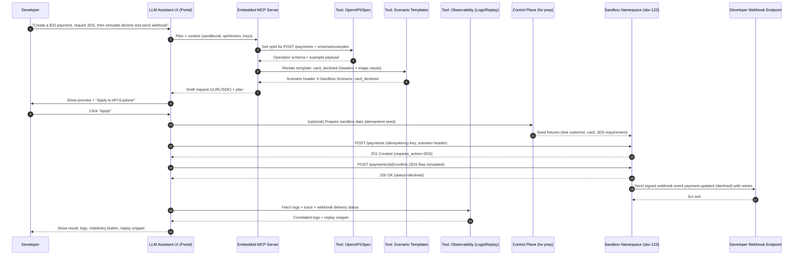

# Sequence: Simulate Scenario + Webhook Test (Assistant ↔ MCP ↔ Tools)

```mermaid
sequenceDiagram
    autonumber
    participant Dev as Developer
    participant UI as LLM Assistant UI (Portal)
    participant MCP as Embedded MCP Server
    participant Spec as Tool: OpenAPI/Spec
    participant Scen as Tool: Scenario Templates
    participant Obs as Tool: Observability (Logs/Replay)
    participant CP as Control Plane (for prep)
    participant NS as Sandbox Namespace (sbx-123)
    participant WH as Developer Webhook Endpoint

    Dev->>UI: "Create a $20 payment, require 3DS, then simulate decline and send webhook"
    UI->>MCP: Plan + context (sandboxId, apiVersion, keys)
    MCP->>Spec: Get opId for POST /payments + schema/examples
    Spec-->>MCP: Operation schema + example payload
    MCP->>Scen: Render template: card_declined (headers + magic inputs)
    Scen-->>MCP: Scenario header X-Sandbox-Scenario: card_declined
    MCP-->>UI: Draft request (cURL/SDK) + plan
    UI->>Dev: Show preview + "Apply to API Explorer"
    Dev->>UI: Click "Apply"
    UI->>CP: (optional) Prepare sandbox data (idempotent seed)
    CP-->>NS: Seed fixtures (test customer, card, 3DS requirement)
    UI->>NS: POST /payments (idempotency-key, scenario header)
    NS-->>UI: 201 Created (requires_action=3DS)
    UI->>NS: POST /payments/{id}/confirm (3DS flow simulated)
    NS-->>UI: 200 OK (status=declined)
    NS->>WH: Send signed webhook event payment.updated (declined) with retries
    WH-->>NS: 2xx ack
    UI->>Obs: Fetch logs + trace + webhook delivery status
    Obs-->>UI: Correlated logs + replay snippet
    UI-->>Dev: Show result, logs, redelivery button, replay snippet
```

